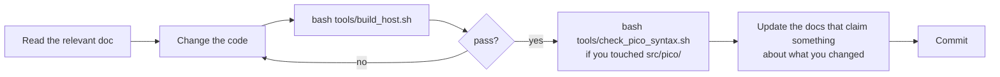

# Contributing

How to work on this repository without breaking flight-critical behaviour or the
documentation discipline the project depends on.

---

## Before you change anything

```bash
bash tools/build_host.sh
```

Every suite must pass before you start, so you know a later failure is yours.

---

## The loop



---

## Project layout

```text
firmware/common/            shared telemetry format, link profile, airtime model,
                            SX1278 driver (cansat::)
firmware/flight-computer/   flight core (flight::) + Pico HAL (src/pico/)
firmware/ground-station/    bridge firmware + USB framing (ground::)
ground-station/software/    Python receive pipeline
ground-station/web/         single-file browser console + its Node test harness
tools/                      build, syntax check, link-budget calculator,
                            documentation-claim checker, SDK stubs
test-data/                  protocol fixtures shared by all three parsers
documentation/              all engineering documentation
```

---

## Rules that are not negotiable

These are the invariants the flight software is built around. Changing one is a design
decision that belongs in [CHANGELOG.md](CHANGELOG.md), not a refactor.

1. **The flight core never includes a Pico SDK header.** Hardware reaches it only through
   the six interfaces in `interfaces.hpp`. Anything device-specific belongs under
   `src/pico/`, behind `#ifdef PICO_BUILD`.
2. **Nothing in the flight loop blocks or allocates.** No `new`, no growing containers, no
   unbounded waits, no retry loop that can spin. Recovery is always bounded.
3. **Telemetry never stops.** No peripheral failure and no mission state, `FAULT`
   included, may suppress telemetry that can still be produced correctly.
4. **Wrong data is worse than no data.** If a mandatory field cannot be trusted, suppress
   the packet. Never transmit a plausible-looking wrong value.
5. **Suppression does not consume a packet number.** Numbering must stay strictly
   sequential over transmitted packets, so gaps mean radio loss and nothing else.
6. **Provisional values stay labelled.** Anything the rulebook or the hardware has not
   fixed keeps its `PROVISIONAL` or `TBD` marker. Only the sync words `0xF3` and `0xA5`
   are rulebook-fixed.
7. **The `CAN-Team-XX` placeholder must keep failing validation.** It is what stops the
   vehicle flying with an unset identity.

---

## Things that exist in more than one language

Change one, change all of them, and update both test suites:

| Logic | Lives in |
|---|---|
| Packet format and parsing | `firmware/common/src/telemetry.cpp`, `ground-station/software/src/telemetry.py`, `ground-station/web/index.html` |
| CRC-16/CCITT framing | `firmware/ground-station/src/framing.cpp`, `ground-station/software/src/transport.py`, `ground-station/web/index.html` |
| Validation semantics | `ground-station/software/src/validator.py`, `ground-station/web/index.html` |
| LoRa airtime model | `firmware/common/include/cansat/lora_airtime.hpp`, `tools/link_budget.py` |
| Radio modem parameters | `firmware/common/include/cansat/link_profile.hpp` — **one definition**, read by the vehicle *and* the bridge |
| Pin assignment | `firmware/flight-computer/include/flight/config.hpp` (authoritative), `documentation/hardware/pico-gpio-map.md`, `documentation/design/wiring.md` |

Three guards make this enforceable rather than a promise:

- **[`test-data/protocol-fixtures.tsv`](test-data/protocol-fixtures.tsv)** — 32 packets with
  a recorded verdict each, read by the C++, Python **and** JavaScript parsers. A parser that
  disagrees fails the build.
- **`tools/check_doc_claims.py`** — 56 numbers from the documentation compared against the
  source that defines them, including every pin in the wiring table.
- **`ground-station/web/tests/console_core.test.mjs`** — the web console's logic is
  extracted from `index.html` between the `PORTABLE-CORE` markers and run under Node, so
  keep new presentation code *below* the END marker or the harness will reject it.

---

## Code style

**C++ (C++17)**

- Two-space indent, 100-column soft limit, `snake_case` for functions and variables,
  `PascalCase` for types, trailing `_` on private members.
- The warning set in `tools/build_host.sh` must stay clean: `-Wall -Wextra -Wpedantic`
  plus `-Wshadow -Wcast-align -Wdouble-promotion -Wnull-dereference -Wnon-virtual-dtor
  -Wformat=2`. CI builds again with `-Werror`, so a new warning fails the build.
- No `<sstream>`, `<iostream>` or `<regex>` in anything the flight image links. They bring
  locale machinery, a static initialiser and allocation to a 264 kB microcontroller;
  `snprintf` does the same job.
- Comment *why*, not *what*. Existing comments explain the reasoning behind thresholds and
  failure policy — match that.
- New tunables go in `Configuration`, never as scattered literals.

**Python (3.10+)**

- Standard library only in the core. `pyserial` and `matplotlib` stay optional, and the
  code must run without them.
- `from __future__ import annotations`, type hints on public functions, dataclasses for
  records.
- Docstrings state the module's responsibility and its boundary with other modules.

---

## Testing

Add a test with every behavioural change. Both suites use plain assertions and no
frameworks.

- **C++ flight core** — add a `test_*` function in
  `firmware/flight-computer/tests/flight_tests.cpp` and call it from `main()`. Use
  `CHECK(...)`; the runner prints a pass count.
- **C++ drivers** — the SX1278 and microSD drivers reach hardware only through a callback
  struct, so they run on the host against simulated devices
  (`firmware/common/tests/sx1278_test.cpp`, `firmware/flight-computer/tests/sd_card_test.cpp`).
  A new driver should follow the same shape: no direct SDK calls in the logic.
- **Python** — add a `unittest` case under `ground-station/software/tests/`.
- **Web console** — add a case to `ground-station/web/tests/console_core.test.mjs`.
- **Tooling** — add a case under `tools/tests/`.

`bash tools/build_host.sh` runs all of them, plus the documentation-claim check.

The C++ suites also build through CMake, which is what CI uses. If your machine has
neither CMake nor a build tool, `pip install cmake ninja` supplies both:

```bash
cmake -S . -B build/host-cmake && cmake --build build/host-cmake --parallel && ctest --test-dir build/host-cmake --output-on-failure
```

What a good test covers here: the failure path, not just the happy path. Most of this
codebase is about behaving correctly when a sensor, a card or a radio fails.

---

## Documentation

Documentation is part of the change, not a follow-up.

| If you change… | Update… |
|---|---|
| Pin assignment | `config.hpp`, `pico-gpio-map.md`, `wiring.md` |
| Packet format | `telemetry-protocol.md`, both parsers, the web console |
| Mission behaviour or thresholds | `software-architecture.md`, `flight-computer/README.md` |
| Test coverage | `test-plan.md` |
| Operating procedure | `runbook.md` |
| Anything notable | `CHANGELOG.md` |

Follow the [documentation rules](documentation/README.md#documentation-rules): evidence
before claims, contradictions surfaced rather than resolved locally, provisional values
labelled, and code as the truth when a document disagrees with it.

---

## Commits

Present-tense, imperative, and specific about behaviour:

```text
Add sensor plausibility gating to the acquisition path
Fix precision pattern rejecting well-formed packets
Document the shared SPI bus constraints
```

Not `update code`, `fixes`, or `wip`.

---

## Hardware changes

Anything that touches wiring, power or a pin assignment additionally requires:

1. The change reflected in `BoardPins` and in both hardware documents.
2. A note on what was physically verified, and how.
3. Bring-up re-run from the affected step in the
   [bring-up order](documentation/design/wiring.md#bring-up-order).

Never mark a hardware item verified because the code compiles.
