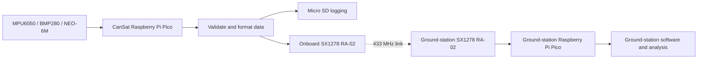

# CanSat 2026

## Project Overview

This repository contains the design and development work for our CanSat 2026 competition vehicle. It covers onboard electronics, flight-computer firmware, telemetry, the ground station, mechanical and electrical design, simulations, testing, and engineering documentation.

The competition requires a self-built CanSat with an egg payload, a descent system, continuous telemetry, altitude and temperature measurement, and inertial measurements. Confirmed hardware is not treated as integrated or compliant until it has been tested.

## Mission

The CanSat must be lifted to the competition launch altitude, deploy its parachute after release, descend safely, protect the egg, transmit telemetry continuously, and remain operational for post-landing recovery and data collection. It is powered before launch; telemetry starts automatically, should show approximately zero altitude at the initial ground-floor baseline, and should reflect the lift to launch altitude.

The supplied rulebook text contains an altitude contradiction: the mission section refers to 100 ft, while the launch guidelines state that launch will take place from a drone at 150 ft. This requires clarification from the organizers.

## Competition Requirements

The following requirements are derived from the supplied official rulebook text. `Complete` is used only where this repository contains evidence; possession of a component alone does not establish compliance.

| Requirement | Our Implementation | Status | Notes |
|---|---|---|---|
| Team consists of 3 to 5 students | Team information is not recorded | TBD | Mandatory. |
| CanSat is self-built; no prefabricated kit | Component-level BOM is confirmed | Not Yet Verified | Mandatory and a restriction; fabrication evidence is required. |
| Egg payload and secure cushioned chamber | No egg chamber or payload is confirmed | Not Yet Verified | Mandatory. |
| Descent system such as a parachute | No parachute or deployment hardware is confirmed | Not Yet Verified | Mandatory; immediate deployment is required. |
| Altitude, pressure, and temperature measurement | BMP280 is planned; integration is incomplete | Planned | Mandatory; calibration and operation must be verified. |
| Gyroscope and accelerometer | MPU6050 is confirmed | Planned | Mandatory; operation and reported values are not verified. |
| Roll, pitch, yaw, and X/Y/Z acceleration fields | Values are not implemented | TBD | Mandatory telemetry data; yaw capability is not assumed. |
| Continuous telemetry from power-on through recovery | Paired RA-02 modules are planned | Planned | Mandatory; no implementation or flight evidence exists. |
| At least one packet per second | Scheduler is not implemented | TBD | Mandatory minimum; packet loss reduces performance. |
| Correct team identifier in every packet | Formatter is not implemented | TBD | Mandatory. |
| Required packet format and sequential numbering from P-001 | Protocol is not implemented | TBD | Mandatory. |
| Launch sync word `0xA5`; test sync word `0xF3` | Radio configuration is not implemented | TBD | Restriction; wrong launch configuration can cause penalties. |
| Other CanSats powered off during another team's launch | Procedure is not documented | TBD | Restriction. |
| Manual ON/OFF switch and visible power LED | Neither is in the confirmed BOM | TBD | Mandatory; LED must light immediately at power-on. |
| Automatic telemetry at power-on | Firmware is not implemented | TBD | Mandatory; no manual trigger. |
| Descent rate of no more than 5 m/s | No descent system or test exists | TBD | Rulebook target. |
| Stable descent and intact post-landing structure | Mechanical design is TBD | TBD | Safety requirement and scoring opportunity. |
| At least 5 seconds of telemetry after impact | Behavior is not implemented or tested | TBD | Mandatory post-landing behavior. |
| Size and mass limits | Dimensions and mass are not documented | TBD | Conflicting dimension statements require clarification. |
| Official dual-ground-station evaluation | Second Pico and RA-02 are planned | Planned | Compatibility is not verified. |
| Four hours for post-launch analysis | Analysis workflow is not implemented | Planned | Required graphs are listed below. |
| Preliminary report excludes analysis; final report includes it | Reports are not prepared | TBD | Submission requirement. |
| Reports submitted as Google Docs links with correct permissions | Submission process is not documented | TBD | Supplied text states a 30 MB limit and `Anyone with the link can view`. |
| Required photos, video, and social-media links | No submission evidence exists | TBD | YouTube, Instagram post/reel, and Physics Club, SVNIT tagging required. |
| Disqualification conditions are avoided | No compliance evidence exists | Not Yet Verified | Includes size/mass overage, unsafe deployment, projectile motion, no parachute, uncontrolled crash, no communication attempt, lateness, and conduct violations. |

### Rulebook Contradictions

- **Dimensions:** Page 1 states maximum width 12 cm with an egg chamber; page 4 states `<= 21 cm x 9 cm` and `<= 500 g`; page 10 states `21 cm (+8 cm maximum for egg chamber) x 12.5 cm`. Dimension limit requires clarification from the organizers due to conflicting values appearing in different sections of the 2026 rulebook.
- **Launch altitude:** The mission section refers to 100 ft, while the launch guidelines state a drone launch at 150 ft. This requires clarification from the organizers.

No value is selected locally for either conflict.

## System Architecture

One Raspberry Pi Pico is intended for the CanSat and one for the ground station. This is planned, not completed; interfaces, pin assignments, software boundaries, packet validation, and failure recovery are TBD.



## Hardware

### Confirmed Hardware Table

| Subsystem | Component | Quantity | Intended purpose | Interface | Status |
|---|---|---:|---|---|---|
| Flight computer | Raspberry Pi Pico | 2 | One CanSat flight computer and one ground-station controller | TBD | Confirmed hardware; roles intended, not integrated. |
| Telemetry | SX1278 RA-02 433 MHz LoRa module | 2 | One radio for the CanSat and one for the ground station | TBD | Confirmed hardware; configuration TBD. |
| Telemetry | 433 MHz LoRa antenna with SMA male connector | 2 | Radio antennas | SMA connection; installation TBD | Confirmed hardware. |
| Telemetry | 10 cm IPEX to SMA female RG1.13 cable | 2 | Connects a radio to an antenna | IPEX to SMA; compatibility TBD | Confirmed hardware. |
| Sensors | MPU6050 3-axis accelerometer and gyroscope | 1 | Acceleration and angular-rate measurements | TBD | Confirmed hardware; operation and integration TBD. |
| Sensors | NEO-6M GPS module with EEPROM | 1 | Additional position and timing sensor | TBD | Confirmed hardware; integration TBD. |
| Sensors | GY-BMP280-3.3 precision altimeter / atmospheric pressure sensor | 1 | Pressure, altitude estimation, and intended temperature measurement | TBD | Confirmed hardware; calibration and integration TBD. |
| Storage | Micro SD card reader module | 1 | Onboard data logging | TBD | Confirmed hardware; wiring, format, and reliability TBD. |
| Power | Orange 3.7 V 1500 mAh 25C 1S LiPo battery | 1 | Primary power source | TBD | Confirmed hardware; switching, charging, protection, and distribution TBD. |
| Power | 3.3 V regulated power supply | TBD | Planned 3.3 V peripheral rail | TBD | Planned; regulator model, current rating, efficiency, and circuit TBD. |
| Prototyping | 10 x 10 cm single-sided universal prototype PCB | 2 | Prototyping and electronics mounting | 2.54 mm pitch | Confirmed hardware; not a custom PCB by itself. |

### Flight Computer

The onboard Pico is intended to acquire measurements, validate data, log selected data, format mandatory telemetry, and transmit packets. Startup sequencing, timing, watchdog behavior, reset recovery, calibration storage, and firmware implementation are TBD. The second Pico is intended for the ground station; its exact role is TBD.

### IMU

The MPU6050 is the confirmed gyroscope and accelerometer hardware. Firmware must produce roll, pitch, yaw, and X/Y/Z acceleration values in the required packet format. Axis orientation, units, calibration, filtering, and whether yaw can be reliably produced from this hardware are not verified.

### BMP280

The GY-BMP280-3.3 is intended to provide pressure and altitude-related data, and its temperature reading is intended to support the mandatory temperature field. Reference pressure, altitude calculation, calibration, filtering, units, and validity checks are TBD.

### GPS

The NEO-6M is an additional confirmed sensor. It may provide position and timing data, but it is not treated as integrated or as a scoring result. Antenna placement, interface, fix handling, update rate, parsing, logging, and optional fields are TBD.

### LoRa Telemetry

The CanSat and ground station each have one RA-02, one 433 MHz antenna, and one IPEX-to-SMA cable. Radio configuration, wiring, antenna installation, packet handling, and link validation are TBD.

### MicroSD Storage

The reader is intended to record mandatory measurements, timestamps, packet numbers, system status, and selected additional data. The interface, filesystem, record format, write rate, initialization, synchronization, and write-failure recovery are TBD.

### Power System

The confirmed battery is a 1S LiPo with 3.7 V nominal voltage, approximately 4.2 V when fully charged, and a lower voltage during discharge. It must not be treated as a fixed 3.7 V supply.

A dedicated 3.3 V regulated power supply is planned for 3.3 V peripherals, particularly the SX1278, MPU6050, and BMP280. The supply is **TBD**. No regulator model, current rating, efficiency, protection circuit, battery-life estimate, or completed installation is claimed.

The required manual switch and visible power LED are not in the confirmed hardware list. Battery protection, charging, voltage monitoring, grounding, decoupling, brownout behavior, and power-load analysis are also TBD.

### Egg Payload

An egg payload and cushioned, secure egg chamber are mandatory. Neither is included in the confirmed electronics BOM. Chamber design, access, restraint, cushioning, and impact verification are TBD.

### Descent System

A parachute or comparable descent system is mandatory. It must deploy during descent, allow immediate deployment after release, avoid tight packing inside the structure, and support a descent rate of no more than 5 m/s. No parachute, deployment mechanism, or descent hardware is confirmed.

### PCB / Electronics

Two universal single-sided prototype PCBs are confirmed. They support prototyping but do not constitute a custom PCB. The rulebook provides scoring opportunities for original PCB design, documentation, routing, compact integration, reduced external wiring, soldering quality, and professional assembly. A custom PCB is not claimed.

### Mechanical Structure

The structure must accommodate the egg, descent system, battery, electronics, sensors, and antenna while protecting the payload and supporting recovery. Layout, materials, dimensions, mass, cable management, labeling, fabrication, CAD, and impact resistance are TBD. No dimension or material is invented because the rulebook dimension statements conflict.

## Telemetry

Continuous telemetry is mandatory from power-on at the ground floor, through lifting and flight, and after landing until recovery. The minimum rate is one packet per second. Higher stable rates may receive scoring consideration, but packet loss reduces performance. Official evaluation uses the Physics Club's dual ground stations.

Every packet must contain the correct team identifier and use this format:

```text
CAN-Team-XX; P-XXX; Ti-HH:MM:SS:MS; A-XXX.X; Pr-XXXX.XX; T-XX.X; Ro-XX.X; Pi-XX.X; Ya-XX.X; AX-XX.XX; AY-XX.XX; AZ-XX.XX;
```

| Field | Meaning | Required representation |
|---|---|---|
| `CAN-Team-XX` | Team identifier | Correct identifier in every packet |
| `P-XXX` | Sequential packet number | Starts at `P-001` and increments sequentially |
| `Ti-HH:MM:SS:MS` | Timestamp | Format shown by the rulebook |
| `A-XXX.X` | Altitude in metres | One decimal place |
| `Pr-XXXX.XX` | Pressure in Pa | Two decimal places |
| `T-XX.X` | Temperature in degrees C | One decimal place |
| `Ro-XX.X` | Roll in degrees | One decimal place |
| `Pi-XX.X` | Pitch in degrees | One decimal place |
| `Ya-XX.X` | Yaw in degrees | One decimal place |
| `AX-XX.XX` | X acceleration in m/s2 | Two decimal places |
| `AY-XX.XX` | Y acceleration in m/s2 | Two decimal places |
| `AZ-XX.XX` | Z acceleration in m/s2 | Two decimal places |

Optional fields may be appended using short prefixes, including `GP-Lat`, `GP-Lon`, `GP-Alt`, `MQ`, `MGX`, `MGY`, and `MGZ`. Mandatory data always has priority. Missing or corrupted mandatory fields result in no telemetry points.

### LoRa Sync Words

- Official launch configuration: `0xA5`.
- Pre-launch testing configuration: `0xF3`.

Using the wrong sync word during another team's launch can result in penalties. Frequency, modulation, packet timing, error checking, retries, acknowledgements, and loss indication are TBD.

## Data Flow

1. The flight Pico reads the MPU6050, BMP280, and NEO-6M.
2. Firmware validates measurements and creates mandatory fields.
3. The flight computer records data to the Micro SD card.
4. It formats sequential packets and sends them through the onboard RA-02.
5. The ground RA-02 receives packets and passes them to the ground-station Pico and software.
6. The ground station displays and records data for live monitoring and post-launch analysis.

The packet parser must reject missing or corrupted mandatory fields. Buffering, duplicate handling, packet-loss reporting, logging formats, and exact interfaces are TBD.

## Ground Station

The second Pico, RA-02, antenna, and cable are intended for the ground station. The station must receive and support evaluation of continuous telemetry using the required format. Ground-station software, UI, live warnings, connection status, data storage, and the division of responsibility between Pico and computer are not implemented and remain TBD.

## Software

Planned flight firmware functions include automatic startup, sensor acquisition, validation, mandatory packet formatting, sequential numbering, continuous transmission, SD logging, and post-impact transmission for at least five seconds. Planned ground-station functions include radio reception, packet validation, display, logging, connection monitoring, and export for analysis. No implementation or feature set is currently confirmed.

The team receives ground-station data after launch and has four hours for analysis. Required graphs are altitude versus time or packet number, temperature versus time or packet number, and pressure versus time or packet number. Additional analysis may include acceleration profiles, orientation changes, descent rate, correlations, and other derived metrics. No analysis is complete.

## Mechanical Design

Mechanical design must address the structure, cushioned egg chamber, parachute deployment and recovery, internal layout, antenna placement, sensor access, wiring, CAD, materials, fabrication, labeling, modularity, and impact protection. The rulebook gives scoring opportunities for efficient size and mass use, lightweight and durable construction, sustainable or unconventional materials, creative construction, detachable systems, hands-on fabrication evidence, housing and recovery innovation, appearance, cable management, and professional finish.

Dimensions and mass remain open because the supplied rulebook text conflicts. Completed CAD, drawings, selected materials, and a verified mechanical design are not recorded.

## Testing

### Planned Tests

- Sensor operation, calibration, units, range, and invalid-data handling
- GPS startup, fix acquisition, parsing, and loss-of-fix behavior
- LoRa range, antenna installation, sync words, and link recovery
- Packet rate, numbering, mandatory formatting, and packet-loss behavior
- SD initialization, sustained logging, corrupted records, and write failure
- Battery, regulator, switch, LED, current draw, voltage range, and brownout behavior
- Parachute deployment, descent rate, stable descent, tumbling, and recovery
- Egg impact survival and structure integrity
- At least five seconds of post-impact telemetry
- Full-system integration, lift profile, launch, landing, and analysis workflow

### Tests in Progress

No tests in progress are recorded.

### Completed Tests

No completed hardware, software, integration, or mission tests are recorded. Compilation or possession of hardware is not flight verification.

## Data Analysis

Data analysis is part of the mission workflow and must be completed within four hours after launch. It must include altitude versus time or packet number, temperature versus time or packet number, and pressure versus time or packet number. Acceleration, orientation, descent rate, correlations, and other derived metrics are additional opportunities. Tooling, data formats, plots, and results are TBD.

## Competition Scoring

Scoring opportunities include stable and longer safe descent, additional working sensors, efficient lightweight construction, payload protection, materials, fabrication, modularity, recovery innovation, labeling, cable management, finish, original PCB design and documentation, compact routing, soldering, self-written and reliable code, higher stable telemetry rates, and analysis beyond the mandatory graphs.

Our design targets these opportunities through the planned sensor suite, telemetry, SD logging, mechanical and PCB documentation, and software development. No scoring opportunity is claimed as earned until it is built, working, and evidenced.

## Documentation

Requirements and rulebook references belong in `documentation/requirements/`; design in `documentation/design/`; testing in `documentation/testing/`; mission material in `documentation/mission/`; schematics in `electrical/schematics/`; PCB files and views in `electrical/PCB/`; CAD and drawings in `mechanical/CAD/` and `mechanical/drawings/`; firmware in `firmware/`; ground-station software in `ground-station/`; and test data in `test-data/`.

The final report must include the design approach, architecture, mission procedure, results, lessons learned, schematics, PCB files, CAD designs, wiring diagrams, references, and all analysis graphs. Required media include high-quality CanSat top, side, and bottom views; PCB top, bottom, and side views; a team photo with the CanSat; and a group photo with mentors and the CanSat.

Reports are submitted as Google Docs links through the provided Google Form. The supplied text states a 30 MB limit and `Anyone with the link can view` permissions. The preliminary report excludes analysis; the final report includes it. A project video must be posted to a team member's YouTube channel and Instagram page as a post or reel, with Physics Club, SVNIT tagged on both posts, and both links submitted through the form.

## Repository Structure

```text
avionics/              Sensors, telemetry, and power work
firmware/              Flight-computer and ground-station firmware
ground-station/        Ground-station software and UI
mechanical/            CAD and mechanical drawings
electrical/            Schematics and PCB design
simulations/            Simulations and analysis
documentation/          Requirements, design, testing, and mission records
test-data/              Test data and analysis datasets
README.md              Project overview and current status
```

## Current Status

The confirmed hardware BOM consists of two Raspberry Pi Picos, two SX1278 RA-02 modules with antenna assemblies, one MPU6050, one NEO-6M, one GY-BMP280-3.3, one Micro SD card reader, one 1S LiPo battery, and two universal prototype PCBs. A 3.3 V regulated power supply is planned but remains TBD.

Hardware roles are planned, but no completed firmware, ground-station software, telemetry implementation, electrical or mechanical design, parachute system, egg chamber, compliance measurement, or test evidence is recorded. The project is not claimed flight-ready.

## TBD / Open Decisions

- Resolve the conflicting rulebook dimension/mass statements and launch altitude.
- Confirm team information, deadlines, arrival requirements, and submission dates not present in the supplied text.
- Select the 3.3 V regulated power supply and define protection, charging, switching, grounding, decoupling, monitoring, and distribution.
- Add and verify the manual ON/OFF switch and visible power LED.
- Confirm module voltage requirements, connectors, interfaces, pin assignments, and wiring.
- Determine whether the MPU6050 implementation can provide a valid yaw field without assuming compliance.
- Design and build the egg chamber, parachute, deployment system, and mechanical structure.
- Implement automatic telemetry, required formatting, `P-001` numbering, one packet per second minimum, sync-word procedures, and corrupted-packet rejection.
- Implement SD logging, ground-station reception, status reporting, data export, and four-hour analysis workflow.
- Create reports, photographs, PCB/CAD/wiring evidence, analysis graphs, and the required video and links.
