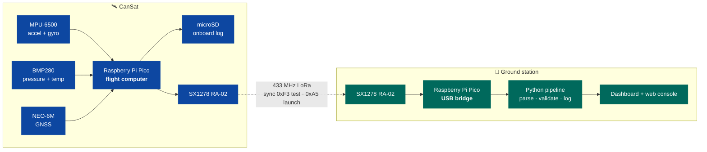
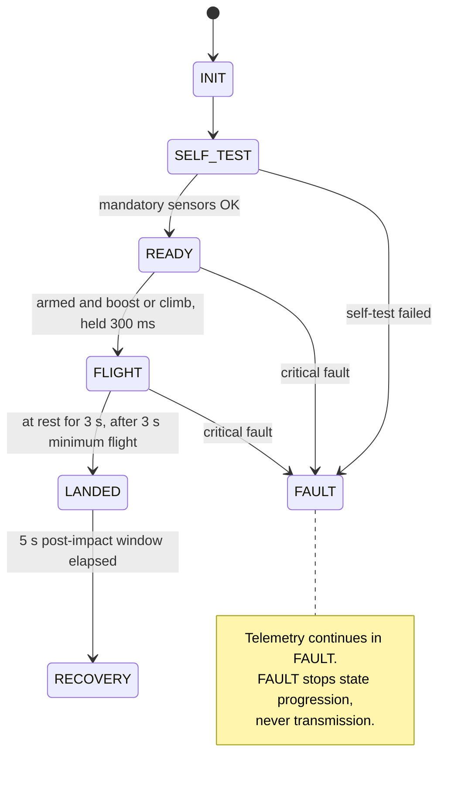
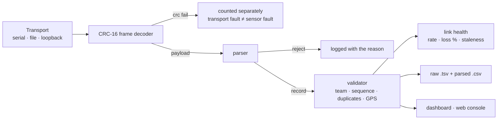

<div align="center">

# CanSat 2026

**A can-sized satellite that lifts to launch altitude, deploys a parachute, protects an egg,
and streams telemetry from power-on through recovery.**

[](https://github.com/KunjSorathiya/CanSat-2026/actions/workflows/ci.yml)
[](documentation/testing/test-plan.md)
[](documentation/testing/test-plan.md)
[](firmware/)
[](ground-station/)
[](documentation/design/telemetry-protocol.md)
[](documentation/testing/bring-up-record.md)
[](mechanical/README.md)

[Mission profile](documentation/mission/concept-of-operations.md) ·
[Architecture](documentation/design/software-architecture.md) ·
[Wiring](documentation/design/wiring.md) ·
[Timeline](documentation/project/timeline.md) ·
[Test plan](documentation/testing/test-plan.md) ·
[Runbook](documentation/operations/runbook.md) ·
[All docs](documentation/README.md)

</div>

---

## Where the project stands

| Layer | State |
|---|---|
| 🟢 **Software** | Flight core, telemetry protocol, ground station and web console **implemented and passing 5170 automated checks on the host**, including an end-to-end trace from the flight controller through the ground pipeline |
| 🟢 **Firmware drivers** | **Every driver has run on real silicon** and its numbers are recorded — IMU, barometer, GPS, radio and microSD. **The flight image itself runs**: it was flashed, it printed its startup summary, it wrote a card, and it produced [F-16](documentation/testing/bring-up-record.md#findings) and [F-19](documentation/testing/bring-up-record.md#findings), which are defects only a running image could have found |
| 🟢 **Hardware** | **The vehicle board is built and every device on it works** — **34 of 91 recorded measurements taken.** **The radio link closed end to end on 2026-09-07** — 66 packets, `P-001` to `P-066`, no gaps, no duplicates, 1.0000 Hz, −44 dBm at bench range, so Gate 8 has a bench link. Gates 3, 4, 5, 6 and 7 all pass on the soldered board — the IMU and barometer share I2C0 (`0x68` and `0x76`, `0x0C` correctly absent), the GPS emits clean NMEA at 162 B/s, the radio sends 5/5, 5/5 and 45/45 with airtimes within 1.8 % of the model, the card writes 100/100 and sustains ~300 writes/s, and the shared SPI0 bus passes every row. **Power is answered:** the Pico's own 3.3 V rail held **3.28–3.29 V through 45 back-to-back transmits** and 3.28–3.30 V at 100 % write duty, so no separate rail is needed. Sensor read costs 0.833 ms worst against a 33 ms period. **Open:** [F-12](documentation/testing/bring-up-record.md#findings), a card intermittent that failed three of its first four runs and has passed twelve since with the supply measured innocent; and [F-17](documentation/testing/bring-up-record.md#findings), **yaw measured drifting more than a full revolution in a 36.8-minute stationary log** — and, more usefully, holding to ±0.8° for the first 15 minutes before switching to 0.4 dps, which is **70° over a 3-minute flight** on a vehicle with no magnetometer; and [F-18](documentation/testing/bring-up-record.md#findings), a stationary GPS jumping 55.6 m in one second because nothing gates a fix on satellite count or HDOP. Still to fit: the sound module, the switch, the divider, and the Schottky |
| 🟡 **Mechanical** | Structure, egg chamber and parachute **not started** — but **no longer blocked**. The 2026 revision settled the dimensions, and the parachute is now sized: a **80.0 cm** flat canopy brings 550 g down at 5.00 m/s on a hot day, computed by [`simulations/descent.py`](simulations/descent.py) and pinned by tests. The envelope has also produced its first real constraint — **a 100 × 100 mm board does not fit flat in a 12 cm section**, so it mounts edge-on ([mechanical/README.md](mechanical/README.md)) |

> [!IMPORTANT]
> This project does not claim compliance for anything it has not evidenced. Owning a
> component is not integration, and a passing test suite is not flight verification. Every
> status in this README is written against that rule.

---

## Contents

- [Mission](#mission)
- [System architecture](#system-architecture)
- [Quick start](#quick-start)
- [How the flight software works](#how-the-flight-software-works)
- [Telemetry protocol](#telemetry-protocol)
- [Ground station](#ground-station)
- [Hardware](#hardware)
- [Testing](#testing)
- [Competition requirements](#competition-requirements)
- [Open questions for the organizers](#open-questions-for-the-organizers)
- [Repository layout](#repository-layout)
- [Documentation](#documentation)

---

## Mission

The CanSat is lifted to launch altitude by a drone, released, and must then deploy its
parachute, descend at no more than 5 m/s, protect an egg payload through landing, and
transmit telemetry continuously — from the moment it is powered on at the ground floor,
through the lift and descent, and for at least five seconds after impact, until it is
recovered.

It has to do all of that on its own. There is no command uplink and no manual trigger: the
vehicle powers on, calibrates itself, arms itself, detects its own launch and landing, and
keeps talking through every failure it can survive.

That statement is enforced rather than asserted. A ground-to-vehicle command exists for the
bench — it erases the onboard log between test runs — but `allow_ground_commands` defaults
to **false**, so a flight build never enters receive mode and has no uplink to reason about.
Even enabled, the vehicle acts on a command only in `READY` with `ARM-0`: the window is shut
for the whole of flight, landing and recovery, which is every state holding a log that
cannot be recreated. See [operations](documentation/operations/runbook.md#erasing-the-onboard-log).

**The mission minute by minute** — what the vehicle, the ground station and the operators are
each doing from power-on to recovery — is
[concept-of-operations.md](documentation/mission/concept-of-operations.md). Writing it turned
up [F-20](documentation/testing/bring-up-record.md#findings): the vehicle **declared a landing
while hovering under the drone**, three seconds into any hover and up to twelve seconds before
release, because 1 g with no vertical motion describes a hover exactly as well as it describes
a landing. **Fixed by a descent gate** — a landing may not be declared until a real descent
has been observed — and the same reproduction now lands three seconds after touchdown.

---

## System architecture



Two Raspberry Pi Picos, two identical radios. The vehicle Pico runs the mission; the ground
Pico is a pure bridge that frames every received payload onto USB serial with a CRC, so the
PC can tell transport corruption apart from a malformed packet.

**Full detail:** [software-architecture.md](documentation/design/software-architecture.md)

---

## Quick start

> **Building one from scratch?** [documentation/quick-start.md](documentation/quick-start.md)
> covers the whole path — parts, wiring, firmware, bring-up, launch and recovery — with
> realistic time estimates and every blocked step marked.

Nothing below needs hardware or the Pico SDK.

```bash
bash tools/build_host.sh
```

Compiles and runs every C++ suite and the Python ground-station suite.

```bash
bash tools/check_pico_syntax.sh
```

Syntax-checks all ten `PICO_BUILD` translation units against minimal SDK stubs.

**See telemetry without any hardware** — open
[`ground-station/web/index.html`](ground-station/web/index.html) in a browser. Demo mode
replays a full drone-lift mission at 2 Hz: link health, mission state, altitude and
pressure plots, an attitude indicator and a live packet monitor.

**Replay a packet file through the real pipeline:**

```bash
cd ground-station/software
python src/main.py replay ../../test-data/sample-mission.txt --team CAN-Team-01 --export logs/flight.csv
```

**Build the Pico images** (requires `PICO_SDK_PATH` and `pico_sdk_import.cmake`):

```bash
cmake -S . -B build/pico && cmake --build build/pico --parallel
```

Produces `cansat_pico_firmware` (vehicle) and `cansat_ground_bridge_firmware` (bridge).

---

## How the flight software works

The vehicle runs a single non-blocking loop on a 2 ms tick. Nothing waits on hardware,
nothing allocates, and every recovery path is bounded.



Six behaviours are worth knowing about:

<details>
<summary><b>It calibrates itself on the pad — and never lets that block the mission</b></summary>

While stationary in `INIT`/`SELF_TEST`/`READY`, the vehicle collects IMU and barometer
samples and captures gyro bias, accelerometer offset and the barometric ground reference
(so altitude reads ≈ 0 on the pad). Acceptance needs 80 samples with per-axis gyro
standard deviation under 2 °/s and an acceleration magnitude within 1.5 m/s² of 1 g.

If the vehicle is not still, calibration retries until a 20 s timeout, then resolves
best-effort: the **barometric reference is still used**, but gyro and accelerometer bias
are **not applied** — a bias measured while moving would be worse than no correction. A
warning fault is raised and the mission continues.
</details>

<details>
<summary><b>A startup glitch cannot trigger a false launch</b></summary>

`READY → FLIGHT` is refused until the vehicle is *armed*: the arming delay has elapsed
(3 s) **and** calibration has settled. Then the launch condition — acceleration above
30 m/s² or a climb of more than 15 m above the ground baseline — must hold continuously
for 300 ms. All four thresholds are provisional and marked as such.
</details>

<details>
<summary><b>An implausible reading is treated as worse than no reading</b></summary>

A value outside datasheet-derived bounds (30–115 kPa, ±170 m/s², ±2200 °/s) is not just
skipped — the previously held value is dropped too, so the vehicle never coasts on data
from a sensor that is actively wrong. Staleness is time-based: 2 s without a good read
raises the fault, so a single failed read changes nothing.
</details>

<details>
<summary><b>Wrong data is never transmitted, and suppression never fakes packet loss</b></summary>

If any mandatory field cannot be trusted, no packet is produced at all — and the packet
number is **not consumed**. Transmitted packets therefore stay strictly sequential
(`P-001`, `P-002`, `P-003`…), so a gap at the ground station means radio loss and nothing
else.
</details>

<details>
<summary><b>Every peripheral can fail without stopping the mission</b></summary>

GPS missing? Optional fields are omitted. SD failing? Logging disables itself after 10
consecutive write failures. Radio down? Bounded re-initialisation with a 1 s back-off,
never a blocking retry loop. Only a total loss of mandatory sensing — bad config, failed
self-test, or *both* IMU and barometer stale — counts as critical, and even then telemetry
keeps running in `FAULT`.
</details>

<details>
<summary><b>It survives its own crashes</b></summary>

A 2 s hardware watchdog reboots a hung loop; telemetry restarts automatically and the
reboot is reported as a fault so the ground station can see it. The onboard log writes into
raw 512-byte blocks with **no filesystem**, rewriting its header after every record, so a
brownout or impact reset resumes at the correct block instead of overwriting flight data.
</details>

---

## Telemetry protocol

Every packet carries the mandatory rulebook block, and may append optional fields after it:

```text
CAN-Team-01; P-042; Ti-00:01:23:450; A-118.4; Pr-99821.33; T-24.6; Ro-2.1; Pi--1.4;
Ya-15.9; AX-0.12; AY--0.31; AZ-9.79; GP-Lat-21.164500; GP-Lon-72.784800;
GP-Alt-121.3; MODE-FLIGHT; FAULTS-0; CAL-1; ARM-1;
```

<details>
<summary><b>Mandatory fields</b></summary>

| Field | Meaning | Format |
|---|---|---|
| `CAN-Team-XX` | Team identifier | Correct identifier in every packet |
| `P-XXX` | Packet number | Starts at `P-001`, increments sequentially |
| `Ti-HH:MM:SS:MS` | Timestamp | Mission clock since power-on |
| `A-XXX.X` | Altitude | Metres, 1 decimal |
| `Pr-XXXX.XX` | Pressure | Pa, 2 decimals |
| `T-XX.X` | Temperature | °C, 1 decimal |
| `Ro-XX.X` / `Pi-XX.X` / `Ya-XX.X` | Roll / pitch / yaw | Degrees, 1 decimal |
| `AX-XX.XX` / `AY-XX.XX` / `AZ-XX.XX` | Acceleration | m/s², 2 decimals |

Precision is enforced exactly, in both the formatter and both parsers.
</details>

<details>
<summary><b>Optional fields we append</b></summary>

| Tag | Meaning |
|---|---|
| `GP-Lat` / `GP-Lon` / `GP-Alt` | GPS position, only when a fix exists |
| `MODE` | Mission state — `INIT`, `SELF_TEST`, `READY`, `FLIGHT`, `LANDED`, `RECOVERY`, `FAULT` |
| `FAULTS` | Count of currently active faults |
| `CAL` | 1 once startup calibration has settled |
| `ARM` | 1 once launch detection is enabled |

These come after every mandatory field, as the rulebook requires. Mandatory data always has
priority, and unknown optional fields are ignored by a conforming parser.
</details>

> [!NOTE]
> **Yaw says which kind of yaw it is.** Every packet carries a `YR-` tag: `YR-M` means an
> absolute magnetic yaw, `YR-G` means a relative gyro integration whose zero is arbitrary.
> The vehicle never claims an absolute heading it has not earned.
>
> **On the part actually delivered, that tag reads `YR-G` and always will.** The IMU is an
> MPU-6500 — six axes, no magnetometer — not the nine-axis MPU-9250 it was sold as
> ([F-1](documentation/hardware/receiving-inspection.md#findings), `WHO_AM_I` `0x70` read
> on the bench). The nine-axis path is implemented and tested and would produce `YR-M` on a
> real MPU-9250; this vehicle has no absolute yaw reference, and its yaw drifts with the
> gyroscope. See [open question 6](#open-questions-for-the-organizers).

**Radio:** 433 MHz LoRa. Only the sync words are fixed by the rulebook — **`0xF3` for
testing, `0xA5` for the official launch**. Spreading factor, bandwidth, coding rate,
power and preamble are provisional engineering defaults.

**Full specification:** [telemetry-protocol.md](documentation/design/telemetry-protocol.md)

---

## Ground station



Three interfaces, one pipeline:

| Interface | Use |
|---|---|
| **Web console** — [`ground-station/web/index.html`](ground-station/web/index.html) | Single file, no build, no dependencies. Demo replay, file replay, or live Web Serial |
| **Tk dashboard** — `python src/main.py live --port COM5 --framed` | Live numeric view, with plots when matplotlib is installed |
| **CLI replay** — `python src/main.py replay ../../test-data/sample-mission.txt --export out.csv` | Offline parse, validate, log and export |

The receive pipeline runs on a background thread and hands the UI a snapshot through a
bounded queue, so a slow interface can never stall reception or logging. **Nothing received
is ever discarded** — malformed packets and CRC failures all reach the raw log with their
receipt time and the reason.

---

## Hardware

<details>
<summary><b>Confirmed bill of materials</b></summary>

| Subsystem | Component | Qty | Purpose | Status |
|---|---|---:|---|---|
| Flight computer | Raspberry Pi Pico | 2 | Vehicle + ground bridge | 🟢 **Both built and running.** Vehicle image and bridge image both flashed and working |
| Telemetry | SX1278 RA-02 433 MHz LoRa | 2 | Vehicle + ground radio | 🟢 **Link closed 2026-09-07**, 66 packets, 0 % loss. Modem parameters remain provisional |
| Telemetry | 433 MHz antenna, SMA | 2 | Radio antennas | 🟢 Mated and radiating; the gender question resolved on inspection |
| Telemetry | 10 cm IPEX-to-SMA RG1.13 cable | 2 | Radio to antenna | 🟢 Fitted |
| Sensors | Sold as MPU-9250; **delivered an MPU-6500** — accelerometer + gyroscope, no magnetometer | 1 | Acceleration and angular rate | 🟠 **Working, but it is the wrong part:** `WHO_AM_I` `0x70`, and `0x0C` never answers ([F-1](documentation/hardware/receiving-inspection.md#findings)). Bias and noise measured |
| Sensors | GY-BMP280-3.3 | 1 | Pressure, altitude, temperature | 🟢 **Verified on the bus at `0x76`**, 83.0 Hz output as predicted |
| Sensors | NEO-6M GPS with EEPROM | 1 | Position and timing | 🟠 **Talking** — all six NMEA sentences, 0 checksum errors. **No fix acquired yet** |
| Sensors | LM393 sound module, 4-pin | 1 | Additional sensor — acoustic level | 🟠 Fitted; its data reaches neither the card nor the radio ([F-15](documentation/testing/bring-up-record.md#findings)) |
| Storage | microSD card reader | 1 | Onboard logging | 🟠 **Writes 100/100 and sustains ~300 writes/s.** Still carries [F-12](documentation/testing/bring-up-record.md#findings), an unexplained intermittent |
| Power | Orange 3.7 V 1500 mAh 25C 1S LiPo | 1 | Primary power | 🟠 Held and charged. **Never yet used to power the vehicle** — that needs the switch and the Schottky |
| Power | ~~3.3 V regulated supply~~ | — | ~~Peripheral rail~~ | 🟢 **Not needed.** The Pico's own rail carries every load, measured |
| Prototyping | 10 × 10 cm universal PCB | 2 | Electronics mounting | 🟢 One built, one spare. **Note it does not fit a 12 cm section laid flat** |

Still to fit, and the first two are mandatory requirements: **manual ON/OFF switch**,
**visible power LED**, the **Schottky diode**, and the **battery divider**. Still to build:
**egg chamber** and **parachute** — see [mechanical/README.md](mechanical/README.md).
</details>

<details>
<summary><b>Pin assignment</b></summary>

| GPIO | Function | Device |
|---:|---|---|
| GP4 / GP5 | I2C0 SDA / SCL | MPU-6500 + BMP280 |
| GP16 / GP18 / GP19 | SPI0 MISO / SCK / MOSI | RA-02 + microSD |
| GP17 | Chip select | RA-02 |
| GP6 | Chip select | microSD |
| GP20 / GP21 / GP22 | RESET / DIO0 / DIO1 | RA-02 |
| GP12 / GP13 | UART0 TX / RX | NEO-6M |
| GP7 | Interrupt | MPU-6500 — wired, firmware does not enable it |
| GP14 | Status LED | External LED |
| GP15 | Comparator input | LM393 sound module `DO` |
| GP26 | ADC0 | Battery sense — divider not fitted |
| GP27 | ADC1 | LM393 sound module `AO` |

`BoardPins` in [`config.hpp`](firmware/flight-computer/include/flight/config.hpp) is the
source of truth, and the machine-readable
[netlist](electrical/schematics/vehicle-netlist.tsv) is generated from it — the generator
refuses to run if the two disagree. Diagrams: [wiring.md](documentation/design/wiring.md) ·
[wiring schedule](documentation/hardware/diagrams/wiring-schedule.svg)
</details>

### The three hardware blockers — all three are closed

They are kept here rather than deleted, because how they closed is more useful than the
fact that they did.

1. ~~**No regulator is selected.**~~ **None is needed.** The AMS1117-3.3 was assessed and
   rejected — a full cell at ≈ 4.2 V does not clear its high-load dropout. Then the Pico's
   own regulator was measured carrying every load: **3.28–3.29 V through 45 back-to-back
   transmits**, 3.28–3.30 V at 100 % write duty. One rail, no external part.
2. ~~**The microSD reader may not be compatible.**~~ **The delivered board is a 3.3 V board.**
   It has no regulator and no level shifter, its supply pin is printed `3V3`, and its whole
   parts list is four 10 kΩ pull-ups and two capacitors. The listing that described a
   4.5–5.5 V board described a different product —
   [sd-module-analysis.md](documentation/hardware/sd-module-analysis.md).
3. ~~**The exact breakout variants are undocumented.**~~ **Every board has been inspected and
   photographed**, and one of them was not what it was sold as — the IMU is a six-axis
   MPU-6500 ([receiving-inspection.md](documentation/hardware/receiving-inspection.md)).
   That is precisely the risk this blocker existed to catch.

### What is actually blocking now

| Blocker | Why | Cost |
|---|---|---|
| **The Schottky diode is not bought** | Without it USB back-powers the LiPo, so the battery switch must be OFF whenever a cable is connected — which is most of bring-up | ~₹10, the only outstanding purchase |
| **Switch, LEDs and divider are not fitted** | Two of them are mandatory requirements, and the power LED is **5 of the cheapest points in the rulebook** | Held, an evening |
| **Nothing mechanical exists** | The largest block of unclaimed points, and it is no longer waiting on anybody — see [mechanical/README.md](mechanical/README.md) | Weeks |

---

## Testing

```bash
bash tools/build_host.sh
```

| Suite | Coverage | Result |
|---|---|---|
| `flight_tests` | 113 suites: packet format and edge cases, parser, shared protocol fixtures, state machine, orientation and angle wrapping, GPS validation, sensor math, IMU range encoding, sensor timing, calibration, faults, scheduler, block log and torn-header recovery, controller behaviour and packet-size degradation, link profile, LoRa airtime | ✅ **4107 / 4107** |
| `flight_smoke_test` | Boot, first three packets, GPS parse | ✅ Passed |
| `sx1278_tests` | LoRa driver register sequence, TX timeout, RX and CRC handling, RSSI conversion, against a fake register bank | ✅ **129 / 129** |
| `sd_card_tests` | microSD init sequence, SDHC vs SDSC addressing, block round trip, bus release, timeouts and write-error paths, against a simulated card | ✅ **613 / 613** |
| `fat_volume_tests` | FAT32 log-file lookup: MBR and superfloppy volumes, contiguity, a missing file, a card that stops answering, against a synthetic image | ✅ **30 / 30** |
| `ground_station_tests` | Framing, CRC detection, resync, known-answer vector | ✅ Passed |
| Python (ground station) | Parser, validator, transport, health, logging robustness, bridge status, vehicle-restart recovery, shared protocol fixtures, and a cross-language end-to-end trace of real vehicle output | ✅ **140 / 140** |
| Python (tooling) | LoRa airtime model, pinned to published SX127x reference vectors | ✅ **49 / 49** |
| Python (simulations) | Descent model: canopy sizing, the closed-form fall against both its own limits, ISA air density, the mass-tolerance argument | ✅ **40 / 40** |
| Web console (Node) | Framing, parser, validator, link health and bridge status, extracted from `index.html` | ✅ **62 / 62** |
| Documented claims | Numbers in the documentation checked against the source that defines them — test counts, the generated netlist, and the descent model's canopy diameter included | ✅ **261 / 261** |
| Pico syntax | 11 translation units against SDK stubs | ✅ All OK |

Highlights of what is actually proven: the emitted packet matches the rulebook format byte
for byte; the BMP280 compensation reproduces the datasheet reference vector; a boost before
arming cannot trigger a launch; invalid mandatory data suppresses a packet without
consuming its number; `crc16_ccitt("123456789") == 0x29B1`; and the vehicle and the bridge
are proven to configure the same radio modem.

**What is not covered:** the mechanical system, a real descent, and any of it in flight.
Everything above runs without hardware. The sensors, the radio link, the card and the power
rail are no longer in this list — they have been measured, and the numbers are in
[bring-up-record.md](documentation/testing/bring-up-record.md) — but a bench is not a flight,
and none of this is evidence that the vehicle flies.
**Details:** [test-plan.md](documentation/testing/test-plan.md)

---

## Competition requirements

<details>
<summary><b>Full requirements table (30 items)</b></summary>

`Implemented` means the software exists and is tested on the host. It never means the
requirement is satisfied in flight.

| Requirement | Our implementation | Status |
|---|---|---|
| Team of 3–5 students | Team information not recorded | ⬜ TBD |
| Self-built, no prefabricated kit | Component-level BOM confirmed | ⬜ Fabrication evidence needed |
| Egg payload and cushioned chamber | Not designed | ⬜ Not started |
| Descent system such as a parachute | Not designed | ⬜ Not started |
| Altitude, pressure, temperature | BMP280 driver + Bosch compensation, tested against the datasheet vector | 🟡 Implemented, hardware unverified |
| Gyroscope and accelerometer | MPU-9250-family driver + datasheet scaling, tested | 🟢 **Read on hardware:** bias, noise and acquisition rate recorded |
| Roll, pitch, yaw, X/Y/Z acceleration fields | Mahony quaternion filter over accelerometer, gyroscope and magnetometer; yaw is magnetic once calibrated and labelled `YR-M`/`YR-G` either way | 🟠 Implemented; **the delivered IMU has no magnetometer**, so yaw is gyro-integrated and drifts. Roll and pitch are still absolutely referenced by gravity |
| Continuous telemetry, power-on to recovery | Automatic; continues in every state including `FAULT` | 🟡 Implemented, unverified |
| At least one packet per second | **1.43 Hz** (700 ms), sized from *measured* airtime rather than the model, which reads 1.8 % low. **The rulebook figure is a floor this vehicle cannot be configured onto:** `validate_config()` refuses any period above 950 ms and a `static_assert` refuses to compile one, so a build physically cannot ship at or below 1 Hz. The ground station reports whether what arrived cleared it | 🟢 **Rate demonstrated on a closed link**, at the 1 Hz configuration it then carried |
| Correct team identifier in every packet | Formatter enforces it; `CAN-Team-XX` is rejected | 🟢 Implemented and enforced |
| Required packet format, numbering from `P-001` | Byte-exact formatter, tested against the rulebook example | 🟢 Implemented and tested |
| Sync words `0xA5` launch, `0xF3` test | `RadioMode` selects it; procedure documented | 🟡 Implemented, link unverified |
| Others powered off during another team's launch | Procedure documented in the runbook | 🟡 Documented |
| Manual ON/OFF switch and visible power LED | **Both parts are held, neither is fitted.** The power LED must light the instant the switch closes, so it goes on the rail rather than on a GPIO; the firmware separately drives a status LED on GP14 whose blink rate names the mission state | 🔴 Not satisfied |
| Automatic telemetry at power-on | No manual trigger anywhere in the firmware | 🟡 Implemented, unverified |
| Descent rate ≤ 5 m/s | No descent system built, but it is **sized**: an 80.0 cm flat canopy at 550 g on a hot day, from [`simulations/descent.py`](simulations/descent.py) | 🟡 Computed, nothing built |
| Stable descent, intact after landing | Mechanical design not started | ⬜ Not started |
| ≥ 5 s of telemetry after impact | `LANDED` holds 5 s; config validation refuses less | 🟡 Implemented and tested |
| Size and mass limits | **Requirement locked by the 2026 revision** — 21 cm (+7 cm) × 12 cm, 500 g ± 10 %. The avionics are ~70 g of that, so the structure has ~380 g to spend. Nothing has been weighed | 🟡 Unblocked, unbuilt |
| Dual-ground-station evaluation | Bridge firmware implemented | 🟡 Implemented, compatibility unverified |
| Four hours for post-launch analysis | CSV export + documented workflow; graphs not produced | 🟡 Partial |
| Preliminary and final reports | Not prepared | ⬜ Not started |
| Google Docs submission with permissions | Process not documented | ⬜ TBD |
| Photos, video, social-media links | No submission evidence | ⬜ Not started |
| Disqualification conditions avoided | No compliance evidence | ⬜ TBD |

Full checklist with evidence columns and development gates:
[requirements.md](documentation/requirements/requirements.md)
</details>

### Rulebook contradictions — resolved by the 2026 revision

The original rulebook contradicted itself on dimensions and launch altitude, and both were
escalated rather than guessed. **The updated 2026 guidelines settle both**, and the figures
below are now single-valued:

| Was contradictory | Now stated |
|---|---|
| **Dimensions** | **21 cm (+7 cm max for the egg chamber) × 12 cm**, stated identically on page 4 and page 10 |
| **Launch altitude** | **100 ft, released from a drone**, stated identically in the mission profile and the launch guidelines |
| **Mass** | **500 g (±10%)**; exceeding size or mass by more than 10% is a disqualification |

The mechanical design is no longer blocked on the organizers.

---

## Open questions for the organizers

1. How is the ≤ 5 m/s descent requirement enforced and scored?
2. **What constitutes valid yaw data?** This question now has a hardware answer behind it:
   the delivered IMU is a six-axis MPU-6500 with no magnetometer, so the vehicle can
   transmit only a relative, gyro-integrated yaw, declared `YR-G`. Is a relative yaw
   acceptable, and is the declared reference (`YR-M` / `YR-G`) an acceptable way to say
   which is being transmitted? **If an absolute magnetic yaw is required, this is a part
   the vehicle does not have** — a procurement item, not a software change.
3. Are any LoRa parameters prescribed beyond the sync words?
4. What scoring thresholds apply where the rulebook rewards higher performance? The 2026 revision rewards packet rates above 1 Hz and longer stable descents, but names no thresholds
5. What are the actual report, media, video and arrival deadlines?
6. What interface and data format do the official dual ground stations use? The 2026 revision names the radios — SX1278 RA-02 or nRF24L01 — but not the framing or the host-side format
7. **How is the 12 cm "across" limit measured on a non-cylindrical CanSat?** `Cansat_D1` is
   prismatic — 115 × 110 mm in section — so **both faces are inside 120 mm while the
   corner-to-corner diagonal is 159.1 mm.** As a width limit it passes; as a diameter it is
   **33 % over**, and exceeding a dimensional limit by more than 10 % is a disqualification
   rather than a scored deduction. The vehicle is drone-released and never passes through a
   tube, which argues for the width reading — but being wrong costs the flight, and the
   fallback is a structural redesign plus a board rebuild

---

## Repository layout

```text
firmware/
  common/              shared telemetry format + SX1278 driver     (cansat::)
  flight-computer/     flight core + Pico HAL + tests              (flight::)
  ground-station/      bridge firmware + USB CRC framing           (ground::)
ground-station/
  software/            Python receive pipeline + tests
  web/                 single-file browser telemetry console
avionics/              per-subsystem summaries against what was measured
  power/  sensors/  telemetry/
electrical/
  schematics/          machine-readable netlist, generated from the firmware
  PCB/                 board layout — perfboard today, nothing fabricated
mechanical/            envelope, mass budget, canopy spec  (nothing built)
  CAD/  drawings/
simulations/           descent model + tests
tools/                 host build, Pico syntax check, LoRa link-budget calculator,
                       netlist and drawing generators, documentation-claim checker,
                       SD-card and flight-log utilities, SDK stubs
test-data/             shared fixtures the C++, Python and JavaScript parsers all read
documentation/
  requirements/        rulebook, requirement checklist, gates
  mission/             concept of operations — the flight, minute by minute
  design/              architecture, protocol, wiring, electrical, link budget
  hardware/            BOM, inspection, assembly, compatibility, GPIO map, datasheets
  project/             timeline, phases, risks, scoring
  testing/             test plan and the bring-up measurement record
  operations/          runbook and launch-day procedure
  audit/               repository audits
```

---

## Documentation

| Document | What it is for |
|---|---|
| [Concept of Operations](documentation/mission/concept-of-operations.md) | The mission from power-on to recovery: what happens, when, and what each part is doing |
| [Software Architecture](documentation/design/software-architecture.md) | How the code is organised and why — flowcharts, fault model, timing budget |
| [Wiring Diagrams](documentation/design/wiring.md) | Signal wiring, pin table, bus rules, power tree, bring-up order |
| [Telemetry Protocol](documentation/design/telemetry-protocol.md) | Wire format, validation policy, radio configuration |
| [Electrical Architecture](documentation/design/electrical-architecture.md) | Power topology, regulation analysis, risks |
| [Requirements Checklist](documentation/requirements/requirements.md) | Every requirement, its status, and the development gates |
| [Project Timeline](documentation/project/timeline.md) | History, phase plan, critical path, risk register |
| [Test Plan](documentation/testing/test-plan.md) | What is tested, what is not, and the hardware test plan |
| [Bring-Up Record](documentation/testing/bring-up-record.md) | Every prediction paired with what was actually measured, and twenty findings |
| [Scoring Assessment](documentation/project/scoring-assessment.md) | Where the project stands against the 200-point rulebook, and the cheapest points left |
| [Operations Runbook](documentation/operations/runbook.md) | Configuration, builds, launch day, troubleshooting |
| [Avionics](avionics/README.md) · [Electrical](electrical/README.md) · [Mechanical](mechanical/README.md) | Per-subsystem summaries: parts, measurements, open items |
| [Simulations](simulations/README.md) | The descent model — canopy sizing, descent time, telemetry yield |
| [Repository Audit](documentation/audit/2026-09-04-repository-audit.md) | File-by-file verification of every claim made here |
| [Changelog](CHANGELOG.md) · [Contributing](CONTRIBUTING.md) | What changed; how to work on it |

---

<div align="center">

**Nothing in this repository is claimed as flight-ready.**

The software is built and tested. The board is built, and every device on it has answered on
a bench. Nothing has flown, nothing mechanical exists, and the vehicle has never run on its
own battery.

</div>
