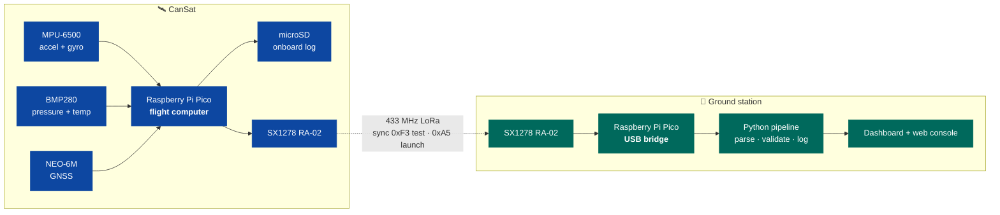
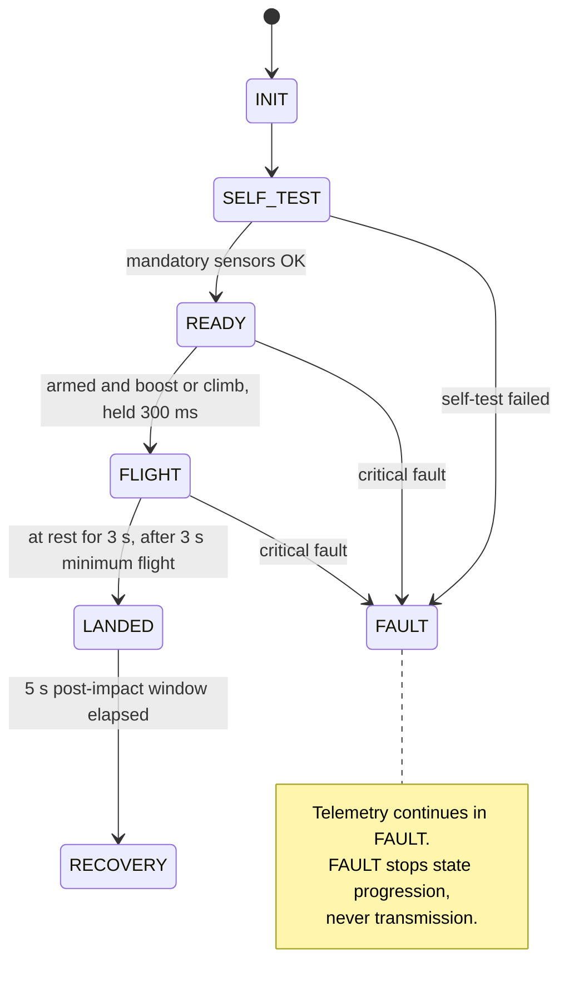
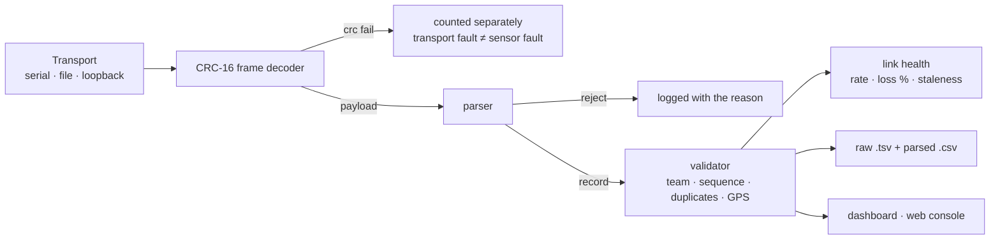

<div align="center">

# CanSat 2026

**A can-sized satellite that lifts to launch altitude, deploys a parachute, protects an egg,
and streams telemetry from power-on through recovery.**

[](https://github.com/KunjSorathiya/CanSat-2026/actions/workflows/ci.yml)
[](documentation/testing/test-plan.md)
[](documentation/testing/test-plan.md)
[](firmware/)
[](ground-station/)
[](documentation/design/telemetry-protocol.md)
[](documentation/project/timeline.md)

[Architecture](documentation/design/software-architecture.md) ·
[Wiring](documentation/design/wiring.md) ·
[Timeline](documentation/project/timeline.md) ·
[Test plan](documentation/testing/test-plan.md) ·
[Runbook](documentation/operations/runbook.md) ·
[All docs](documentation/README.md)

</div>

---

## Where the project stands

| Layer | State |
|---|---|
| 🟢 **Software** | Flight core, telemetry protocol, ground station and web console **implemented and passing 4395 automated checks on the host**, including an end-to-end trace from the flight controller through the ground pipeline |
| 🟡 **Firmware drivers** | The IMU, barometer, GPS and radio drivers **have run on real silicon** and their numbers are recorded. The microSD driver and the flight image as a whole have not |
| 🟠 **Hardware** | Bring-up under way: **18 of 80 recorded measurements taken** — the bare Pico, the IMU and barometer, the GPS, the radio's airtime, and the bench identification that found the IMU is a six-axis part. **Power is untouched** — no regulator selected, no switch, no divider, nothing measured |
| 🔴 **Mechanical** | Structure, egg chamber and parachute **not started** — blocked on a rulebook contradiction |

> [!IMPORTANT]
> This project does not claim compliance for anything it has not evidenced. Owning a
> component is not integration, and a passing test suite is not flight verification. Every
> status in this README is written against that rule.

---

## Contents

- [Mission](#mission)
- [System architecture](#system-architecture)
- [Quick start](#quick-start)
- [How the flight software works](#how-the-flight-software-works)
- [Telemetry protocol](#telemetry-protocol)
- [Ground station](#ground-station)
- [Hardware](#hardware)
- [Testing](#testing)
- [Competition requirements](#competition-requirements)
- [Open questions for the organizers](#open-questions-for-the-organizers)
- [Repository layout](#repository-layout)
- [Documentation](#documentation)

---

## Mission

The CanSat is lifted to launch altitude by a drone, released, and must then deploy its
parachute, descend at no more than 5 m/s, protect an egg payload through landing, and
transmit telemetry continuously — from the moment it is powered on at the ground floor,
through the lift and descent, and for at least five seconds after impact, until it is
recovered.

It has to do all of that on its own. There is no command uplink and no manual trigger: the
vehicle powers on, calibrates itself, arms itself, detects its own launch and landing, and
keeps talking through every failure it can survive.

---

## System architecture



Two Raspberry Pi Picos, two identical radios. The vehicle Pico runs the mission; the ground
Pico is a pure bridge that frames every received payload onto USB serial with a CRC, so the
PC can tell transport corruption apart from a malformed packet.

**Full detail:** [software-architecture.md](documentation/design/software-architecture.md)

---

## Quick start

> **Building one from scratch?** [documentation/quick-start.md](documentation/quick-start.md)
> covers the whole path — parts, wiring, firmware, bring-up, launch and recovery — with
> realistic time estimates and every blocked step marked.

Nothing below needs hardware or the Pico SDK.

```bash
bash tools/build_host.sh
```

Compiles and runs every C++ suite and the Python ground-station suite.

```bash
bash tools/check_pico_syntax.sh
```

Syntax-checks all ten `PICO_BUILD` translation units against minimal SDK stubs.

**See telemetry without any hardware** — open
[`ground-station/web/index.html`](ground-station/web/index.html) in a browser. Demo mode
replays a full drone-lift mission at 2 Hz: link health, mission state, altitude and
pressure plots, an attitude indicator and a live packet monitor.

**Replay a packet file through the real pipeline:**

```bash
cd ground-station/software
python src/main.py replay ../../test-data/sample-mission.txt --team CAN-Team-01 --export logs/flight.csv
```

**Build the Pico images** (requires `PICO_SDK_PATH` and `pico_sdk_import.cmake`):

```bash
cmake -S . -B build/pico && cmake --build build/pico --parallel
```

Produces `cansat_pico_firmware` (vehicle) and `cansat_ground_bridge_firmware` (bridge).

---

## How the flight software works

The vehicle runs a single non-blocking loop on a 2 ms tick. Nothing waits on hardware,
nothing allocates, and every recovery path is bounded.



Six behaviours are worth knowing about:

<details>
<summary><b>It calibrates itself on the pad — and never lets that block the mission</b></summary>

While stationary in `INIT`/`SELF_TEST`/`READY`, the vehicle collects IMU and barometer
samples and captures gyro bias, accelerometer offset and the barometric ground reference
(so altitude reads ≈ 0 on the pad). Acceptance needs 80 samples with per-axis gyro
standard deviation under 2 °/s and an acceleration magnitude within 1.5 m/s² of 1 g.

If the vehicle is not still, calibration retries until a 20 s timeout, then resolves
best-effort: the **barometric reference is still used**, but gyro and accelerometer bias
are **not applied** — a bias measured while moving would be worse than no correction. A
warning fault is raised and the mission continues.
</details>

<details>
<summary><b>A startup glitch cannot trigger a false launch</b></summary>

`READY → FLIGHT` is refused until the vehicle is *armed*: the arming delay has elapsed
(3 s) **and** calibration has settled. Then the launch condition — acceleration above
30 m/s² or a climb of more than 15 m above the ground baseline — must hold continuously
for 300 ms. All four thresholds are provisional and marked as such.
</details>

<details>
<summary><b>An implausible reading is treated as worse than no reading</b></summary>

A value outside datasheet-derived bounds (30–115 kPa, ±170 m/s², ±2200 °/s) is not just
skipped — the previously held value is dropped too, so the vehicle never coasts on data
from a sensor that is actively wrong. Staleness is time-based: 2 s without a good read
raises the fault, so a single failed read changes nothing.
</details>

<details>
<summary><b>Wrong data is never transmitted, and suppression never fakes packet loss</b></summary>

If any mandatory field cannot be trusted, no packet is produced at all — and the packet
number is **not consumed**. Transmitted packets therefore stay strictly sequential
(`P-001`, `P-002`, `P-003`…), so a gap at the ground station means radio loss and nothing
else.
</details>

<details>
<summary><b>Every peripheral can fail without stopping the mission</b></summary>

GPS missing? Optional fields are omitted. SD failing? Logging disables itself after 10
consecutive write failures. Radio down? Bounded re-initialisation with a 1 s back-off,
never a blocking retry loop. Only a total loss of mandatory sensing — bad config, failed
self-test, or *both* IMU and barometer stale — counts as critical, and even then telemetry
keeps running in `FAULT`.
</details>

<details>
<summary><b>It survives its own crashes</b></summary>

A 2 s hardware watchdog reboots a hung loop; telemetry restarts automatically and the
reboot is reported as a fault so the ground station can see it. The onboard log writes into
raw 512-byte blocks with **no filesystem**, rewriting its header after every record, so a
brownout or impact reset resumes at the correct block instead of overwriting flight data.
</details>

---

## Telemetry protocol

Every packet carries the mandatory rulebook block, and may append optional fields after it:

```text
CAN-Team-01; P-042; Ti-00:01:23:450; A-118.4; Pr-99821.33; T-24.6; Ro-2.1; Pi--1.4;
Ya-15.9; AX-0.12; AY--0.31; AZ-9.79; GP-Lat-21.164500; GP-Lon-72.784800;
GP-Alt-121.3; MODE-FLIGHT; FAULTS-0; CAL-1; ARM-1;
```

<details>
<summary><b>Mandatory fields</b></summary>

| Field | Meaning | Format |
|---|---|---|
| `CAN-Team-XX` | Team identifier | Correct identifier in every packet |
| `P-XXX` | Packet number | Starts at `P-001`, increments sequentially |
| `Ti-HH:MM:SS:MS` | Timestamp | Mission clock since power-on |
| `A-XXX.X` | Altitude | Metres, 1 decimal |
| `Pr-XXXX.XX` | Pressure | Pa, 2 decimals |
| `T-XX.X` | Temperature | °C, 1 decimal |
| `Ro-XX.X` / `Pi-XX.X` / `Ya-XX.X` | Roll / pitch / yaw | Degrees, 1 decimal |
| `AX-XX.XX` / `AY-XX.XX` / `AZ-XX.XX` | Acceleration | m/s², 2 decimals |

Precision is enforced exactly, in both the formatter and both parsers.
</details>

<details>
<summary><b>Optional fields we append</b></summary>

| Tag | Meaning |
|---|---|
| `GP-Lat` / `GP-Lon` / `GP-Alt` | GPS position, only when a fix exists |
| `MODE` | Mission state — `INIT`, `SELF_TEST`, `READY`, `FLIGHT`, `LANDED`, `RECOVERY`, `FAULT` |
| `FAULTS` | Count of currently active faults |
| `CAL` | 1 once startup calibration has settled |
| `ARM` | 1 once launch detection is enabled |

These come after every mandatory field, as the rulebook requires. Mandatory data always has
priority, and unknown optional fields are ignored by a conforming parser.
</details>

> [!NOTE]
> **Yaw says which kind of yaw it is.** Every packet carries a `YR-` tag: `YR-M` means an
> absolute magnetic yaw, `YR-G` means a relative gyro integration whose zero is arbitrary.
> The vehicle never claims an absolute heading it has not earned.
>
> **On the part actually delivered, that tag reads `YR-G` and always will.** The IMU is an
> MPU-6500 — six axes, no magnetometer — not the nine-axis MPU-9250 it was sold as
> ([F-1](documentation/hardware/receiving-inspection.md#findings), `WHO_AM_I` `0x70` read
> on the bench). The nine-axis path is implemented and tested and would produce `YR-M` on a
> real MPU-9250; this vehicle has no absolute yaw reference, and its yaw drifts with the
> gyroscope. See [open question 6](#open-questions-for-the-organizers).

**Radio:** 433 MHz LoRa. Only the sync words are fixed by the rulebook — **`0xF3` for
testing, `0xA5` for the official launch**. Spreading factor, bandwidth, coding rate,
power and preamble are provisional engineering defaults.

**Full specification:** [telemetry-protocol.md](documentation/design/telemetry-protocol.md)

---

## Ground station



Three interfaces, one pipeline:

| Interface | Use |
|---|---|
| **Web console** — [`ground-station/web/index.html`](ground-station/web/index.html) | Single file, no build, no dependencies. Demo replay, file replay, or live Web Serial |
| **Tk dashboard** — `python src/main.py live --port COM5 --framed` | Live numeric view, with plots when matplotlib is installed |
| **CLI replay** — `python src/main.py replay ../../test-data/sample-mission.txt --export out.csv` | Offline parse, validate, log and export |

The receive pipeline runs on a background thread and hands the UI a snapshot through a
bounded queue, so a slow interface can never stall reception or logging. **Nothing received
is ever discarded** — malformed packets and CRC failures all reach the raw log with their
receipt time and the reason.

---

## Hardware

<details>
<summary><b>Confirmed bill of materials</b></summary>

| Subsystem | Component | Qty | Purpose | Status |
|---|---|---:|---|---|
| Flight computer | Raspberry Pi Pico | 2 | Vehicle + ground bridge | Confirmed; not integrated |
| Telemetry | SX1278 RA-02 433 MHz LoRa | 2 | Vehicle + ground radio | Confirmed; configuration provisional |
| Telemetry | 433 MHz antenna, SMA | 2 | Radio antennas | Confirmed; **connector gender disputed** |
| Telemetry | 10 cm IPEX-to-SMA RG1.13 cable | 2 | Radio to antenna | Confirmed |
| Sensors | Sold as MPU-9250; **delivered an MPU-6500** — accelerometer + gyroscope, no magnetometer | 1 | Acceleration and angular rate | **Identified on the bench:** `WHO_AM_I` `0x70`, and `0x0C` never answers ([F-1](documentation/hardware/receiving-inspection.md#findings)) |
| Sensors | GY-BMP280-3.3 | 1 | Pressure, altitude, temperature | Confirmed; unverified |
| Sensors | NEO-6M GPS with EEPROM | 1 | Position and timing | Confirmed; unverified |
| Storage | microSD card reader | 1 | Onboard logging | Confirmed; **highest-risk item** |
| Power | Orange 3.7 V 1500 mAh 25C 1S LiPo | 1 | Primary power | Confirmed; treat as variable-voltage |
| Power | 3.3 V regulated supply | TBD | Peripheral rail | **Not selected** |
| Prototyping | 10 × 10 cm universal PCB | 2 | Electronics mounting | Confirmed |

Not in the BOM and mandatory: **manual ON/OFF switch**, **visible power LED**, **egg
chamber**, **parachute**.
</details>

<details>
<summary><b>Pin assignment</b></summary>

| GPIO | Function | Device |
|---:|---|---|
| GP4 / GP5 | I2C0 SDA / SCL | MPU-9250 + BMP280 |
| GP16 / GP18 / GP19 | SPI0 MISO / SCK / MOSI | RA-02 + microSD |
| GP17 | Chip select | RA-02 |
| GP6 | Chip select | microSD |
| GP20 / GP21 / GP22 | RESET / DIO0 / DIO1 | RA-02 |
| GP12 / GP13 | UART0 TX / RX | NEO-6M |
| GP7 | Interrupt | MPU-9250 |
| GP14 | Status LED | External LED |
| GP26 | ADC0 | Battery sense — **reservation only** |

`BoardPins` in [`config.hpp`](firmware/flight-computer/include/flight/config.hpp) is the
source of truth. Diagrams: [wiring.md](documentation/design/wiring.md)
</details>

### The three hardware blockers

1. **No regulator is selected.** The AMS1117-3.3 was assessed and rejected for direct 1S
   LiPo to 3.3 V regulation — a full cell at ≈ 4.2 V does not clear its high-load dropout,
   and its 3.3 V output is below the microSD reader's stated 4.5–5.5 V input range.
2. **The microSD reader may not be compatible** with any rail the vehicle can produce
   easily. See [sd-module-analysis.md](documentation/hardware/sd-module-analysis.md).
3. **The exact breakout variants are undocumented.** Board-level supply, logic levels,
   regulators, pull-ups and pinouts stay `TBD` until physically verified — a chip datasheet
   does not describe a breakout board.

---

## Testing

```bash
bash tools/build_host.sh
```

| Suite | Coverage | Result |
|---|---|---|
| `flight_tests` | 59 suites: packet format and edge cases, parser, shared protocol fixtures, state machine, orientation and angle wrapping, GPS validation, sensor math, IMU range encoding, sensor timing, calibration, faults, scheduler, block log and torn-header recovery, controller behaviour and packet-size degradation, link profile, LoRa airtime | ✅ **3560 / 3560** |
| `flight_smoke_test` | Boot, first three packets, GPS parse | ✅ Passed |
| `sx1278_tests` | LoRa driver register sequence, TX timeout, RX and CRC handling, RSSI conversion, against a fake register bank | ✅ **94 / 94** |
| `sd_card_tests` | microSD init sequence, SDHC vs SDSC addressing, block round trip, bus release, timeouts and write-error paths, against a simulated card | ✅ **581 / 581** |
| `ground_station_tests` | Framing, CRC detection, resync, known-answer vector | ✅ Passed |
| Python (ground station) | Parser, validator, transport, health, logging robustness, bridge status, vehicle-restart recovery, shared protocol fixtures, and a cross-language end-to-end trace of real vehicle output | ✅ **111 / 111** |
| Python (tooling) | LoRa airtime model, pinned to published SX127x reference vectors | ✅ **33 / 33** |
| Web console (Node) | Framing, parser, validator, link health and bridge status, extracted from `index.html` | ✅ **46 / 46** |
| Documented claims | Numbers in the documentation checked against the source that defines them, test counts included | ✅ **149 / 149** |
| Pico syntax | 11 translation units against SDK stubs | ✅ All OK |

Highlights of what is actually proven: the emitted packet matches the rulebook format byte
for byte; the BMP280 compensation reproduces the datasheet reference vector; a boost before
arming cannot trigger a launch; invalid mandatory data suppresses a packet without
consuming its number; `crc16_ccitt("123456789") == 0x29B1`; and the vehicle and the bridge
are proven to configure the same radio modem.

**What is not covered:** real sensors, the radio link, SD media, power behaviour, and the
mechanical system. Everything above runs without hardware; none of it is evidence that the
vehicle flies.
**Details:** [test-plan.md](documentation/testing/test-plan.md)

---

## Competition requirements

<details>
<summary><b>Full requirements table (30 items)</b></summary>

`Implemented` means the software exists and is tested on the host. It never means the
requirement is satisfied in flight.

| Requirement | Our implementation | Status |
|---|---|---|
| Team of 3–5 students | Team information not recorded | ⬜ TBD |
| Self-built, no prefabricated kit | Component-level BOM confirmed | ⬜ Fabrication evidence needed |
| Egg payload and cushioned chamber | Not designed | ⬜ Not started |
| Descent system such as a parachute | Not designed | ⬜ Not started |
| Altitude, pressure, temperature | BMP280 driver + Bosch compensation, tested against the datasheet vector | 🟡 Implemented, hardware unverified |
| Gyroscope and accelerometer | MPU-9250-family driver + datasheet scaling, tested | 🟢 **Read on hardware:** bias, noise and acquisition rate recorded |
| Roll, pitch, yaw, X/Y/Z acceleration fields | Mahony quaternion filter over accelerometer, gyroscope and magnetometer; yaw is magnetic once calibrated and labelled `YR-M`/`YR-G` either way | 🟠 Implemented; **the delivered IMU has no magnetometer**, so yaw is gyro-integrated and drifts. Roll and pitch are still absolutely referenced by gravity |
| Continuous telemetry, power-on to recovery | Automatic; continues in every state including `FAULT` | 🟡 Implemented, unverified |
| At least one packet per second | 1 Hz default, chosen from measured packet size and LoRa airtime; `validate_config()` refuses any period the radio cannot sustain | 🟡 Implemented, radio unverified |
| Correct team identifier in every packet | Formatter enforces it; `CAN-Team-XX` is rejected | 🟢 Implemented and enforced |
| Required packet format, numbering from `P-001` | Byte-exact formatter, tested against the rulebook example | 🟢 Implemented and tested |
| Sync words `0xA5` launch, `0xF3` test | `RadioMode` selects it; procedure documented | 🟡 Implemented, link unverified |
| Others powered off during another team's launch | Procedure documented in the runbook | 🟡 Documented |
| Manual ON/OFF switch and visible power LED | Neither in the BOM; firmware drives a status LED on GP14 | 🔴 Not satisfied |
| Automatic telemetry at power-on | No manual trigger anywhere in the firmware | 🟡 Implemented, unverified |
| Descent rate ≤ 5 m/s | No descent system | ⬜ Not started |
| Stable descent, intact after landing | Mechanical design not started | ⬜ Not started |
| ≥ 5 s of telemetry after impact | `LANDED` holds 5 s; config validation refuses less | 🟡 Implemented and tested |
| Size and mass limits | Blocked by the rulebook contradiction | 🔴 Blocked |
| Dual-ground-station evaluation | Bridge firmware implemented | 🟡 Implemented, compatibility unverified |
| Four hours for post-launch analysis | CSV export + documented workflow; graphs not produced | 🟡 Partial |
| Preliminary and final reports | Not prepared | ⬜ Not started |
| Google Docs submission with permissions | Process not documented | ⬜ TBD |
| Photos, video, social-media links | No submission evidence | ⬜ Not started |
| Disqualification conditions avoided | No compliance evidence | ⬜ TBD |

Full checklist with evidence columns and development gates:
[requirements.md](documentation/requirements/requirements.md)
</details>

### Rulebook contradictions

The supplied rulebook contradicts itself in two places. **No value has been chosen
locally** — both are escalated to the organizers.

| Conflict | The problem |
|---|---|
| **Dimensions** | Page 1 says max width 12 cm with an egg chamber; page 4 says ≤ 21 × 9 cm and ≤ 500 g; page 10 says 21 cm (+8 cm for the egg chamber) × 12.5 cm |
| **Launch altitude** | The mission section says 100 ft; the launch guidelines say a drone launch at 150 ft |

Both block the mechanical design, which is why phase 7 has not started.

---

## Open questions for the organizers

1. Which dimensional limit applies, given three conflicting statements?
2. Is ≤ 500 g the mass limit, and how does the >10% disqualification threshold apply?
3. Launch altitude — 100 ft or 150 ft?
4. Are egg-chamber dimensions included in, or added to, the main dimensions?
5. How is the ≤ 5 m/s descent requirement enforced and scored?
6. **What constitutes valid yaw data?** This question now has a hardware answer behind it:
   the delivered IMU is a six-axis MPU-6500 with no magnetometer, so the vehicle can
   transmit only a relative, gyro-integrated yaw, declared `YR-G`. Is a relative yaw
   acceptable, and is the declared reference (`YR-M` / `YR-G`) an acceptable way to say
   which is being transmitted? **If an absolute magnetic yaw is required, this is a part
   the vehicle does not have** — a procurement item, not a software change.
7. Are any LoRa parameters prescribed beyond the sync words?
8. What scoring thresholds apply where the rulebook rewards higher performance?
9. What are the actual report, media, video and arrival deadlines?
10. What interface and data format do the official dual ground stations use?

---

## Repository layout

```text
firmware/
  common/              shared telemetry format + SX1278 driver     (cansat::)
  flight-computer/     flight core + Pico HAL + tests              (flight::)
  ground-station/      bridge firmware + USB CRC framing           (ground::)
ground-station/
  software/            Python receive pipeline + tests
  web/                 single-file browser telemetry console
tools/                 host build, Pico syntax check, LoRa link-budget calculator,
                       documentation-claim checker, SDK stubs
documentation/
  requirements/        rulebook, requirement checklist, gates
  design/              architecture, protocol, wiring, electrical
  hardware/            BOM, compatibility, GPIO map, datasheets
  project/             timeline, phases, risks
  testing/             test plan and verification record
  operations/          runbook and launch-day procedure
  audit/               repository audits
electrical/  mechanical/  simulations/  test-data/   (awaiting hardware work)
```

---

## Documentation

| Document | What it is for |
|---|---|
| [Software Architecture](documentation/design/software-architecture.md) | How the code is organised and why — flowcharts, fault model, timing budget |
| [Wiring Diagrams](documentation/design/wiring.md) | Signal wiring, pin table, bus rules, power tree, bring-up order |
| [Telemetry Protocol](documentation/design/telemetry-protocol.md) | Wire format, validation policy, radio configuration |
| [Electrical Architecture](documentation/design/electrical-architecture.md) | Power topology, regulation analysis, risks |
| [Requirements Checklist](documentation/requirements/requirements.md) | Every requirement, its status, and the development gates |
| [Project Timeline](documentation/project/timeline.md) | History, phase plan, critical path, risk register |
| [Test Plan](documentation/testing/test-plan.md) | What is tested, what is not, and the hardware test plan |
| [Operations Runbook](documentation/operations/runbook.md) | Configuration, builds, launch day, troubleshooting |
| [Repository Audit](documentation/audit/2026-09-04-repository-audit.md) | File-by-file verification of every claim made here |
| [Changelog](CHANGELOG.md) · [Contributing](CONTRIBUTING.md) | What changed; how to work on it |

---

<div align="center">

**Nothing in this repository is claimed as flight-ready.**
The software is built and tested. The hardware has not been touched.

</div>
