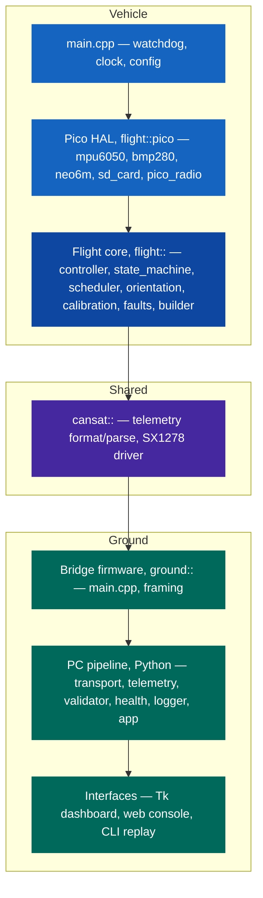
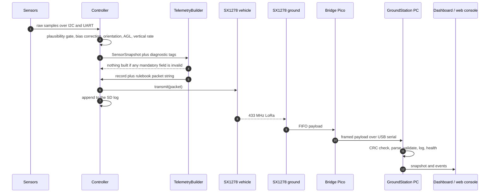
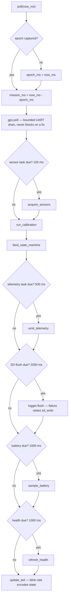
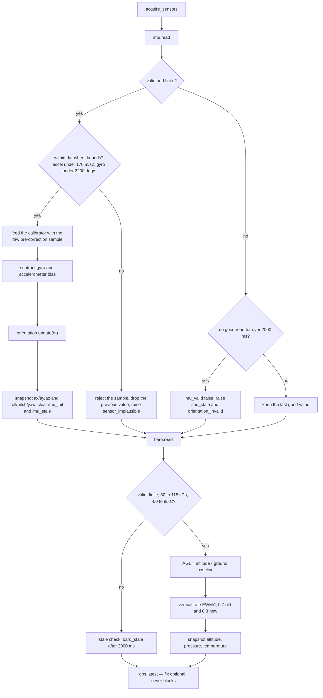
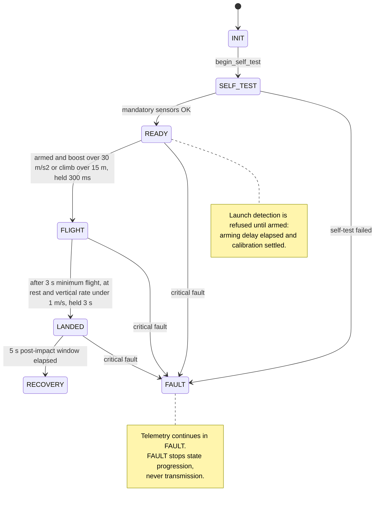
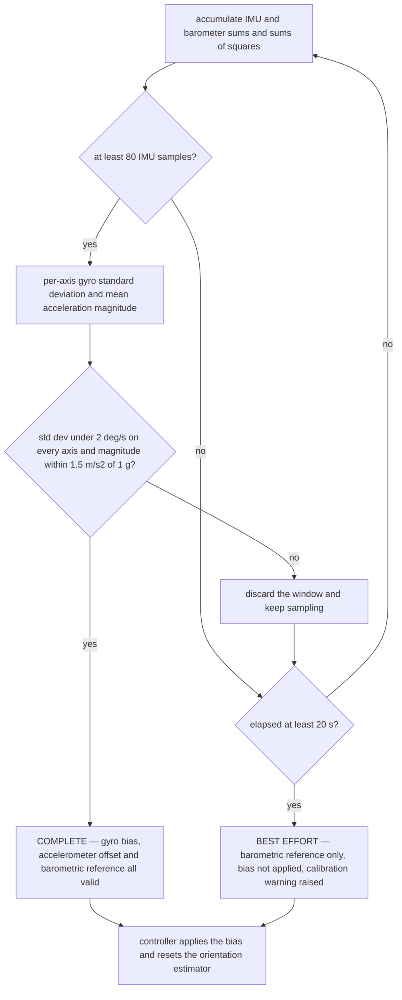
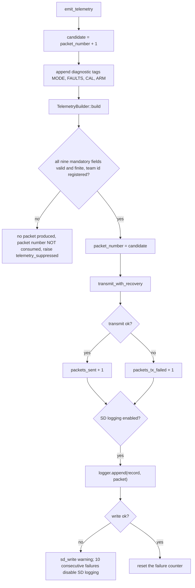
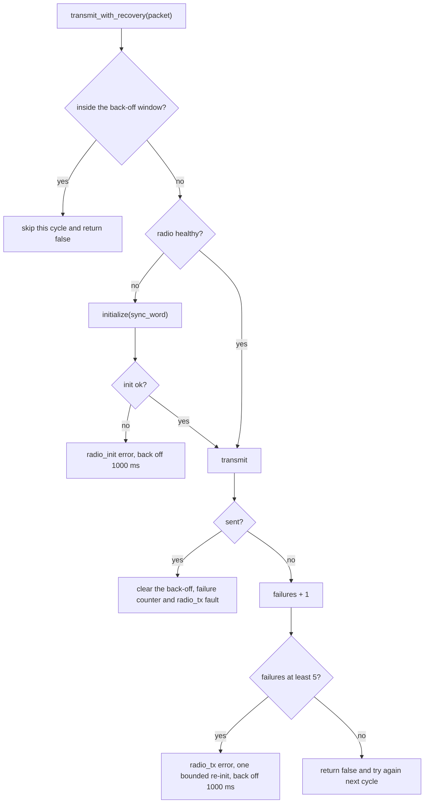
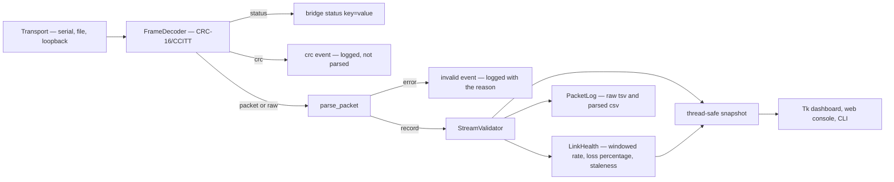

# Software Architecture

Complete map of the CanSat 2026 software: what each module does, how the layers depend on
one another, and the exact control flow inside the flight loop and the ground pipeline.

Everything described here exists in the repository and is exercised by the host test
suites. Hardware behaviour (real sensors, real radio link, real SD card) is **not**
verified — see [Verification status](#verification-status).

---

## Contents

- [Layer model](#layer-model)
- [Repository to module map](#repository-to-module-map)
- [End-to-end data path](#end-to-end-data-path)
- [Flight computer](#flight-computer)
  - [Flight loop control flow](#flight-loop-control-flow)
  - [Sensor acquisition](#sensor-acquisition)
  - [Mission state machine](#mission-state-machine)
  - [Startup calibration](#startup-calibration)
  - [Telemetry generation](#telemetry-generation)
  - [Radio transmit with recovery](#radio-transmit-with-recovery)
  - [Fault model](#fault-model)
  - [Onboard logging](#onboard-logging)
- [Ground station](#ground-station)
  - [Bridge firmware](#bridge-firmware)
  - [Serial framing](#serial-framing)
  - [PC pipeline](#pc-pipeline)
  - [Web console](#web-console)
- [Timing budget](#timing-budget)
- [Design rules](#design-rules)
- [Verification status](#verification-status)

---

## Layer model

Each layer only depends on the layer beneath it. The flight core never includes a Pico SDK
header, which is why the whole mission logic is testable on a laptop.



**The dependency rule.** `flight_core` compiles against the host toolchain with no SDK
present. Hardware arrives only through the six abstract interfaces in
[`interfaces.hpp`](../../firmware/flight-computer/include/flight/interfaces.hpp):
`Imu`, `Barometer`, `Gps`, `Radio`, `SdLogger`, `BoardIo`. Tests substitute mocks
([`mock_hardware.hpp`](../../firmware/flight-computer/tests/mock_hardware.hpp)); the
vehicle substitutes `flight::pico::*`.

---

## Repository to module map

### Shared library — `firmware/common/`

| File | Responsibility |
|---|---|
| [`cansat/telemetry.hpp`](../../firmware/common/include/cansat/telemetry.hpp) | Canonical `TelemetryRecord`, `TelemetryValidity`, `GpsData`, `ParseResult` |
| [`src/telemetry.cpp`](../../firmware/common/src/telemetry.cpp) | Rulebook packet formatter, strict parser, team-id validation. No `<regex>` dependency |
| [`cansat/sx1278.hpp`](../../firmware/common/include/cansat/sx1278.hpp) | SX1278 / RA-02 LoRa driver contract and settings |
| [`src/sx1278.cpp`](../../firmware/common/src/sx1278.cpp) | Register-level driver, driven through a `Sx1278Hal` callback struct so it runs on the vehicle, on the bridge, or against a fake register bank |

### Flight core — `firmware/flight-computer/`

| Module | Responsibility |
|---|---|
| [`config.hpp`](../../firmware/flight-computer/include/flight/config.hpp) / [`config.cpp`](../../firmware/flight-computer/src/config.cpp) | Every tunable in one struct, `BoardPins`, and `validate_config()` |
| [`interfaces.hpp`](../../firmware/flight-computer/include/flight/interfaces.hpp) | The six hardware interfaces and their sample structs |
| [`controller.cpp`](../../firmware/flight-computer/src/controller.cpp) | The flight loop orchestrator — the single place mission behaviour is composed |
| [`state_machine.cpp`](../../firmware/flight-computer/src/state_machine.cpp) | `INIT` to `SELF_TEST` to `READY` to `FLIGHT` to `LANDED` to `RECOVERY`, plus `FAULT` |
| [`scheduler.cpp`](../../firmware/flight-computer/src/scheduler.cpp) | `PeriodicTask` — fixed-period, non-allocating, stall-tolerant timers |
| [`orientation.cpp`](../../firmware/flight-computer/src/orientation.cpp) | Complementary-filter roll and pitch, gyro-integrated relative yaw |
| [`sensor_math.cpp`](../../firmware/flight-computer/src/sensor_math.cpp) | MPU6050 scaling, Bosch BMP280 compensation, barometric altitude |
| [`startup_calibration.cpp`](../../firmware/flight-computer/src/startup_calibration.cpp) | Pad calibration: gyro bias, accelerometer offset, barometric ground reference |
| [`telemetry_builder.cpp`](../../firmware/flight-computer/src/telemetry_builder.cpp) | Snapshot to record to packet string to SD CSV row |
| [`fault_manager.cpp`](../../firmware/flight-computer/src/fault_manager.cpp) | Fixed-size fault store indexed by enum; never grows |
| [`raw_block_log.cpp`](../../firmware/flight-computer/src/raw_block_log.cpp) | Append-only 512-byte-block log — no filesystem, no FAT dependency |
| [`gps_parser.cpp`](../../firmware/flight-computer/src/gps_parser.cpp) | Streaming NMEA-0183 (GGA and RMC) with checksum validation |
| [`health.cpp`](../../firmware/flight-computer/src/health.cpp) | `HealthSnapshot` and mission-state names |
| `src/pico/*` | Pico-only HAL, compiled only when the SDK is present |

### Ground station

| Component | Path | Responsibility |
|---|---|---|
| Bridge firmware | [`firmware/ground-station/src/pico/main.cpp`](../../firmware/ground-station/src/pico/main.cpp) | RA-02 continuous RX to framed USB serial |
| Framing (C++) | [`framing.cpp`](../../firmware/ground-station/src/framing.cpp) | `$len,crc,payload` encoder and incremental decoder |
| Framing (Python) | [`transport.py`](../../ground-station/software/src/transport.py) | Byte-for-byte mirror, plus serial / file / loopback transports |
| Parser | [`telemetry.py`](../../ground-station/software/src/telemetry.py) | Packet to `TelemetryRecord`, precision-strict |
| Validator | [`validator.py`](../../ground-station/software/src/validator.py) | Team identity, sequence, duplicates, timestamp monotonicity, GPS sanity |
| Link health | [`health.py`](../../ground-station/software/src/health.py) | Sliding-window rate, loss percentage, CRC errors, staleness |
| Logger | [`logger.py`](../../ground-station/software/src/logger.py) | Raw `.tsv` (nothing discarded) and parsed `.csv` |
| Orchestrator | [`app.py`](../../ground-station/software/src/app.py) | Background thread, thread-safe snapshot, event queue |
| Dashboard | [`dashboard.py`](../../ground-station/software/src/dashboard.py) | Tk UI, non-blocking event drain |
| CLI | [`main.py`](../../ground-station/software/src/main.py) | `replay` and `live` subcommands |
| Web console | [`ground-station/web/index.html`](../../ground-station/web/index.html) | Zero-dependency browser console: demo, file replay, Web Serial |

---

## End-to-end data path



A packet only becomes a telemetry point if it survives every stage. Each stage's rejection
is counted separately, so a transport fault is never mistaken for a sensor fault.

---

## Flight computer

### Flight loop control flow

`Controller::poll(now_ms)` is called continuously from `main()` on a 5 ms tick. It is
non-blocking and bounded: no branch waits on hardware.



The ordering is deliberate. GPS is drained first so a full UART buffer can never back up;
calibration and the state machine run before telemetry so every packet carries the state
that matches the samples inside it.

### Sensor acquisition



Two rules matter here.

1. **An implausible reading is worse than no reading.** A value outside datasheet-derived
   bounds is not merely skipped — the previously held value is dropped too, so the vehicle
   never coasts on stale data from a sensor that is actively wrong.
2. **Staleness is time-based, not attempt-based.** A single failed read changes nothing;
   `sensor_stale_after_ms` (2 s) without a good read raises the fault.

### Mission state machine



**Critical fault is deliberately narrow.** Only a total loss of mandatory sensing counts:
invalid configuration, a failed self-test, or *both* IMU and barometer stale at the same
time. Anything the vehicle can still partly do keeps the mission running.

**Post-impact requirement.** The rulebook demands at least 5 s of telemetry after impact.
`LANDED` holds for `post_impact_transmission_ms` (5000 ms, and `validate_config()` refuses
to start below 5000) before `RECOVERY`, and telemetry never stops in either state.

### Startup calibration

Runs while the vehicle sits on the pad, during `INIT`, `SELF_TEST` and `READY`.



The asymmetry is intentional. A bias measured while the vehicle was moving would be worse
than no correction, so it is discarded — but the **barometric ground reference stays
usable** even then, because averaging pressure does not require stillness. Calibration
never blocks the mission.

### Telemetry generation



**Packet numbering is strictly sequential over transmitted packets.** A suppressed packet
does not consume a number, so the ground station sees `P-001`, `P-002`, `P-003` with no
gaps that would be indistinguishable from radio loss.

The wire format is defined in [telemetry-protocol.md](telemetry-protocol.md). The
formatter is the only place it is produced, and `parse_packet()` is the only place it is
consumed on the C++ side.

### Radio transmit with recovery



Recovery is bounded on purpose: a dead radio costs one initialisation attempt per back-off
window, never a blocking retry loop inside the flight loop.

### Fault model

Sixteen enumerated codes in a fixed-size array — no allocation, and constant cost
regardless of mission length. Faults carry severity, occurrence count, and first and last
timestamps. `clear()` marks recovery but keeps the history.

| Code | Severity | Raised when | Effect |
|---|---|---|---|
| `config_invalid` | critical | `validate_config()` fails | FAULT; no compliant telemetry is possible |
| `imu_init` / `baro_init` | error, critical if both | Sensor initialisation fails | Degraded; both dead means FAULT |
| `imu_stale` / `baro_stale` | error | No good read for 2 s | Affected fields invalid; both stale is critical |
| `orientation_invalid` | error | The estimator has no valid attitude | Roll, pitch and yaw invalid, so the packet is suppressed |
| `sensor_implausible` | warning | A reading falls outside datasheet bounds | The sample and the previous value are both dropped |
| `gps_unavailable` | warning | GPS initialisation fails | Optional fields omitted; mission unaffected |
| `sd_unavailable` / `sd_write` | warning | SD init fails, or a write fails | Logging disables itself after 10 consecutive failures |
| `radio_init` / `radio_tx` | error | Init fails, or 5 consecutive transmit failures | Bounded re-init plus back-off |
| `battery_low` | warning | Below `battery_low_voltage`, only when a divider ratio is configured | Reported; no mission change |
| `telemetry_suppressed` | error | Mandatory data invalid at build time | The packet number is not consumed |
| `calibration` | warning | Pad calibration did not settle cleanly | Best-effort reference used |
| `watchdog_reboot` | warning | The power session began with a watchdog reset | Recorded so the ground station can see the recovery |

### Onboard logging

`RawBlockLog` writes newline-terminated records into a linear array of 512-byte blocks
with **no filesystem at all**, so the flight code carries no FAT dependency.

```text
base_lba + 0        header: magic 'CSAT', version, block size,
                            next free block, boot count, region size
base_lba + 1 .. N   one space-padded, newline-terminated record per block
```

The header is rewritten after every record, so a brownout or impact reset resumes at the
correct block instead of overwriting flight data, and the boot count increments on each
power session. A full region stops writing rather than wrapping over earlier data.

---

## Ground station

### Bridge firmware

The ground Pico is a pure bridge: the SX1278 sits in continuous RX and every received
payload is framed straight to USB serial. It adds a
`#state=RX radio=... frames=... rssi=... snr=...` status line once a second, re-initialises
the radio after 20 consecutive unhealthy polls, and runs a 3 s watchdog so a hung bridge
reboots and the PC transport reconnects on its own.

### Serial framing

```text
'$' <len> ',' <crc16-hex4> ',' <payload bytes> '\n'
```

`len` is the decimal payload length. `crc16` is CRC-16/CCITT-FALSE (polynomial `0x1021`,
initial value `0xFFFF`) over the raw payload, lower-case, four hex digits. A payload
starting with `#` is a bridge status line.

The point of the CRC is separation of concerns: it tells the PC whether the **transport**
corrupted the bytes, independently of whether the **packet** was malformed. Three
implementations exist and must stay identical —
[`framing.cpp`](../../firmware/ground-station/src/framing.cpp),
[`transport.py`](../../ground-station/software/src/transport.py), and the decoder inside
[`index.html`](../../ground-station/web/index.html). A shared known-answer vector is
asserted in both test suites.

### PC pipeline



`GroundStation` runs the whole pipeline on a background thread and talks to the UI through
a bounded event queue plus a lock-protected snapshot. When the queue fills, the oldest
event is dropped rather than blocking the receive thread, so a slow UI can never stall
reception or logging.

**Nothing received is ever discarded.** Malformed packets, CRC failures and rejected
packets all reach the raw `.tsv` with their receipt timestamp and the reason.

### Web console

[`ground-station/web/index.html`](../../ground-station/web/index.html) is a single file
with no build step and no dependencies. It ports the parser, the validator, the
link-health model and the CRC framing from the Python and C++ sources, so it accepts
exactly what the bridge emits. Three sources are available: a generated demo mission, a
packet file, or a live Web Serial connection to the bridge Pico.

---

## Timing budget

| Activity | Period | Configured by | Note |
|---|---:|---|---|
| Main tick | 5 ms | `main.cpp` | The loop is non-blocking; the delay only yields |
| Sensor acquisition and orientation | 100 ms | `sensor_period_ms` | 10 Hz attitude update |
| Telemetry packet | 500 ms | `telemetry_period_ms` | 2 Hz target; **1000 ms is the enforced ceiling** for the 1 Hz rulebook minimum |
| SD flush | 2000 ms | `sd_flush_period_ms` | Appends happen per packet; this is the sync |
| Battery sample | 1000 ms | `battery_period_ms` | |
| Health refresh | 1000 ms | `health_period_ms` | |
| Flight watchdog | 2000 ms | `main.cpp` | A hung loop reboots and telemetry restarts |
| Bridge watchdog | 3000 ms | bridge `main.cpp` | A hung bridge reboots and the PC reconnects |
| Bridge status line | 1000 ms | bridge `main.cpp` | |

`PeriodicTask` self-corrects after a stall: if the loop falls behind by more than one
period, the next due time re-anchors to `now + period` instead of firing a catch-up burst.

---

## Design rules

These are the invariants the code is built around. Breaking one is a design change, not a
refactor.

1. **Telemetry never stops.** No peripheral failure, and no state including `FAULT`,
   suppresses telemetry that can still be produced correctly.
2. **Wrong data is worse than no data.** Mandatory fields that cannot be trusted suppress
   the packet instead of transmitting a plausible-looking wrong value.
3. **Sequential numbering is over transmitted packets.** Suppression does not consume a
   number.
4. **The flight core knows no hardware.** Anything device-specific lives behind an
   interface, under `src/pico/`.
5. **Nothing in the flight loop blocks or allocates.** Fixed-size buffers, bounded
   recovery, no dynamic containers on the hot path.
6. **Provisional values are labelled.** Everything the rulebook or the hardware has not
   fixed is marked `PROVISIONAL` in `config.hpp`. Only the sync words `0xF3` (test) and
   `0xA5` (official) are fixed by the rulebook.
7. **The placeholder team id is rejected on purpose.** `CAN-Team-XX` fails
   `validate_config()`, so the vehicle cannot fly with an unset identity.

---

## Verification status

| Scope | Status |
|---|---|
| Flight core logic, telemetry format, parser, framing, GPS parsing, state machine, calibration | **Verified on host** — 21 C++ suites with 189 assertions, plus 37 Python tests |
| Pico HAL sources | **Compile-checked only** — `-fsyntax-only` against minimal SDK stubs |
| Pico firmware image | **Not built here** — requires `PICO_SDK_PATH` and `pico_sdk_import.cmake` |
| Sensors, radio link, SD card, power, antenna | **Not verified** — no hardware bring-up has been performed |

Host tests prove logic, not flight readiness. See [test-plan.md](../testing/test-plan.md)
for what is covered and what is still open.
