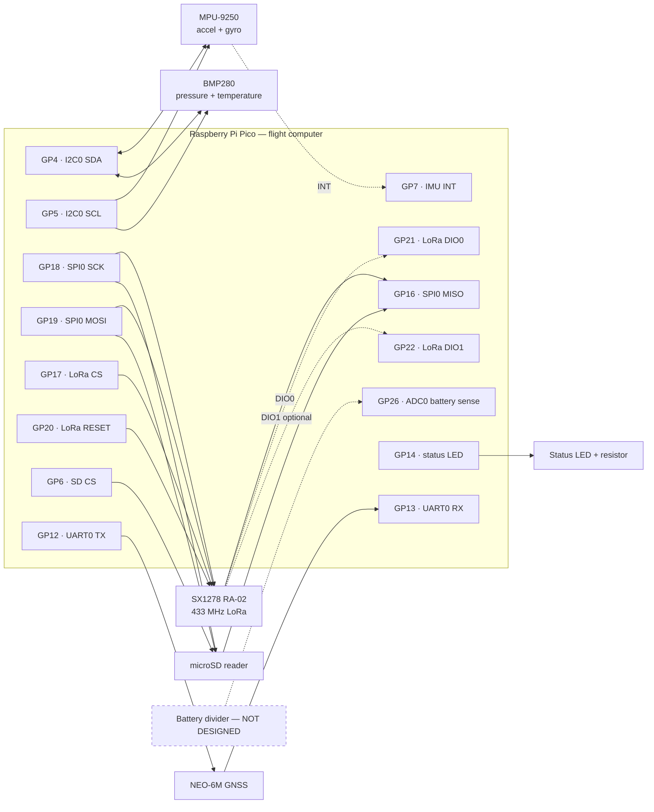
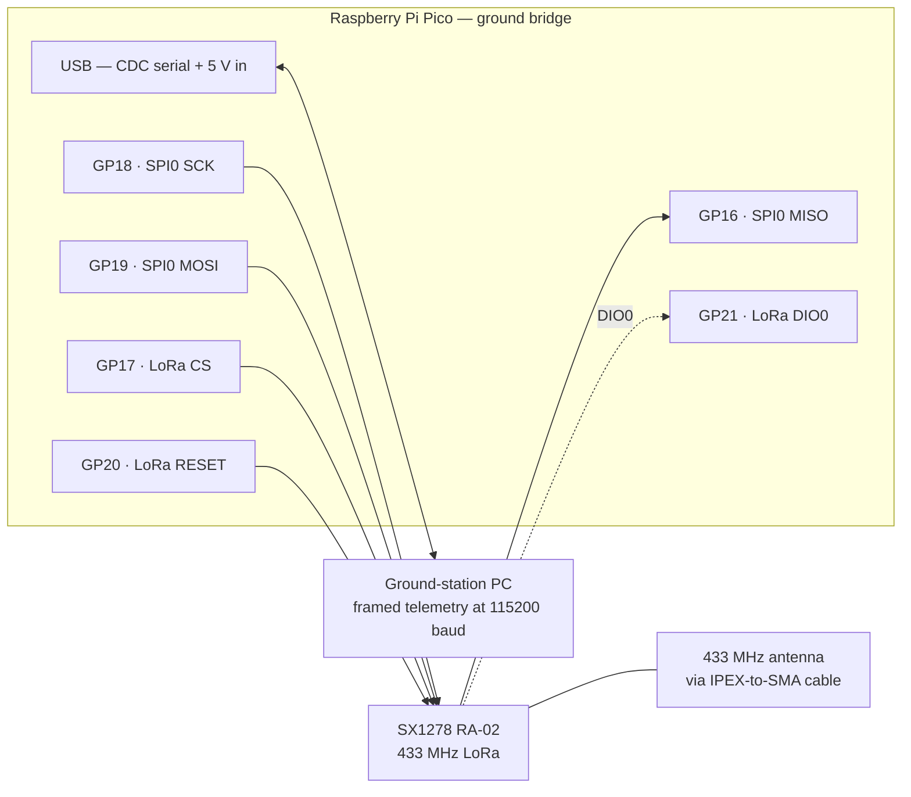
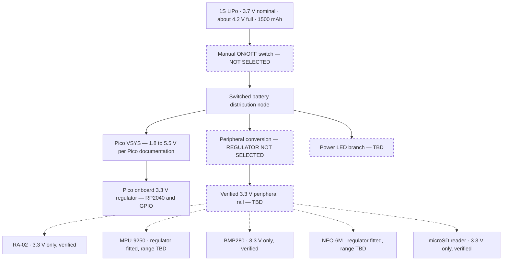

# Wiring Diagrams

Signal-level wiring for both Picos, drawn from the pin assignment the firmware actually
uses. `BoardPins` in
[`config.hpp`](../../firmware/flight-computer/include/flight/config.hpp) is the single
source of truth in code; this page and
[pico-gpio-map.md](../hardware/pico-gpio-map.md) must always agree with it.

> [!WARNING]
> **This is a provisional signal map, not an approved schematic.** No wire in this
> document has been built or measured. The breakout variants are now identified and their
> headers transcribed, but **no regulator is selected and no rail has been powered** — see
> [electrical-compatibility.md](../hardware/electrical-compatibility.md) and
> [pre-procurement-design-status.md](../hardware/pre-procurement-design-status.md).
> Do not connect the LiPo to any module, or to GPIO26, on the basis of this page.

---

## Contents

- [Flight computer](#flight-computer-signal-wiring)
- [Ground station bridge](#ground-station-bridge-signal-wiring)
- [Pin assignment table](#pin-assignment-table)
- [Module header pinouts](#module-header-pinouts-as-printed)
- [Bus sharing rules](#bus-sharing-rules)
- [Power tree](#power-tree-provisional)
- [Status LED and power indicator](#status-led-and-power-indicator)
- [Battery monitoring](#battery-monitoring)
- [RF chain](#rf-chain)
- [Bring-up order](#bring-up-order)
- [Module mounting](#module-mounting)
- [Open items](#open-items-before-any-wiring-is-built)

---

## Flight computer signal wiring



Solid arrows are driven signals; dashed arrows are interrupt or optional lines. The
battery divider is drawn dashed because **it does not exist yet**.

Text form, matching [pico-gpio-map.md](../hardware/pico-gpio-map.md):

```text
I2C0                      SPI0 (shared bus)
  GP4  -> SDA  -> MPU-9250   GP18 -> SCK  -> RA-02 + microSD
  GP4  -> SDA  -> BMP280    GP19 -> MOSI -> RA-02 + microSD
  GP5  -> SCL  -> MPU-9250   GP16 <- MISO <- RA-02 + microSD
  GP5  -> SCL  -> BMP280    GP17 -> CS   -> RA-02   (dedicated)
  GP7  <- INT  <- MPU-9250   GP6  -> CS   -> microSD (dedicated)

UART0                     RA-02 control
  GP12 -> TX -> GPS RX      GP20 -> RESET
  GP13 <- RX <- GPS TX      GP21 <- DIO0
                            GP22 <- DIO1 (optional; release if unused)

Board I/O
  GP14 -> status LED (through a current-limiting resistor, value TBD)
  GP26 <- ADC0, battery-sense reservation only — nothing connected
```

---

## Ground station bridge signal wiring

The bridge Pico uses the same SPI pins as the vehicle, so one wiring habit covers both
boards. It has no sensors, no SD card and no GPS.



The bridge is powered and read over the same USB cable, so it needs no battery and no
regulator. The pin constants live in
[`firmware/ground-station/src/pico/main.cpp`](../../firmware/ground-station/src/pico/main.cpp)
and mirror `BoardPins`.

---

## Pin assignment table

| Pico GPIO | Function | Peripheral | Direction | Device | Required | `BoardPins` field |
|---:|---|---|---|---|---|---|
| GP4 | I2C SDA | I2C0 | Bidirectional | MPU-9250 + AK8963 + BMP280 | Yes | `i2c_sda` |
| GP5 | I2C SCL | I2C0 | Output (open-drain bus) | MPU-9250 + AK8963 + BMP280 | Yes | `i2c_scl` |
| GP6 | SD chip select | GPIO | Output | microSD reader | Yes | `sd_cs` |
| GP7 | IMU interrupt | GPIO | Input | MPU-9250 INT | Useful | `imu_int` |
| GP12 | UART TX | UART0 | Output | NEO-6M RX | Yes | `gps_tx` |
| GP13 | UART RX | UART0 | Input | NEO-6M TX | Yes | `gps_rx` |
| GP14 | Status LED | GPIO | Output | External LED | Yes | `status_led` |
| GP16 | SPI MISO | SPI0 RX | Input | RA-02 + microSD | Yes | `spi_miso` |
| GP17 | LoRa chip select | GPIO | Output | RA-02 NSS | Yes | `lora_cs` |
| GP18 | SPI SCK | SPI0 | Output | RA-02 + microSD | Yes | `spi_sck` |
| GP19 | SPI MOSI | SPI0 TX | Output | RA-02 + microSD | Yes | `spi_mosi` |
| GP20 | LoRa reset | GPIO | Output | RA-02 RESET | Yes | `lora_reset` |
| GP21 | LoRa DIO0 | GPIO | Input | RA-02 DIO0 (TxDone / RxDone) | Yes | `lora_dio0` |
| GP22 | LoRa DIO1 | GPIO | Input | RA-02 DIO1 | Optional | `lora_dio1` |
| GP26 | Battery sense | ADC0 | Analog in | Reservation only | Useful | `battery_adc` |

Bus speeds configured by the HAL
([`pico_hal.cpp`](../../firmware/flight-computer/src/pico/pico_hal.cpp)):
I2C0 at 400 kHz, SPI0 initialised at 400 kHz (SD-safe) and raised by the SD driver after
card initialisation, UART0 at 9600 baud for the NEO-6M.

---

## Module header pinouts, as printed

Transcribed from the delivered boards on 2026-09-04, photographs in
[`documentation/hardware/photos/`](../hardware/photos/). **These are silkscreen labels, not
an interpretation of them** — where a board prints `CLK` this table says `CLK`, and where it
names a pin two ways it says both.

**SX1278 RA-02** — two rows of 8, read from the u.FL connector end:

```text
J2   GND   GND   3.3V   RST   DIO0   DIO1   DIO2   DIO3
J1   GND   NSS   MOSI   MISO   SCK   DIO5   DIO4   GND
```

> The supply pin is **third from the end, with `GND` either side of it**. A one-pin offset
> when the module is pressed into the prototype board puts 3.3 V onto `RST`, or ground onto
> the rail. Mark pin 1 on the board before wiring.

**MPU-9250 breakout** (`GY-6500 / GY-9250`, `V356`) — 10 pins:

```text
VCC   GND   SCL     SDA     EDA   ECL   AD0       INT   NCS   FSYNC
                  (SCLK)  (SDI)                 (SDO)
```

> The underside names `SCL/SCLK`, `SDA/SDI` and `ADD/SDO` — the second name in each pair is
> the SPI role. This project uses I2C, so `SCL`, `SDA` and `AD0` are the relevant names.
> `EDA`/`ECL` are the auxiliary master bus and stay unconnected.

**GY-BM(E/P)280** — 6 pins:

```text
VCC   GND   SCL   SDA   CSB   SDO
```

> Six pins, not the four of the I2C-only variant. `CSB` selects the interface and `SDO`
> selects the address; both carry 10 kΩ straps whose direction is not yet read.

**NEO-6M** (`GY-NEO6MV2`) — 4 pins:

```text
VCC   RX   TX   GND
```

> `RX` and `TX` name the **board's own** pins. The board's `TX` goes to the Pico's `RX` on
> GP13, and the board's `RX` to the Pico's `TX` on GP12 — which is what the pin table says,
> now confirmed against the silkscreen.

**microSD reader** — 6 pins:

```text
GND   MISO   CLK   MOSI   CS   3V3
```

> `CLK`, not `SCK`. Ground and supply are at opposite ends, so a reversed header is a direct
> short across the rail.

---

## Bus sharing rules

**I2C0 was designed for three devices and carries two.** On an MPU-9250 the magnetometer is
a separate AK8963 die at address `0x0C`, invisible until the firmware sets
`INT_PIN_CFG.BYPASS_EN` and bridges it onto the primary bus, after which it counts against
the bus's capacitance and pull-up budget like any other device. **The delivered IMU is an
MPU-6500 and `0x0C` never appears** — in either scan, with or without the bypass
([F-1](../hardware/receiving-inspection.md#findings), bring-up row 3.1). The third row below
is retained because it is what the bus must accommodate if a nine-axis part is ever fitted.

| Device | Address | Selected by |
|---|---|---|
| IMU accelerometer + gyroscope | `0x68` or `0x69` | AD0 strap |
| AK8963 magnetometer — **absent on the delivered part** | `0x0C` | Fixed; reachable only through the pass-through bridge |
| BMP280 | `0x76` or `0x77` | SDO strap |

All three are distinct whichever way the straps are fitted, so sharing the bus works — but
only if the pull-ups behave. **Both delivered breakouts carry their own, and both are 10 kΩ:**
five `103` resistors on the MPU-9250 board and four on the BMP280 board
([receiving-inspection.md C.3.5 and C.4.4](../hardware/receiving-inspection.md#part-c--per-board-identification)).
Two 10 kΩ pull-ups in parallel on each line is 5 kΩ — a legal bus, and a stiffer one than
either board was designed around. It sinks roughly 0.66 mA per line when a device pulls low,
which every part here can drive, but it is worth measuring rather than assuming.

The **strap directions are still unread**: which way AD0 and SDO are pulled decides `0x68`
versus `0x69` and `0x76` versus `0x77`, and no photograph shows it. The firmware and the
bring-up record both currently expect `0x68` and `0x76`. Check the straps with a meter, or
scan the bus, before treating those two addresses as facts.

**SPI0 — RA-02 and microSD share clock, MOSI and MISO.** Two rules make this safe:

1. Exactly one chip select may be asserted at a time. The RA-02 uses GP17 and the SD card
   uses GP6, and no code path drives both low.
2. A deselected device must release MISO. **On the delivered reader, nothing but the card
   itself does.** The board has no buffer and no translator — four 10 kΩ pull-ups and two
   capacitors are its entire parts list — so a card that keeps driving MISO corrupts the
   *radio's* next transaction, and the symptom looks like a dead radio. The pull-up defines
   an undriven line; it cannot overcome a driven one. This is bring-up row 7.4, and it is
   the most important row in the shared-bus gate.

The delivered reader's supply pin is printed `3V3` and it carries no regulator, so it runs
from the same 3.3 V rail as everything else on the vehicle. An earlier revision of this
document said the opposite — that the reader needed 4.5–5.5 V and a rail of its own — on the
strength of a supplier listing. The board that arrived does not agree with the listing, which
is precisely why this project photographs and inspects its boards before designing around
them.

Its header, in printed order, is **`GND  MISO  CLK  MOSI  CS  3V3`** — note `CLK`, not `SCK`,
and note that the supply pin is at the opposite end from ground.

What remains open for the reader is current, not voltage: an SD write transient is the
largest short-duration load on this vehicle and it lands on the same regulator as a radio
that transmits once a second. See
[sd-module-analysis.md](../hardware/sd-module-analysis.md).

---

## Power tree (provisional)



**The second rail is gone.** The delivered microSD reader has no regulator and no level
shifter, and its supply pin is printed `3V3`. Every peripheral now sits on one 3.3 V rail.
The supplier listing describing a 4.5–5.5 V input and an onboard regulator did not describe
the board that arrived — see
[receiving-inspection.md, finding F-3](../hardware/receiving-inspection.md#findings).

Dashed boxes are undesigned. Two decisions still block the tree:

1. **No regulator is selected.** The AMS1117-3.3 was assessed and rejected for direct 1S
   LiPo to 3.3 V regulation — a fully charged cell at about 4.2 V does not clear its
   high-load dropout.
   See [electrical-architecture.md](electrical-architecture.md#ams1117-33-direct-regulation-assessment).
   The requirement is simpler than it was — one rail, not two — but it is not yet met.
2. **No ON/OFF switch and no power LED are in the BOM**, and both are mandatory
   competition items.

Three modules are verified 3.3 V-only. That removes the *supply* question for them and
tightens a different one: **with no level shifter anywhere in the vehicle, 3.3 V is a
requirement, not a convenience.** A 5 V feed onto this rail reaches the RA-02, the barometer
and the microSD card directly.

The MPU-9250 and NEO-6M each carry an unidentified SOT-23-5 regulator, so they may tolerate
more than 3.3 V. Neither is a reason to give them more.

The battery must be treated as a variable-voltage source across its discharge curve, never
as a fixed 3.7 V supply. **Neither of the delivered pack's connectors mates with anything in
this project** — a red JST-RCY main lead and a white 2-pin JST-XH balance lead — so the
switched distribution node begins with a purchase.

---

## Status LED and power indicator

```text
GP14 -> current-limiting resistor (value TBD) -> LED -> GND
```

Firmware drives GP14 high at the very start of `main()` and then blinks it at a rate that
encodes the mission state
([`Controller::update_led`](../../firmware/flight-computer/src/controller.cpp)):

| Mission state | LED behaviour |
|---|---|
| `INIT`, `SELF_TEST` | Solid on |
| `READY`, not yet armed | Slow blink, 900 ms half-period |
| `READY`, armed | Faster blink, 400 ms |
| `FLIGHT` | Fast blink, 100 ms |
| `LANDED`, `RECOVERY` | 250 ms |
| `FAULT` | Very fast blink, 60 ms |

> [!IMPORTANT]
> This is a *status* LED driven by firmware. The competition also requires a **visible
> power indicator that lights immediately at power-on**. A GPIO-driven LED only lights
> once the RP2040 is running. Satisfying the requirement properly needs an LED branch on
> the switched battery node, which is still `TBD`.

---

## Battery monitoring

GP26 / ADC0 is a **reservation only**. No divider is designed and nothing is connected.

The firmware is written to make an unsafe assumption impossible:
`BoardIo::battery_voltage()` returns the **raw pin voltage**, implementations must not
pre-scale, and `Configuration::battery_divider_ratio` defaults to `0.0f`, which means the
controller reports the raw pin voltage unscaled and the low-battery fault stays disabled.
A real voltage is only ever reported once a measured divider ratio `(R1 + R2) / R2` is
entered.

> [!CAUTION]
> Never connect the LiPo directly to GP26. The RP2040 ADC input is limited to the 3.3 V
> rail, and a charged 1S cell is about 4.2 V.

---

## RF chain

```text
RA-02 module  ->  IPEX (u.FL) connector
              ->  10 cm IPEX-to-SMA RG1.13 cable
              ->  433 MHz antenna
```

**The chain has been assembled and fits.** Antenna, cable and module were mated hand-tight on
2026-09-04 with no adapter — photograph
[`1150780-ra02-antenna-mated.jpg`](../hardware/photos/1150780-ra02-antenna-mated.jpg). The
RA-02's connector is a u.FL socket and the cable's is the matching IPEX-1 plug.

Three notes:

- **The connector nomenclature is still open, but assembly is not.** The antenna's shell is
  female and the cable's is male, which agrees with the supplier listing's gender and
  contradicts the BOM's "SMA male". Whether the pair is SMA or RP-SMA depends on the centre
  contacts, which no photograph shows. This matters when a *replacement* antenna is ordered:
  an RP-SMA antenna screws onto an SMA pigtail perfectly and connects nothing.
- **The cable is a bulkhead part**, supplied with a nut and star washer, so it is meant to be
  panel-mounted through the airframe wall. That mount is also the strain relief — plan the
  hole rather than leaving the joint hanging on 10 cm of coax.
- **Never power a LoRa module without its antenna attached.** Transmitting into an open
  connector can damage the output stage.

The module's shield states `PA:+18dBm`, which is the module's PA capability rather than the
configured output. What is actually transmitted comes from `link_profile.hpp` below. The two
are not in conflict, but the 1 dB is worth knowing before a range measurement gets read as a
link-budget failure.

Radio parameters — 433 MHz, **SF7**, 125 kHz bandwidth, coding rate 4/5, 17 dBm, CRC on — live
in one place, [`cansat/link_profile.hpp`](../../firmware/common/include/cansat/link_profile.hpp),
read by both the vehicle and the ground-station bridge. The spreading factor is set by
airtime, not preference: see [link-budget.md](link-budget.md). Only the sync words are fixed
by the rulebook: **`0xF3` for testing, `0xA5` for the official launch.**

---

## Bring-up order

Wire and verify one subsystem at a time. Do not connect everything and power on.

```mermaid
flowchart LR
    S1["1 · Pico alone<br/>USB power, blink GP14"] --> S2["2 · I2C<br/>scan for MPU-9250 + BMP280"]
    S2 --> S3["3 · Sensor reads<br/>compare against known values"]
    S3 --> S4["4 · UART<br/>raw NMEA from the NEO-6M"]
    S4 --> S5["5 · RA-02 alone<br/>read chip version over SPI"]
    S5 --> S6["6 · Link test<br/>bench range, sync word 0xF3"]
    S6 --> S7["7 · SD alone<br/>on its own supply, block read/write"]
    S7 --> S8["8 · Shared SPI<br/>radio + SD together"]
    S8 --> S9["9 · Battery power<br/>current draw, brownout behaviour"]
    S9 --> S10["10 · Full integration"]
```



Each step is a gate: a failure stops the sequence rather than being carried forward. Record
results in [documentation/testing](../testing/).

---

## Module mounting

Decided 2026-09-05, before the first joint was made. Two modules are permanent, four stay
removable, and the split follows the spares rather than the wiring.

| Module | Delivered | Mounting | Why |
|---|---:|---|---|
| Raspberry Pi Pico | 2 | **Header pins through the board, soldered** | Headers were fitted on 2026-09-04, so flat castellation mounting was already off the table. A spare Pico is in the drawer |
| SX1278 RA-02 | 2 | **Soldered** | One of the two modules whose supply jumper caused [F-10](../testing/bring-up-record.md#findings). Soldering it removes that wire entirely. A spare RA-02 is in the drawer |
| MPU-6500 IMU | 1 | Jumpered | No spare |
| GY-BMP280 | 1 | Jumpered | No spare |
| NEO-6M GPS | 1 | Jumpered | No spare |
| microSD reader | 1 | Jumpered | No spare |

The two modules held in duplicate are the two made permanent; the four held singly stay
removable. A destroyed RA-02 costs a module from the drawer. A destroyed IMU costs the
mission, and there is no second one to fit.

### What the jumpered microSD requires

[F-10](../testing/bring-up-record.md#findings) was a long supply jumper: **every** microSD
write failed while **every** read passed, across five bench runs, appearing and vanishing with
the seating. Soldering the RA-02 removes that wire for the radio. It does not remove it for
the card, which is still on a jumper — so the card is still in the configuration that failed,
and the capacitor is what stands in for the wire.

Two rules follow, and the first is the one that decides whether this works:

- **The 470 µF and the 100 nF go on the microSD module's own `3V3` and `GND` pins** — the
  module end of the jumper, not the perfboard end. A capacitor at the board end still has the
  whole jumper between itself and the current it is meant to supply, which is the path
  [F-10](../testing/bring-up-record.md#findings) proved is not good enough.
- **Run the card's supply as short soldered wire even if its signals stay on jumpers.** The
  signals tolerated the jumper throughout; only the supply failed.

The same rule applies at smaller stakes to the 100 nF at the IMU, barometer and GPS: module
end, at the pins. Values and reasoning are in
[electrical-architecture.md](electrical-architecture.md#decoupling).

### What jumpers add mechanically

Four modules on flying leads are four more things that can come loose on a vehicle that is
launched and lands hard. The [electrical risk table](electrical-architecture.md#electrical-risks)
already carries impact opening a connector as a failure mode; jumpers make it four times.

- **Retention on every jumper.** Dupont shells back out under vibration on their own. Each
  needs heat-shrink or a tie at the shell, and an anchor so mechanical load never reaches the
  connector.
- **The IMU must be rigidly bonded to the structure regardless of its wiring.** Attitude is
  referenced to the airframe, so a module that moves relative to the structure degrades roll
  and pitch directly — and with no magnetometer on the delivered part
  ([F-1](../hardware/receiving-inspection.md#findings)) there is no second reference to catch
  it. The jumper solves the electrical connection and nothing else.
- **The GPS patch antenna faces skyward** wherever the module ends up.

### Still open

How the jumper's board end lands is not decided. Male header strips soldered into the
perfboard give a plug field and keep both ends serviceable; wire soldered straight into the
pad has one fewer connector per line to shake loose but makes the board end permanent. The
current intent is header strips for the four signal groups and soldered wire for the
microSD's supply pair.

---

## Open items before any wiring is built

- [x] Exact breakout variants identified and photographed — [receiving-inspection.md](../hardware/receiving-inspection.md)
- [x] Header pin order transcribed from every delivered board — [above](#module-header-pinouts-as-printed)
- [x] microSD reader supply resolved: 3.3 V board, no regulator, no level shifter, one rail
- [x] Antenna, cable and RA-02 shown to mate with no adapter
- [x] Fitted pull-up values read: 10 kΩ on both I2C breakouts, 10 kΩ on the microSD reader
- [x] **I2C strap directions read, 2026-09-05** — the bus scan answers it without a meter: the IMU replies at `0x68` and the barometer at `0x76`, so AD0 and SDO are both strapped low
- [x] **BMP280 confirmed against BME280, 2026-09-05** — chip ID `0xD0` returned `0x58`; a BME280 answers `0x60` ([F-4](../hardware/receiving-inspection.md#findings))
- [x] **NEO-6M supply resolved by operation, 2026-09-05** — clean NMEA on the Pico's 3.3 V rail
- [ ] MPU-9250 and NEO-6M regulator part numbers still unread — a curiosity now, not a blocker
- [ ] microSD write-transient current measured against the regulator's capability
- [ ] microSD MISO tri-state behaviour confirmed on the shared SPI bus
- [ ] Peripheral regulator selected, with a documented load budget
- [ ] Manual ON/OFF switch selected and placed in the main battery feed
- [ ] Power-LED branch designed so it lights immediately at power-on
- [ ] Battery divider designed, built and measured before `battery_divider_ratio` is set
- [x] **Battery polarity confirmed with a meter** — red is positive, 3.92 V open-circuit, 2026-09-05
- [x] **A mating connector for the battery obtained** — JST-RCY pigtail, 2026-09-05
- [x] **1S charger obtained** — 2026-09-05; none was supplied and none is on the BOM
- [x] Pico headers obtained and fitted, 2026-09-04 — flat mounting is therefore off the table
- [x] **Vehicle Pico mounting decided, 2026-09-05** — pins passed through the board and soldered. No sockets anywhere on this build
- [x] **Module mounting split decided, 2026-09-05** — RA-02 soldered; IMU, barometer, GPS and microSD jumpered. See [Module mounting](#module-mounting)
- [ ] Jumper board-end landing decided: male header strips into the perfboard, or wire soldered into the pad
- [ ] 470 µF and 100 nF fitted at the microSD module's **own** supply pins, not at the perfboard end
- [ ] Retention and strain relief specified for all four jumpered modules
- [ ] IMU rigidly bonded to the structure, independently of its wiring
- [ ] Antenna and cable centre contacts photographed, settling SMA against RP-SMA
- [ ] 3.3 V and GND bus runs laid out on the single-sided prototype board before placement
- [ ] Grounding, decoupling and cable-management plan recorded

Related: [pico-gpio-map.md](../hardware/pico-gpio-map.md) ·
[pico-resource-map.md](../hardware/pico-resource-map.md) ·
[electrical-architecture.md](electrical-architecture.md) ·
[electrical-compatibility.md](../hardware/electrical-compatibility.md)
