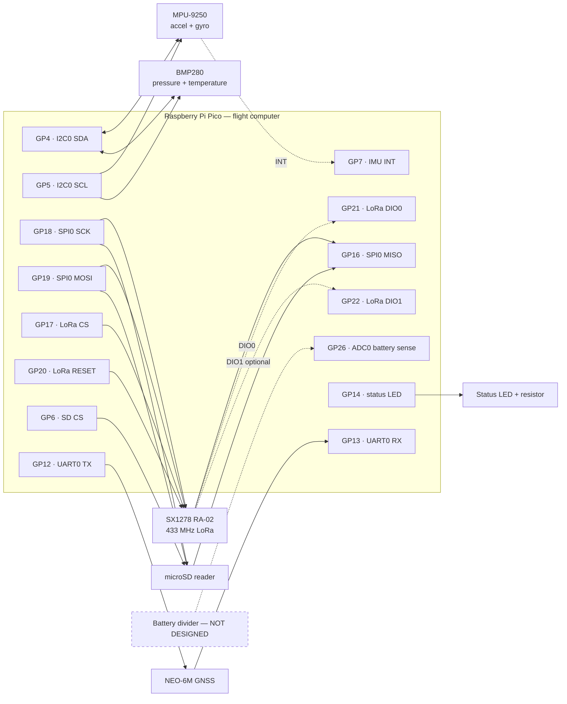
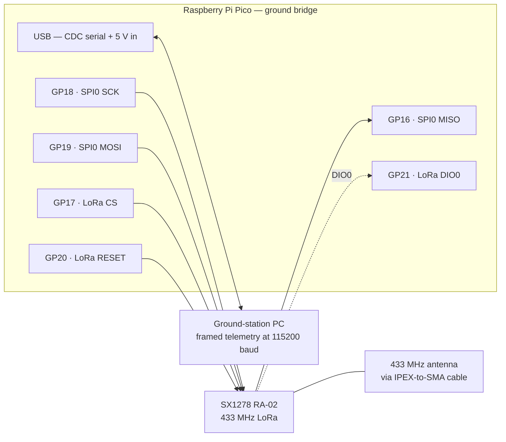
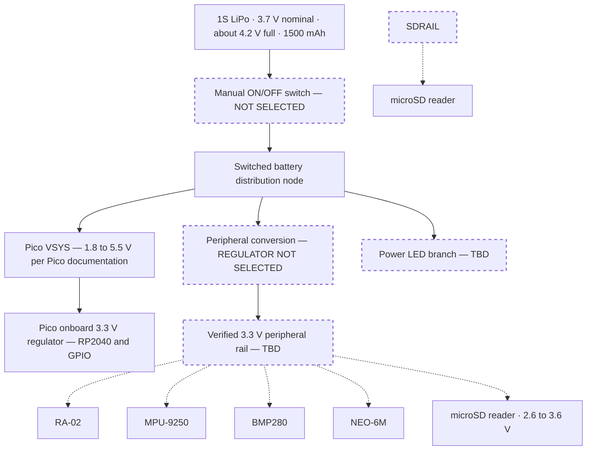

# Wiring Diagrams

Signal-level wiring for both Picos, drawn from the pin assignment the firmware actually
uses. `BoardPins` in
[`config.hpp`](../../firmware/flight-computer/include/flight/config.hpp) is the single
source of truth in code; this page and
[pico-gpio-map.md](../hardware/pico-gpio-map.md) must always agree with it.

> [!WARNING]
> **This is a provisional signal map, not an approved schematic.** No wire in this
> document has been built or measured. Every power connection is `TBD` until the exact
> breakout variants are documented — see
> [electrical-compatibility.md](../hardware/electrical-compatibility.md) and
> [pre-procurement-design-status.md](../hardware/pre-procurement-design-status.md).
> Do not connect the LiPo to any module, or to GPIO26, on the basis of this page.

---

## Contents

- [Flight computer](#flight-computer-signal-wiring)
- [Ground station bridge](#ground-station-bridge-signal-wiring)
- [Pin assignment table](#pin-assignment-table)
- [Bus sharing rules](#bus-sharing-rules)
- [Power tree](#power-tree-provisional)
- [Status LED and power indicator](#status-led-and-power-indicator)
- [Battery monitoring](#battery-monitoring)
- [RF chain](#rf-chain)
- [Bring-up order](#bring-up-order)
- [Open items](#open-items-before-any-wiring-is-built)

---

## Flight computer signal wiring



Solid arrows are driven signals; dashed arrows are interrupt or optional lines. The
battery divider is drawn dashed because **it does not exist yet**.

Text form, matching [pico-gpio-map.md](../hardware/pico-gpio-map.md):

```text
I2C0                      SPI0 (shared bus)
  GP4  -> SDA  -> MPU-9250   GP18 -> SCK  -> RA-02 + microSD
  GP4  -> SDA  -> BMP280    GP19 -> MOSI -> RA-02 + microSD
  GP5  -> SCL  -> MPU-9250   GP16 <- MISO <- RA-02 + microSD
  GP5  -> SCL  -> BMP280    GP17 -> CS   -> RA-02   (dedicated)
  GP7  <- INT  <- MPU-9250   GP6  -> CS   -> microSD (dedicated)

UART0                     RA-02 control
  GP12 -> TX -> GPS RX      GP20 -> RESET
  GP13 <- RX <- GPS TX      GP21 <- DIO0
                            GP22 <- DIO1 (optional; release if unused)

Board I/O
  GP14 -> status LED (through a current-limiting resistor, value TBD)
  GP26 <- ADC0, battery-sense reservation only — nothing connected
```

---

## Ground station bridge signal wiring

The bridge Pico uses the same SPI pins as the vehicle, so one wiring habit covers both
boards. It has no sensors, no SD card and no GPS.



The bridge is powered and read over the same USB cable, so it needs no battery and no
regulator. The pin constants live in
[`firmware/ground-station/src/pico/main.cpp`](../../firmware/ground-station/src/pico/main.cpp)
and mirror `BoardPins`.

---

## Pin assignment table

| Pico GPIO | Function | Peripheral | Direction | Device | Required | `BoardPins` field |
|---:|---|---|---|---|---|---|
| GP4 | I2C SDA | I2C0 | Bidirectional | MPU-9250 + AK8963 + BMP280 | Yes | `i2c_sda` |
| GP5 | I2C SCL | I2C0 | Output (open-drain bus) | MPU-9250 + AK8963 + BMP280 | Yes | `i2c_scl` |
| GP6 | SD chip select | GPIO | Output | microSD reader | Yes | `sd_cs` |
| GP7 | IMU interrupt | GPIO | Input | MPU-9250 INT | Useful | `imu_int` |
| GP12 | UART TX | UART0 | Output | NEO-6M RX | Yes | `gps_tx` |
| GP13 | UART RX | UART0 | Input | NEO-6M TX | Yes | `gps_rx` |
| GP14 | Status LED | GPIO | Output | External LED | Yes | `status_led` |
| GP16 | SPI MISO | SPI0 RX | Input | RA-02 + microSD | Yes | `spi_miso` |
| GP17 | LoRa chip select | GPIO | Output | RA-02 NSS | Yes | `lora_cs` |
| GP18 | SPI SCK | SPI0 | Output | RA-02 + microSD | Yes | `spi_sck` |
| GP19 | SPI MOSI | SPI0 TX | Output | RA-02 + microSD | Yes | `spi_mosi` |
| GP20 | LoRa reset | GPIO | Output | RA-02 RESET | Yes | `lora_reset` |
| GP21 | LoRa DIO0 | GPIO | Input | RA-02 DIO0 (TxDone / RxDone) | Yes | `lora_dio0` |
| GP22 | LoRa DIO1 | GPIO | Input | RA-02 DIO1 | Optional | `lora_dio1` |
| GP26 | Battery sense | ADC0 | Analog in | Reservation only | Useful | `battery_adc` |

Bus speeds configured by the HAL
([`pico_hal.cpp`](../../firmware/flight-computer/src/pico/pico_hal.cpp)):
I2C0 at 400 kHz, SPI0 initialised at 400 kHz (SD-safe) and raised by the SD driver after
card initialisation, UART0 at 9600 baud for the NEO-6M.

---

## Bus sharing rules

**I2C0 carries three devices, not two.** The MPU-9250's magnetometer is a separate AK8963
die at address `0x0C`, invisible until the firmware sets `INT_PIN_CFG.BYPASS_EN` and bridges
it onto the primary bus. After that it is an ordinary third device on GP4/GP5, and it
counts against the bus's capacitance and pull-up budget like any other.

| Device | Address | Selected by |
|---|---|---|
| MPU-9250 accelerometer + gyroscope | `0x68` or `0x69` | AD0 strap |
| AK8963 magnetometer | `0x0C` | Fixed; reachable only through the pass-through bridge |
| BMP280 | `0x76` or `0x77` | SDO strap |

All three are distinct whichever way the straps are fitted, so sharing the bus works — but
only if one set of pull-ups dominates. Both breakouts commonly carry their own, and stacking
them lowers the effective bus resistance. Confirm the addresses and the fitted pull-up
values on the physical boards before wiring them together.

**SPI0 — RA-02 and microSD share clock, MOSI and MISO.** Two rules make this safe:

1. Exactly one chip select may be asserted at a time. The RA-02 uses GP17 and the SD card
   uses GP6, and no code path drives both low.
2. A deselected device must release MISO. Some microSD breakouts do not tri-state MISO
   properly when deselected; if the RA-02 reads back garbage while a card is inserted,
   this is the first thing to check.

The SD reader received is a 2.6–3.6 V SPI module, so it runs from the same 3.3 V rail as
everything else on the vehicle. An earlier revision of this document said the opposite —
that the reader needed 4.5–5.5 V and a rail of its own — on the strength of a supplier
listing. The board that arrived does not agree with the listing, which is precisely why
this project photographs and inspects its boards before designing around them.

What remains open for the reader is current, not voltage: an SD write transient is the
largest short-duration load on this vehicle and it lands on the same regulator as a radio
that transmits once a second. See
[sd-module-analysis.md](../hardware/sd-module-analysis.md).

---

## Power tree (provisional)



Dashed boxes are undesigned. Three decisions block the whole tree:

1. **No regulator is selected.** The AMS1117-3.3 was assessed and rejected for direct 1S
   LiPo to 3.3 V regulation — a fully charged cell at about 4.2 V does not clear its
   high-load dropout, and its 3.3 V output is below the SD reader's stated input range.
   See [electrical-architecture.md](electrical-architecture.md#ams1117-33-direct-regulation-assessment).
2. **No ON/OFF switch and no power LED are in the BOM**, and both are mandatory
   competition items.
3. **The peripheral supply for each module is unresolved** until the exact breakout
   variants are documented.

The battery must be treated as a variable-voltage source across its discharge curve, never
as a fixed 3.7 V supply.

---

## Status LED and power indicator

```text
GP14 -> current-limiting resistor (value TBD) -> LED -> GND
```

Firmware drives GP14 high at the very start of `main()` and then blinks it at a rate that
encodes the mission state
([`Controller::update_led`](../../firmware/flight-computer/src/controller.cpp)):

| Mission state | LED behaviour |
|---|---|
| `INIT`, `SELF_TEST` | Solid on |
| `READY`, not yet armed | Slow blink, 900 ms half-period |
| `READY`, armed | Faster blink, 400 ms |
| `FLIGHT` | Fast blink, 100 ms |
| `LANDED`, `RECOVERY` | 250 ms |
| `FAULT` | Very fast blink, 60 ms |

> [!IMPORTANT]
> This is a *status* LED driven by firmware. The competition also requires a **visible
> power indicator that lights immediately at power-on**. A GPIO-driven LED only lights
> once the RP2040 is running. Satisfying the requirement properly needs an LED branch on
> the switched battery node, which is still `TBD`.

---

## Battery monitoring

GP26 / ADC0 is a **reservation only**. No divider is designed and nothing is connected.

The firmware is written to make an unsafe assumption impossible:
`BoardIo::battery_voltage()` returns the **raw pin voltage**, implementations must not
pre-scale, and `Configuration::battery_divider_ratio` defaults to `0.0f`, which means the
controller reports the raw pin voltage unscaled and the low-battery fault stays disabled.
A real voltage is only ever reported once a measured divider ratio `(R1 + R2) / R2` is
entered.

> [!CAUTION]
> Never connect the LiPo directly to GP26. The RP2040 ADC input is limited to the 3.3 V
> rail, and a charged 1S cell is about 4.2 V.

---

## RF chain

```text
RA-02 module  ->  IPEX (u.FL) connector
              ->  10 cm IPEX-to-SMA RG1.13 cable
              ->  433 MHz antenna
```

Two open items:

- **Connector gender is unconfirmed.** The supplied BOM says SMA male while the observed
  Robu listing for the antenna SKU says RP-SMA female. This must be checked against the
  physical parts before assembly.
- **Never power a LoRa module without its antenna attached.** Transmitting into an open
  connector can damage the output stage.

Radio parameters — 433 MHz, **SF7**, 125 kHz bandwidth, coding rate 4/5, 17 dBm, CRC on — live
in one place, [`cansat/link_profile.hpp`](../../firmware/common/include/cansat/link_profile.hpp),
read by both the vehicle and the ground-station bridge. The spreading factor is set by
airtime, not preference: see [link-budget.md](link-budget.md). Only the sync words are fixed
by the rulebook: **`0xF3` for testing, `0xA5` for the official launch.**

---

## Bring-up order

Wire and verify one subsystem at a time. Do not connect everything and power on.

```mermaid
flowchart LR
    S1["1 · Pico alone<br/>USB power, blink GP14"] --> S2["2 · I2C<br/>scan for MPU-9250 + BMP280"]
    S2 --> S3["3 · Sensor reads<br/>compare against known values"]
    S3 --> S4["4 · UART<br/>raw NMEA from the NEO-6M"]
    S4 --> S5["5 · RA-02 alone<br/>read chip version over SPI"]
    S5 --> S6["6 · Link test<br/>bench range, sync word 0xF3"]
    S6 --> S7["7 · SD alone<br/>on its own supply, block read/write"]
    S7 --> S8["8 · Shared SPI<br/>radio + SD together"]
    S8 --> S9["9 · Battery power<br/>current draw, brownout behaviour"]
    S9 --> S10["10 · Full integration"]
```



Each step is a gate: a failure stops the sequence rather than being carried forward. Record
results in [documentation/testing](../testing/).

---

## Open items before any wiring is built

- [ ] Exact breakout variants documented for the RA-02, MPU-9250, NEO-6M, GY-BMP280-3.3 and the microSD reader
- [ ] I2C addresses and fitted pull-up values confirmed on the physical boards
- [x] microSD reader supply resolved: 2.6–3.6 V module, runs from the 3.3 V rail
- [ ] microSD write-transient current measured against the regulator's capability
- [ ] microSD MISO tri-state behaviour confirmed on the shared SPI bus
- [ ] Peripheral regulator selected, with a documented load budget
- [ ] Manual ON/OFF switch selected and placed in the main battery feed
- [ ] Power-LED branch designed so it lights immediately at power-on
- [ ] Battery divider designed, built and measured before `battery_divider_ratio` is set
- [ ] Antenna and cable connector genders physically verified
- [ ] Grounding, decoupling and cable-management plan recorded

Related: [pico-gpio-map.md](../hardware/pico-gpio-map.md) ·
[pico-resource-map.md](../hardware/pico-resource-map.md) ·
[electrical-architecture.md](electrical-architecture.md) ·
[electrical-compatibility.md](../hardware/electrical-compatibility.md)
