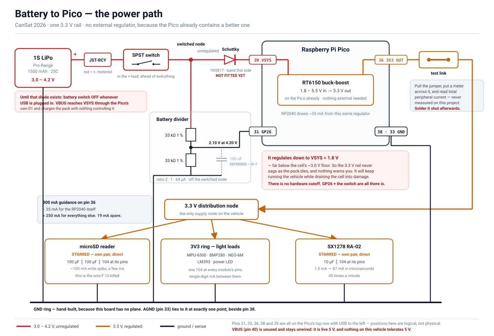
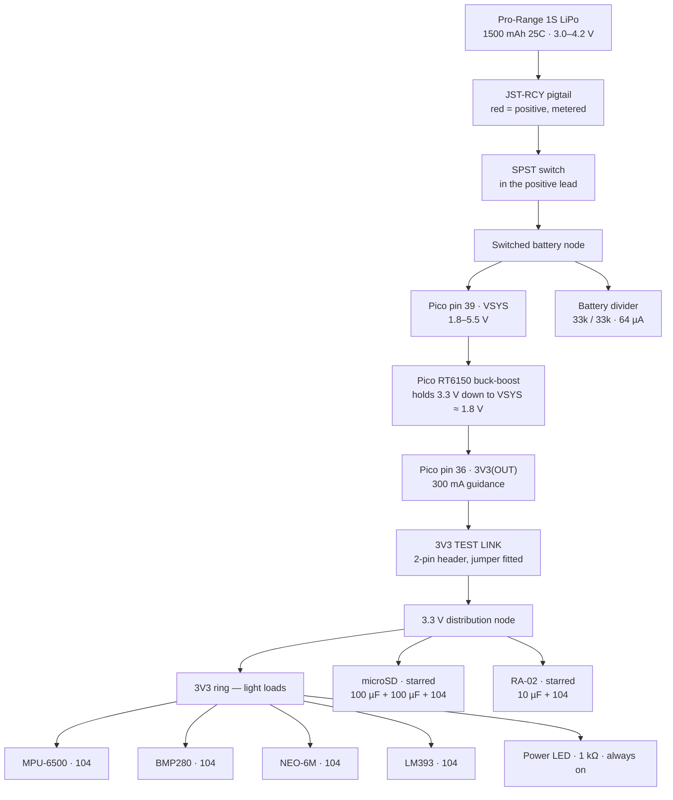

# Assembly Procedure

The order in which this vehicle is soldered, and the checks that gate each step.

Everything here traces to a fact already recorded in this repository. Where two documents
disagreed, this page says which one wins and why — those are marked **[D-n]** and are the
only new decisions on this page.

> [!IMPORTANT]
> **Work top to bottom. Do not skip ahead to the module you are most confident about.**
> Every fault this project has actually had — [F-10](../testing/bring-up-record.md#findings)
> twice over — was a supply wire, found only because one subsystem was powered at a time.

---

## Contents

- [Pre-solder check results](#pre-solder-check-results)
- [Decisions taken here](#decisions-taken-here)
- [What you must confirm on the bench first](#what-you-must-confirm-on-the-bench-first)
- [Floorplan](#floorplan)
- [Signal routing](#signal-routing-and-why-spacing-is-the-wrong-lever)
- [The power path](#the-power-path)
- [Physical pin reference](#physical-pin-reference)
- [Wiring diagrams](#wiring-diagrams)
- [Step-by-step build](#step-by-step-build)
- [The do-not list](#the-do-not-list)

---

## Pre-solder check results

Run against the repository on 2026-09-06. ✅ settled, ⚠️ needs your eyes at the bench,
❌ blocks a step (and which one).

### Identity and electrical compatibility

| # | Check | Result |
|---|---|---|
| 1 | Every module identified from the delivered board, not a listing | ✅ [Part C](receiving-inspection.md#part-c--per-board-identification). Three listings were wrong — [F-1, F-3, F-5](receiving-inspection.md#findings) |
| 2 | Every module is a 3.3 V part | ✅ RA-02, BMP280, microSD and LM393 confirmed. MPU-6500 and NEO-6M carry their own regulators and run correctly on 3.3 V (bring-up gates 3, 4) |
| 3 | No level shifter anywhere, so 3.3 V is a requirement not a preference | ✅ Understood and designed for. **Nothing on this board may ever see 5 V** |
| 4 | I2C addresses confirmed on a live bus | ✅ IMU `0x68`, barometer `0x76`. AD0 and SDO are both strapped low — leave both pins open |
| 5 | Barometer is a BMP280 not a BME280 | ✅ Chip ID `0x58` ([F-4](receiving-inspection.md#findings)) |
| 6 | Header pin order transcribed from silkscreen for every board | ✅ [wiring.md](../design/wiring.md#module-header-pinouts-as-printed) |
| 7 | Firmware pin map matches the documentation | ✅ `BoardPins` in [`config.hpp`](../../firmware/flight-computer/include/flight/config.hpp) agrees with [pico-gpio-map.md](pico-gpio-map.md) and [wiring.md](../design/wiring.md) on all 17 pins |
| 8 | Documentation claims still match the source | ✅ `python tools/check_doc_claims.py` — **218/218** |

### Function, proved on the breadboard

| # | Check | Result |
|---|---|---|
| 9 | Radio reads and transmits | ✅ Gate 5, after [F-10](../testing/bring-up-record.md#findings) was found |
| 10 | Card initialises, reads and writes | ✅ Gate 6 — 3672 writes in ten seconds once the supply jumper was shortened |
| 11 | **The card releases MISO on the shared bus** | ✅ Gate 7.4 — 200 interleaved rounds, zero radio misreads. This was the highest-risk item in the BOM |
| 12 | Radio and card interleave correctly | ⚠️ Gate 7.3 passes twice, but over **ten seconds, not the five minutes the row asks for**. Owed, and the soldered board is where to pay it |
| 13 | Sensors read at rate | ✅ Gate 3 — barometer 83.0 Hz against an 83.3 Hz prediction |
| 14 | GPS emits clean NMEA on the Pico's 3.3 V rail | ⚠️ Gate 4, provisional: 0 checksum errors over 18 s **without a fix**. Re-take outdoors |
| 15 | Status LED blink rates | ❌ **Not takeable — there is no LED yet.** Gate 1 rows 1.1–1.3b are blocked on step 5 of this procedure |

### Parts in hand

| # | Check | Result |
|---|---|---|
| 16 | Perfboard | ✅ 2 × 100 × 100 mm, 1.6 mm FR-4, four mounting holes, **single-sided, isolated pads, no rails anywhere** — metered, [C.9](receiving-inspection.md#c9--prototype-pcb-quantity-2) |
| 17 | Resistors, metered against their bands | ✅ 33 kΩ ±1 % (divider), 1 kΩ ±5 % (both LEDs), 100 kΩ ±5 % spare |
| 18 | Capacitors | ✅ 10 µF 50 V, 100 µF 50 V, 100 µF 25 V, ~20 × `104`. **The `104` print is worn illegible** — their value is on record from the purchase, not from the part |
| 19 | Switch and LEDs | ✅ Obtained 2026-09-06. An I/O switch and LEDs in two colours |
| 20 | Battery, charger, JST-RCY pigtail | ✅ Pack healthy at 3.92 V, red confirmed positive on the meter |
| 21 | microSD card | ✅ 32 GB, block-addressed |
| 22 | Antenna chain | ✅ Mates hand-tight, no adapter |
| 23 | Hookup wire — solid core 22 AWG, several colours | ✅ **Held, confirmed 2026-09-06 / KS.** The repository had no record of it; the record is this row |
| 24 | Silicone stranded wire, red and black, for the battery lead | ✅ **Held, confirmed 2026-09-06 / KS** |
| 25 | Male header strips, enough for four module footprints | ✅ **Held, confirmed 2026-09-06 / KS.** Strips were consumed fitting every board on 2026-09-04 and the remainder was never counted; enough survives |
| 26 | Solder, flux, braid | ⚠️ An iron and solder are recorded; flux and braid are not |
| 26a | RA-02 and Pico seat in the perfboard grid | ✅ **Confirmed by insertion 2026-09-06 / KS.** A module whose rows drop into holes has whole-pitch row spacing; no caliper reading was needed |
| 27 | A third 100 µF, for the optional `VSYS` bulk capacitor | ⚠️ Two are consumed by the microSD pair. If no third exists, skip it — it was always optional |

### Design items still open

| # | Item | Effect on soldering |
|---|---|---|
| 28 | **The all-at-once load is 306 mA against a 300 mA pin guidance** ([power budget](../design/electrical-architecture.md#power-budget)) | Does not block. It is real but transient — GPS *acquisition* is a startup condition, and the realistic case is 281 mA. **Nothing new may join the 3.3 V rail without re-running that table** |
| 29 | No current has ever been measured, only rail voltage | Fixed by this procedure: step 3 builds a **test link** in the 3.3 V feed so a meter can sit in series |
| 30 | Battery divider not built; `battery_divider_ratio` is still `0.0f` | Built at step 14, measured, and only then entered |
| 31 | Loop jitter with the SD logger running ([F-11](../testing/bring-up-record.md#findings)) | Measured at step 16, not during the build |
| 32 | `team_id` is still the `CAN-Team-XX` placeholder | Blocks flight, not soldering |
| 33 | Antenna centre contacts unphotographed — SMA or RP-SMA | Blocks *reordering* an antenna, not this build |
| 34 | No reverse-polarity protection anywhere on the vehicle | The JST-RCY is keyed, so the risk is one badly wired pigtail. Step 15 meters it before the first mate |
| 35 | **The RP2040 datasheet is not in this repository.** `datasheets/` holds the Pico datasheet and the BMP280 one; the ADC sample time and sample capacitance that would settle whether a 16.5 kΩ divider needs help are in the RP2040 document | Does not block. The `104` at `GP26` is fitted on judgement in the meantime, and [says so](#one-part-to-add-100-nf-from-the-divider-tap-to-agnd) |

---

## Decisions taken here

Five places where the repository contradicted itself or stopped short. Each is settled
below, with the reason, and the losing document should be corrected.

### [D-1] The microSD bulk capacitor is **2 × 100 µF in parallel**, not 470 µF

[wiring.md](../design/wiring.md#what-the-soldered-microsd-requires) and
[electrical-architecture.md](../design/electrical-architecture.md#what-to-fit-and-where) both
say 470 µF. **No 470 µF part arrived.** What arrived is a 100 µF 50 V and a 100 µF 25 V
([D.7](receiving-inspection.md#d7--the-capacitors)), which is 200 µF in parallel.

The requirement is not 470 µF. It is **~50 µF**, computed from a 100 mA step held 50 µs with
100 mV of droop allowed — the 470 µF was
[explicitly described as generous rather than calculated](../design/electrical-architecture.md#how-much-bulk-is-actually-needed).
200 µF is four times the requirement. Mixing voltage ratings is fine: both are far above
3.3 V and an electrolytic has no DC-bias derating.

### [D-2] No sockets. The 2026-09-05 mounting decision stands

[Purchase list §1](purchase-list.md#1--blocking-the-soldered-board) still asks for female
headers to "socket every module, and this is also how the Pico itself should mount". That
line predates the [module mounting decision of 2026-09-05](../design/wiring.md#module-mounting),
which says the opposite and gives its reasons: **Pico and RA-02 soldered down** (both held in
duplicate), **IMU, barometer, GPS and microSD jumpered** (all held singly). The later decision
wins. **Do not buy female headers.**

### [D-3] The microSD is soldered too. Only four modules stay on jumpers

**Revised 2026-09-06.** The [mounting decision](../design/wiring.md#module-mounting) jumpered
the microSD reader for one reason - no spare - and a stronger reason runs the other way:
**the microSD's supply jumper is the only wire on this project that has actually failed.**
[F-10](../testing/bring-up-record.md#findings) was five bench runs of every write failing while
every read passed, appearing and vanishing with the seating. Soldering the module deletes that
wire instead of decoupling around it.

The spare argument is weaker here than it looks, too. The reader is four 10 kohm resistors and
two capacitors with no active part on it, and the component swapped in service is the **card**,
not the board.

- **Soldered down:** Pico, RA-02, **microSD reader**
- **On jumpers, into male header strips:** MPU-6500, BMP280, NEO-6M and the LM393 sound board -
  **24 pins of strip** across four footprints

**One requirement arrives with it.** The card slot must reach an opening in the airframe. The
flight log is recovered off that card, and a reader soldered inside a sealed body with its slot
facing inward loses it.

The capacitors do not change: 100 uF in parallel with 100 uF and a `104`, at the module's own
`3V3` and `GND` pins. A soldered track is shorter than a jumper, but the write spike still wants
its charge locally.

### [D-4] The power LED hangs off the **3.3 V bus**, and the switch sits in the battery positive lead

The rulebook wants a light that comes on at power-on, and
[wiring.md](../design/wiring.md#status-led-and-power-indicator) worried that only a branch on
the switched battery node could do it. It does not need one. **The Pico's 3V3(OUT) rises from
the RT6150 as soon as `VSYS` is energised, with no firmware involved** — so `3V3 → 1 kΩ → LED →
GND` lights the instant the switch closes and dies the instant it opens. It is also already
counted in the load budget at 1.3 mA continuous.

The switch goes in the **battery positive lead, ahead of everything**, so `VSYS`, the 3.3 V bus
and the battery divider are all dead in the OFF state.

### [D-5] Two heavy loads are **starred off the Pico's supply pins**; everything else taps a ring

[F-10](../testing/bring-up-record.md#findings) was a supply path, twice, on the two modules
that pulse hardest: the microSD's write spike (~100 mA for a few ms) and the RA-02's PA key-up
(1.5 mA to 87 mA in microseconds). Those two get their own point-to-point supply pairs from the
distribution node — **not** a share of the ring behind five other modules.

The IMU, barometer, GPS, sound board and both LEDs draw single-digit milliamps between them and
tap the nearest point on the ring.

---

## What you must confirm on the bench first

Things this repository cannot check for you. **Do these before the iron is hot.**

| # | Confirm | Why it matters |
|---|---|---|
| B.1 | ~~Solid-core hookup wire, silicone battery wire, and enough male header strip~~ | **Closed 2026-09-06 / KS — all three held.** They were the only ❌ on the parts list |
| B.2 | **Short the multimeter probes: ≤ 0.5 Ω, steady** | The first meter read 18 Ω across its own shorted tips ([F-3, bring-up](../testing/bring-up-record.md#findings)). Every continuity check below is worthless on a lying meter |
| B.3 | **Count the header strip against the footprints before cutting any of it** — 10 + 6 + 4 + 6, plus 4 for the sound board | 30 pins across five footprints. Running out halfway through step 6 leaves a board that cannot be gated |

And one that costs nothing: **charge the pack now**, on a non-flammable surface, attended, so
it is ready at step 15 rather than being the thing that delays it.

---

## Floorplan

100 x 100 mm, single-sided, isolated pads. The grid runs `A`-`Z` then `A`-`K` across
(36 columns) and `01`-`35` down.

**Decided 2026-09-06, with every module laid out on the board.** The Pico sits with its **USB
facing the left edge**, and that one choice fixes everything else - because it decides which of
the Pico's two pin rows faces which half of the board.

### Where the Pico's pins actually are

USB left, component side up, pin 1 at the bottom-left:

| Row | left to right | Carries |
|---|---|---|
| **Top** | `40 39 38 37 36`, `35 34 33 32 31`, `30 29 28 27 26`, `25 24 23 22 21` | **power** - VBUS, VSYS, GND, 3V3_EN, **3V3(OUT)**; **ADC** - GP28, AGND, GP27, GP26; radio control - GP22, GP21, GP20; **SPI** - GP19, GP18, GP17, GP16 |
| **Bottom** | `01`-`05`, `06 07 08 09 10`, `11`-`15`, `16 17 18 19 20` | spare; **I2C** GP4, GP5, plus SD CS GP6 and IMU INT GP7; spare; **GPS** GP12, GP13, plus status LED GP14 and sound DO GP15 |

> [!IMPORTANT]
> **There is no 3.3 V pin on the bottom row.** Pin 36 is the only supply output the part has,
> and it is on the top row. The four bottom-row grounds - 3, 8, 13 and 18 - are returns, not a
> rail. Placing the SPI devices low "to be near 3V3" moves them away from it.

### The bands that follow

```text
  TOP EDGE - GND ring, 3V3 ring just inside it
 +---------------------------------------------------------------+
 | [sound 4-pin strip]     [ microSD, soldered ]   [   RA-02   ]  |
 |        AO -> pin 32      card slot -> panel      u.FL -> edge  |
 | +----+ +---------------------------------------------+        |
 | |PWR | | 40 39 38 37 36  35 34 33 32 31 ....... 22 21|        |
 | |zone| | USB<            P I C O                     |        |
 | |    | | 01 ......... 06 07 .. 09 ....... 16 17 .. 20|        |
 | +----+ +---------------------------------------------+        |
 |  [ BMP280 6-pin ]  [ MPU 10-pin ]    [ GPS 4-pin ]  [ LEDs ]   |
 +---------------------------------------------------------------+
```

**Top band, against the top pin row:** RA-02 and microSD at the right end where the SPI pins
are; the sound board's 4-pin strip under the ADC pins in the middle-left; the power zone -
distribution nodes, test link, both 33 kohm legs, the electrolytics, switch and battery entry -
in the left margin beside pins 36, 38 and 39.

**Bottom band, against the bottom pin row:** BMP280 and MPU strips under the I2C pins, the GPS
strip under pins 16 and 17, both LEDs at the right end where pin 19 is.

### Why not the other way round

A first layout put the RA-02 and microSD in the **bottom** band. The two arrangements differ by
seventeen wires:

| Wires that must cross or loop the Pico | SPI devices low | SPI devices high |
|---|---:|---:|
| RA-02 signals | 7 | 0 |
| microSD signals | 3 | 0 |
| Both supply stars | 4 | 0 |
| I2C | 4 | 0 |
| Sound `DO` | 1 | 1 |
| microSD `CS`, from pin 9 on the bottom row | 0 | 1 |
| **Total** | **19** | **2** |

There is a six-column channel between the Pico's two pin rows on the copper side, so wires
*can* pass underneath. Nineteen cannot, and filling it makes the Pico unremovable.

Two consequences worth stating plainly:

- **The star supply wires now run about 40 mm along the top edge to the RA-02, and that is
  fine.** [F-10](../testing/bring-up-record.md#findings) was a Dupont jumper - two crimps and
  two contact interfaces - not length. 40 mm of soldered 22 AWG is roughly 2 milliohms, which
  is 0.2 mV at 100 mA. The bulk pair still goes at the module's own pins.
- **`AO` sits in the middle-left of the top band and the RA-02 at its right end**, about 60 mm
  apart. That is the better of two imperfect options: the alternative runs a high-impedance
  analogue line the width of the board and straight through the SPI bundle.

### What the first layout already had right, and did not move

The GPS in the bottom-right against pins 16 and 17; the microSD reachable from `CS` on pin 9;
the sound board on the ADC side of the top row for `AO`.

### As laid out, 2026-09-06

Placement was settled on the board rather than on paper, and the photograph is the record —
no pad coordinates are transcribed here, because a coordinate copied by hand is one more
thing that can disagree with the board.

| Item | Where | Confirmed by |
|---|---|---|
| Pico | Centred, USB to the left edge, ~24 mm inboard | Needs a panel cutout; do not shift the Pico left, that margin is the power zone |
| RA-02 | Top band, centre, u.FL to the top edge | Its `NSS`/`MOSI`/`MISO`/`SCK` column lands almost directly above Pico pins 21–25. SPI runs are 20–30 mm and near-vertical |
| microSD | Top band, right of the RA-02, header facing the Pico | Reaches `MISO`/`MOSI`/`CLK` on pins 21/25/24. Card slot to the right or top edge |
| LM393 strip | Top band, far left, on the ADC side | `AO` reaches pin 32 in ~40 mm. Route it with a paired return to `AGND` on pin 33 and cross the supply wires at right angles |
| MPU strip | Bottom band, directly under pins 6 and 7 | Shortest I2C run on the board |
| BMP280 strip | Bottom band, left of the MPU | 12–30 mm to the same two pins |
| NEO-6M strip | Bottom band, right, near pins 16 and 17 | Unchanged from the first layout, which had it right |
| Power zone | Left margin, beside pins 36, 38 and 39 | Distribution nodes, test link, both 33 kΩ, switch terminals, battery entry |
| Both LEDs | Bottom right, near pin 19 | Must sit behind whatever window the airframe gets |

**The RA-02 seats in the grid**, confirmed by insertion on 2026-09-06. That is the whole of the
question a caliper was going to answer: a module whose two rows drop into holes is a module
whose row spacing is a whole multiple of 2.54 mm. The Pico's 7-pitch rows seat likewise.

Four things must be clear before the first joint, and none of them is a component:

- **Both bus rings**, marked and reserved — the outermost ring of pads for GND and the ring
  inside it for 3V3.
- **All four corner mounting holes**, plus about 4 mm around each. The top-left one is under
  the sound module and the top-right one is where the microSD wants to go.
- **The power zone**, before the BMP280 strip creeps up into it.
- **The USB cutout**, decided with the airframe rather than after it.

---

## Signal routing, and why spacing is the wrong lever

The instinct to hold signal wires three rows apart is right about the risk and wrong about the
remedy, and on a board with no ground plane the difference matters.

**Wire-to-wire coupling falls logarithmically with separation, not linearly.** For two parallel
round wires the mutual capacitance goes as `1 / ln(d/r)`. Going from one row of separation
(2.54 mm) to three (7.62 mm) on 22 AWG changes `ln(d/r)` from about 2.1 to about 3.2 — so the
coupling drops by roughly a third, not by two thirds. Tripling the gap does not third the
crosstalk, and it costs three times the routing area, which forces longer runs, which puts the
coupling back.

**Only two lines on this vehicle are worth protecting**, and neither is protected by spacing:

| Line | Why it is a victim |
|---|---|
| `GP26`, pin 31 — the divider tap | Source impedance is 33 kΩ ∥ 33 kΩ = **16.5 kΩ**. High enough to be worth treating, on the general SAR-converter principle rather than on a number — see the caveat below |
| `GP27`, pin 32 — the microphone `AO` | High impedance, and [whether the board buffers it is unread](receiving-inspection.md#d5--the-lm393-sound-module) |

Everything else is either the aggressor or immune to it. SPI0 at **4 MHz** is the only fast
thing on the board and it is the aggressor; I2C at 400 kHz through 5 kΩ pull-ups has rise times
near 250 ns; UART0 is 9600 baud; `CS`, `RST`, `DIO0` and the LED lines are static or slow. None
of those needs a millimetre of clearance from any other. The radio's 87 mA key-up is a real
disturbance, but it travels the *supply*, and spacing signal wires does nothing about it — that
is what the star feeds and the local capacitors are for.

**What actually works, in descending order of effect:**

1. **Give the sensitive line its own ground return**, run alongside it or twisted with it, back
   to `AGND` on pin 33. This is worth an order of magnitude more than separation, because it
   gives the return current a path next to the signal instead of somewhere across the board.
2. **Cross, do not parallel.** Coupling scales with the length of the parallel run. A crossing
   at right angles couples almost nothing, and a 40 mm parallel run couples forty times what a
   1 mm one does.
3. **Shorten the run.**
4. **Lower the victim's impedance** — see the capacitor below.
5. **Then, distantly, spacing.**

### One part to add: 100 nF from the divider tap to AGND

```text
pin 31 (GP26) ──┐
                ├── one 104 straight across, on the copper side
pin 33 (AGND) ──┘
     pin 32 (GP27, the microphone AO) sits between them — do not bridge it
```

**Fit it at the Pico, not at the divider.** The two are the same electrical node, but the
capacitor'''s job is to feed the ADC'''s sample-and-hold, so it belongs at the pin. The geography
is kind here: on the top row `GP26` is pin 31 and `AGND` is pin 33 — **two pitches apart,
5.08 mm**, with only pin 32 between them. A `104` disc'''s leads bend to that without complaint.

**A ceramic, and not an electrolytic.** Not only for the value: an aluminium electrolytic leaks
microamps, and a few µA through a 16.5 kΩ source is tens to hundreds of millivolts of **offset**
on the one measurement nothing else can cross-check. A ceramic leaks picoamps. Ceramics also
have no polarity, unlike the three electrolytics on this board.

It does two jobs. It gives the SAR converter's sample-and-hold a local charge reservoir, so a
**16.5 kΩ** source no longer has to settle the sampling capacitor through itself; and it shorts
any coupled glitch to ground before the conversion sees it. The time constant is 1.65 ms against
a battery read once per second, so it costs nothing that matters.

> [!WARNING]
> **This part is a recommendation, and the reasoning behind it is thinner than the rest of this
> page.** It comes from the general behaviour of SAR converters — a sampling capacitor charged
> through the source impedance during the sample window — and **not from the RP2040 datasheet,
> which is not in this repository.** `datasheets/` holds the *Pico* datasheet; the ADC sample
> time and sample capacitance are in the *RP2040* one. Until somebody reads it, "16.5 kΩ is
> high" is an engineering expectation, not a measured or documented limit.
>
> Fit it anyway. It is one `104` out of about twenty, the time constant is irrelevant at a
> 1 Hz read, and the failure it guards against is a gain error on **the one telemetry quantity
> nothing else can cross-check**. But it is here on judgement, not on evidence, and it should
> say so.

**Do not fit the equivalent on `AO`.** That line carries the audio envelope the driver reduces
to a peak-to-peak span, and filtering it would remove the measurement. `AO` gets the ground
return and the short run instead.

This takes the `104` count from six to **seven**, against about twenty in hand.

### The board has no ground plane, and that is the real weakness

[C.9.3 and C.9.4](receiving-inspection.md#c9--prototype-pcb-quantity-2): copper on one face,
isolated pads, no rails. Every return current on this vehicle finds its way home through a
hand-built ring. That is why return paths outrank separation here — on a board with a plane the
question would barely arise, and the instinct behind it would be sound.

Run the GND ring generously, tie `AGND` to it at exactly one point beside pin 38, and give both
analogue lines their own returns.

---

## The power path



*One picture of the whole chain: [power-path-battery-to-pico.svg](diagrams/power-path-battery-to-pico.svg).*



Three things this settles that were previously `TBD`:

1. **No regulator is fitted and none is needed.** Every load runs from `3V3(OUT)`, and both the
   radio and the card have been measured holding that rail alone at 100 % duty (rows 5.4a,
   6.3b).
2. **The RT6150 regulates down to `VSYS` ≈ 1.8 V**, far below the pack's ~3.0 V floor. The 3.3 V
   rail will not sag as the cell discharges; low-voltage cutoff is a *battery protection*
   obligation, handled in firmware off `GP26`, not a regulator one.
3. **The divider taps the switched node, not the battery directly**, so its 64 µA stops when the
   switch opens.

> [!NOTE]
> **USB and battery may both be connected.** The Pico's `D1` Schottky from `VBUS` to `VSYS`
> means the 5 V USB rail simply wins and the pack idles. This is the documented arrangement and
> it is how you will run gates 1–14.

---

## Physical pin reference

The GPIO numbers are in [pico-gpio-map.md](pico-gpio-map.md). **These are the pin numbers you
will actually count on the board**, from pin 1 at the USB end of the left row.

| Pin | Name | Goes to | Group |
|---:|---|---|---|
| 6 | GP4 | MPU `SDA` **and** BMP280 `SDA` | I2C |
| 7 | GP5 | MPU `SCL` **and** BMP280 `SCL` | I2C |
| 8 | GND | GND ring | — |
| 9 | GP6 | microSD `CS` — crosses the board | SPI |
| 10 | GP7 | MPU `INT` — optional, see note | — |
| 13 | GND | GND ring | — |
| 16 | GP12 | NEO-6M **`RX`** (Pico transmits) | UART |
| 17 | GP13 | NEO-6M **`TX`** (Pico receives) | UART |
| 18 | GND | GND ring | — |
| 19 | GP14 | 1 kΩ → status LED anode | LED |
| 20 | GP15 | LM393 `DO` | Sound |
| 21 | GP16 | RA-02 `MISO` **and** microSD `MISO` | SPI |
| 22 | GP17 | RA-02 `NSS` | SPI |
| 23 | GND | GND ring | — |
| 24 | GP18 | RA-02 `SCK` **and** microSD **`CLK`** | SPI |
| 25 | GP19 | RA-02 `MOSI` **and** microSD `MOSI` | SPI |
| 26 | GP20 | RA-02 `RST` | Radio |
| 27 | GP21 | RA-02 `DIO0` | Radio |
| 28 | GND | GND ring | — |
| 29 | GP22 | RA-02 `DIO1` — optional, see note | Radio |
| 31 | GP26 / ADC0 | Battery divider midpoint | ADC |
| 32 | GP27 / ADC1 | LM393 `AO` | ADC |
| 33 | **AGND** | GND node, **one tie only**, next to pin 38 | Analogue return |
| 36 | **3V3(OUT)** | Test link → 3.3 V distribution node | Power |
| 38 | GND | GND node → GND ring | Power |
| 39 | **VSYS** | Switched battery positive | Power |

Everything not listed stays unconnected. That includes `VBUS` (40), `3V3_EN` (37), `RUN` (30),
`ADC_VREF` (35) and `GP28` (34).

> [!NOTE]
> **`GP7` and `GP22` are configured as inputs by the firmware and never read.**
> [`pico_hal.cpp:61`](../../firmware/flight-computer/src/pico/pico_hal.cpp) and
> [`pico_radio.cpp:61`](../../firmware/flight-computer/src/pico/pico_radio.cpp) set their
> direction and nothing calls `gpio_get` on either. Wire them anyway — they cost two wires now
> and a rebuild later — but do not spend time diagnosing them, and do not let either hold up a
> gate.

**Pins left open on the modules, deliberately:**

| Module | Leave open | Because |
|---|---|---|
| MPU-6500 | `AD0`, `EDA`, `ECL`, `NCS`, `FSYNC` | `AD0` is strapped low on the board — the part answers at `0x68`. The rest are the auxiliary bus and the SPI interface |
| BMP280 | `CSB`, `SDO` | Both strapped on the board: I2C selected, address `0x76`, confirmed by bus scan |
| RA-02 | `DIO2`–`DIO5` | Unused by the driver |

---

## Wiring diagrams

### I2C — left zone

```text
Pico pin 6  (GP4, SDA) ──┬── MPU-6500  SDA
                         └── BMP280    SDA
Pico pin 7  (GP5, SCL) ──┬── MPU-6500  SCL
                         └── BMP280    SCL
3V3 ring ────────────────┬── MPU-6500  VCC   + 104 at the module pins
                         └── BMP280    VCC   + 104 at the module pins
GND ring ────────────────┬── MPU-6500  GND
                         └── BMP280    GND
Pico pin 10 (GP7) ────────── MPU-6500  INT   (optional)
```

No external pull-ups. **Both breakouts carry their own 10 kΩ**, which parallel to 5 kΩ — a
legal bus and a stiffer one than either board was designed around, sinking ~0.66 mA per line.
Do not add more.

### UART — left zone

```text
Pico pin 16 (GP12, TX) ───► NEO-6M  RX
Pico pin 17 (GP13, RX) ◄─── NEO-6M  TX
3V3 ring ─────────────────► NEO-6M  VCC   + 104 at the module pins
GND ring ─────────────────► NEO-6M  GND
```

**The labels are the board's own pins, and they cross.** Header order on the delivered board is
`VCC RX TX GND`. The patch antenna faces skyward wherever the module ends up.

### SPI — right zone

```text
                        ┌── RA-02   SCK
Pico pin 24 (GP18) ─────┤
                        └── microSD CLK        note: CLK, not SCK

                        ┌── RA-02   MOSI
Pico pin 25 (GP19) ─────┤
                        └── microSD MOSI

                        ┌── RA-02   MISO
Pico pin 21 (GP16) ─────┤
                        └── microSD MISO

Pico pin 22 (GP17) ──────── RA-02   NSS       dedicated
Pico pin 9  (GP6)  ──────── microSD CS        dedicated, crosses the board
Pico pin 26 (GP20) ──────── RA-02   RST
Pico pin 27 (GP21) ──────── RA-02   DIO0
Pico pin 29 (GP22) ──────── RA-02   DIO1      optional
```

RA-02 header, read from the u.FL end — **the supply pin is third, with `GND` either side of
it.** A one-pin offset puts 3.3 V onto `RST`:

```text
J2   GND   GND   3.3V   RST   DIO0   DIO1   DIO2   DIO3
J1   GND   NSS   MOSI   MISO   SCK   DIO5   DIO4   GND
```

microSD header — **ground and supply are at opposite ends, so a reversed strip is a direct
short across the rail:**

```text
GND   MISO   CLK   MOSI   CS   3V3
```

### Starred supplies — the two that failed before

```text
3.3 V node ──[short, direct]──► microSD 3V3 ──┬── 100 µF 50 V   (stripe to GND)
                                              ├── 100 µF 25 V   (stripe to GND)
GND node ────[short, direct]──► microSD GND ──┴── 104

3.3 V node ──[short, direct]──► RA-02 3.3V ───┬── 10 µF 50 V    (stripe to GND)
GND node ────[short, direct]──► RA-02 GND ────┴── 104
```

**Every capacitor goes at the module's own pins, not at the perfboard end.** A capacitor five
centimetres away, through the same wire, does very little — that wire is exactly what
[F-10](../testing/bring-up-record.md#findings) proved is not good enough.

### Battery divider — GP26

```text
Switched battery node ──[ 33 kΩ ±1 % ]──┬──[ 33 kΩ ±1 % ]── GND ring
                                        │
                                        └── Pico pin 31 (GP26 / ADC0)
```

Plus **100 nF from the tap to the `AGND` tie** — see
[Signal routing](#signal-routing-and-why-spacing-is-the-wrong-lever) for why.

Ratio 2:1. **2.10 V at the pin on a full 4.20 V cell**, against a 3.3 V input limit; 1.50 V at a
3.0 V cutoff; 64 µA continuous, off the battery and not off the 3.3 V rail.

**Use the 33 kΩ 1 % parts, not the 100 kΩ 5 % ones.** Same ratio, a fifth of the tolerance, on
the one telemetry quantity nothing else can cross-check.

> [!CAUTION]
> **Fit both legs before powering anything.** A divider with its lower leg missing puts the full
> pack voltage on `GP26`, and 4.2 V on a 3.3 V input is how an RP2040 dies.

### LEDs

```text
Pico pin 19 (GP14) ──[ 1 kΩ ]──►|── GND ring        status — firmware driven
3V3 ring ────────────[ 1 kΩ ]──►|── GND ring        power  — always on
```

~1.3 mA each. The long leg is the anode. If the power LED is too dim outdoors, two 1 kΩ in
parallel give 500 Ω and 2.6 mA — but re-check the
[budget](../design/electrical-architecture.md#power-budget) first.

### Sound module — bottom strip, far corner

```text
Pico pin 32 (GP27 / ADC1) ◄─── LM393  AO    keep short, with its own ground return
Pico pin 20 (GP15)        ◄─── LM393  DO    slow digital, route along the bottom
3V3 ring ─────────────────────► LM393 VCC   + 104 at the module pins
GND ring, near the pin 33 tie ► LM393 GND
```

Header order on the delivered four-pin board is `AO DO GND VCC`. Both channels are real, so
`sound_analog_connected` and `sound_gate_connected` both stay `true`.

**No divider on `AO`.** The output already swings inside 0–3.3 V; one would halve the signal for
nothing.

**Set the trimpot once, mark it, and write the position in the flight log.** Two flights at
different trimpot positions produce numbers that cannot be compared, and nothing in the
telemetry records where it was left.

---

## Step-by-step build

Sixteen steps. **Each numbered gate is a stop** — if it fails, fix it there. That is the whole
reason the breadboard faults were findable at all.

### 1 · Dry fit, no solder

**Three parts land on the perfboard's own hole grid: the Pico, the RA-02 and the microSD
reader** ([D-3](#d-3-the-microsd-is-soldered-too-only-four-modules-stay-on-jumpers)). The other
four — IMU, barometer, GPS and the sound board — sit on the structure and reach the board on
Dupont jumpers, so their board-end footprint is a male header strip you cut yourself and fits by
construction. Nothing about them can surprise the grid; the RA-02 can.

1. **Measure the RA-02's row-to-row spacing with a ruler or calipers before assuming it is a
   whole number of 2.54 mm pitches.** If it is not, the module cannot be pressed flat into
   perfboard and one row's pins have to be bent. That is a step-1 discovery, not a step-10 one.
2. **Press the Pico in.** 2 × 20 pins at 2.54 mm, rows 17.78 mm apart — **exactly 7 hole
   pitches**, so it occupies 20 rows × 8 columns. Both rows should seat without splaying.
3. **Reserve the two bus rings before placing anything else.** Mark the outermost usable ring of
   pads as GND and the ring inside it as 3V3. Nothing else may land there. Decide now where a
   module overhang forces a gap.
4. **Orient**, in this priority order: USB to the top edge; the RA-02's u.FL toward the edge
   that carries the bulkhead hole, with the pigtail offered up to check it reaches without a
   loop; the microSD beside it in the same top band, its card slot facing a panel opening; the
   sound board's strip in the corner furthest from the RA-02.
5. **Draw the two crossings** — `GP6` (pin 9) to the microSD's `CS`, and `GP15` (pin 20) to the
   sound board's `DO` — along the bottom of the board, clear of the SPI bundle. If a route
   cannot be drawn clear, move the strip rather than the wire.
6. **Record every pin-1 pad coordinate** on the silkscreened grid, and photograph the laid-out
   board from directly above into [`photos/`](photos/README.md).

**Cut no header strip yet.** That is step 6. Step 1 commits nothing.

**Gate:** the RA-02 and the Pico both land on real holes at real pitch; no footprint or ring
overlaps one of the four corner mounting holes; the antenna pigtail reaches its bulkhead
position without a loop; both crossings route clear of SPI; every pin-1 coordinate is written
down.

### 2 · The two buses

There are no rails on this board — [C.9.5](receiving-inspection.md#c9--prototype-pcb-quantity-2)
metered the edge rows and they are isolated pad to pad like every other pad. Both buses are
hand-built, and retrofitting them under a populated board is unpleasant.

Lay bare tinned solid wire around the perimeter — one ring for GND on the outermost usable ring
of pads, one for 3V3 just inside it — and solder it to **every** pad it crosses. Leave a gap
where a module will overhang.

**Gate:** continuity end to end along each ring, **and open circuit between the two rings.**
Measure the second one twice. A solder whisker between them destroys the Pico at step 4.

### 3 · Pico, distribution nodes and the test link

Solder the Pico's header pins through the board. Then:

- pin 38 → GND node → GND ring
- pin 33 (`AGND`) → GND node, **one tie only**, next to pin 38
- pin 36 → **2-pin header (the test link)** → 3.3 V distribution node → 3V3 ring

Fit the jumper shunt on the test link.

**Gate:** no bridge between any adjacent pair of Pico pins — check visually with a magnifier
*and* on the meter. Then 3V3 ring to GND ring: still open.

### 4 · First power, USB only

Nothing else is connected. Plug in the USB cable.

**Gate:** the 3V3 ring measures **3.28–3.32 V** against the GND ring. If it does not, unplug and
find out why before anything else goes on the board.

### 5 · Both LEDs

Power LED from the 3V3 ring through 1 kΩ; status LED from pin 19 through 1 kΩ. Both cathodes to
the GND ring.

**Gate:** the power LED lights the moment USB is connected — the rulebook requirement, satisfied
in hardware. Then flash the flight firmware and take **bring-up rows 1.1, 1.2, 1.3, 1.3a and
1.3b**, which have been blocked on this LED since the project started. Use the meter's `Hz`
range on pin 19 rather than a stopwatch wherever it will lock on. Remember the predicted numbers
are half-periods: `READY` unarmed is 900 ms on, 900 ms off — **1800 ms full cycle, 0.56 Hz.**

### 6 · The header field

Solder male header strips for the four jumpered modules — **10 pins (MPU), 6 (BMP280), 4
(NEO-6M) and 4 (LM393), 24 in total** — at the coordinates recorded in step 1. The microSD needs
no strip: it is soldered down like the RA-02.

**Gate:** adjacent-pin isolation across every strip.

### 7 · Starred supplies and every capacitor

Run the two point-to-point supply pairs from the distribution nodes to the microSD and the
RA-02. Then fit all ten capacitors **at each module's own pins**:

| Module | Fit |
|---|---|
| microSD | 100 µF 50 V ∥ 100 µF 25 V ∥ `104` |
| RA-02 | 10 µF 50 V ∥ `104` |
| MPU-6500, BMP280, NEO-6M, LM393 | one `104` each |
| Battery divider tap, `GP26` to the `AGND` tie | one `104` — see [Signal routing](#signal-routing-and-why-spacing-is-the-wrong-lever) |

**Electrolytics are polarised — the stripe marks the negative leg, to GND.** Backwards they heat
and can vent. Mount them **lying flat**, leads as short as they go, body secured with a tie or a
bead of hot glue: upright on 10 mm legs is a lever arm on two solder joints, and this vehicle
lands hard.

**Gate:** every electrolytic's stripe faces GND — check all three before power. Then 3V3 to GND:
still open (a capacitor reads as a brief charging dip, then open).

### 8 · I2C group

Wire the four I2C lines and both module supplies. Fit the IMU and the barometer.

**Gate: bring-up gate 3.** The scan must find **`0x68` and `0x76`, and nothing at `0x0C`** —
there is no magnetometer on this part and its absence is the expected result, not a fault.
Confirm `WHO_AM_I` = `0x70` and chip ID = `0x58`. Then take row 3.5: the barometer at **83.0 Hz**.

### 9 · GPS

Wire pins 16 and 17 to the NEO-6M, crossed. Fit the module with its patch antenna facing up.

**Gate: bring-up gate 4** — raw NMEA at 9600 baud, checksums clean. Take this one **outdoors,
with a fix**, and close the ⚠️ on row 4.3 while you are there.

### 10 · RA-02, soldered down

This module is permanent — a spare is in the drawer, and soldering it removes the supply wire
that [F-10](../testing/bring-up-record.md#findings) killed a radio with. Solder both 8-pin rows.
Wire `SCK`, `MOSI`, `MISO`, `NSS`, `RST`, `DIO0` and, optionally, `DIO1`.

**Attach the antenna before you apply power.** Mate the u.FL pigtail, run it to the bulkhead
hole, fit the nut and star washer, and screw the antenna on hand-tight.

**Gate: bring-up gate 5.** `RegVersion` must read `0x12`. Then transmit, sync word `0xF3`.

> [!CAUTION]
> **Never power this module without its antenna attached.** Transmitting into an open connector
> can damage the output stage.

### 11 · microSD

Solder the reader down and wire its four SPI signals. Its supply pair went in at step 7. Insert
the card — and check now, not later, that the slot lines up with wherever the airframe panel
opening will be, because the flight log is recovered through it.

**Gate: bring-up gate 6.** The card initialises, reads its BPB — and, the row that matters,
**writes.** [F-10](../testing/bring-up-record.md#findings) was every write failing while every
read passed. If that returns on a soldered board with 200 µF at the pins, stop: it is telling
you something new.

### 12 · Shared bus

Nothing new is wired. Both devices are now on SPI0 together.

**Gate: bring-up gate 7 — and pay the debt in row 7.3 by running it for the full five minutes**,
not ten seconds. Row 7.4 is the one that matters: the card must release MISO when deselected, or
a held line corrupts the *radio's* next transaction and the symptom looks like a dead radio.

### 13 · Sound module

Wire `AO` to pin 32 with its own ground return, `DO` to pin 20 along the bottom, supply from the
ring. Keep `AO` off the SPI bundle.

**Gate:** the logged level responds to sound and is not pinned near a rail. A window pinned near
a rail is a wire, not a sound. Set the trimpot, mark it, write it down.

### 14 · Battery divider

Fit both 33 kΩ legs — **both, before any power can reach the top of the divider.** The top leg
goes to the switched battery node, which is still unconnected at this point; that is correct and
deliberate.

**Gate:** with the pack **still disconnected**, meter each leg in place and compute
`ratio = (R1 + R2) / R2` from the two measured values. Enter that number as
`battery_divider_ratio` and set `battery_low_voltage`. Until you do, the firmware reports the
raw pin voltage and the low-battery fault stays disabled — which is deliberate, and is why a
wrong divider cannot silently produce a plausible number.

### 15 · Switch and battery — last

Solder the switch into the battery positive lead using **silicone stranded** wire. Then:

1. With the pack **not** connected, meter the pigtail at the board end. **Red must be positive.**
   Mark the polarity on the board with a pen.
2. Confirm the 3V3 ring to GND ring is still open.
3. Switch OFF. Mate the JST-RCY.
4. Switch ON.

**Gate: bring-up gate 2.** Rail voltage under load. Then take the measurement this project has
never taken: **pull the test-link jumper, put the meter in series across it, and read total
peripheral current** — idle, transmitting, and during a write. Compare it against the
[power budget](../design/electrical-architecture.md#power-budget), where the all-at-once case is
306 mA against a 300 mA guidance.

Refit the jumper. **Then solder a wire permanently across the two test-link pins** — a removable
shunt is a mechanical failure point on a vehicle that lands hard.

### 16 · Integration, then strain relief

**Gate: bring-up gates 8 and 9.** End to end, then endurance. Take the
[F-11](../testing/bring-up-record.md#findings) measurement while you are there: **loop jitter
with the SD logger running**, which has never been measured and is the one number standing
between a known 29.756 ms worst-case write and any claim that the 33 ms sensor period is safe.

Then, before anything closes:

- **Heat-shrink or a tie at every Dupont shell.** They back out under vibration on their own.
- **An anchor on every jumper**, so mechanical load never reaches a connector.
- **The IMU rigidly bonded to the structure**, independently of its wiring. Attitude is
  referenced to the airframe, and with no magnetometer there is no second reference to catch a
  module that has shifted.
- **Strain relief on the antenna pigtail.** The u.FL is the most fragile thing on this vehicle.

---

## The do-not list

- **Do not connect the LiPo to the 3.3 V bus, or to `GP26`, ever.** 4.2 V on a 3.3 V input kills
  the RP2040.
- **Do not let 5 V onto this board.** There is no level shifter anywhere; it reaches the RA-02,
  the barometer and the card directly.
- **Do not power the radio without its antenna.**
- **Do not add a load to the 3.3 V rail** without re-running the
  [power budget](../design/electrical-architecture.md#power-budget). There is 19 mA of margin in
  the realistic case and none in the worst.
- **Do not fit an electrolytic backwards.** Stripe to GND.
- **Do not fit external I2C pull-ups.** Both breakouts already carry 10 kΩ.
- **Do not assert both chip selects.** No code path does; no bench jig should either.
- **Do not skip a gate because the previous one passed.** Gate 7 exists because two devices that
  each work alone are not two devices that work together.

---

## Related documents

- [Wiring](../design/wiring.md) — the signal map this procedure builds
- [Electrical architecture](../design/electrical-architecture.md) — the power budget and the decoupling reasoning
- [Receiving inspection](receiving-inspection.md) — what the delivered boards actually are
- [Bring-up record](../testing/bring-up-record.md) — the gates, and the numbers to fill in
- [Pico GPIO map](pico-gpio-map.md) — the logical assignment
- [Purchase list](purchase-list.md) — what is held and what is not
