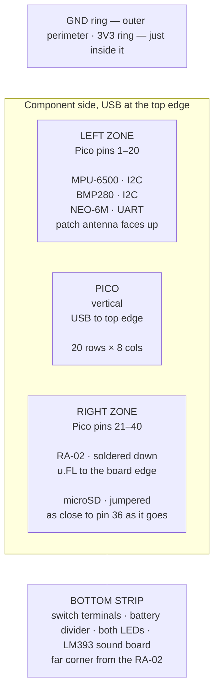
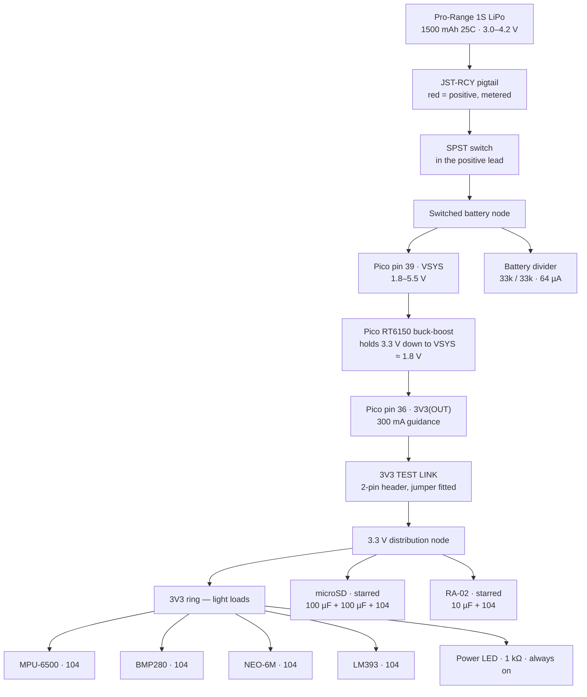

# Assembly Procedure

The order in which this vehicle is soldered, and the checks that gate each step.

Everything here traces to a fact already recorded in this repository. Where two documents
disagreed, this page says which one wins and why — those are marked **[D-n]** and are the
only new decisions on this page.

> [!IMPORTANT]
> **Work top to bottom. Do not skip ahead to the module you are most confident about.**
> Every fault this project has actually had — [F-10](../testing/bring-up-record.md#findings)
> twice over — was a supply wire, found only because one subsystem was powered at a time.

---

## Contents

- [Pre-solder check results](#pre-solder-check-results)
- [Decisions taken here](#decisions-taken-here)
- [What you must confirm on the bench first](#what-you-must-confirm-on-the-bench-first)
- [Floorplan](#floorplan)
- [The power path](#the-power-path)
- [Physical pin reference](#physical-pin-reference)
- [Wiring diagrams](#wiring-diagrams)
- [Step-by-step build](#step-by-step-build)
- [The do-not list](#the-do-not-list)

---

## Pre-solder check results

Run against the repository on 2026-09-06. ✅ settled, ⚠️ needs your eyes at the bench,
❌ blocks a step (and which one).

### Identity and electrical compatibility

| # | Check | Result |
|---|---|---|
| 1 | Every module identified from the delivered board, not a listing | ✅ [Part C](receiving-inspection.md#part-c--per-board-identification). Three listings were wrong — [F-1, F-3, F-5](receiving-inspection.md#findings) |
| 2 | Every module is a 3.3 V part | ✅ RA-02, BMP280, microSD and LM393 confirmed. MPU-6500 and NEO-6M carry their own regulators and run correctly on 3.3 V (bring-up gates 3, 4) |
| 3 | No level shifter anywhere, so 3.3 V is a requirement not a preference | ✅ Understood and designed for. **Nothing on this board may ever see 5 V** |
| 4 | I2C addresses confirmed on a live bus | ✅ IMU `0x68`, barometer `0x76`. AD0 and SDO are both strapped low — leave both pins open |
| 5 | Barometer is a BMP280 not a BME280 | ✅ Chip ID `0x58` ([F-4](receiving-inspection.md#findings)) |
| 6 | Header pin order transcribed from silkscreen for every board | ✅ [wiring.md](../design/wiring.md#module-header-pinouts-as-printed) |
| 7 | Firmware pin map matches the documentation | ✅ `BoardPins` in [`config.hpp`](../../firmware/flight-computer/include/flight/config.hpp) agrees with [pico-gpio-map.md](pico-gpio-map.md) and [wiring.md](../design/wiring.md) on all 17 pins |
| 8 | Documentation claims still match the source | ✅ `python tools/check_doc_claims.py` — **216/216** |

### Function, proved on the breadboard

| # | Check | Result |
|---|---|---|
| 9 | Radio reads and transmits | ✅ Gate 5, after [F-10](../testing/bring-up-record.md#findings) was found |
| 10 | Card initialises, reads and writes | ✅ Gate 6 — 3672 writes in ten seconds once the supply jumper was shortened |
| 11 | **The card releases MISO on the shared bus** | ✅ Gate 7.4 — 200 interleaved rounds, zero radio misreads. This was the highest-risk item in the BOM |
| 12 | Radio and card interleave correctly | ⚠️ Gate 7.3 passes twice, but over **ten seconds, not the five minutes the row asks for**. Owed, and the soldered board is where to pay it |
| 13 | Sensors read at rate | ✅ Gate 3 — barometer 83.0 Hz against an 83.3 Hz prediction |
| 14 | GPS emits clean NMEA on the Pico's 3.3 V rail | ⚠️ Gate 4, provisional: 0 checksum errors over 18 s **without a fix**. Re-take outdoors |
| 15 | Status LED blink rates | ❌ **Not takeable — there is no LED yet.** Gate 1 rows 1.1–1.3b are blocked on step 5 of this procedure |

### Parts in hand

| # | Check | Result |
|---|---|---|
| 16 | Perfboard | ✅ 2 × 100 × 100 mm, 1.6 mm FR-4, four mounting holes, **single-sided, isolated pads, no rails anywhere** — metered, [C.9](receiving-inspection.md#c9--prototype-pcb-quantity-2) |
| 17 | Resistors, metered against their bands | ✅ 33 kΩ ±1 % (divider), 1 kΩ ±5 % (both LEDs), 100 kΩ ±5 % spare |
| 18 | Capacitors | ✅ 10 µF 50 V, 100 µF 50 V, 100 µF 25 V, ~20 × `104`. **The `104` print is worn illegible** — their value is on record from the purchase, not from the part |
| 19 | Switch and LEDs | ✅ Obtained 2026-09-06. An I/O switch and LEDs in two colours |
| 20 | Battery, charger, JST-RCY pigtail | ✅ Pack healthy at 3.92 V, red confirmed positive on the meter |
| 21 | microSD card | ✅ 32 GB, block-addressed |
| 22 | Antenna chain | ✅ Mates hand-tight, no adapter |
| 23 | Hookup wire — solid core 22 AWG, several colours | ✅ **Held, confirmed 2026-09-06 / KS.** The repository had no record of it; the record is this row |
| 24 | Silicone stranded wire, red and black, for the battery lead | ✅ **Held, confirmed 2026-09-06 / KS** |
| 25 | Male header strips, enough for four module footprints | ✅ **Held, confirmed 2026-09-06 / KS.** Strips were consumed fitting every board on 2026-09-04 and the remainder was never counted; enough survives |
| 26 | Solder, flux, braid | ⚠️ An iron and solder are recorded; flux and braid are not |
| 27 | A third 100 µF, for the optional `VSYS` bulk capacitor | ⚠️ Two are consumed by the microSD pair. If no third exists, skip it — it was always optional |

### Design items still open

| # | Item | Effect on soldering |
|---|---|---|
| 28 | **The all-at-once load is 306 mA against a 300 mA pin guidance** ([power budget](../design/electrical-architecture.md#power-budget)) | Does not block. It is real but transient — GPS *acquisition* is a startup condition, and the realistic case is 281 mA. **Nothing new may join the 3.3 V rail without re-running that table** |
| 29 | No current has ever been measured, only rail voltage | Fixed by this procedure: step 3 builds a **test link** in the 3.3 V feed so a meter can sit in series |
| 30 | Battery divider not built; `battery_divider_ratio` is still `0.0f` | Built at step 14, measured, and only then entered |
| 31 | Loop jitter with the SD logger running ([F-11](../testing/bring-up-record.md#findings)) | Measured at step 16, not during the build |
| 32 | `team_id` is still the `CAN-Team-XX` placeholder | Blocks flight, not soldering |
| 33 | Antenna centre contacts unphotographed — SMA or RP-SMA | Blocks *reordering* an antenna, not this build |
| 34 | No reverse-polarity protection anywhere on the vehicle | The JST-RCY is keyed, so the risk is one badly wired pigtail. Step 15 meters it before the first mate |

---

## Decisions taken here

Five places where the repository contradicted itself or stopped short. Each is settled
below, with the reason, and the losing document should be corrected.

### [D-1] The microSD bulk capacitor is **2 × 100 µF in parallel**, not 470 µF

[wiring.md](../design/wiring.md#what-the-jumpered-microsd-requires) and
[electrical-architecture.md](../design/electrical-architecture.md#what-to-fit-and-where) both
say 470 µF. **No 470 µF part arrived.** What arrived is a 100 µF 50 V and a 100 µF 25 V
([D.7](receiving-inspection.md#d7--the-capacitors)), which is 200 µF in parallel.

The requirement is not 470 µF. It is **~50 µF**, computed from a 100 mA step held 50 µs with
100 mV of droop allowed — the 470 µF was
[explicitly described as generous rather than calculated](../design/electrical-architecture.md#how-much-bulk-is-actually-needed).
200 µF is four times the requirement. Mixing voltage ratings is fine: both are far above
3.3 V and an electrolytic has no DC-bias derating.

### [D-2] No sockets. The 2026-09-05 mounting decision stands

[Purchase list §1](purchase-list.md#1--blocking-the-soldered-board) still asks for female
headers to "socket every module, and this is also how the Pico itself should mount". That
line predates the [module mounting decision of 2026-09-05](../design/wiring.md#module-mounting),
which says the opposite and gives its reasons: **Pico and RA-02 soldered down** (both held in
duplicate), **IMU, barometer, GPS and microSD jumpered** (all held singly). The later decision
wins. **Do not buy female headers.**

### [D-3] The jumpers land on **male header strips** at the board end — except the microSD supply

[The open item](../design/wiring.md#still-open) offered two options and stated an intent. Take
the intent:

- **Signal groups** (I2C, UART, the microSD's four SPI lines, the sound module) land on male
  header strips soldered into the perfboard. Both ends stay serviceable.
- **The microSD's `3V3` and `GND` land as soldered wire, module end to board end**, with the
  capacitors at the module's own pins. That is [F-10](../testing/bring-up-record.md#findings)'s
  instruction and it is not negotiable: a connector in that pair is the wire that failed.

### [D-4] The power LED hangs off the **3.3 V bus**, and the switch sits in the battery positive lead

The rulebook wants a light that comes on at power-on, and
[wiring.md](../design/wiring.md#status-led-and-power-indicator) worried that only a branch on
the switched battery node could do it. It does not need one. **The Pico's 3V3(OUT) rises from
the RT6150 as soon as `VSYS` is energised, with no firmware involved** — so `3V3 → 1 kΩ → LED →
GND` lights the instant the switch closes and dies the instant it opens. It is also already
counted in the load budget at 1.3 mA continuous.

The switch goes in the **battery positive lead, ahead of everything**, so `VSYS`, the 3.3 V bus
and the battery divider are all dead in the OFF state.

### [D-5] Two heavy loads are **starred off the Pico's supply pins**; everything else taps a ring

[F-10](../testing/bring-up-record.md#findings) was a supply path, twice, on the two modules
that pulse hardest: the microSD's write spike (~100 mA for a few ms) and the RA-02's PA key-up
(1.5 mA to 87 mA in microseconds). Those two get their own point-to-point supply pairs from the
distribution node — **not** a share of the ring behind five other modules.

The IMU, barometer, GPS, sound board and both LEDs draw single-digit milliamps between them and
tap the nearest point on the ring.

---

## What you must confirm on the bench first

Things this repository cannot check for you. **Do these before the iron is hot.**

| # | Confirm | Why it matters |
|---|---|---|
| B.1 | ~~Solid-core hookup wire, silicone battery wire, and enough male header strip~~ | **Closed 2026-09-06 / KS — all three held.** They were the only ❌ on the parts list |
| B.2 | **Short the multimeter probes: ≤ 0.5 Ω, steady** | The first meter read 18 Ω across its own shorted tips ([F-3, bring-up](../testing/bring-up-record.md#findings)). Every continuity check below is worthless on a lying meter |
| B.3 | **Count the header strip against the footprints before cutting any of it** — 10 + 6 + 4 + 6, plus 4 for the sound board | 30 pins across five footprints. Running out halfway through step 6 leaves a board that cannot be gated |

And one that costs nothing: **charge the pack now**, on a non-flammable surface, attended, so
it is ready at step 15 rather than being the thing that delays it.

---

## Floorplan

100 × 100 mm, single-sided, isolated pads. The grid runs `A`–`Z` then `A`–`K` across
(36 columns) and `01`–`35` down. **Record each module's pin-1 pad coordinate in the assembly
notes as you place it** — that is what makes the layout survive being taken apart.



Why this and not something else:

- **The Pico's own pinout splits the board for you.** Pins 1–20 carry I2C, the GPS UART, the
  status LED and the sound gate; pins 21–40 carry all of SPI, the radio's control lines, both
  ADC channels and every power pin. Sensors left, radio and storage right, and almost nothing
  crosses.
- **The microSD sits as close to the Pico's `3V3(OUT)` as it will go.** Its supply pair is the
  wire that failed twice; the shortest one you can make is the right one.
- **The RA-02's u.FL faces the board edge**, so the pigtail reaches the bulkhead nut without a
  loop. That mount is the strain relief.
- **The sound board goes in the far corner from the radio.** `AO` is a high-impedance analogue
  line and the SPI bundle clocks at 4 MHz.
- **Two wires cross the board and both are harmless:** `GP6` (pin 9, left) to the microSD's
  `CS`, and `GP15` (pin 20, left) to the sound board's `DO`. Both are static or slow digital
  lines. Route them along the bottom, not through the SPI bundle.

**Dry-fit every module into the perfboard before any solder.** The RA-02's two 8-pin rows and
the Pico's two 20-pin rows must land on real holes at real spacing; measure, do not assume.

---

## The power path



Three things this settles that were previously `TBD`:

1. **No regulator is fitted and none is needed.** Every load runs from `3V3(OUT)`, and both the
   radio and the card have been measured holding that rail alone at 100 % duty (rows 5.4a,
   6.3b).
2. **The RT6150 regulates down to `VSYS` ≈ 1.8 V**, far below the pack's ~3.0 V floor. The 3.3 V
   rail will not sag as the cell discharges; low-voltage cutoff is a *battery protection*
   obligation, handled in firmware off `GP26`, not a regulator one.
3. **The divider taps the switched node, not the battery directly**, so its 64 µA stops when the
   switch opens.

> [!NOTE]
> **USB and battery may both be connected.** The Pico's `D1` Schottky from `VBUS` to `VSYS`
> means the 5 V USB rail simply wins and the pack idles. This is the documented arrangement and
> it is how you will run gates 1–14.

---

## Physical pin reference

The GPIO numbers are in [pico-gpio-map.md](pico-gpio-map.md). **These are the pin numbers you
will actually count on the board**, from pin 1 at the USB end of the left row.

| Pin | Name | Goes to | Group |
|---:|---|---|---|
| 6 | GP4 | MPU `SDA` **and** BMP280 `SDA` | I2C |
| 7 | GP5 | MPU `SCL` **and** BMP280 `SCL` | I2C |
| 8 | GND | GND ring | — |
| 9 | GP6 | microSD `CS` — crosses the board | SPI |
| 10 | GP7 | MPU `INT` — optional, see note | — |
| 13 | GND | GND ring | — |
| 16 | GP12 | NEO-6M **`RX`** (Pico transmits) | UART |
| 17 | GP13 | NEO-6M **`TX`** (Pico receives) | UART |
| 18 | GND | GND ring | — |
| 19 | GP14 | 1 kΩ → status LED anode | LED |
| 20 | GP15 | LM393 `DO` | Sound |
| 21 | GP16 | RA-02 `MISO` **and** microSD `MISO` | SPI |
| 22 | GP17 | RA-02 `NSS` | SPI |
| 23 | GND | GND ring | — |
| 24 | GP18 | RA-02 `SCK` **and** microSD **`CLK`** | SPI |
| 25 | GP19 | RA-02 `MOSI` **and** microSD `MOSI` | SPI |
| 26 | GP20 | RA-02 `RST` | Radio |
| 27 | GP21 | RA-02 `DIO0` | Radio |
| 28 | GND | GND ring | — |
| 29 | GP22 | RA-02 `DIO1` — optional, see note | Radio |
| 31 | GP26 / ADC0 | Battery divider midpoint | ADC |
| 32 | GP27 / ADC1 | LM393 `AO` | ADC |
| 33 | **AGND** | GND node, **one tie only**, next to pin 38 | Analogue return |
| 36 | **3V3(OUT)** | Test link → 3.3 V distribution node | Power |
| 38 | GND | GND node → GND ring | Power |
| 39 | **VSYS** | Switched battery positive | Power |

Everything not listed stays unconnected. That includes `VBUS` (40), `3V3_EN` (37), `RUN` (30),
`ADC_VREF` (35) and `GP28` (34).

> [!NOTE]
> **`GP7` and `GP22` are configured as inputs by the firmware and never read.**
> [`pico_hal.cpp:61`](../../firmware/flight-computer/src/pico/pico_hal.cpp) and
> [`pico_radio.cpp:61`](../../firmware/flight-computer/src/pico/pico_radio.cpp) set their
> direction and nothing calls `gpio_get` on either. Wire them anyway — they cost two wires now
> and a rebuild later — but do not spend time diagnosing them, and do not let either hold up a
> gate.

**Pins left open on the modules, deliberately:**

| Module | Leave open | Because |
|---|---|---|
| MPU-6500 | `AD0`, `EDA`, `ECL`, `NCS`, `FSYNC` | `AD0` is strapped low on the board — the part answers at `0x68`. The rest are the auxiliary bus and the SPI interface |
| BMP280 | `CSB`, `SDO` | Both strapped on the board: I2C selected, address `0x76`, confirmed by bus scan |
| RA-02 | `DIO2`–`DIO5` | Unused by the driver |

---

## Wiring diagrams

### I2C — left zone

```text
Pico pin 6  (GP4, SDA) ──┬── MPU-6500  SDA
                         └── BMP280    SDA
Pico pin 7  (GP5, SCL) ──┬── MPU-6500  SCL
                         └── BMP280    SCL
3V3 ring ────────────────┬── MPU-6500  VCC   + 104 at the module pins
                         └── BMP280    VCC   + 104 at the module pins
GND ring ────────────────┬── MPU-6500  GND
                         └── BMP280    GND
Pico pin 10 (GP7) ────────── MPU-6500  INT   (optional)
```

No external pull-ups. **Both breakouts carry their own 10 kΩ**, which parallel to 5 kΩ — a
legal bus and a stiffer one than either board was designed around, sinking ~0.66 mA per line.
Do not add more.

### UART — left zone

```text
Pico pin 16 (GP12, TX) ───► NEO-6M  RX
Pico pin 17 (GP13, RX) ◄─── NEO-6M  TX
3V3 ring ─────────────────► NEO-6M  VCC   + 104 at the module pins
GND ring ─────────────────► NEO-6M  GND
```

**The labels are the board's own pins, and they cross.** Header order on the delivered board is
`VCC RX TX GND`. The patch antenna faces skyward wherever the module ends up.

### SPI — right zone

```text
                        ┌── RA-02   SCK
Pico pin 24 (GP18) ─────┤
                        └── microSD CLK        note: CLK, not SCK

                        ┌── RA-02   MOSI
Pico pin 25 (GP19) ─────┤
                        └── microSD MOSI

                        ┌── RA-02   MISO
Pico pin 21 (GP16) ─────┤
                        └── microSD MISO

Pico pin 22 (GP17) ──────── RA-02   NSS       dedicated
Pico pin 9  (GP6)  ──────── microSD CS        dedicated, crosses the board
Pico pin 26 (GP20) ──────── RA-02   RST
Pico pin 27 (GP21) ──────── RA-02   DIO0
Pico pin 29 (GP22) ──────── RA-02   DIO1      optional
```

RA-02 header, read from the u.FL end — **the supply pin is third, with `GND` either side of
it.** A one-pin offset puts 3.3 V onto `RST`:

```text
J2   GND   GND   3.3V   RST   DIO0   DIO1   DIO2   DIO3
J1   GND   NSS   MOSI   MISO   SCK   DIO5   DIO4   GND
```

microSD header — **ground and supply are at opposite ends, so a reversed strip is a direct
short across the rail:**

```text
GND   MISO   CLK   MOSI   CS   3V3
```

### Starred supplies — the two that failed before

```text
3.3 V node ──[short, direct]──► microSD 3V3 ──┬── 100 µF 50 V   (stripe to GND)
                                              ├── 100 µF 25 V   (stripe to GND)
GND node ────[short, direct]──► microSD GND ──┴── 104

3.3 V node ──[short, direct]──► RA-02 3.3V ───┬── 10 µF 50 V    (stripe to GND)
GND node ────[short, direct]──► RA-02 GND ────┴── 104
```

**Every capacitor goes at the module's own pins, not at the perfboard end.** A capacitor five
centimetres away, through the same wire, does very little — that wire is exactly what
[F-10](../testing/bring-up-record.md#findings) proved is not good enough.

### Battery divider — GP26

```text
Switched battery node ──[ 33 kΩ ±1 % ]──┬──[ 33 kΩ ±1 % ]── GND ring
                                        │
                                        └── Pico pin 31 (GP26 / ADC0)
```

Ratio 2:1. **2.10 V at the pin on a full 4.20 V cell**, against a 3.3 V input limit; 1.50 V at a
3.0 V cutoff; 64 µA continuous, off the battery and not off the 3.3 V rail.

**Use the 33 kΩ 1 % parts, not the 100 kΩ 5 % ones.** Same ratio, a fifth of the tolerance, on
the one telemetry quantity nothing else can cross-check.

> [!CAUTION]
> **Fit both legs before powering anything.** A divider with its lower leg missing puts the full
> pack voltage on `GP26`, and 4.2 V on a 3.3 V input is how an RP2040 dies.

### LEDs

```text
Pico pin 19 (GP14) ──[ 1 kΩ ]──►|── GND ring        status — firmware driven
3V3 ring ────────────[ 1 kΩ ]──►|── GND ring        power  — always on
```

~1.3 mA each. The long leg is the anode. If the power LED is too dim outdoors, two 1 kΩ in
parallel give 500 Ω and 2.6 mA — but re-check the
[budget](../design/electrical-architecture.md#power-budget) first.

### Sound module — bottom strip, far corner

```text
Pico pin 32 (GP27 / ADC1) ◄─── LM393  AO    keep short, with its own ground return
Pico pin 20 (GP15)        ◄─── LM393  DO    slow digital, route along the bottom
3V3 ring ─────────────────────► LM393 VCC   + 104 at the module pins
GND ring, near the pin 33 tie ► LM393 GND
```

Header order on the delivered four-pin board is `AO DO GND VCC`. Both channels are real, so
`sound_analog_connected` and `sound_gate_connected` both stay `true`.

**No divider on `AO`.** The output already swings inside 0–3.3 V; one would halve the signal for
nothing.

**Set the trimpot once, mark it, and write the position in the flight log.** Two flights at
different trimpot positions produce numbers that cannot be compared, and nothing in the
telemetry records where it was left.

---

## Step-by-step build

Sixteen steps. **Each numbered gate is a stop** — if it fails, fix it there. That is the whole
reason the breadboard faults were findable at all.

### 1 · Dry fit, no solder

**Only two parts land on the perfboard's own hole grid: the Pico and the RA-02.** Those are the
two that get soldered down. The other five — IMU, barometer, GPS, microSD reader and sound
board — sit on the structure and reach the board on Dupont jumpers, so their board-end footprint
is a male header strip you cut yourself and fits by construction. Nothing about them can
surprise the grid; the RA-02 can.

1. **Measure the RA-02's row-to-row spacing with a ruler or calipers before assuming it is a
   whole number of 2.54 mm pitches.** If it is not, the module cannot be pressed flat into
   perfboard and one row's pins have to be bent. That is a step-1 discovery, not a step-10 one.
2. **Press the Pico in.** 2 × 20 pins at 2.54 mm, rows 17.78 mm apart — **exactly 7 hole
   pitches**, so it occupies 20 rows × 8 columns. Both rows should seat without splaying.
3. **Reserve the two bus rings before placing anything else.** Mark the outermost usable ring of
   pads as GND and the ring inside it as 3V3. Nothing else may land there. Decide now where a
   module overhang forces a gap.
4. **Orient**, in this priority order: USB to the top edge; the RA-02's u.FL toward the edge
   that carries the bulkhead hole, with the pigtail offered up to check it reaches without a
   loop; the microSD's strip and its soldered supply pads hard against Pico pins 36 and 38; the
   sound board's strip in the corner furthest from the RA-02.
5. **Draw the two crossings** — `GP6` (pin 9) to the microSD's `CS`, and `GP15` (pin 20) to the
   sound board's `DO` — along the bottom of the board, clear of the SPI bundle. If a route
   cannot be drawn clear, move the strip rather than the wire.
6. **Record every pin-1 pad coordinate** on the silkscreened grid, and photograph the laid-out
   board from directly above into [`photos/`](photos/README.md).

**Cut no header strip yet.** That is step 6. Step 1 commits nothing.

**Gate:** the RA-02 and the Pico both land on real holes at real pitch; no footprint or ring
overlaps one of the four corner mounting holes; the antenna pigtail reaches its bulkhead
position without a loop; both crossings route clear of SPI; every pin-1 coordinate is written
down.

### 2 · The two buses

There are no rails on this board — [C.9.5](receiving-inspection.md#c9--prototype-pcb-quantity-2)
metered the edge rows and they are isolated pad to pad like every other pad. Both buses are
hand-built, and retrofitting them under a populated board is unpleasant.

Lay bare tinned solid wire around the perimeter — one ring for GND on the outermost usable ring
of pads, one for 3V3 just inside it — and solder it to **every** pad it crosses. Leave a gap
where a module will overhang.

**Gate:** continuity end to end along each ring, **and open circuit between the two rings.**
Measure the second one twice. A solder whisker between them destroys the Pico at step 4.

### 3 · Pico, distribution nodes and the test link

Solder the Pico's header pins through the board. Then:

- pin 38 → GND node → GND ring
- pin 33 (`AGND`) → GND node, **one tie only**, next to pin 38
- pin 36 → **2-pin header (the test link)** → 3.3 V distribution node → 3V3 ring

Fit the jumper shunt on the test link.

**Gate:** no bridge between any adjacent pair of Pico pins — check visually with a magnifier
*and* on the meter. Then 3V3 ring to GND ring: still open.

### 4 · First power, USB only

Nothing else is connected. Plug in the USB cable.

**Gate:** the 3V3 ring measures **3.28–3.32 V** against the GND ring. If it does not, unplug and
find out why before anything else goes on the board.

### 5 · Both LEDs

Power LED from the 3V3 ring through 1 kΩ; status LED from pin 19 through 1 kΩ. Both cathodes to
the GND ring.

**Gate:** the power LED lights the moment USB is connected — the rulebook requirement, satisfied
in hardware. Then flash the flight firmware and take **bring-up rows 1.1, 1.2, 1.3, 1.3a and
1.3b**, which have been blocked on this LED since the project started. Use the meter's `Hz`
range on pin 19 rather than a stopwatch wherever it will lock on. Remember the predicted numbers
are half-periods: `READY` unarmed is 900 ms on, 900 ms off — **1800 ms full cycle, 0.56 Hz.**

### 6 · The header field

Solder male header strips for the four jumpered modules' signal groups — 10, 6, 4 and 6 pins,
plus 4 for the sound board — at the coordinates recorded in step 1. **No supply pins in the
microSD's strip**; its supply is step 7.

**Gate:** adjacent-pin isolation across every strip.

### 7 · Starred supplies and every capacitor

Run the two point-to-point supply pairs from the distribution nodes to the microSD and the
RA-02. Then fit all nine capacitors **at each module's own pins**:

| Module | Fit |
|---|---|
| microSD | 100 µF 50 V ∥ 100 µF 25 V ∥ `104` |
| RA-02 | 10 µF 50 V ∥ `104` |
| MPU-6500, BMP280, NEO-6M, LM393 | one `104` each |

**Electrolytics are polarised — the stripe marks the negative leg, to GND.** Backwards they heat
and can vent. Mount them **lying flat**, leads as short as they go, body secured with a tie or a
bead of hot glue: upright on 10 mm legs is a lever arm on two solder joints, and this vehicle
lands hard.

**Gate:** every electrolytic's stripe faces GND — check all three before power. Then 3V3 to GND:
still open (a capacitor reads as a brief charging dip, then open).

### 8 · I2C group

Wire the four I2C lines and both module supplies. Fit the IMU and the barometer.

**Gate: bring-up gate 3.** The scan must find **`0x68` and `0x76`, and nothing at `0x0C`** —
there is no magnetometer on this part and its absence is the expected result, not a fault.
Confirm `WHO_AM_I` = `0x70` and chip ID = `0x58`. Then take row 3.5: the barometer at **83.0 Hz**.

### 9 · GPS

Wire pins 16 and 17 to the NEO-6M, crossed. Fit the module with its patch antenna facing up.

**Gate: bring-up gate 4** — raw NMEA at 9600 baud, checksums clean. Take this one **outdoors,
with a fix**, and close the ⚠️ on row 4.3 while you are there.

### 10 · RA-02, soldered down

This module is permanent — a spare is in the drawer, and soldering it removes the supply wire
that [F-10](../testing/bring-up-record.md#findings) killed a radio with. Solder both 8-pin rows.
Wire `SCK`, `MOSI`, `MISO`, `NSS`, `RST`, `DIO0` and, optionally, `DIO1`.

**Attach the antenna before you apply power.** Mate the u.FL pigtail, run it to the bulkhead
hole, fit the nut and star washer, and screw the antenna on hand-tight.

**Gate: bring-up gate 5.** `RegVersion` must read `0x12`. Then transmit, sync word `0xF3`.

> [!CAUTION]
> **Never power this module without its antenna attached.** Transmitting into an open connector
> can damage the output stage.

### 11 · microSD

Wire the four SPI signals from the header strip. Its supply pair is already soldered from step 7.
Insert the card.

**Gate: bring-up gate 6.** The card initialises, reads its BPB — and, the row that matters,
**writes.** [F-10](../testing/bring-up-record.md#findings) was every write failing while every
read passed. If that returns on a soldered board with 200 µF at the pins, stop: it is telling
you something new.

### 12 · Shared bus

Nothing new is wired. Both devices are now on SPI0 together.

**Gate: bring-up gate 7 — and pay the debt in row 7.3 by running it for the full five minutes**,
not ten seconds. Row 7.4 is the one that matters: the card must release MISO when deselected, or
a held line corrupts the *radio's* next transaction and the symptom looks like a dead radio.

### 13 · Sound module

Wire `AO` to pin 32 with its own ground return, `DO` to pin 20 along the bottom, supply from the
ring. Keep `AO` off the SPI bundle.

**Gate:** the logged level responds to sound and is not pinned near a rail. A window pinned near
a rail is a wire, not a sound. Set the trimpot, mark it, write it down.

### 14 · Battery divider

Fit both 33 kΩ legs — **both, before any power can reach the top of the divider.** The top leg
goes to the switched battery node, which is still unconnected at this point; that is correct and
deliberate.

**Gate:** with the pack **still disconnected**, meter each leg in place and compute
`ratio = (R1 + R2) / R2` from the two measured values. Enter that number as
`battery_divider_ratio` and set `battery_low_voltage`. Until you do, the firmware reports the
raw pin voltage and the low-battery fault stays disabled — which is deliberate, and is why a
wrong divider cannot silently produce a plausible number.

### 15 · Switch and battery — last

Solder the switch into the battery positive lead using **silicone stranded** wire. Then:

1. With the pack **not** connected, meter the pigtail at the board end. **Red must be positive.**
   Mark the polarity on the board with a pen.
2. Confirm the 3V3 ring to GND ring is still open.
3. Switch OFF. Mate the JST-RCY.
4. Switch ON.

**Gate: bring-up gate 2.** Rail voltage under load. Then take the measurement this project has
never taken: **pull the test-link jumper, put the meter in series across it, and read total
peripheral current** — idle, transmitting, and during a write. Compare it against the
[power budget](../design/electrical-architecture.md#power-budget), where the all-at-once case is
306 mA against a 300 mA guidance.

Refit the jumper. **Then solder a wire permanently across the two test-link pins** — a removable
shunt is a mechanical failure point on a vehicle that lands hard.

### 16 · Integration, then strain relief

**Gate: bring-up gates 8 and 9.** End to end, then endurance. Take the
[F-11](../testing/bring-up-record.md#findings) measurement while you are there: **loop jitter
with the SD logger running**, which has never been measured and is the one number standing
between a known 29.756 ms worst-case write and any claim that the 33 ms sensor period is safe.

Then, before anything closes:

- **Heat-shrink or a tie at every Dupont shell.** They back out under vibration on their own.
- **An anchor on every jumper**, so mechanical load never reaches a connector.
- **The IMU rigidly bonded to the structure**, independently of its wiring. Attitude is
  referenced to the airframe, and with no magnetometer there is no second reference to catch a
  module that has shifted.
- **Strain relief on the antenna pigtail.** The u.FL is the most fragile thing on this vehicle.

---

## The do-not list

- **Do not connect the LiPo to the 3.3 V bus, or to `GP26`, ever.** 4.2 V on a 3.3 V input kills
  the RP2040.
- **Do not let 5 V onto this board.** There is no level shifter anywhere; it reaches the RA-02,
  the barometer and the card directly.
- **Do not power the radio without its antenna.**
- **Do not add a load to the 3.3 V rail** without re-running the
  [power budget](../design/electrical-architecture.md#power-budget). There is 19 mA of margin in
  the realistic case and none in the worst.
- **Do not fit an electrolytic backwards.** Stripe to GND.
- **Do not fit external I2C pull-ups.** Both breakouts already carry 10 kΩ.
- **Do not assert both chip selects.** No code path does; no bench jig should either.
- **Do not skip a gate because the previous one passed.** Gate 7 exists because two devices that
  each work alone are not two devices that work together.

---

## Related documents

- [Wiring](../design/wiring.md) — the signal map this procedure builds
- [Electrical architecture](../design/electrical-architecture.md) — the power budget and the decoupling reasoning
- [Receiving inspection](receiving-inspection.md) — what the delivered boards actually are
- [Bring-up record](../testing/bring-up-record.md) — the gates, and the numbers to fill in
- [Pico GPIO map](pico-gpio-map.md) — the logical assignment
- [Purchase list](purchase-list.md) — what is held and what is not
