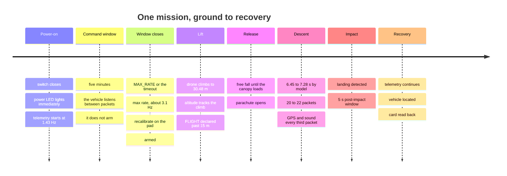

# Concept of Operations

What happens, in order, from the moment the switch closes to the moment the vehicle is back
in someone's hands — and what the vehicle, the ground station and the operators are each
doing at every point.

**Status: 2026-09-14 — submitted, launch pending.** No lift has been flown. This document
describes the **sealed flight image** that was submitted: a five-minute command window from
power-on, then max rate, recalibration and arming by itself. Every timing below is either a firmware
constant, a computed figure, or a bench measurement, and each says which it is.

> [!IMPORTANT]
> **This document found a defect, and it is fixed.** The vehicle declared a landing during a
> drone hover, up to twelve seconds before release. See [the hover
> problem](#the-hover-problem-f-20) for what it was, why the existing guard did not catch
> it, and the descent gate that now does.

---

## Contents

- [The mission in one paragraph](#the-mission-in-one-paragraph)
- [The profile](#the-profile)
- [Phase by phase](#phase-by-phase)
- [The hover problem (F-20)](#the-hover-problem-f-20)
- [The data budget](#the-data-budget)
- [What is autonomous, and what is not](#what-is-autonomous-and-what-is-not)
- [Failure behaviour, phase by phase](#failure-behaviour-phase-by-phase)
- [What is still unknown](#what-is-still-unknown)

---

## The mission in one paragraph

The CanSat is powered on at ground level and begins transmitting immediately. A drone lifts
it to **100 ft (30.48 m)** and releases it. It deploys a parachute, descends at **no more
than 5 m/s**, transmits continuously throughout, keeps transmitting for **at least five
seconds after impact**, and is then recovered. It does all of this on its own: there is no
launch command, no arming button and no manual trigger anywhere in the firmware.

---

## The profile



| Milestone | When | Where the number comes from |
|---|---|---|
| Telemetry begins | Immediately at power-on, at 700 ms — 1.43 Hz | No trigger exists in the firmware; `kTelemetryPeriodMs` |
| Command window | 0 – 300 s | `command_window_ms`. The vehicle calibrates once for a working altitude reference and **does not arm** |
| Window closes | At 300 s, or on an accepted `MAX_RATE` | Whichever comes first. An erase command does not close it |
| Max rate | From the close | `auto_max_rate`: rich, lean, lean in 374 / 296 / 296 ms slots — **3.11 Hz** measured |
| Recalibration | ~2.7 s after the close | 80 samples at 30 Hz; the power-on calibration is discarded |
| **Armed** | **3 s after the close**, once recalibration settles | `arming_delay_ms`, counted from the close, **and** calibration settled |
| Calibration times out best-effort | 20 s after the close | `calib_timeout_ms` |
| `READY → FLIGHT` | 15 m above the pad, held 300 ms | `launch_altitude_gain_m`, `launch_confirm_ms` |
| Release altitude | 30.48 m | Rulebook, MIS-001 |
| Descent duration | **6.45–7.28 s** in the 450–550 g band | [`simulations/descent.py`](../../simulations/descent.py), 80 cm canopy |
| Descent gate opens | ~1 s into the descent | `landing_descent_rate_mps`, `landing_descent_confirm_ms` |
| Landing detected | 3 s at rest, **after an observed descent**, no sooner than 3 s into FLIGHT | `landing_confirm_ms`, `min_flight_ms` |
| Post-impact window | 5.0 s | `post_impact_transmission_ms`, ≥ the rulebook's 5 s |

> [!WARNING]
> **A lift inside the command window is never detected.** Launch detection is off until the
> vehicle arms, so a drone that climbs before then carries a vehicle that reports `READY`
> through the entire flight. **Wait for armed.**

**The pad phase is up to five minutes; the flight is under fifteen seconds of it.**

---

## Phase by phase

### 1 · Power-on and self-test — `INIT` → `SELF_TEST`

**Vehicle.** Closes the switch, brings up I2C0, SPI0 and UART0, initialises the IMU,
barometer, GPS, radio, microSD and microphone, and prints a startup summary naming every
subsystem and whether it answered. Mandatory sensors must produce valid data or the vehicle
enters `FAULT` — and keeps transmitting there.

**Ground station.** Nothing yet; the bridge is already up and reporting `#state=RX` at 1 Hz.

**Operator.** Watch the startup summary. It is the only moment the vehicle says what is
fitted, and it repeats every 3 s until arming, then stops for good.

**Status LED:** solid on.

### 2 · The command window — `READY`, unarmed

**Vehicle.** Transmits at **1.43 Hz** and listens in the gap after each packet for a
password-authorised command. While stationary it collects IMU and barometer samples and
captures gyro bias, accelerometer offset and the **barometric ground reference** — the reason
altitude reads ≈ 0 rather than the ~23 m an uncalibrated barometer showed on the bench
(row 8.5). **It does not arm**, however long it has been still. The window lasts five
minutes.

If it is not still, calibration retries until 20 s and then resolves **best-effort**: the
barometric reference is still used, but gyro and accelerometer bias are **not** applied. A
bias measured while moving is worse than no correction. A warning fault is raised and the
mission continues.

**Operator.** Carry the vehicle to the pad and set it down. Send `MAX_RATE` from the console
to close the window early, or wait for it to time out. **The status field reads `ST-R0…`**
throughout — READY, not armed.

**Status LED** (if fitted — not recorded at submission): 900 ms on, 900 ms off.

### 3 · Window closed — max rate, recalibrate, arm

**Vehicle.** On an accepted `MAX_RATE`, or at 300 s, it switches to the max-rate pattern —
rich, lean, lean, **3.11 Hz** — stops listening for good, **discards the power-on calibration
and recalibrates where it now sits**, and arms once that settles and 3 s have passed.

**Operator.** Keep the vehicle **still** until it reads armed: **`ST-R11…`** — READY, armed,
calibrated — and the station's received rate has risen to about 3.1 Hz. **Only then hand it
to the drone.**

**Status LED** (if fitted): 400 ms on, 400 ms off.

### 4 · Lift — `READY` → `FLIGHT`

**Vehicle.** Enters `FLIGHT` when acceleration exceeds 30 m/s² **or** altitude passes 15 m
above the pad, held continuously for 300 ms. On a drone lift it is the altitude condition
that fires, so **`ST-F…` appears during the ascent, not at release.** That is correct
and intended — MIS-004 requires telemetry to reflect the altitude change during lifting —
but it surprises people watching the console.

**Ground station.** Altitude climbs. This is the first live confirmation the barometer is
tracking anything real.

**Status LED:** 100 ms on, 100 ms off — 5 Hz.

> **This is the phase the hover problem lived in**, and the reason `FLIGHT` here does
> not mean "falling". See [below](#the-hover-problem-f-20).

### 5 · Release and descent — `FLIGHT`

**Vehicle.** Free fall until the canopy takes load, then a terminal descent. Nothing in the
firmware knows a release happened; it is already in `FLIGHT` and stays there.

**Numbers**, from [`simulations/descent.py`](../../simulations/descent.py), for the 80 cm
canopy that was fitted and a vehicle ballasted into the 450–550 g band:

| Case | Rate | Descent time | Packets at 3.11 Hz |
|---|---:|---:|---:|
| 450 g, ISA 15 °C — the bottom of the band | 4.37 m/s | 7.28 s | ~22 |
| 500 g, ISA 15 °C | 4.61 m/s | 6.94 s | ~21 |
| 550 g, 35 °C — the sizing case | 5.00 m/s | 6.45 s | ~20 |

**The submitted mass is not recorded**, so the flight cannot be placed on one row until the
vehicle is weighed. **And none of these is measured** — no drop test was made, so the drag
coefficient under every row is assumed.

**About twenty packets of descent go over the air**, one in three of them carrying GPS and
sound. At the 1.43 Hz this document was first written against it would have been nine. The
SD log is still the better record — not because it is denser (**it writes one row per
packet**, at the same 3.11 Hz) but because no row is lost to the link, and each carries
satellite count, HDOP and full-precision position that the packet does not.

**Operator.** Watch, and do not touch anything. There is nothing to do.

### 6 · Impact and the post-impact window — `LANDED`

**Vehicle.** Declares a landing when three things are true together:

1. **A descent has actually been observed** — vertical rate below −2 m/s, held for a
   second, at some point during this `FLIGHT`. This is the [descent gate](#the-fix-the-descent-gate),
   and without it the at-rest timer below does not even start.
2. Acceleration is back within 2.5 m/s² of 1 g **and** vertical speed is below 1 m/s, both
   held for 3 s.
3. At least 3 s have passed since `FLIGHT` was entered.

Then it transmits for **5 s** before moving to `RECOVERY`. `validate_config()` refuses to
build with a shorter window, because REC-008 is a hard 5 s.

**Status LED:** 250 ms on, 250 ms off — 2 Hz.

### 7 · Recovery — `RECOVERY`

**Vehicle.** Terminal state. **Telemetry continues** — this is what gets the recovery team to
it, and since 2026-09-11 every rich packet carries `GP-Lat`, `GP-Lon` and `GP-Alt`, so the
console can point at the vehicle rather than only hearing it. If `transmit_gps` is turned off,
the search falls back to RSSI and eye, and the fix is on the card inside the thing being
looked for.

**Operator.** Find it, switch it off, pull the card, and read it back with
[`tools/read_flight_log.py`](../../tools/read_flight_log.py). Then follow
[post-flight analysis](../operations/runbook.md#post-flight-analysis) — the rulebook allows
four hours.

---

## The hover problem (F-20)

**The vehicle declares a landing while hanging under the drone.**

Landing detection asks two questions: is acceleration within 2.5 m/s² of 1 g, and is
vertical speed below 1 m/s? A vehicle **hovering under a drone answers yes to both.** Held
for `landing_confirm_ms` — three seconds — that is a landing.

Run against the real `StateMachine`, with a lift climbing at 3 m/s to 30 m and a 20-second
hover before release:

```text
t= 10362 ms  alt=  16.1 m  rate= +3.0 m/s   READY -> FLIGHT
t= 18018 ms  alt=  30.0 m  rate= +0.0 m/s   FLIGHT -> LANDED     <-- still under the drone
t= 23034 ms  alt=  30.0 m  rate= +0.0 m/s   LANDED -> RECOVERY   <-- 12 s before release
```

**What it costs:**

- `MODE-` reads `RECOVERY` through the entire real descent, so any analysis that segments the
  flight by mission state is wrong.
- The 5-second post-impact window is **spent in the air**. Telemetry does continue after the
  real impact — `RECOVERY` transmits — so REC-008 is physically satisfied; what is lost is the
  vehicle's own declaration that it landed, which is the evidence a judge would look for.
- `RECOVERY` is terminal. Once entered, the state machine never returns to `FLIGHT`.

**Three seconds is a short hover.** A pilot stabilising over the drop point will exceed it
without thinking about it. And the exposure is wider than hovering: **any interval of three
seconds in which the vertical rate stays under 1 m/s** does it, which includes a gentle lift
at less than 1 m/s.

**Why the existing guard does not catch it.** `min_flight_ms` suppresses landing detection
for the first 3 s of `FLIGHT` — which is aimed at a boost-then-coast rocket profile, where
the vehicle is genuinely in motion. On a drone lift, `FLIGHT` is entered at 15 m during the
ascent, so those 3 s are used up long before the hover.

**An altitude gate would also have worked** — refusing a landing unless `altitude_agl_m` is
near the ground baseline — but it leans on barometric altitude still being trustworthy after
several minutes of drift. The gate that was built does not.

### The fix: the descent gate

**A vehicle cannot land without descending first.** `StateMachine` now latches
`descent_observed_` once the vertical rate has been below **−2 m/s** for **one second**, and
refuses `FLIGHT → LANDED` until it is set. Three properties make it hold:

- **The at-rest timer does not start without it.** A hover cannot quietly accumulate
  towards a landing and then fire the instant the gate happens to open.
- **The latch belongs to one `FLIGHT`, not to the vehicle.** It clears on any state change,
  so a descent seen earlier cannot authorise a landing later.
- **`validate_config()` refuses thresholds that overlap.** The descent rate must exceed the
  at-rest rate — otherwise one sample could mean both "descending" and "stopped" — and the
  confirm window may not be zero, or a single noisy barometer sample would re-admit the
  hover.

**Why these numbers.** They sit in the wide gap between the two things they separate. The
mission descends at up to 5 m/s and reaches terminal rate in about half a second, so the
gate opens roughly a second into a 6.45 s descent with five seconds to spare — and a failed
parachute falls far faster, opening it sooner. A hovering drone, a gentle lift and
barometric noise are all far below 2 m/s. They are **PROVISIONAL**, like every other
detection threshold here, and want tuning against real drop data.

**The same reproduction, re-run against the fixed state machine:**

```text
t= 10362 ms  alt=  16.1 m  rate= +3.0 m/s   READY -> FLIGHT      <-- during the ascent, correct
t= 44022 ms  alt=   0.0 m  rate= +0.0 m/s   FLIGHT -> LANDED     <-- 3 s after touchdown
t= 49038 ms  alt=   0.0 m  rate= +0.0 m/s   LANDED -> RECOVERY   <-- window spent on the ground
```

**One consequence worth knowing.** If the barometer fails during descent the vertical rate
never goes negative, the gate never opens, and the vehicle stays in `FLIGHT` after
touchdown. **Telemetry continues** — that invariant is untouched, and it is what REC-008
actually requires — but the vehicle would not declare its own landing. That is a strictly
better failure than declaring one in mid-air, and it is the same class of degradation as
every other barometer loss on this vehicle.

Recorded as [F-20](../testing/bring-up-record.md#findings), covered by
`test_a_hovering_drone_is_not_a_landing` and four others.

---

## The data budget

Assuming a 10 s lift and a 20 s hover, and the command window run to its full five minutes:

| Phase | Duration | Rate | Packets |
|---|---:|---:|---:|
| Command window | 300 s | 1.43 Hz | ~428 |
| Recalibrate and arm | ~3 s | 3.11 Hz | ~9 |
| Pad, armed, before the lift | operator-dependent | 3.11 Hz | — |
| Lift to 30.48 m | ~10 s | 3.11 Hz | ~31 |
| Hover before release | ~20 s | 3.11 Hz | ~62 |
| **Descent** | **6.45–7.28 s** | 3.11 Hz | **~20–22** |
| Post-impact window | 5 s | 3.11 Hz | ~15 |
| Recovery, until switched off | operator-dependent | 3.11 Hz | — |

**For comparison — the failure the warning above is about.** If the drone lifts inside the
command window, the vehicle is still at 1.43 Hz and never arms, so the descent goes over the
air at the slower rate and `FLIGHT` is never declared:

| Case | Descent | Packets at 1.43 Hz |
|---|---:|---:|
| 500 g, lifted inside the command window | 6.94 s | **9** |

**About twenty packets is the whole descent dataset over the air.** Two consequences:

1. **The SD log is the primary record, not a backup.** It writes one row per packet — the
   same ~20 descent rows — but none are lost to the link, and each carries satellite count and
   HDOP that never go on the air. *It does not run at the 30 Hz sensor rate, which this page
   said until 2026-09-14; the append is in `emit_telemetry()`.*
2. **A single lost packet is 5 % of the descent.** The max-rate pattern lost 1 packet in 544
   at bench range (row 8.18); nothing is known about loss at 30 m with the vehicle swinging
   under a canopy.

---

## What is autonomous, and what is not

**Everything in flight is autonomous.** Once armed, the vehicle detects its own launch and
landing and keeps talking through every failure it can survive. There is no launch command
and no manual trigger.

**The pad is not autonomous, by design.** The submitted image has an uplink, and it is open
for exactly one phase:

1. **Only during the five-minute command window**, before arming. Once the window closes the
   vehicle never enters receive mode again for the power cycle, so the uplink is shut for the
   whole of flight, landing and recovery — every state holding a log that cannot be
   recreated. A watchdog reset skips the window entirely.
2. **Two commands exist**: `MAX_RATE`, which closes the window early, and an erase for bench
   runs.
3. **Each command carries a digest of a shared secret, the command name and the packet number
   the operator was looking at**, so the wire never sees the secret and a captured frame
   cannot be replayed or reused for the other command.

**It is not cryptography**, and the documentation says so: it stops accidents, stray frames
and replays. It does not stop somebody who knows the password.

---

## Failure behaviour, phase by phase

| Failure | Phase | What happens |
|---|---|---|
| Calibration never settles | Pad | Best-effort at 20 s: barometric reference used, gyro/accel bias not applied, warning raised, mission continues |
| GPS never gets a fix | Any | `GP-` fields omitted; nothing else changes. Position is optional data |
| GPS lead pulled off at deployment | Descent | The fix is declared stale after 3 s of no update, so a frozen position never survives more than a few packets |
| microSD fails | Any | Logging disables itself after 10 consecutive write failures. Telemetry untouched |
| Radio fails | Any | Bounded re-initialisation with a 1 s back-off. Never a blocking retry loop |
| One mandatory sensor stale | Any | Packet suppressed, and **the packet number is not consumed** — so a gap at the ground station means radio loss and nothing else |
| Both IMU and barometer stale | Any | Critical fault → `FAULT`. **Telemetry continues in `FAULT`** |
| Barometer fails during descent | Descent | The vertical rate never goes negative, so the descent gate never opens and the vehicle stays in `FLIGHT` after touchdown. **Telemetry continues**, which is what REC-008 requires; what is lost is the vehicle's own declaration that it landed. Strictly better than declaring one in mid-air |
| Loop hangs | Any | 2 s hardware watchdog reboots it; telemetry restarts automatically and the reboot is reported as a fault |
| Brownout or impact reset | Any | The block log rewrites its header after every record, so it resumes at the correct block instead of overwriting flight data |

---

## What is still unknown

| Unknown | Why it matters | Where it gets answered |
|---|---|---|
| **The lift profile** — climb rate, hover duration, release method | Directly drives [F-20](#the-hover-problem-f-20), and the packet budget above assumes numbers nobody has confirmed | Organizers, or a rehearsal |
| Link performance at 30 m under a swinging canopy | About twenty descent packets is a thin dataset to lose any of | The launch |
| Real descent rate | The 4.37–5.00 m/s is a model with an unmeasured drag coefficient. No drop test was made before submission | The launch — time it from the SD log |
| Barometric altitude drift over a multi-minute session | The ground reference is retaken when the command window closes, then held for the flight | Gate 9 endurance |
| Yaw over a 3-minute mission | Measured drifting ~70° over 180 s. The delivered IMU is a six-axis **MPU-6500** with no magnetometer, so there is no absolute reference to catch it and every packet declares `YR-G` ([F-1](../hardware/receiving-inspection.md#findings)) | [F-13](../testing/bring-up-record.md#findings), [F-17](../testing/bring-up-record.md#findings) |
| Whether a relative yaw is acceptable | Mandatory field, and the MPU-6500 cannot produce anything else | Organizers, open question 2 |
| **The submitted mass** | Ballasted into the band, number not recorded. It decides which descent row the flight is compared against | Weigh it before the launch |

---

Related: [runbook.md](../operations/runbook.md) — the launch-day procedure ·
[requirements.md](../requirements/requirements.md) ·
[software-architecture.md](../design/software-architecture.md) ·
[simulations/](../../simulations/README.md) ·
[bring-up-record.md](../testing/bring-up-record.md)
