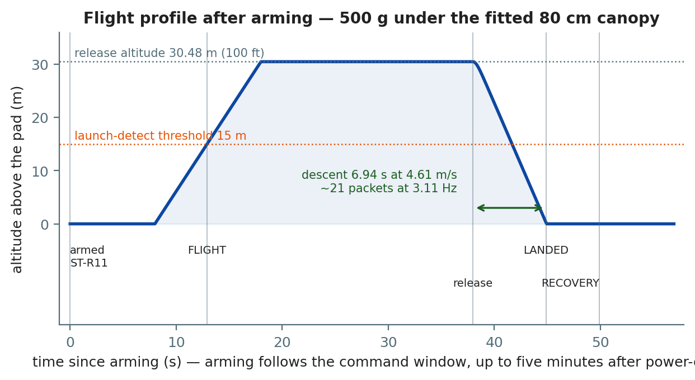
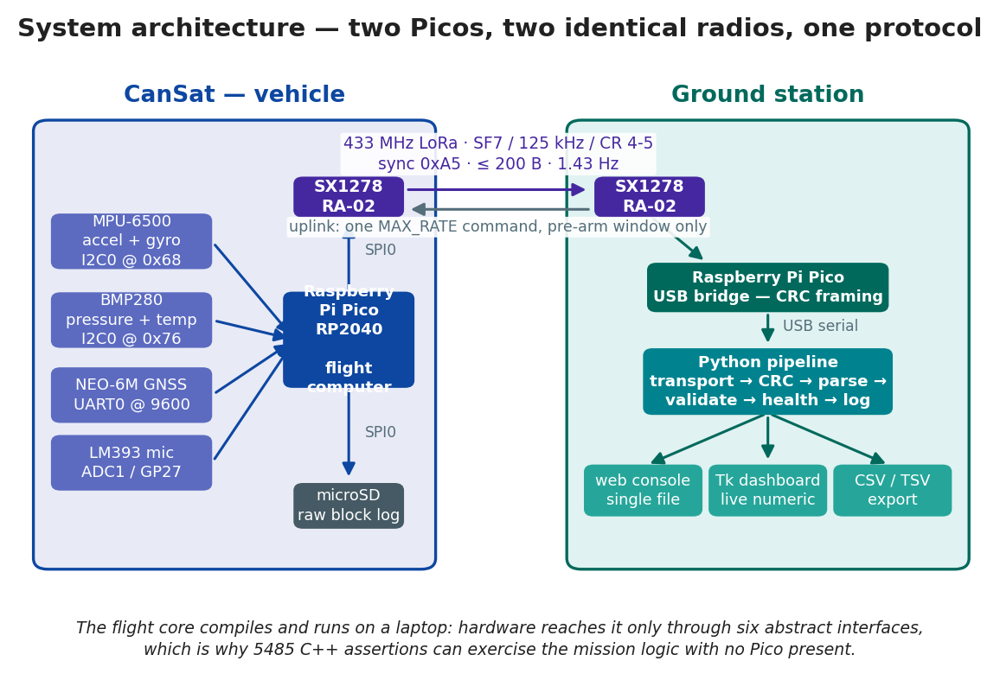
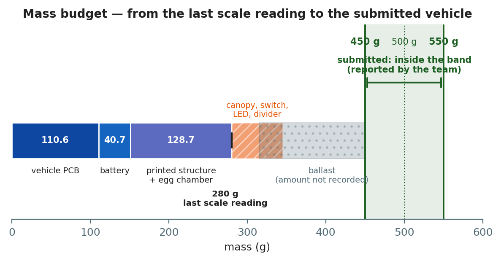
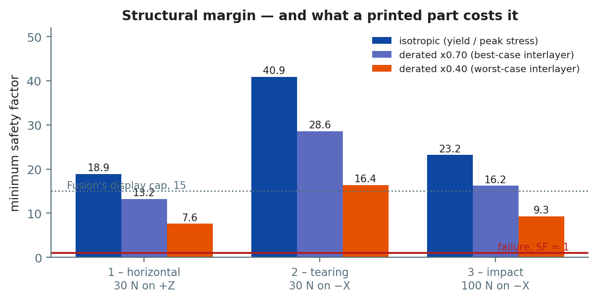
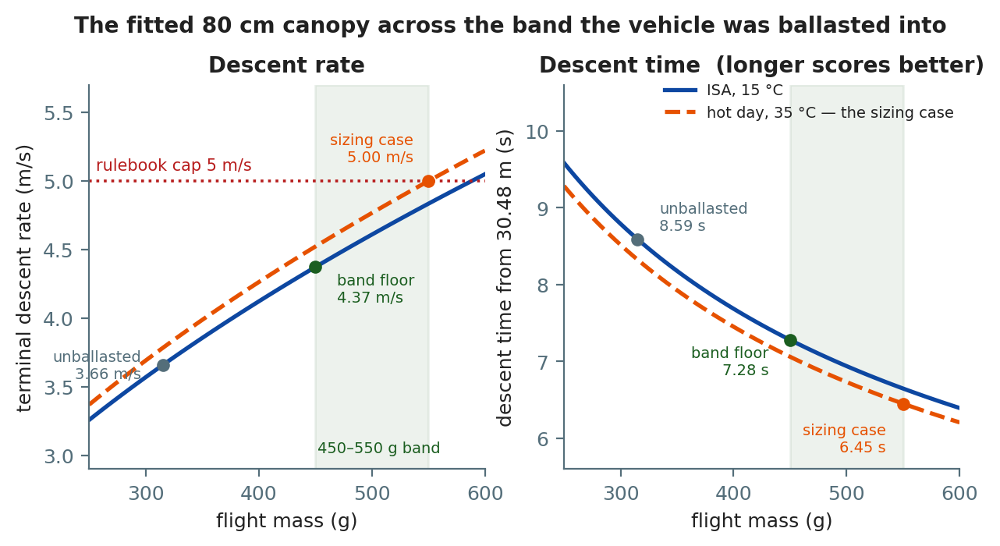
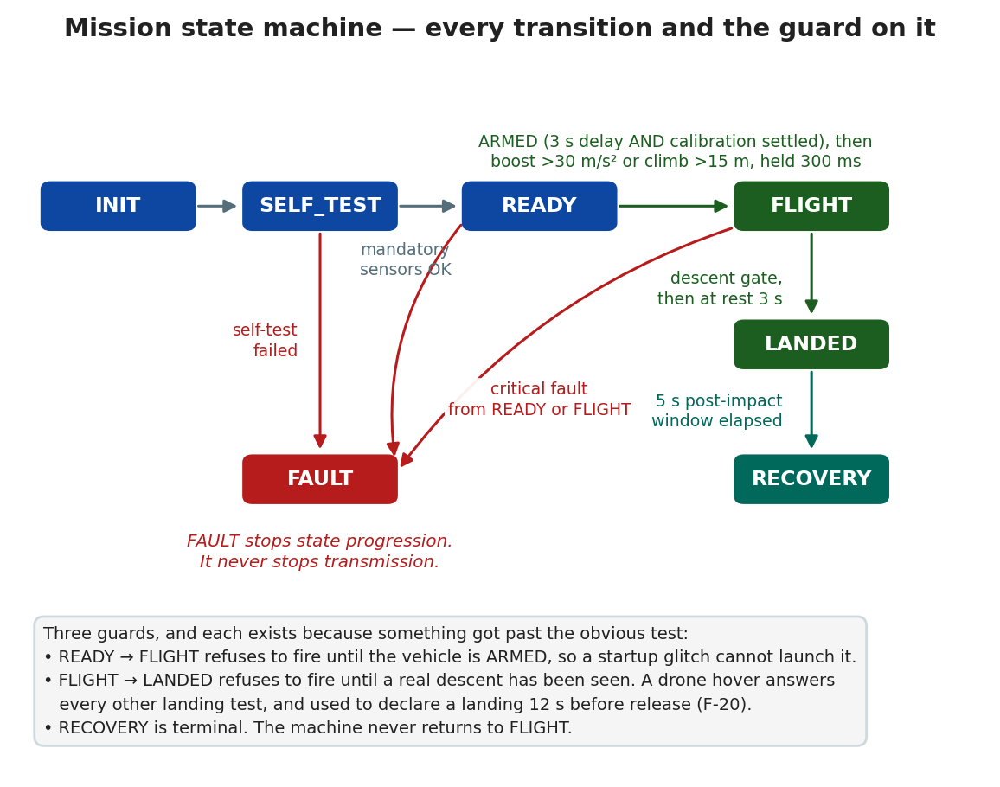
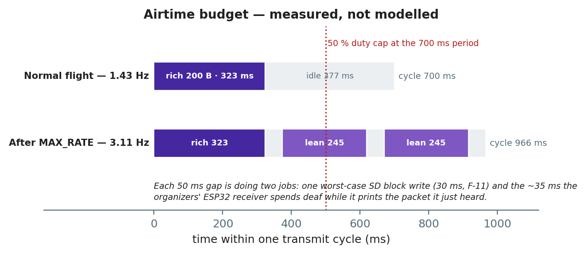
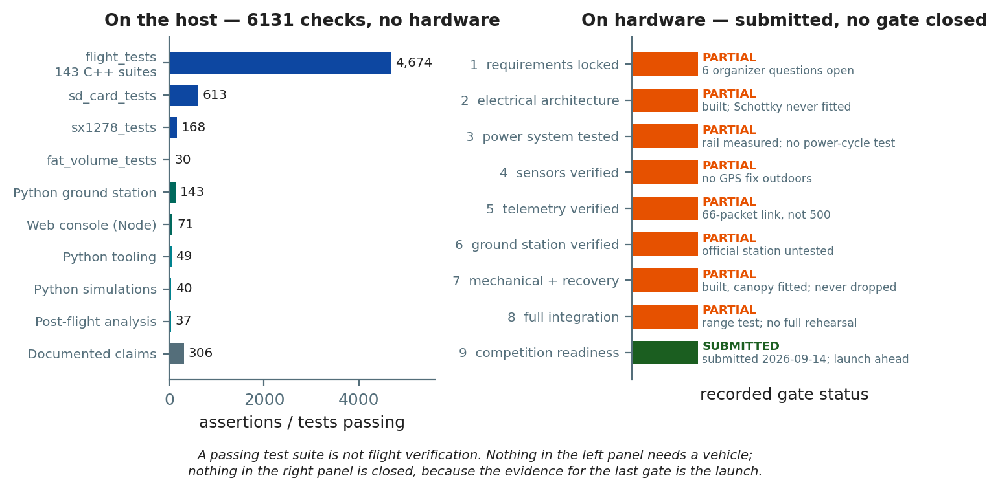

# CanSat 2026 — Final Project Report

**Team CAN-Team-25 · Physics Club, SVNIT**

**Report date: 12 September 2026 · revised at submission, 14 September 2026**

**Repository:** `github.com/KunjSorathiya/CanSat-Team-Singularity`

---

> **A note on what this report claims.**
>
> This project keeps one rule, and this report is written under it: **nothing is described
> as done unless there is evidence, and the evidence is named.** Owning a component is not
> integration. A passing test suite is not flight verification. A simulation is not a drop
> test.
>
> Where something has been measured, the measurement and its date are given. Where something
> is a model, it is labelled a model and the file that computes it is named. Where something
> has not been done, this report says so plainly rather than leaving it out — including in
> the sections where that is unflattering.
>
> **The CanSat and this report were submitted on 14 September 2026. Nothing in this project
> has flown yet** — the launch is still ahead, so this report has no results section, and says
> so rather than implying one.

---

## Contents

1. [Executive summary](#1-executive-summary)
2. [Mission and requirements](#2-mission-and-requirements)
3. [Concept of operations](#3-concept-of-operations)
4. [System architecture](#4-system-architecture)
5. [Components](#5-components)
6. [Electrical design](#6-electrical-design)
7. [Mechanical design and the as-built vehicle](#7-mechanical-design-and-the-as-built-vehicle)
8. [Structural simulation](#8-structural-simulation)
9. [Descent simulation and the parachute](#9-descent-simulation-and-the-parachute)
10. [Flight software](#10-flight-software)
11. [Telemetry protocol and the radio link](#11-telemetry-protocol-and-the-radio-link)
12. [Onboard logging](#12-onboard-logging)
13. [Ground station](#13-ground-station)
14. [Verification and testing](#14-verification-and-testing)
15. [Bring-up measurements](#15-bring-up-measurements)
16. [Findings register](#16-findings-register)
17. [Project timeline](#17-project-timeline)
18. [Scoring assessment](#18-scoring-assessment)
19. [Open questions for the organizers](#19-open-questions-for-the-organizers)
20. [Lessons learned](#20-lessons-learned)
21. [Appendix A — pin assignment](#appendix-a--pin-assignment)
22. [Appendix B — flight configuration constants](#appendix-b--flight-configuration-constants)
23. [Appendix C — repository map](#appendix-c--repository-map)

---

## 1. Executive summary

The CanSat is a can-sized satellite that is lifted to 100 ft by a drone, released, deploys a
parachute, descends at no more than 5 m/s, carries an egg chamber through landing, and
streams telemetry continuously from power-on through recovery.

**Where the project stands at submission, 14 September 2026:**

| Layer | State |
|---|---|
| **Submission** | **The CanSat and this report were submitted** (reported by the team, 2026-09-14). **The launch has not happened** |
| **Software** | Complete and passing **6131 automated checks** on the host — flight core, telemetry protocol, ground station, web console, simulations and documentation claims |
| **Firmware drivers** | Every driver has run on real silicon: IMU, barometer, GPS, radio and microSD. The sealed flight image has been flashed and run |
| **Electronics** | Built, and **every device on it works**. The radio link has closed end to end. **Switch, power LED and battery divider fitted; the Schottky diode never was** |
| **Structure** | **Printed in white PETG and assembled**, egg chamber fitted, **ballasted into the 450–550 g band** (reported by the team, 2026-09-14) |
| **Recovery** | **80 cm canopy sewn and fitted** (reported by the team, 2026-09-14). **Never dropped, never deployed** |
| **Flight** | **Nothing has flown.** The launch will be the first descent, the first deployment and the first measured descent rate |

### The three numbers that matter most

| | | |
|---|---:|---|
| **Mass** | **450–550 g band** | Ballasted into it before submission (reported by the team, 2026-09-14). The last scale reading on record is **280 g** assembled without a parachute, 2026-09-12 |
| **Telemetry rate** | **1.43 Hz**, then **3.11 Hz** for the flight | Measured at the ground station. The rulebook floor is 1 Hz |
| **Descent under the fitted canopy** | **4.37–5.00 m/s over 6.45–7.28 s** across the mass band | Modelled. The cap is 5 m/s; no drop test was made |

### What changed at submission, and why it matters

Three days before submission the vehicle was printed, assembled and weighed at **280 g
without a parachute** — and that inverted the project's largest open risk. The print came in
at **≈ 128.7 g against a 193 g solid-volume upper bound, 33 % under**, so the finished vehicle
would have been **105–135 g below the 450 g edge** of the rulebook's mass band.

Whether that edge binds was never answered: GEN-005 reads *"500 g (±10%)"* as a band, while
GEN-006's disqualification names only *exceeding*. **The team made the question moot** by
ballasting into the band, which satisfies either reading. In the same days the **80 cm canopy
was sewn and fitted and the switch and power LED went in** — the last mandatory items on the
build.

**What was never done is a drop test.** The canopy has never opened and the structure has
never absorbed an arrival, so the descent rate in this report is a model, and the launch is
its first test.

---

## 2. Mission and requirements

### 2.1 The mission

The CanSat is powered on at ground level and begins transmitting immediately. A drone lifts
it to **100 ft (30.48 m)** and releases it. It deploys a parachute, descends at **no more
than 5 m/s**, transmits continuously throughout, keeps transmitting for **at least five
seconds after impact**, and is then recovered.

Flight is autonomous. There is no launch command, no arming button and no manual trigger
anywhere in the firmware: the vehicle powers on, calibrates itself, arms itself, detects its
own launch and its own landing, and keeps talking through every failure it can survive.

### 2.2 Requirements

Thirty requirements were extracted from the rulebook and each was given an implementation, a
verification method and a status. The full traceable table is in
`documentation/requirements/requirements.md`. The rulebook's own hard numbers:

| Quantity | Value | Requirement |
|---|---|---|
| Body envelope | 21 cm × 12 cm, **+7 cm** for the egg chamber | GEN-004 |
| Mass | **500 g ± 10 %** — 450 g to 550 g | GEN-005 |
| Release altitude | **100 ft / 30.48 m**, from a drone | MIS-001 |
| Descent rate | **≤ 5 m/s** | REC-005 |
| Telemetry rate | **≥ 1 packet per second** | TEL-004 |
| Post-impact telemetry | **≥ 5 s** | REC-008 |
| Radio | 433 MHz LoRa, sync `0xF3` test / `0xA5` launch | TEL-020 |

**Exceeding size or mass by more than 10 % is a disqualification**, not a deduction. It sits
on a closed list alongside unsafe deployment, no attempt at a communication system, arriving
late, and code-of-conduct violations.

### 2.3 Two rulebook contradictions, both resolved

The original guidelines contradicted themselves on dimensions and on launch altitude. Neither
was guessed at locally; both were escalated, and the **2026 revision settled both**:

| Was contradictory | Now stated |
|---|---|
| Dimensions | **21 cm (+7 cm for the egg chamber) × 12 cm**, stated identically on pages 4 and 10 |
| Launch altitude | **100 ft, released from a drone**, stated identically in both places |

A third ambiguity — whether "12 cm across" meant a width or a diameter — was put to the
organizers directly, because for a prismatic body the two give different answers and the
difference was disqualification-class rather than a scored margin. **They confirmed on
2026-09-09 that a 12 cm sided box is acceptable.** That written confirmation must travel with
the submission; it is currently recorded only in this repository.

---

## 3. Concept of operations



*Figure 1 — the flight after arming, for a 500 g vehicle under the fitted 80 cm canopy. The
submitted mass is inside the band but not recorded, so 500 g stands in for it. The descent
segment is the model's closed-form solution, not height ÷ rate.*

| Milestone | When | Where the number comes from |
|---|---|---|
| Telemetry begins | Immediately at power-on, at 1.43 Hz | No trigger exists in the firmware |
| Command window | 0 – 300 s | `command_window_ms`. The vehicle listens between packets and **does not arm** |
| Window closes | At 300 s, or on an accepted `MAX_RATE` | Whichever is first |
| Max rate | From the close | `auto_max_rate` — **3.11 Hz** measured |
| **Armed** | 3 s after the close, once recalibration settles | `arming_delay_ms`, counted from the close |
| Calibration times out best-effort | 20 s after the close | `calib_timeout_ms` |
| `READY → FLIGHT` | 15 m above the pad, held 300 ms | `launch_altitude_gain_m` |
| Release altitude | 30.48 m | Rulebook, MIS-001 |
| Descent duration | **6.45–7.28 s** across the 450–550 g band | `simulations/descent.py`, 80 cm canopy |
| Landing detected | 3 s at rest, after an observed descent | `landing_confirm_ms` |
| Post-impact window | 5.0 s | `post_impact_transmission_ms` |

**The pad phase is up to five minutes; the flight is under fifteen seconds of it.**

### 3.1 The five-minute command window, and the one operational constraint it creates

The sealed flight image opens an uplink window for **five minutes from power-on**, during
which the vehicle transmits at 1.43 Hz so that a command can be heard in the gap between
packets. When the window closes — or when a `MAX_RATE` command closes it early — the vehicle
goes to its max-rate pattern by itself, **discards its power-on calibration, recalibrates
where it now sits**, and arms.

> **The drone must not lift off until the vehicle has armed.** Launch detection is disabled
> for the whole of the command window, so a lift that begins inside it is never detected and
> the vehicle stays in `READY` through the entire flight. Wait for the status field to read
> armed — **`ST-R11…`** — and the station's rate to rise to about 3.1 Hz.

Once armed the uplink is closed for the whole of flight, landing and recovery — which is
every state holding a log that cannot be recreated.

### 3.2 The hover problem, and the guard that closed it

Writing the concept of operations found a defect that no test had: **the vehicle declared a
landing while hanging under the drone, up to twelve seconds before release.**

Landing detection asked two questions — is acceleration within 2.5 m/s² of 1 g, and is
vertical speed below 1 m/s? **A vehicle hovering under a drone answers yes to both.** Held
for three seconds, that is a landing. Run against the real state machine with a 3 m/s climb
and a 20 s hover:

```text
t= 10362 ms  alt=  16.1 m  rate= +3.0 m/s   READY -> FLIGHT
t= 18018 ms  alt=  30.0 m  rate= +0.0 m/s   FLIGHT -> LANDED     <-- still under the drone
t= 23034 ms  alt=  30.0 m  rate= +0.0 m/s   LANDED -> RECOVERY   <-- 12 s before release
```

The existing guard did not catch it because `min_flight_ms` suppresses landing detection only
for the first 3 s of `FLIGHT`, and on a drone lift `FLIGHT` is entered at 15 m during the
*ascent* — so those three seconds are spent long before the hover.

**The fix is a descent gate: a vehicle cannot land without descending first.** The state
machine latches `descent_observed_` once the vertical rate has been below −2 m/s for one
second, and refuses `FLIGHT → LANDED` until it is set. The latch belongs to one `FLIGHT` and
clears on any state change, so a descent seen earlier cannot authorise a landing later. The
same reproduction now lands three seconds after touchdown.

---

## 4. System architecture



*Figure 2 — two Raspberry Pi Picos and two identical radios. The vehicle Pico runs the
mission; the ground Pico is a pure bridge that frames every received payload onto USB with a
CRC, so the PC can tell transport corruption apart from a malformed packet.*

### 4.1 The dependency rule

The system is layered, and each layer depends only on the one beneath it:

```text
main.cpp          watchdog, clock, configuration
  |
flight::pico      hardware  — mpu9250, bmp280, neo6m, sd_card, pico_radio
  |
flight::          flight core — controller, state machine, scheduler, orientation,
                  calibration, faults, telemetry builder, block log
  |
cansat::          shared — telemetry format and parser, SX1278 driver
  |
ground::          bridge firmware and USB CRC framing
  |
Python / JS       ground pipeline and interfaces
```

**The flight core never includes a Pico SDK header.** Hardware reaches it only through six
abstract interfaces — `Imu`, `Barometer`, `Gps`, `Radio`, `SdLogger`, `BoardIo`. Tests
substitute mocks; the vehicle substitutes `flight::pico::*`.

That single rule is why 5485 C++ assertions can exercise the entire mission logic on a laptop
with no hardware present, and it is the reason the software was complete and tested before
any component had been unpacked.

### 4.2 End-to-end data path

```text
sensors -> controller -> plausibility gate -> bias correction -> orientation
        -> AGL and vertical rate
        -> TelemetryBuilder   (nothing is built if any mandatory field is invalid)
        -> packet string -> SX1278 -> 433 MHz LoRa -> SX1278 -> bridge Pico
        -> CRC-framed USB serial
        -> transport -> CRC check -> parse -> validate -> health -> log
        -> dashboard, web console, CSV export
```

A packet becomes a telemetry point only if it survives every stage, **and each stage's
rejection is counted separately** — so a transport fault is never mistaken for a sensor
fault.

---

## 5. Components

### 5.1 Bill of materials

| Subsystem | Component | Qty | Purpose | Status |
|---|---|---:|---|---|
| Flight computer | Raspberry Pi Pico (RP2040) | 2 | Vehicle + ground bridge | **Both built and running** |
| Telemetry | SX1278 RA-02 433 MHz LoRa | 2 | Vehicle + ground radio | **Link closed 2026-09-07**, 66 packets, 0 % loss |
| Telemetry | 433 MHz SMA antenna | 2 | Radio antennas | Mated and radiating |
| Telemetry | 10 cm IPEX-to-SMA RG1.13 | 2 | Radio to antenna | Fitted |
| Sensors | **MPU-6500** (sold as MPU-9250) | 1 | Acceleration, angular rate | **Working, but the wrong part** — see below |
| Sensors | GY-BMP280-3.3 | 1 | Pressure, altitude, temperature | Verified at `0x76`, 83.0 Hz |
| Sensors | NEO-6M GPS with EEPROM | 1 | Position and timing | Talking, all six NMEA sentences, 0 checksum errors. **No fix acquired outdoors yet** |
| Sensors | LM393 sound module, 4-pin | 1 | Additional sensor — acoustic level | Fitted, logged, and transmitted as `SN-` |
| Storage | microSD card reader (3.3 V) | 1 | Onboard logging | Writes 100/100, sustains ~300 writes/s |
| Power | Orange 3.7 V 1500 mAh 25C 1S LiPo | 1 | Primary power | Behind the fitted switch. **No Schottky** — never connect USB with the battery in |
| Power | Manual ON/OFF switch + power LED | 1 each | PWR-001, PWR-002 | **Fitted** (reported by the team, 2026-09-14) |
| Structure | `Cansat_D1`, white PETG, 3D printed | 1 | Airframe and egg chamber | **Printed, assembled, ballasted into the mass band** |
| Recovery | 80 cm flat canopy | 1 | Descent at ≤ 5 m/s | **Sewn and fitted** (reported by the team, 2026-09-14). Never deployed |
| Prototyping | 10 × 10 cm universal PCB | 2 | Electronics mounting | One built, one spare |

**Built and submitted.** The only part of the design never fitted is the **Schottky diode**.

### 5.2 The IMU is not the part that was ordered

The module sold as an MPU-9250 answers `WHO_AM_I` with **`0x70` — an MPU-6500. Six axes, no
magnetometer.** Address `0x0C` never appears on the bus, in either scan, with or without the
pass-through bridge enabled. There is nothing behind it.

**The consequence is that this vehicle has no absolute yaw reference.** Yaw is
gyro-integrated and drifts without bound; roll and pitch are unaffected, because they are
referenced to gravity through the accelerometer. Every packet declares which kind of yaw it
carries: `YR-M` for an absolute magnetic yaw, `YR-G` for a relative gyro integration whose
zero is arbitrary. **On this vehicle it reads `YR-G` and always will.**

The nine-axis path — the AK8963 driver, the axis rotation, the calibration, the `YR-M`
declaration — is implemented and tested and would work on a genuine MPU-9250. It has no
source. **This is a procurement item, not a software change**, and whether a declared
relative yaw is acceptable for the mandatory `Ya-` field is an open organizer question.

The firmware was written for exactly this case: it accepts `0x70` as a six-axis part and
reports degraded attitude rather than refusing to boot, or — worse — inventing a heading from
a bus that is not answering.

### 5.3 The additional sensor, and why a microphone

Sensor integration is capped at 25 points: 15 for the mandatory set, +5 for GPS, +5 for one
more. The second +5 is taken by an **analogue microphone on GP27**, and the choice is
defensible rather than opportunistic.

**A microphone on a descending probe is a flight-proven atmospheric instrument.** Mars 2020
*Perseverance* carried one dedicated to entry, descent and landing. The *Huygens* probe
carried an acoustic sensor through Titan's atmosphere in 2005. *Venera 13* and *14* recorded
wind noise on the surface of Venus. Acoustics is one of the cheapest ways to instrument a
descent, which is why it keeps being flown.

What it measures here, in order of confidence:

| Use | Confidence | Why |
|---|---|---|
| **Landing detection** | High | Impact is an impulsive transient tens of dB above anything else in the flight |
| **Flow noise against descent rate** | Good | Unshielded electrets are extremely sensitive to airflow. On a descending body that is normally a defect; here it is the measurement |
| **Canopy oscillation** | Partial | Canopy modes are 0.5–3 Hz. The level is computed every loop tick but **recorded once per packet** — 3.11 Hz in flight — so only modes below about 1.5 Hz can be resolved; faster ones alias |
| **Deployment transient** | Moderate | The crack is sharp and loud, but it happens exactly when flow noise is highest |
| **Absolute sound pressure level** | **None** | No calibration, no reference, and an unrecorded gain trimpot |
| **Frequency spectra** | **None** | A 0.5 ms window resolves ~2 kHz upward, which is not where the content is |

**Two channels are recorded, deliberately.** `sound_mv_pp` is *how loud*; `sound_gate_pct` is
*what fraction of the window was loud*. A sharp crack and a steady roar can reach the same
peak and mean opposite things, and the duty cycle is what separates them.

**What it does not measure, stated before a judge asks:** the level is a relative
peak-to-peak envelope in millivolts, **not a sound pressure level**. Reporting decibels would
need a calibrated reference source and a record of the module's gain trimpot position, and
this project has neither. Values are comparable within one flight at one gain setting and
with nothing else. That limitation is written into the firmware comments, the requirements
row, and the log column name.

---

## 6. Electrical design

### 6.1 The power question, answered by measurement

Three hardware blockers held the design up for days. All three are closed, and how they
closed is more useful than the fact that they did.

**No external regulator is needed.** An AMS1117-3.3 was assessed and rejected — a full cell
at ≈ 4.2 V does not clear its high-load dropout. The Pico's own regulator was then measured
carrying every load on the vehicle:

| Condition | Rail voltage |
|---|---|
| 45 back-to-back radio transmits | **3.28–3.29 V** |
| 100 % microSD write duty | **3.28–3.30 V** |

One rail, no external part. The microSD reader turned out to be a **3.3 V board** with no
regulator and no level shifter — its supply pin is printed `3V3` and its entire parts list is
four 10 kΩ pull-ups and two capacitors. The listing that described a 4.5–5.5 V board
described a different product.

### 6.2 The power path

```text
LiPo --[ ON/OFF switch ]--[ Schottky ]--> Pico VSYS --> Pico 3V3(OUT) --> everything
             |                                              |
             +--[ 1 kOhm ]--> power LED                     +-- MPU-6500, BMP280  (I2C0)
                                                            +-- SX1278 RA-02      (SPI0)
                                                            +-- microSD reader    (SPI0)
                                                            +-- NEO-6M            (UART0)
                                                            +-- LM393 microphone  (ADC)
```

**The power LED hangs off the switched rail through a series resistor, not off a GPIO.**
PWR-003 requires it to light *immediately* on power-up, and a firmware-driven LED would wait
for boot. The firmware separately drives a status LED on GP14 whose blink rate encodes the
mission state.

**The switch, the power LED and the battery divider were fitted before submission. The
Schottky diode was not** — about ₹10, and the one part of this drawing that does not exist on
the vehicle. Without it USB back-powers the LiPo, so **a USB cable must never be connected
while the battery is in**, switch closed or not.

### 6.3 Bus discipline

Two shared buses, and a lesson from each:

- **I2C0 (GP4/GP5)** carries the IMU at `0x68` and the barometer at `0x76`. Both verified
  together on the soldered board; `0x0C` correctly absent.
- **SPI0 (GP16/GP18/GP19)** carries the radio and the microSD, with separate chip selects on
  GP17 and GP6. **This bus produced the single most instructive defect in the project** —
  see F-16 in section 16.

The netlist at `electrical/schematics/vehicle-netlist.tsv` is **generated from `BoardPins` in
the firmware**, and the generator refuses to run if the two disagree. The wiring diagrams are
generated from the same source. A pin cannot drift between the code and the documentation.

---

## 7. Mechanical design and the as-built vehicle

### 7.1 The design

`Cansat_D1` is modelled in Fusion 360 and exported to STEP. Every dimension quoted in this
project is **read out of the STEP file by `tools/cad_dimensions.py`**, and the build fails if
the documentation and the model disagree.

| | |
|---|---:|
| Solids | one, `Body1`, 56 faces |
| **Bounding box** | **118.5 × 115.0 × 110.0 mm** |
| Cross-section diagonal | 159.1 mm |
| Height against the 210 mm allowance | **91.5 mm unused** |
| **Clearance per side against the 120 mm section** | **2.5 and 5.0 mm** |

It is an **open box frame**: two solid side panels, two faces opened out with large arched
cutouts, a central vertical spine, harness slots top and bottom, and a rectangular cutout for
the switch with two LED holes beside it.

**The board fits flat.** A 100 × 100 mm perfboard sits inside a 115 × 110 mm section with 15
and 10 mm to spare for walls and standoffs. An earlier version of the design reasoning said
it could not and should be mounted edge-on as a spine; that was reasoned against a 120 mm
*circular* section, before there was a design, and it is withdrawn.

### 7.2 Material — white PETG

The rulebook permits any outer material and offers a **bonus for sustainable or
unconventional materials**. PETG was chosen and the reasoning recorded, because section D
expects the reasoning as much as the choice:

- **Tougher than PLA and far easier than ABS.** PETG does not go brittle the way PLA does,
  which matters for a part whose job is to survive exactly one impact.
- **Prints without an enclosure**, with little warping. ABS's toughness comes with warping and
  fumes a school workshop usually cannot manage.
- **Impact energy goes into deformation rather than fracture** — a bent frame is a recovered
  vehicle, a shattered one is not.

**Print orientation was decided before printing and recorded: as modelled, sitting on its
base.** It was the single free variable that changes the part's strength, it costs nothing at
slicing time, and it cannot be changed afterwards. Layers stack vertically, so the weak
directions are tension normal to the layers and interlayer shear.

**White** was a finish decision: it shows a clean print rather than hiding a poor one, it is
the easiest colour to photograph against any background for the mandatory views, and it runs
cooler in sunlight on a pad than a dark part would.

### 7.3 The mass budget



*Figure 3 — from the last scale reading to the submitted vehicle. Everything to the right of
280 g went in after that reading, and the submitted total is reported, not weighed on record.*

| Item | Mass | How |
|---|---:|---|
| Assembled vehicle PCB, no battery | 110.573 g | Weighed 2026-09-09 |
| Battery — Orange 1500 mAh 1S LiPo | 40.726 g | Weighed 2026-09-09 |
| **Electronics, all-up** | **151.299 g** | Sum |
| **Printed structure + egg chamber** | **≈ 128.7 g** | **By difference** |
| **As-built vehicle, no parachute** | **280 g** | **Weighed 2026-09-12** — the last scale reading on record |
| Parachute, lines, harness | 30–55 g | Fitted after that reading |
| Switch, power LED, divider | 5–10 g | Fitted after that reading |
| Ballast | to the band | Added before submission; amount not recorded |
| **Submitted vehicle** | **450–550 g** | **Reported by the team, 2026-09-14** |

**What was measured and what was derived.** The scale figure is the **280 g assembled
vehicle**. The electronics inside it were weighed separately three days earlier. The
structure line is therefore arithmetic on two measurements, not a third one:
280 − 151.299 = 128.701 g, quoted as ≈ 128.7 g because the 280 g came off a scale reading
whole grams. **The submitted mass is a third kind of number** — a report, not a measurement
— and the table says so.

### 7.4 The estimate was 33 % high, and that is the interesting part

| | |
|---|---:|
| Predicted, solid volume × 1.27 g/cm³ | 193.0 g |
| **Printed — and that includes an egg chamber the estimate did not** | **≈ 128.7 g** |
| Error | **−64 g, −33 %** |

**Infill is the whole of it.** The 193 g assumed no infill saving at all; a real slice of a
thin-walled open frame is mostly perimeter and air. The estimate was labelled an upper bound
and behaved like one — but the size of the gap is what made the vehicle light.

### 7.5 The risk, and how it closed

At 280 g, the finished vehicle projected to **315–345 g — 105 to 135 g under the 450 g edge**
of the band. Two routes were on the table:

- **Re-print heavier.** The printed part had ~64 g of headroom to its 193 g solid volume, and
  higher infill adds material exactly where a printed part is weakest. Not enough on its own.
- **Ballast.** Cruder, and it earns nothing in section D — but it closes any gap.

**The team ballasted into the band before submission.** That also made the open question —
whether 450 g binds at all — stop mattering, because a vehicle inside 450–550 g satisfies both
readings of the rule. **The final mass was not recorded**, and weighing the vehicle before the
launch is worth doing: it decides which modelled descent the flight is compared against.

### 7.6 What was never done mechanically

- **A drop test.** The only measurement of the drag coefficient the descent model rests on, and
  the only check that the printed structure survives an arrival. The launch is the first.
- **Calipers on the printed envelope.** Every dimension held here is read from the STEP, and a
  printed part is not its model. 2.5 mm per side is the whole clearance.
- **Photographs of the built vehicle** in this repository. Mandatory media, and section D's 15
  aesthetics-and-build-quality points are judged from those images.

---

## 8. Structural simulation

Three static-stress studies were run in Fusion 360 on `Cansat_D1`.



*Figure 4 — safety factor per load case, isotropic and derated for the anisotropy of a
printed part.*

| Study | Load | Mesh | Max von Mises | Yield ÷ stress |
|---|---|---|---:|---:|
| 1 · Horizontal | 30 N on +Z | 5838 nodes | 2.885 MPa | **18.9** |
| 2 · Tearing | 30 N on −X | 5838 nodes | 1.330 MPa | **40.9** |
| 3 · Impact | 100 N on −X | 7148 nodes | 2.345 MPa | **23.2** |

**The structure is nowhere near failing in any of the three.** Four caveats, none of them
small, and all of them stated because the numbers are useless without them.

### 8.1 The report says the design breaks. It does not.

All three exports contain the sentence *"the design is expected to bend permanently or
break."* **It is template text.** The sentence sits above a block containing *both* the
"Below Safety Factor Target" and "Above Safety Factor Limit" advice lists — which is what a
template emits when it renders every branch rather than the one that applied.

**And the reported minimum of 15 is a display cap, not a result.** All three studies report
exactly 15 while their peak stresses differ by more than a factor of two, and three different
load cases cannot all minimise at exactly the same value. Fusion's safety-factor legend caps
at 15 by default, so "15" means *at or above the cap, everywhere on the part* — which is
consistent with the yield-derived figures above and is the stronger statement of the two.

### 8.2 The simulation material is PET, not PETG

| Property | In the study (PET) | Typical bulk PETG |
|---|---:|---:|
| Density | 1.541 g/cm³ | ~1.27 g/cm³ |
| Young's modulus | 2757.9 MPa | ~2000–2100 MPa |
| Yield strength | 54.40 MPa | ~50 MPa |

PET is stiffer, denser and slightly stronger, so the studies are **mildly optimistic on
strength and materially wrong on mass**. The mass error turned out larger than density alone:
the printed part weighs ≈ 128.7 g where the PET density implies 234.2 g and the ×0.82 density
correction implies 192.0 g. The remainder is infill, which the studies do not model at all.

### 8.3 A printed part is not isotropic, and this is the bigger caveat

Inter-layer adhesion in Z is typically **40–70 % of in-plane strength**. With the orientation
decided — printed on its base, layers stacking vertically — the derating is arithmetic:

| Study | Isotropic | ×0.70 | ×0.40 |
|---|---:|---:|---:|
| Horizontal | 18.9 | 13.2 | **7.6** |
| Tearing | 40.9 | 28.6 | 16.4 |
| Impact | 23.2 | 16.2 | **9.3** |

**Even at the pessimistic 40 %, and even taking the capped 15 rather than the yield-derived
figure, the effective safety factor is 6.** That is a structure with margin, not one being
argued into compliance.

### 8.4 The 100 N impact load is an assumption — and the mass band brackets it

100 N came from a 500 g vehicle at 5 m/s arrested in 25 ms. The submitted vehicle is somewhere
in the 450–550 g band, and under the fitted canopy its landing momentum brackets the studied
case:

| Case | Mass | Rate | Momentum | Force at 25 ms | at 10 ms |
|---|---:|---:|---:|---:|---:|
| Study 3's assumption | 500 g | 5.00 m/s | 2.50 N·s | **100 N** | 250 N |
| Bottom of the band, ISA | 450 g | 4.37 m/s | 1.97 N·s | 79 N | 197 N |
| Nominal, ISA | 500 g | 4.61 m/s | 2.31 N·s | 92 N | 231 N |
| Top of the band, 35 °C | 550 g | 5.00 m/s | 2.75 N·s | **110 N** | 275 N |

**So the studied load sits inside the band, not above it.** At the very top — 550 g on a hot
day — the landing is 10 % harder than study 3, which scales its capped safety factor of 15 to
about 13.6 and its worst derated figure to about 8. The margin absorbs it easily, but the
earlier claim that the as-built mass made the study conservative no longer holds once the
ballast went in, and this table replaces it.

**It does not retire the caveat.** All three studies load *horizontally*, and a vehicle under
a canopy lands **base-first — along the build axis, which is the print's weak direction.**
Lower force in the wrong direction is still the wrong direction. The vertical impact case is
the one load case never run, and the launch will answer it first.

---

## 9. Descent simulation and the parachute

`simulations/descent.py` sizes the canopy and models the fall. It runs in the host test suite,
so a change that breaks the physics fails the same build as a change that breaks the firmware,
and it is pinned to closed-form limits that can be checked by hand.

### 9.1 What it computes

- Canopy area and flat diameter for a target descent rate, from **S = 2mg / (ρ·Cd·v²)**.
- The descent rate a canopy you already have will produce.
- Descent **time**, from the closed-form solution of **m·dv/dt = mg − ½ρCdSv²** rather than
  height ÷ rate — the vehicle starts at rest and accelerates into terminal, and over a 30 m
  drop that transient is a third of a second.
- The number of telemetry packets the descent yields.
- Air density from the gas law, using **pressure and temperature the vehicle itself
  measures**. A 35 °C launch day is ~6.5 % thinner than ISA, which is ~7 % more canopy.

**What it does not compute:** canopy opening dynamics, oscillation, the drag of the bare
vehicle before deployment, or wind drift. Deployment delay is modelled as free fall, which is
pessimistic on altitude and therefore safe.

### 9.2 The canopy, and why it is sized at 550 g

| Case | Flat diameter | Rate | Time |
|---|---:|---:|---:|
| 500 g, ISA 15 °C, vented flat circular | 73.7 cm | 5.00 m/s | 6.45 s |
| **550 g, 35 °C — size to this** | **80.0 cm** | **5.00 m/s** | **6.45 s** |

**Size at the top of the mass tolerance, not at the nominal mass.** Canopy area is linear in
mass, so ±10 % of mass is ±10 % of area but only ~5 % of diameter. A canopy sized at 500 g
and flown at 550 g **breaks the 5 m/s cap**; one sized at 550 g is compliant across the whole
band and costs 6 cm of cloth. A test asserts exactly this.

### 9.3 The fitted canopy across the mass band



*Figure 5 — the 80 cm canopy across the 450–550 g band the vehicle was ballasted into, on an
ISA day and on the 35 °C day it was sized against. The unballasted 315 g point is kept for
comparison.*

| Flight mass | Rate | Descent time | Packets at 3.11 Hz |
|---|---:|---:|---:|
| 450 g, ISA — the bottom of the band | 4.37 m/s | 7.28 s | ~22 |
| 500 g, ISA — nominal | 4.61 m/s | 6.94 s | ~21 |
| **550 g, 35 °C — the sizing case** | **5.00 m/s** | **6.45 s** | **~20** |
| *315 g — unballasted, for comparison* | *3.66 m/s* | *8.59 s* | — |

**Every row in the band clears the 5 m/s cap**, which is exactly what sizing at the top of the
tolerance was for. Two things follow:

- **The ballast cost descent time.** Unballasted, the vehicle would have fallen for 8.59 s;
  in the band it falls for 6.45–7.28 s. Section C scores descent time comparatively, so a
  vehicle ballasted to the bottom of the band keeps more of that than one ballasted to the
  middle — which is one more reason to record the submitted mass.
- **About twenty packets of descent go over the air**, one in three carrying GPS and sound,
  because the vehicle flies at max rate after its command window.

### 9.4 Three constraints on the canopy that are not the diameter

- It **must not be tightly packed** — external or semi-exposed, so it deploys immediately on
  release (REC-003, REC-004). A chute stuffed inside the body risks the 5 deployment points
  *and* a disqualification for unsafe deployment.
- Descent must be **stable, without tumbling or spinning** (REC-006), scored comparatively.
  An unvented flat circular canopy oscillates. A central vent of roughly 10 % of the diameter
  costs a little drag and buys a great deal of stability; a cruciform is better still and is
  easy to sew.
- The structure must be **intact after landing** (REC-007) and telemetry must continue for at
  least 5 s (REC-008) — which means the antenna and the battery connection have to survive
  the arrival.

### 9.5 The uncertainty paper cannot close

**Drag coefficient is the dominant term, and the spread between canopy types is larger than
every other term in the model combined:**

| Canopy | Cd | Diameter at 500 g |
|---|---:|---:|
| Cruciform | 0.85 | 69.3 cm |
| Flat circular | 0.80 | 71.4 cm |
| Vented flat | 0.75 | 73.7 cm |
| Hemispherical | 1.40 | 54.0 cm |

**Only a drop test closes it**: a known mass, a known height, a stopwatch, and the measured
rate fed back into the model.

---

## 10. Flight software

The vehicle runs a **single non-blocking loop on a 2 ms tick**. Nothing waits on hardware,
nothing allocates, and every recovery path is bounded.

### 10.1 The flight loop

```text
poll(now_ms)
  |-- capture epoch on first call; mission_ms = now_ms - epoch_ms
  |-- gps.poll()          bounded UART drain — never blocks on a fix
  |-- every 33 ms         acquire_sensors()
  |-- every tick          run_calibration()
  |-- every tick          feed_state_machine()
  |-- every 700 ms        emit_telemetry()
  |-- every 2000 ms       logger.flush()
  |-- every 1000 ms       sample_battery()
  |-- every 1000 ms       refresh_health()
  +-- every tick          update_led()      blink rate encodes mission state
```

**The ordering is deliberate.** GPS is drained first so a full UART buffer can never back up
— at 9600 baud the RP2040's 32-byte FIFO fills in 33 ms, and `validate_config()` enforces
that the tick is short enough. Calibration and the state machine run *before* telemetry, so
every packet carries the state that matches the samples inside it.

`PeriodicTask` self-corrects after a stall: if the loop falls behind by more than one period,
the next due time re-anchors to `now + period` rather than firing a catch-up burst.

### 10.2 Sensor acquisition

```text
acquire_sensors()
  imu.read()
    |-- not valid or not finite? ------------> stale check: 2000 ms without a good read
    |                                          raises imu_stale + orientation_invalid
    |-- outside datasheet bounds? -----------> reject the sample, DROP the previous value,
    |   (accel > 170 m/s2, gyro > 2200 dps)    raise sensor_implausible
    +-- good --------------------------------> feed the calibrator with the RAW sample,
                                               subtract bias, orientation.update(dt)
  baro.read()
    |-- outside 30-115 kPa or -50..95 C? ----> stale check, baro_stale after 2000 ms
    +-- good --------------------------------> AGL = altitude - ground baseline
                                               vertical rate EWMA (0.7 old, 0.3 new)
  gps.latest() + last_fix_ms
    +-- a fix is used only while it is being renewed
```

### 10.3 The mission state machine



*Figure 6 — every transition and the guard on it.*

### 10.4 Six behaviours worth knowing about

**It calibrates itself on the pad — and never lets that block the mission.** While stationary
it collects IMU and barometer samples and captures gyro bias, accelerometer offset and the
barometric ground reference, so altitude reads ≈ 0 on the pad rather than the ~23 m an
uncalibrated barometer showed on the bench. Acceptance needs 80 samples with per-axis gyro
standard deviation under 2 °/s and acceleration magnitude within 1.5 m/s² of 1 g. If the
vehicle is not still, calibration retries until a 20 s timeout and then resolves best-effort:
**the barometric reference is still used, but gyro and accelerometer bias are not applied** —
a bias measured while moving would be worse than no correction. A warning is raised and the
mission continues.

**A startup glitch cannot trigger a false launch.** `READY → FLIGHT` is refused until the
vehicle is armed: the 3 s arming delay has elapsed *and* calibration has settled. Then the
launch condition — acceleration above 30 m/s² or a climb of more than 15 m — must hold
continuously for 300 ms.

**An implausible reading is treated as worse than no reading.** A value outside
datasheet-derived bounds is not merely skipped — **the previously held value is dropped
too**, so the vehicle never coasts on data from a sensor that is actively wrong. Staleness is
time-based: 2 s without a good read raises the fault, so one failed read changes nothing.

**Wrong data is never transmitted, and suppression never fakes packet loss.** If any
mandatory field cannot be trusted, no packet is produced — and **the packet number is not
consumed.** Transmitted packets stay strictly sequential, so a gap at the ground station
means radio loss and nothing else.

**Every peripheral can fail without stopping the mission.** GPS missing? The optional fields
are omitted. SD failing? Logging disables itself after 10 consecutive write failures. Radio
down? Bounded re-initialisation with a 1 s back-off, never a blocking retry loop. Only a
total loss of mandatory sensing counts as critical — and even then **telemetry keeps running
in `FAULT`.**

**It survives its own crashes.** A 2 s hardware watchdog reboots a hung loop; telemetry
restarts automatically and the reboot is reported as a fault so the ground station can see
it.

### 10.5 The fault model

Faults are **classified, not fatal**:

| Class | Effect | Examples |
|---|---|---|
| **Warning** | Counted and reported; nothing else changes | Calibration timed out, low battery, GPS stale |
| **Degraded** | A field or a subsystem is dropped; telemetry continues | SD logging disabled, radio re-initialising, sound stale |
| **Critical** | `→ FAULT`, state progression stops — **transmission does not** | Bad configuration, failed self-test, both IMU *and* barometer stale |

The design rule behind the whole table: **telemetry never stops.** No peripheral failure and
no state, `FAULT` included, suppresses telemetry that can still be produced correctly.

### 10.6 Design rules

These are the invariants the code is built around. Breaking one is a design change, not a
refactor.

1. **Telemetry never stops.**
2. **Wrong data is worse than no data.** Mandatory fields that cannot be trusted suppress the
   packet rather than transmitting a plausible-looking wrong value.
3. **Sequential numbering is over transmitted packets.** Suppression does not consume a
   number.
4. **The flight core knows no hardware.**
5. **Nothing in the flight loop blocks or allocates.** Fixed-size buffers, bounded loops.
6. **Every constant says where it came from** — rulebook, datasheet, textbook or engineering
   choice, named in a comment at the definition.
7. **Predictions stay labelled as predictions** until a measurement replaces them.

### 10.7 Code originality

Every driver in the flight path is written here, against its datasheet and register map:
**MPU-9250 family, BMP280, NEO-6M, SX1278 and the SD card protocol.** There are no
third-party libraries anywhere in the flight path. The BMP280 compensation reproduces the
datasheet's own reference vector; the SD card driver implements CMD0/CMD8/ACMD41
initialisation and SDHC vs SDSC block addressing; the FAT32 reader walks an MBR, a BPB and a
cluster chain.

---

## 11. Telemetry protocol and the radio link

### 11.1 The packet

```text
CAN-Team-25; P-042; Ti-00:01:23:450; A-18.4; Pr-100821.33; T-24.6; Ro-2.1; Pi--1.4;
Ya-15.9; AX-0.12; AY--0.31; AZ-9.79; GP-Lat-21.16450; GP-Lon-72.78480;
GP-Alt-21; SN-412.5; ST-F110;
```

| Field | Meaning | Format |
|---|---|---|
| `CAN-Team-XX` | Team identifier | Correct identifier in every packet |
| `P-XXX` | Packet number | Starts at `P-001`, increments sequentially |
| `Ti-HH:MM:SS:MS` | Mission clock since power-on | |
| `A-XXX.X` | Altitude | Metres, 1 decimal |
| `Pr-XXXX.XX` | Pressure | Pa, 2 decimals |
| `T-XX.X` | Temperature | °C, 1 decimal |
| `Ro-` / `Pi-` / `Ya-` | Roll / pitch / yaw | Degrees, 1 decimal |
| `AX-` / `AY-` / `AZ-` | Acceleration | m/s², 2 decimals |
| `GP-Lat` / `GP-Lon` / `GP-Alt` | GPS position, only when a fix exists | Optional |
| `SN-` | Acoustic level, mV peak-to-peak | Optional |
| `ST-` | Status: state letter, armed, calibrated, active faults — `ST-F110` is FLIGHT, armed, calibrated, no faults | Optional; dropped from any packet it would push past 200 bytes |

**Precision is enforced exactly, in the formatter and in all three parsers.** The C++, Python
and JavaScript implementations are held to **one shared fixture file**,
`test-data/protocol-fixtures.tsv`, so they cannot drift apart.

### 11.2 Two packet shapes, and a 200-byte ceiling

| Shape | Carries | Worst case |
|---|---|---:|
| **Rich** | The twelve mandatory fields, then `GP-Lat`, `GP-Lon`, `GP-Alt`, then `SN-` | **209 B**, held to **200 B** on the air |
| **Lean** | The twelve mandatory fields only | **147 B** |

**The 200-byte ceiling is not ours.** The organizers' receiver — an ESP32 running the
arduino-LoRa library, shared with the team on 2026-09-11 — reads into a 201-byte buffer and
**discards anything over 200 bytes**, printing an error and scoring nothing. The competition
scores what *their* station receives, so 200 is the ceiling whatever this project's own
bridge can hear.

At 6 decimals of latitude and 1 of altitude the GPS block was 55 bytes and mandatory + GPS
was 202 — two bytes over. Printed to what the NEO-6M actually resolves — **5 decimals (1.1 m,
against its ~2.5 m horizontal error) and whole metres** — it is 51, and the total is 198. The
SD log keeps the full precision.

**The byte figures are defended by construction, not by arithmetic.** A test builds the widest
packet each shape can produce — packet number 4294967295, a 99:59:59:999 clock, every axis at
full scale — and checks it against its constant. **That test corrected this design twice**,
once by 2 bytes on the lean packet, which crossed a LoRa symbol boundary and cost 5 ms of
airtime on every packet.

### 11.3 The radio

| Parameter | Value | Fixed by |
|---|---|---|
| Frequency | 433 MHz | Rulebook band |
| Spreading factor | SF7 | Engineering choice — airtime |
| Bandwidth | 125 kHz | Engineering choice |
| Coding rate | 4/5 | Engineering choice |
| TX power | 17 dBm (PA_BOOST) | RA-02 maximum without PA_DAC |
| **Sync word** | **`0xA5`** | **Rulebook — and the organizers' station listens on nothing else** |

**SF7 is airtime-driven, not range-driven.** A ~190-byte packet needs 943 ms at SF9/125 kHz
and about 302 ms at SF7/125 kHz; only the latter meets 1 Hz with margin. The link budget still
closes with tens of dB to spare at the mission's 30 m range.

**Both Picos fly `0xA5`, for testing as well as for the launch.** On the 2026-09-10 range test
the vehicle was on the test word `0xF3`, and the organizers' station heard only the few
packets an SX127x sync filter lets through while the team's own station heard every one. That
is a silent, total loss of telemetry that looks exactly like a dead radio, and it is the
reason both images now fly the official word all the time.

One definition of the modem parameters is shared by both ends — `link_profile.hpp` — because
before it existed the two carried separate copies and agreed only by coincidence.

### 11.4 The rate



*Figure 7 — where the transmit cycle goes, sized from measured airtime.*

| | Command window | Flight — after the window closes |
|---|---:|---:|
| Period / cycle | 700 ms | 966 ms (374 + 296 + 296) |
| **Packet rate** | **1.43 Hz** | **3.11 Hz measured** |
| Sensors on the air | 1.43 Hz | 1.04 Hz |
| Duty | 46.2 % measured | 84 % |

**The rulebook's 1 Hz is a floor this vehicle cannot be configured onto.** Three independent
mechanisms enforce it: a `static_assert` refuses to compile a profile above 950 ms,
`validate_config()` refuses to run one, and `check_doc_claims.py` refuses to pass a repository
whose documentation disagrees. A flight build silently running at 1 Hz is exactly the failure
that is designed against.

**Every slot is measured airtime + 50 ms, rounded up** — not modelled airtime. The model reads
1.8 % low against this hardware, reproduced to 0.1 ms across four sessions.

**The 50 ms guard does two jobs in the same gap.** One is the vehicle's own worst-case SD
block write — 30 ms, seen on two boards in two of five sessions. The other is the organizers'
receiver, which is **deaf for about 35 ms after every packet** while it prints what it just
heard at 115200 baud. The previous 40 ms guard covered the card and not that.

---

## 12. Onboard logging

The onboard log writes into **raw 512-byte blocks with no filesystem**, rewriting its header
after every record. A brownout or an impact reset therefore resumes at the correct block
instead of overwriting flight data.

**The log writes one row per telemetry packet**, appended in `Controller::emit_telemetry()`
as the packet goes on the air — so it runs at the radio's cadence, **3.11 Hz in flight**, not
at the 30 Hz sensor rate. *An earlier version of this report said 30 Hz; the code says
otherwise, and the 36.8-minute bench log confirms it: 2209 rows at the 1 Hz period it then
carried.* Each row carries satellite count, HDOP and full-precision position that never go on
the air.

**The SD log is still the primary record, but for completeness rather than density.** It
holds the same ~20 descent rows the radio sends, with none lost to the link and with every
column the packet leaves out. Every descent-rate
number in the post-flight analysis will come from the card.

Two supporting tools exist: `tools/prepare_sd_card.py` creates and sizes the log file, and
`tools/inspect_sd_log.py` reports its extent layout. The firmware maps log block numbers
through an extent list of up to 16 runs, so **a file in a few pieces is not a fault** — only
one broken into more runs than that is refused.

---

## 13. Ground station

Three interfaces over one pipeline:

| Interface | Use |
|---|---|
| **Web console** — `ground-station/web/index.html` | Single file, no build, no dependencies. Demo replay, file replay, or live Web Serial |
| **Tk dashboard** — `python src/main.py live --port COM5 --framed` | Live numeric view, with plots when matplotlib is installed |
| **CLI replay** — `python src/main.py replay … --export out.csv` | Offline parse, validate, log and export |

```text
transport (serial / file / loopback)
  -> CRC-16 frame decoder --(crc fail)--> counted separately:
  |                                       a transport fault is not a sensor fault
  -> parser               --(reject)----> logged with the reason
  -> validator              team, sequence, duplicates, GPS plausibility
  -> link health            rate, loss %, staleness
  -> raw .tsv + parsed .csv + dashboard + web console
```

The receive pipeline runs on a background thread and hands the UI a snapshot through a bounded
queue, so a slow interface can never stall reception or logging.

**Nothing received is ever discarded.** Malformed packets and CRC failures all reach the raw
log with their receipt time and the reason they were rejected.

The bridge firmware is a pure bridge: it frames every received payload onto USB with a CRC and
emits a status line at 1 Hz carrying its own frame and drop counters. On the first closed link
those counters and the packet stream **agreed exactly** — `frames` incremented once per packet
with `dropped=0` — which is how it is known that the radio delivered everything it heard and
USB carried everything the radio delivered.

---

## 14. Verification and testing



*Figure 8 — what is verified on the host, and what is verified on hardware.*

```bash
bash tools/build_host.sh
```

Compiles and runs every C++ suite, the Python suites and the Node suite, then checks the
documentation against the source. **All of it runs without hardware.**

| Suite | Coverage | Result |
|---|---|---|
| `flight_tests` | 143 suites: packet format, parser, shared fixtures, state machine, orientation and angle wrapping, GPS validation, sensor math, timing, calibration, faults, scheduler, block log and torn-header recovery, controller behaviour, link profile, LoRa airtime | **4674 / 4674** |
| `sd_card_tests` | microSD init, SDHC vs SDSC addressing, block round trip, bus release, timeouts, write-error paths | **613 / 613** |
| `sx1278_tests` | LoRa register sequence, TX timeout, RX and CRC handling, RSSI conversion | **168 / 168** |
| `fat_volume_tests` | FAT32 log lookup: MBR and superfloppy, contiguity, missing file, a card that stops answering | **30 / 30** |
| `flight_smoke_test` | Boot, first three packets, GPS parse | Passed |
| `ground_station_tests` | Framing, CRC detection, resync, known-answer vector | Passed |
| Python — ground station | Parser, validator, transport, health, logging robustness, bridge status, vehicle-restart recovery, and a cross-language end-to-end trace of real vehicle output | **143 / 143** |
| Python — tooling | LoRa airtime model, pinned to published SX127x reference vectors | **49 / 49** |
| Python — simulations | Descent model against closed-form limits, ISA density, mass-tolerance argument | **40 / 40** |
| Python — post-flight analysis | Recovers a synthetic flight's known descent rate, drag coefficient, spin, drift and lost packet; the notebook executed cell by cell | **37 / 37** |
| Node — web console | Framing, parser, validator, link health, bridge status, extracted from `index.html` | **71 / 71** |
| Documented claims | Numbers in the documentation checked against the source that defines them | **306 / 306** |
| Pico syntax | 11 translation units against SDK stubs | All OK |

**Total: 6131 automated checks.**

### 14.1 What is actually proven

- The emitted packet matches the rulebook format **byte for byte**.
- The BMP280 compensation reproduces the **datasheet's own reference vector**.
- A boost before arming **cannot** trigger a launch.
- A hovering drone **cannot** be read as a landing.
- Invalid mandatory data suppresses a packet **without consuming its number**.
- `crc16_ccitt("123456789") == 0x29B1` — the standard known-answer vector.
- The vehicle and the bridge are proven to configure **the same radio modem**.
- Three independent parsers in three languages agree on **one fixture file**.

### 14.2 What is not covered

**The mechanical system, a real descent, and any of it in flight.** The sensors, the radio
link, the card and the power rail are no longer on this list — they have been measured — but
**a bench is not a flight, and none of this is evidence that the vehicle flies.**

### 14.3 The documentation checker

`tools/check_doc_claims.py` is unusual enough to be worth describing: it reads numbers out of
the documentation and checks them against the source that defines them — pin assignments,
telemetry rates, watchdog periods, packet sizes, test counts, rulebook constants, the
generated netlist, the descent model's own output, the mass budget's arithmetic, and every
relative link and heading anchor across 53 documents.

**It has caught real errors repeatedly**, including two during the writing of this report. A
documentation set that cannot be checked drifts from the code within days; this one fails the
build instead.

---

## 15. Bring-up measurements

Every prediction was written down *before* the measurement was taken, and both are recorded
side by side in `documentation/testing/bring-up-record.md` — 94 rows, of which 34 have been
taken.

### 15.1 Highlights

| Quantity | Predicted | **Measured** |
|---|---|---|
| Radio version register | `0x12` | **`0x12`** |
| Airtime, 206-byte packet, SF7/125 kHz | 328 ms | **333.7 ms** — +1.8 %, reproduced to 0.1 ms across four sessions |
| Gyro bias, per axis | Within ±25 dps | **X −3.30, Y +0.86, Z −0.06 dps** |
| Barometer output rate | 83 Hz | **83.0 Hz** |
| GPS NMEA output | Clean sentences | **All six, 162 B/s, 0 checksum errors** |
| SD single block write | — | **2.678 ms mean, 4.9 ms typical worst, 29.8 ms occasional** |
| SD sustained rate | — | **~300 writes/s**, 3672 in ten seconds |
| Rail under 45 transmits | Holds | **3.28–3.29 V** |
| Rail at 100 % write duty | Holds | **3.28–3.30 V** |
| Sensor read cost | Under 33 ms | **0.833 ms worst** |
| Altitude at rest after calibration | ≈ 0.0 m | **−0.5 m to +0.1 m** across 62 packets |
| First link | — | **66 packets, `P-001`–`P-066`, no gaps, no duplicates, 0 % loss, −44 dBm** |
| `MAX_RATE` at the station | ~3.13 Hz | **3.11 Hz**, 1 packet in 544 lost, RSSI −21 dBm, SNR 10.0 dB |

### 15.2 The measurement that characterises the vehicle rather than testing it

**Yaw drift, from a 36.8-minute stationary log of 2209 records.** Yaw made **more than a full
revolution while the vehicle sat still** — unwrapped, it ran −16.9° to +362.8° and back to
+79.0°.

But it did not drift steadily, and that is the useful part. **The first 15 minutes were nearly
perfect: ±0.8° total, at 0.002 dps.** Drift then switched on to ±0.39 dps and later reversed.
Something changed at t ≈ 900 s, and 0.4 dps is what it costs — **70° of yaw error over a
180-second flight.**

Two candidates and the data cannot separate them: board temperature moved from flat to rising
at about the same moment, and the GPS acquired its first fix at t = 1073 s and lost it at
t = 1812 s, which brackets the positive-drift phase almost exactly. But dT/dt does not track
the sign. **The experiment that separates them is one stationary re-run with the GPS antenna
disconnected**, and it has not been done.

---

## 16. Findings register

Twenty-one findings are recorded across receiving inspection, bring-up and the post-flight analysis. The ones that changed
the design:

| # | What was expected | What happened | Outcome |
|---|---|---|---|
| **F-1** | An MPU-9250: `WHO_AM_I` `0x71`/`0x73`, AK8963 at `0x0C` | **`0x70` — an MPU-6500. No magnetometer.** `0x0C` never appears | **Open.** The vehicle has no absolute yaw. A procurement item, not a code change |
| **F-5** | A radio that either works or does not | The same transmit failed 5/5 and then succeeded 45/45 minutes later, same code, same antenna | **Closed by F-10** — the RA-02's 3V3 jumper |
| **F-10** | A card that reads is a card that writes | With a long 3V3 jumper the card initialised, read its BPB and FAT, then went silent on the very first write, five runs running. **A short jumper fixed it outright: 100/100** | **Closed.** The write-current spike arrives down whatever the supply wire can deliver; reads never draw enough to expose it. On the soldered board this became a short track and a 470 µF bulk capacitor |
| **F-11** | Write latency small against the 33 ms sensor period | **29.8 ms worst case**, seen twice in five sessions on two boards | **Open.** One telemetry append is *two* writes, so a bad second can block the loop for ~56 ms — close to two sensor periods |
| **F-12** | The card to initialise as reliably as it had | **3 failures in the first 4 runs, then 11 consecutive passes**, with the supply measured innocent | **Bounded, not closed.** Ten clean runs bound the rate at only ~30 % at 95 % confidence. The clustering favours *something changed* over *random* — and nobody can say what |
| **F-16** | The card to work under the flight image as under the bring-up image | It **failed every time** under the flight image while passing twelve times under bring-up | **Root cause found, and it is not the card.** `lora_cs` was configured only by the radio driver, which runs *second* — so through the whole SD initialisation GP17 was an unconfigured pad, and an RP2040 pad resets with its pull-down enabled, which holds it **LOW**, which on the RA-02 means **selected**. The radio drove MISO for the entire sequence. Fixed by driving both chip selects high with the bus |
| **F-17** | Yaw to drift steadily | **It did not drift at all for 15 minutes, then drifted hard** | **Open.** 0.39 dps is 70° over a 180 s flight |
| **F-18** | A reported fix to be a holdable fix | **739 fixes from a stationary receiver: median 8.1 m from the centroid, max 50.9 m, and the largest single-second jump 55.6 m** | **Gated.** The parser rejected only `quality <= 0` and never tested satellite count at all. It now refuses a fix below 4 satellites or above HDOP 5.0, and parses HDOP — which it previously discarded |
| **F-20** | Landing detection to need a landing | **A landing declared under a hovering drone, 12 s before release** | **Closed by the descent gate** |
| **F-21** | The vehicle's altitude to be its height above the pad | **About 5 % low on a hot day.** The firmware's ISA formula assumes 15 °C; real height per pascal scales with the real temperature | **Corrected in the analysis**, since the sealed image cannot change: the descent rate is taken from temperature-corrected height, which matters because the uncorrected rate reads ~5 % low — enough to make a 5.05 m/s descent look compliant |

**Two things are worth noticing about that list.** Every one of these came from *running*
something rather than from reading it. And **the defects a host suite of five thousand
assertions could not find — the chip-select ordering, the supply jumper, the wrong IMU — are
all of the kind that only appear when a real board is powered up.**

---

## 17. Project timeline

The project ran from 3 September to submission on 14 September 2026 — **twelve days, over
two hundred commits.**

| Days | What happened |
|---|---|
| **09-03 → 04** | The whole software stack, written and tested on the host, then a second pass over it that found **nine defects in code that already built and passed** — a telemetry rate the radio could not have delivered, three parsers that disagreed, sensors that could not feed their own loop, an attitude filter wrong at the ±180° seam, a packet budget below the real packet, and two SPI drivers that had never executed |
| **09-04 → 05** | Parts arrive and are photographed and identified one board at a time. **The IMU is not the part that was ordered.** The microSD reader turns out to be a 3.3 V board, which closes the blocker that had held up the power design for days |
| **09-05** | Breadboard bring-up. The radio answers and transmits, the card initialises and writes, and **two separate intermittents both turn out to be one long supply jumper** |
| **09-06** | The board is *designed* rather than assembled: floorplan to scale, coupling analysis, decoupling sized against a failure that actually happened, sixteen gated build steps |
| **09-07** | The board is built and gates 3–7 pass on it. **The first radio link closes** — 66 packets, no gaps. Running the flight image finds a chip-select ordering bug no host test could have |
| **09-08** | Telemetry to 1.43 Hz, an authorised erase command that is inert by construction, GPS gated on satellite count and HDOP, and the first mission analysis the project has had — which finds F-20 |
| **09-09** | **The mechanical design arrives.** `Cansat_D1` modelled and exported, the organizers confirm a 12 cm sided box so it fits, PETG chosen and argued, three stress studies run, the electronics weighed at 151.299 g, print orientation decided |
| **09-10 → 11** | **The first range test, and the discovery that the organizers' station had barely heard the vehicle** — it was on the test sync word. Both Picos move to `0xA5`, the packet budget drops to 200 bytes, GPS and sound go on the air, and `MAX_RATE` is measured at 3.11 Hz |
| **09-12** | **The structure comes back from the printer and the vehicle becomes a physical object.** White PETG, electronics mounted, egg chamber fitted, **280 g on a scale**. The mass risk inverts and doubles |
| **09-13 → 14** | **Finished and submitted.** The 80 cm canopy sewn and fitted, the switch and power LED fitted, the vehicle ballasted into the 450–550 g band, and **the CanSat and this report submitted** (reported by the team, 2026-09-14) |

### 17.1 Development gates

Nine gates were defined at the start. **None is closed, and that is the correct reading at
submission**: each gate is closed by evidence, and the evidence for the last of them is a
flight. Figure 8 shows where each stands.

**Gates 1–6 are substantially done** and each is held open by a small, named item. **Gate 7 is
built but not verified** — structure, egg chamber and canopy all exist, and nothing about
recovery has been tested. **Gate 8** has a bench link, a range test and a measured max-rate
pattern, but no full rehearsal. **Gate 9 is at submission**: the vehicle is handed in and the
launch is what is left.

### 17.2 What is left

**Nothing blocks the launch.** Four things are worth doing before it:

1. **Weigh the submitted vehicle.** The final mass is not on record, and it decides which
   modelled descent the flight is compared against.
2. ~~**Write the analysis notebook.**~~ **Done** — `analysis/`: a notebook and a one-command CLI
   that write the mandatory graphs, the descent rate and drag coefficient, and a summary, tested
   against a synthetic flight. Rehearse it once before the launch.
3. **Rehearse the pad sequence once**: power on, command window, `MAX_RATE`, wait for
   `ST-R11…`. A drone lifting inside the window is the one mistake that costs the flight its
   state detection.
4. **Never connect USB while the battery is in.** The Schottky was not fitted.

---

## 18. Scoring assessment

Against the 200-point rulebook. **This is an estimate, and half of it is a judgement call
about work nobody has done yet** — sections D and F are scored on appearance and
presentation, and section C's descent scoring is explicitly comparative across teams.

| Section | Max | Secured at submission | Achievable | Gap |
|---|---:|---:|---:|---|
| A · Payload safety | 25 | 0 | **5** | Egg test declined — 20 points forgone by choice. Canopy built; deployment scored at the launch |
| B · Telemetry & communication | 25 | 0 | 23 | Scored on what the organizers' station receives in flight |
| C · Parachute, descent, stability | 25 | **~5** | 23 | **Switch and power LED fitted.** Descent, stability and landing scored at the launch |
| D · Structural & material innovation | 30 | **~12** | 26 | Structure, egg chamber and canopy built; build quality judged from photographs |
| E · Technical design & analysis | 70 | ~29 | 58 | Perfboard not PCB; sensor integration at its cap; analysis needs flight data |
| F · Final report | 25 | ~20 | 24 | This report, submitted. Imaging not recorded in the repository |
| **Total** | **200** | **~66** | **~159** | |

**The team elected not to fly an egg payload**, on personal grounds. The 20 points for egg
integrity are treated as forgone. **This is not a disqualification** — the rulebook's
disqualification list is closed and specific, and an absent egg appears on none of it. The
egg *chamber* was built anyway, because PAY-002 is a separate requirement, it carries the
+7 cm dimensional allowance, and section D scores effective use of permitted volume.

### 18.1 Where the strength is

**Code originality — 9 or 10 of 10.** Self-written, no third-party libraries in the flight
path, heavily commented, held by 6131 automated checks. This section rewards exactly what this
repository is.

**Sensor integration — 25 of 25, at the cap.** The mandatory set is 15, GPS is the first +5,
and the microphone is the second. **A third additional sensor scores nothing in this
section** — a point worth planning against, because it is easy to assume otherwise.

### 18.2 Where the gaps are

**PCB design — near zero on a perfboard.** The section asks for original PCB design with
layout diagrams, minimal external wiring and well-routed traces, with a bonus for custom
boards *instead of* generic dev boards. A hand-wired prototype board is the opposite of that
on every criterion. **The pin map has been frozen and hardware-verified since gate 5**, so a
schematic could be drawn today.

**Data analysis — 20 points, ready before the flight.** `analysis/flight_analysis.py` and its
notebook read the SD log, the ground CSV or raw packets, and in one command write the three
mandatory graphs, the descent rate by regression, the implied drag coefficient, acceleration,
orientation, spin, pendulum frequency, GPS drift, acoustic level and SD-against-ground radio loss.
It is tested against a synthetic flight whose answers are known — rate within 3 %, drag
coefficient within 6 %, release within 0.15 s — and it corrects F-21's altitude bias.

### 18.3 What would lose points

- **Stray transmission during another team's launch. The 2026 revision made this five times
  harsher: −1 point per 2 packets.** At 1.43 Hz that is 0.71 points per second — **35 seconds
  of a CanSat accidentally left on costs more than the entire telemetry section is worth** —
  and after its five-minute window the vehicle is at 3.11 Hz, so about sixteen. The firmware
  is *required* to transmit on power-up, so **the fitted switch is the only control and the
  dark power LED the only confirmation.**
- **Wrong sync word.** A mismatch is a silent, total loss of telemetry that looks exactly like
  a dead radio. This has already happened once, on the range test.
- **Wrong team number or a malformed packet** zeroes the telemetry section regardless of how
  well the link performs.
- **A drone lifting inside the command window.** The data still flows, but `FLIGHT`,
  `LANDED` and the post-impact window are never declared, which is the state record a judge
  reads.
- **Exceeding the size or mass limit by more than 10 % is a disqualification.** The vehicle was
  ballasted into the mass band and designed inside the size limit.

---

## 19. Open questions for the organizers

Ordered by consequence. One question from the build is closed and kept here struck through,
because how it closed is part of the record.

1. **What constitutes valid yaw data?** The delivered IMU is a six-axis MPU-6500 with no
   magnetometer, so the vehicle can transmit only a relative, gyro-integrated yaw (`YR-G` in
   the log). Is that acceptable? **If an absolute magnetic yaw is required, this is a part the
   vehicle does not have.**
2. **How is the ≤ 5 m/s descent requirement enforced and scored?**
3. **Are any LoRa parameters prescribed beyond the sync words?**
4. **What scoring thresholds apply where the rulebook rewards higher performance?** The 2026
   revision rewards packet rates above 1 Hz and longer stable descents but names no
   thresholds.
5. **Does declining the egg carry any consequence beyond the 20 points**, given the general
   rules call it mandatory while the disqualification list does not?
6. ~~**Is the 500 g ± 10 % mass limit a band or a ceiling?**~~ **Moot at submission.** At 280 g
   assembled the vehicle would have been 105–135 g under the lower edge; it was ballasted into
   the band, which satisfies either reading.

---

## 20. Lessons learned

**1. Owning a component is not integrating it, and a listing is not a datasheet.** Two of the
delivered parts were not what they were sold as: the IMU is a six-axis MPU-6500 rather than
the nine-axis MPU-9250 ordered, and the microSD listing described a board with a regulator
when the delivered one had none. Both were found by **photographing and identifying every
board on arrival** rather than by assuming. One of them cost a mandatory telemetry field; the
other closed a blocker that had held the power design up for days. The inspection paid for
itself twice, in opposite directions.

**2. The defects that matter most are the ones a test suite cannot reach.** Five thousand
host assertions did not find the chip-select ordering bug, the supply jumper, or the wrong
part number. All three needed a powered board. **Write the tests — they caught nine real
defects in code that already built — but do not mistake them for evidence about hardware.**

**3. A marginal wire is indistinguishable from a broken component.** Two separate
intermittents — a radio that transmitted 5/5 then 0/5, and a card that read perfectly and
refused to write — turned out to be **the same fault on the same kind of wire on two different
modules.** A supply jumper that carries an idle part will not carry a working one, and reads
never draw enough current to expose it. Shortening the jumper fixed both outright.

**4. Estimates are wrong in both directions, and the scale settles it in one minute.** The
avionics estimate was 31 g *low*; the structure estimate was 64 g *high*. Both had reasoning
behind them and both were labelled as estimates. **Neither survived contact with a scale**, and
the second one inverted the project's largest risk twice in three days.

**5. Write the operational document before you think you need it.** The concept of operations
was written as documentation, and writing it found F-20 — a vehicle that declared a landing
while hanging under the drone, twelve seconds before release. **No test found it because no
test described a hover.** Describing the mission in order, minute by minute, was the thing
that exposed a state the design had never considered.

**6. Two systems that must agree should have one definition.** The vehicle and the ground
bridge carried separate copies of the modem parameters and agreed only by coincidence; three
parsers in three languages disagreed about the packet format. Both were fixed the same way —
**one shared header, one shared fixture file** — and both would otherwise have failed silently
and totally.

**7. Make the documentation fail the build.** `check_doc_claims.py` checks 300 numbers in the
documentation against the source that defines them. It has caught real drift repeatedly,
including twice while this report was being written. **A documentation set that cannot be
checked is stale within a week**, and stale documentation is worse than none because it is
believed.

**8. Say what you have not done.** Every status in this project is written against the rule
that nothing is claimed without evidence, and the most valuable part of that discipline is not
the accuracy — it is that **the list of what is missing stays short and visible**, which is
what makes it actionable. The three hardware blockers were closed because they were written
down as blockers rather than described as risks.

**9. The test you skip is the one the launch runs for you.** Everything on this vehicle that
could be measured on a bench was measured, and most of it twice. The drop test was the one
mechanical test that needed a site, a height and an afternoon, and it is the one that was not
done before submission — so the canopy's first opening, the structure's first arrival and the
model's first check will all happen at the launch, at once, with points on them. The bring-up
record shows what happens to a prediction that meets reality: the airtime model survived to
within 1.8 %, and the mass estimates did not survive at all.

**10. Re-read the code before repeating a number about it.** The documentation said for a week
that the SD log runs at the 30 Hz sensor rate, and this report repeated it. It does not: the
row is appended once per telemetry packet. The 30 Hz figure was true of the acquisition loop
and quietly became a claim about the log. A stationary bench log of 2209 rows in 36.8 minutes
had shown the real rate all along, to anyone who divided.

---

## Appendix A — pin assignment

`BoardPins` in `firmware/flight-computer/include/flight/config.hpp` is the source of truth.
The netlist and the wiring diagrams are **generated from it**, and the generator refuses to
run if they disagree.

| GPIO | Function | Device |
|---:|---|---|
| GP4 / GP5 | I2C0 SDA / SCL | MPU-6500 (`0x68`) + BMP280 (`0x76`) |
| GP16 / GP18 / GP19 | SPI0 MISO / SCK / MOSI | RA-02 + microSD |
| GP17 | Chip select | RA-02 |
| GP6 | Chip select | microSD |
| GP20 / GP21 / GP22 | RESET / DIO0 / DIO1 | RA-02 |
| GP12 / GP13 | UART0 TX / RX | NEO-6M |
| GP7 | Interrupt | MPU-6500 — wired, firmware does not enable it |
| GP14 | Status LED | External LED, blink rate encodes mission state |
| GP15 | Comparator input | LM393 `DO` |
| GP26 | ADC0 | Battery sense, divider ratio 2.0 (33 kΩ / 33 kΩ) |
| GP27 | ADC1 | LM393 `AO` |

---

## Appendix B — flight configuration constants

From `firmware/flight-computer/src/pico/main.cpp` and `config.hpp`. Every value is validated
at startup by `validate_config()`, which refuses to run a configuration that cannot meet the
rulebook.

| Constant | Value | Note |
|---|---:|---|
| `team_id` | `CAN-Team-25` | The formatter refuses the rulebook's `CAN-Team-XX` placeholder |
| `loop_tick_ms` | 2 ms | Bounded twice: scheduling jitter, and draining the GPS UART before its FIFO fills |
| `sensor_period_ms` | 33 ms | 30 Hz attitude and altitude-rate update |
| `telemetry_period_ms` | 700 ms | **1.43 Hz.** Hard ceiling 950 ms, enforced three ways |
| `sd_flush_period_ms` | 2000 ms | Appends happen per packet; this is the sync |
| Watchdog | 2000 ms | A hung loop reboots; telemetry restarts automatically |
| `calib_samples` | 80 | ~2.7 s at 30 Hz |
| `calib_timeout_ms` | 20 000 ms | Then resolve best-effort |
| `arming_delay_ms` | 3000 ms | **And** calibration must have settled |
| `launch_confirm_ms` | 300 ms | Launch condition must hold this long |
| `launch_altitude_gain_m` | 15 m | Or acceleration above 30 m/s² |
| `min_flight_ms` | 3000 ms | Landing detection suppressed until this into flight |
| `landing_descent_rate_mps` | −2 m/s | The descent gate — F-20 |
| `landing_descent_confirm_ms` | 1000 ms | Held this long before the gate opens |
| `landing_confirm_ms` | 3000 ms | At-rest condition must hold this long |
| `post_impact_transmission_ms` | 5000 ms | **≥ the rulebook's 5 s**; a shorter value will not build |
| `sensor_stale_after_ms` | 2000 ms | Time-based, not attempt-based |
| `sd_max_failures` | 10 | Consecutive write failures before logging disables itself |
| `radio_recovery_backoff_ms` | 1000 ms | Bounded re-init, never a blocking retry |
| `battery_divider_ratio` | 2.0 | 33 kΩ / 33 kΩ into GP26 |
| `battery_low_voltage` | 3.5 V | Raises a warning; nothing more |
| `command_window_ms` | 300 000 ms | Five minutes from power-on, pre-arm only |
| `auto_max_rate` | true | Goes to max rate when the window closes, and after a watchdog reset |

**All detection thresholds are marked PROVISIONAL** and want tuning against real drop data.

---

## Appendix C — repository map

```text
firmware/
  common/              shared telemetry format + SX1278 driver     (cansat::)
  flight-computer/     flight core + Pico HAL + tests              (flight::)
  ground-station/      bridge firmware + USB CRC framing           (ground::)
ground-station/
  software/            Python receive pipeline + tests
  web/                 single-file browser telemetry console
avionics/              per-subsystem summaries against what was measured
electrical/
  schematics/          machine-readable netlist, generated from the firmware
  PCB/                 board layout — perfboard today, nothing fabricated
mechanical/            envelope, mass budget, canopy spec, CAD, stress studies
simulations/           descent model + tests
analysis/              post-flight analysis: notebook, one-command CLI, synthetic flight
tools/                 host build, Pico syntax check, LoRa link-budget calculator,
                       netlist and drawing generators, documentation-claim checker,
                       SD-card and flight-log utilities, report figures, SDK stubs
test-data/             shared fixtures the C++, Python and JavaScript parsers all read
documentation/
  requirements/        rulebook, requirement checklist, gates
  mission/             concept of operations
  design/              architecture, protocol, wiring, electrical, link budget
  hardware/            BOM, inspection, assembly, compatibility, GPIO map, datasheets
  project/             timeline, scoring, this report
  testing/             test plan and the bring-up measurement record
  operations/          runbook and launch-day procedure
  audit/               repository audits
```

---

<div align="center">

**Submitted 14 September 2026. Nothing in this project is claimed as flown.**

The software is built and tested. The board is built, and every device on it has answered on a
bench. The structure is printed, the canopy and the switch are fitted, and the vehicle is in
the mass band.

**The launch is still ahead, and it will be the first time the vehicle descends under its
canopy.**

</div>
