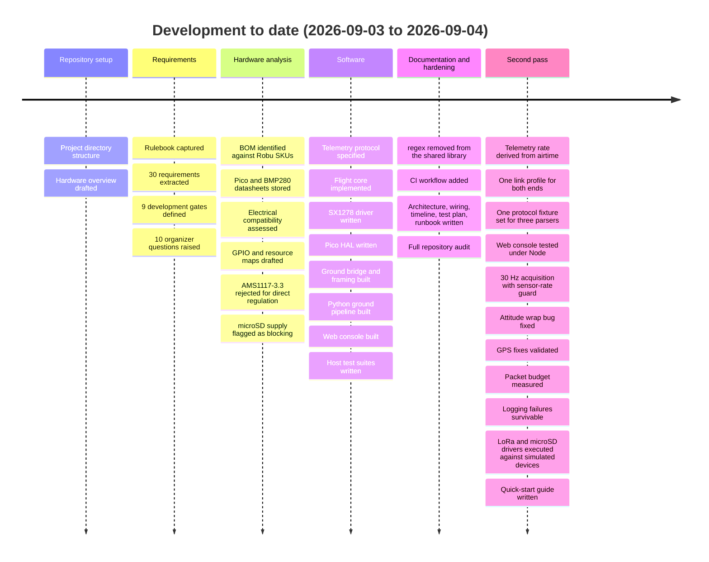
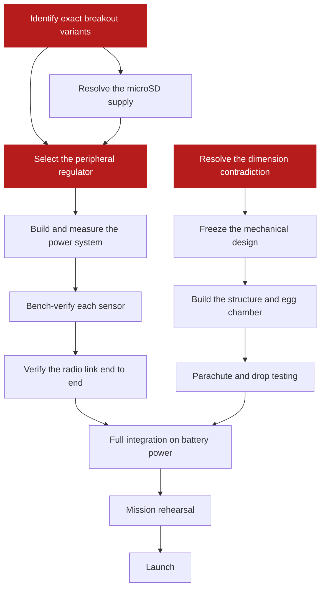

# Project Timeline

Where the project has been, where it stands today, and what has to happen next.

**Status date: 2026-09-04.**

> [!NOTE]
> No competition deadline appears in the supplied rulebook text, so the forward plan is
> written in **phases and gates, not calendar dates**. Deadlines are open question 9 in
> [requirements.md](../requirements/requirements.md#open-questions-for-organizers) and must
> be confirmed with the organizers before this page can carry real dates.

---

## Contents

- [At a glance](#at-a-glance)
- [What has happened](#what-has-happened)
- [Phase plan](#phase-plan)
- [Development gates](#development-gates)
- [Critical path](#critical-path)
- [Blocked work](#blocked-work)
- [Risk register](#risk-register)

---

## At a glance

| Phase | Scope | Status |
|---|---|---|
| 0 · Project setup | Repository, structure, rulebook capture | ✅ Complete |
| 1 · Requirements | Requirement extraction, gap analysis, gates, organizer questions | ✅ Complete |
| 2 · Hardware study | BOM identification, datasheets, compatibility and resource analysis | ✅ Complete |
| 3 · Software | Flight core, telemetry protocol, ground station, web console, test suites | ✅ Complete on host |
| 4 · Documentation | Architecture, wiring, timeline, test plan, runbook, audit | ✅ Complete |
| 5 · Procurement + bring-up | Verify boards, resolve power, bench each subsystem | ⬜ Not started — **blocking** |
| 6 · Electrical build | Regulator, switch, LED, divider, PCB, harness | ⬜ Not started |
| 7 · Mechanical build | Structure, egg chamber, parachute, recovery | ⬜ Not started |
| 8 · Integration + flight test | Full-system, drop and range testing | ⬜ Not started |
| 9 · Competition | Launch, analysis, reports, media | ⬜ Not started |

Phases 0–4 are complete. **Every remaining phase depends on hardware verification that has
not begun.**

---

## What has happened

All development so far is recorded in the repository history.

### Commit history

| Commit | Date | Content |
|---|---|---|
| `c6c500b` | 2026-09-03 | Initial project structure |
| `e71706c` | 2026-09-03 | Hardware project overview |
| `a915247` | 2026-09-03 | Competition requirements and rulebook |
| `27495df` | 2026-09-03 | Initial CanSat software and engineering documentation |
| `9c23a88` | 2026-09-04 | Flight software, ground station and host test suites |
| `f7c75a7` | 2026-09-04 | Full documentation set and CI |
| `486daa3` | 2026-09-04 | Telemetry rate derived from LoRa airtime; single link profile |
| `e188b7d` | 2026-09-04 | One protocol fixture set across all three parsers; web console tested |
| `942aa7d` | 2026-09-04 | 30 Hz acquisition, after making the sensors able to feed it |
| `dc0b10e` | 2026-09-04 | Quick-start guide |
| `0ab977e` | 2026-09-04 | Attitude blending across the ±180° seam; GPS fix validation |
| `3e70c6d` | 2026-09-04 | Real packet budget; optional-field degradation instead of truncation |
| `b2450a7` | 2026-09-04 | Ground station survives a failing log; raw log stays parseable |
| `9266816` | 2026-09-04 | LoRa driver executed against a fake register bank |
| `83cad81` | 2026-09-04 | microSD driver executed against a simulated card |
| `6356709` | 2026-09-04 | IMU range encoding made host-testable |

Eleven of these are a second development pass over software that already built and passed:
a rate that the radio could not have delivered, three parsers that disagreed, sensors that
could not feed their own loop, an attitude filter wrong at the wrap, a packet budget below
the real packet, a logger that could take reception down with it, and two SPI drivers that
had never executed. All are recorded in [CHANGELOG.md](../../CHANGELOG.md) and in the
[audit findings](../audit/2026-09-04-repository-audit.md#findings) as F-12 to F-28.

### What exists now

| Area | Delivered | Evidence |
|---|---|---|
| Telemetry protocol | Rulebook format, strict parser, precision rules, optional fields | [telemetry-protocol.md](../design/telemetry-protocol.md) |
| Flight core | Controller, state machine, scheduler, orientation, calibration, faults, builder, block log, NMEA parser, link profile, airtime and sensor-rate guards | 36 C++ suites, 537 assertions |
| Sensor drivers | MPU-9250, BMP280, NEO-6M | Compile-checked against SDK stubs; register encodings and timing model host-tested |
| Ground bridge | Continuous RX, CRC framing, status lines, watchdog | Framing unit-tested |
| Ground software | Transport, parser, validator, health, logger, orchestrator, Tk dashboard, CLI, end-to-end trace | 76 Python tests |
| Web console | Framing, parser, validator and link health extracted from `index.html` and run under Node | 30 Node tests |
| SPI drivers | LoRa radio and microSD command sequences against simulated devices | 675 assertions |
| Tooling | LoRa time-on-air calculator used for the packet-rate decision | 33 Python tests |
| Web console UI | Single-file console with demo, file replay and Web Serial | Rendering verified by hand in a browser |
| Documentation | Requirements, hardware, electrical, protocol, architecture, wiring, testing, operations | This directory |

---

## Phase plan

```mermaid
gantt
    title Forward plan — sequence and dependencies, not calendar dates
    dateFormat X
    axisFormat Phase %s

    section Blocking
    Procurement verification        :crit, p5a, 0, 2
    Power architecture resolved     :crit, p5b, after p5a, 2
    Subsystem bench bring-up        :crit, p5c, after p5b, 3

    section Electrical
    Switch, LED, divider            :p6a, after p5c, 2
    PCB layout and assembly         :p6b, after p6a, 3
    Harness and cable management    :p6c, after p6b, 1

    section Mechanical
    Structure and layout            :p7a, after p5a, 3
    Egg chamber                     :p7b, after p7a, 2
    Parachute and deployment        :p7c, after p7a, 3
    Drop testing                    :p7d, after p7c, 2

    section Integration
    Full-system integration         :p8a, after p6c, 2
    Range and link testing          :p8b, after p8a, 2
    Descent-rate verification       :p8c, after p7d, 2
    Mission rehearsal               :p8d, after p8b, 2

    section Competition
    Preliminary report              :p9a, after p8a, 2
    Launch                          :milestone, p9b, after p8d, 0
    Analysis within 4 hours         :p9c, after p9b, 1
    Final report and media          :p9d, after p9c, 2
```

### Phase 5 — Procurement verification and bring-up *(blocking everything else)*

- Photograph and identify every purchased breakout; record the exact variant
- Confirm supply voltage, logic levels, regulators, level shifters, pull-ups and pinouts
- ~~Resolve the microSD reader supply~~ — done: the delivered module is 2.6–3.6 V and runs from the 3.3 V rail. Measure its write-transient current against the regulator instead
- Verify the antenna and IPEX cable connector genders
- Follow the [bring-up order](../design/wiring.md#bring-up-order), one subsystem at a time

### Phase 6 — Electrical build

- Select the peripheral regulator with a measured load budget
- Add the manual ON/OFF switch and the immediate power LED (both mandatory, neither in the BOM)
- Design, build and measure the battery divider, then set `battery_divider_ratio`
- Lay out the PCB; the rulebook awards points for original design, routing and assembly quality

### Phase 7 — Mechanical build

- Structure sized to the resolved dimension limit (currently contradictory — organizer question 1)
- Cushioned, secure egg chamber
- Parachute and deployment for a descent rate of no more than 5 m/s
- Drop testing for egg survival and structural integrity

### Phase 8 — Integration and flight test

- Full-system integration on battery power
- Range and link testing at the launch configuration
- Descent-rate measurement
- End-to-end rehearsal following the [runbook](../operations/runbook.md)

### Phase 9 — Competition

- Preliminary report (excludes analysis), final report (includes it)
- Launch, then analysis inside the four-hour window
- Required photographs, video, and social-media posts tagging Physics Club, SVNIT

---

## Development gates

The nine gates are defined in
[requirements.md](../requirements/requirements.md#development-gates). Current position:

| Gate | Status | What is missing |
|---|---|---|
| 1 · Requirements locked | 🟠 Partial | Requirements extracted and gates defined, but ten organizer questions are unanswered — including the dimension and altitude contradictions |
| 2 · Electrical architecture approved | ⬜ Not passed | No regulator selected; module supplies unresolved |
| 3 · Power system tested | ⬜ Not passed | No switch, no LED, no divider, no measurement |
| 4 · Sensors individually verified | ⬜ Not passed | Drivers written and compile-checked; no hardware reads |
| 5 · Telemetry verified | ⬜ Not passed | Format and rate verified in software; no radio link tested |
| 6 · Ground station verified | ⬜ Not passed | Pipeline tested against files and loopback; never against a real bridge |
| 7 · Mechanical and recovery verified | ⬜ Not passed | Nothing built |
| 8 · Full system integration | ⬜ Not passed | Blocked by gates 2–7 |
| 9 · Competition readiness | ⬜ Not passed | Blocked by gate 8 |

---

## Critical path

Three items gate everything: **exact board identification**, **regulator selection**, and
**the organizers' answer on dimensions**. Nothing downstream can be frozen until they
resolve.

---

## Blocked work

| Blocked | Blocked by | Owner |
|---|---|---|
| Mechanical design freeze | Contradictory dimension limits (organizer questions 1 and 4) | Organizers |
| Descent-system sizing | Launch altitude contradiction, 100 ft vs 150 ft (question 3) | Organizers |
| Yaw compliance claim | No definition of valid yaw data (question 6). The vehicle can now produce an absolute magnetic yaw, but only after an airframe calibration that has not yet been performed | Organizers |
| Radio parameter freeze | Only the sync words are prescribed (question 7) | Organizers |
| Peripheral rail design | Exact breakout documentation | Team |
| microSD integration | MISO tri-state behaviour on the shared bus, and the write-transient current | Team |
| Battery-life estimate | Regulator selection plus a measured load | Team |
| Report and media schedule | No deadlines in the supplied text (question 9) | Organizers |

---

## Risk register

| Risk | Impact | Current mitigation |
|---|---|---|
| microSD write transient browns out the shared 3.3 V regulator | Loses onboard logging, or resets the flight computer | Supply voltage resolved (2.6–3.6 V module on the 3.3 V rail); the write transient is still unmeasured and shares a regulator with the radio. SD failure already degrades gracefully in firmware |
| Magnetometer calibration never performed, or performed on a bare board | Yaw stays relative, or an absolute heading is claimed that is wrong by a constant | Calibration ships invalid and the vehicle reports `YR-G` until a real sweep is loaded; the sweep is a named bring-up gate |
| No regulator selected | Blocks the whole power build | AMS1117-3.3 assessed and rejected with reasoning recorded; replacement still open |
| Yaw may be judged non-compliant if a relative angle is not accepted | Mandatory field may be judged non-compliant | The MPU-9250's magnetometer makes an absolute magnetic yaw available once the airframe is calibrated; until then yaw is relative. Every packet declares which it is (`YR-M` / `YR-G`), so an absolute heading is never claimed without one |
| Antenna connector gender mismatch | Cannot connect the RF chain | Flagged for physical verification before assembly |
| Dimension contradiction unresolved | Mechanical rework, or disqualification on size | No value invented locally; escalated to the organizers |
| Radio link untested at range | Telemetry loss during flight | Link testing is a named gate; firmware already recovers from radio failure with bounded back-off |
| Hardware bring-up not started | Compresses every later phase | Bring-up is documented and sequenced so it can start the moment parts are verified |

---

Related: [requirements.md](../requirements/requirements.md) ·
[test-plan.md](../testing/test-plan.md) · [runbook.md](../operations/runbook.md) ·
[CHANGELOG.md](../../CHANGELOG.md)
