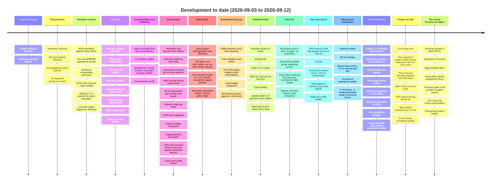
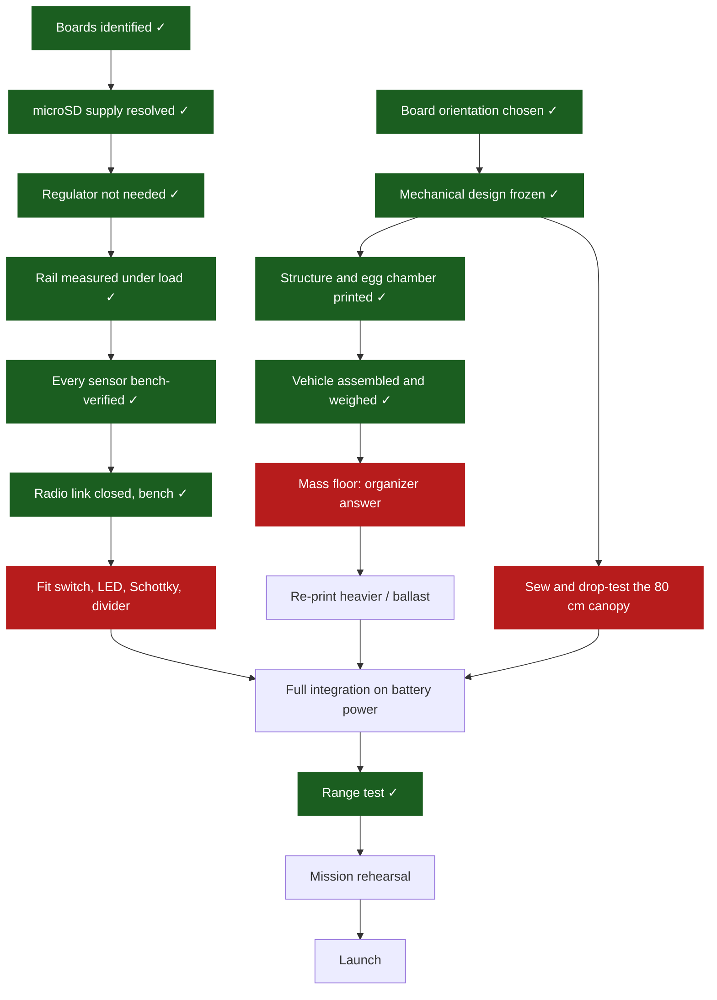

# Project Timeline

Where the project has been, where it stands today, and what has to happen next.

**Status date: 2026-09-12.**

> [!NOTE]
> No competition deadline appears in the supplied rulebook text, so the forward plan is
> written in **phases and gates, not calendar dates**. Deadlines are open question 9 in
> [requirements.md](../requirements/requirements.md#open-questions-for-organizers) and must
> be confirmed with the organizers before this page can carry real dates.

> [!IMPORTANT]
> **The centre of gravity has moved twice.** For its first four days everything was blocked on
> hardware; the board was then built and every remaining blocker became mechanical. **As of
> 2026-09-12 the structure is printed, the vehicle is assembled, and it has been weighed at
> 280 g.** What is left is a parachute, a drop test, four small parts on the power path, and
> flights — plus one organizer answer that decides whether the structure is re-printed heavier.

---

## Contents

- [At a glance](#at-a-glance)
- [What has happened](#what-has-happened)
- [Phase plan](#phase-plan)
- [Development gates](#development-gates)
- [Critical path](#critical-path)
- [Blocked work](#blocked-work)
- [Risk register](#risk-register)

---

## At a glance

| Phase | Scope | Status |
|---|---|---|
| 0 · Project setup | Repository, structure, rulebook capture | ✅ Complete |
| 1 · Requirements | Requirement extraction, gap analysis, gates, organizer questions | ✅ Complete |
| 2 · Hardware study | BOM identification, datasheets, compatibility and resource analysis | ✅ Complete |
| 3 · Software | Flight core, telemetry protocol, ground station, web console, test suites | ✅ Complete on host |
| 4 · Documentation | Architecture, wiring, timeline, test plan, runbook, audit | ✅ Complete |
| 5 · Procurement + bring-up | Verify boards, resolve power, bench each subsystem | 🟢 **Substantially complete.** Every board inspected, the power question closed by measurement, gates 3–7 passed on the soldered board |
| 6 · Electrical build | Regulator, switch, LED, divider, PCB, harness | 🟠 **Board built and working.** No regulator is needed. Switch, LEDs, Schottky and divider not fitted |
| 7 · Mechanical build | Structure, egg chamber, parachute, recovery | 🟠 **Structure printed and assembled 2026-09-12.** `Cansat_D1` in white PETG, electronics mounted, egg chamber fitted, **weighed at 280 g**. Three static-stress studies, envelope confirmed with the organizers, canopy sized at 80.0 cm. **Still open: the parachute, the drop test, and 105–135 g of missing mass** |
| 8 · Integration + flight test | Full-system, drop and range testing | 🟠 **Bench link closed.** No range test, no drop test, never run on battery |
| 9 · Competition | Launch, analysis, reports, media | ⬜ Not started |

Phases 0–4 are complete and phase 5 is substantially so. **What remains is a parachute, a
drop test, four small parts on the power path, and flights** — and a decision, waiting on the
organizers, about whether a 280 g vehicle has to be made heavier.

---

## What has happened

All development so far is recorded in the repository history.

### Commit history

Over two hundred commits in seven days. Listing them here would duplicate
[CHANGELOG.md](../../CHANGELOG.md), which carries the reasoning as well as the subject line,
so this is the shape of it instead:

| Days | Roughly what happened | Where the detail is |
|---|---|---|
| **2026-09-03 → 04** | The whole software stack, written and tested on the host, then a second pass over it that found nine defects in code that already built and passed — a telemetry rate the radio could not have delivered, three parsers that disagreed, sensors that could not feed their own loop, an attitude filter wrong at the ±180° seam, a packet budget below the real packet, and two SPI drivers that had never executed | [2026-09-04 audit](../audit/2026-09-04-repository-audit.md#findings), F-12 to F-28 |
| **2026-09-04 → 05** | Parts arrive and are photographed, identified and inspected one board at a time. **The IMU is not the part that was ordered.** The microSD reader turns out to be a 3.3 V board, which closes the blocker that had held up the power design for days | [receiving-inspection.md](../hardware/receiving-inspection.md) |
| **2026-09-05** | Breadboard bring-up. The radio answers and transmits, the card initialises and writes, and two separate intermittents both turn out to be one long supply jumper | [bring-up-record.md](../testing/bring-up-record.md), F-5 to F-10 |
| **2026-09-06** | The board is designed rather than assembled: floorplan to scale, coupling analysis, decoupling sized against a failure that actually happened, sixteen gated build steps | [assembly-procedure.md](../hardware/assembly-procedure.md) |
| **2026-09-07** | The board is built, and gates 3 through 7 pass on it. **The first radio link closes** — 66 packets, no gaps. Running the flight image finds a chip-select ordering bug no host test could have | [bring-up-record.md](../testing/bring-up-record.md), F-12 to F-19 |
| **2026-09-08** | Telemetry to 1.43 Hz, an authorised erase command that is inert by construction, GPS gated on satellite count and HDOP, and the first mechanical and mission analysis this project has had | This document, [concept-of-operations.md](../mission/concept-of-operations.md) |
| **2026-09-09** | **The mechanical design arrives and the vehicle stops being an idea with a board in it.** `Cansat_D1` modelled and exported, the organizers confirm a 12 cm *sided box* so it fits, PETG chosen and argued, three static-stress studies run, the electronics weighed for the first time at **151.299 g**, and the print orientation decided. The mass finding runs the other way: **coming in under the 450 g floor is now likelier than exceeding the cap** | [mechanical/README.md](../../mechanical/README.md), [simulation/README.md](../../mechanical/simulation/README.md) |
| **2026-09-10 → 11** | **The first range test, and the discovery that the organizers' ground station had barely heard the vehicle.** Their receiver was given to the team: an ESP32 on sync word `0xA5` that discards any packet over 200 bytes. The vehicle was on `0xF3`. Both Picos move to `0xA5`, the packet budget drops to 200 bytes, GPS and sound go **on the air** rather than to the card — the organizers having ruled that only transmitted telemetry counts for extra-sensor points — and a `MAX_RATE` uplink command is measured at **3.11 Hz with 1 packet in 544 lost** | [max-rate-command.md](../design/max-rate-command.md), rows 8.17 and 8.18 |
| **2026-09-12** | **The structure comes back from the printer and the vehicle becomes a physical object.** White PETG, electronics mounted, egg chamber fitted, and **280 g on a scale** — the first mechanical measurement the project has had. The print came in at **≈ 128.7 g against a 193 g upper bound**, a 33 % overshoot in the estimate, and the mass risk that inverted on 09-09 **roughly doubled**: the projection is now 315–345 g against a 450 g floor. The final project report is written | [mechanical/README.md](../../mechanical/README.md#mass-budget), [final-report.md](final-report.md) |

**Two things are worth noticing about that list.** Every one of those days ends with a
finding, and most of the findings came from *running* something rather than from reading it.
And the defects that a host test suite of five thousand assertions could not find — the
chip-select ordering, the supply jumper, the wrong IMU — are all of the kind that only
appear when a real board is powered up.

### What exists now

| Area | Delivered | Evidence |
|---|---|---|
| Telemetry protocol | Rulebook format, strict parser, precision rules, optional fields | [telemetry-protocol.md](../design/telemetry-protocol.md) |
| Flight core | Controller, state machine, scheduler, orientation, calibration, faults, builder, block log, NMEA parser, sound level, command authorisation, link profile, airtime and sensor-rate guards | 113 C++ suites, 4107 assertions |
| Sensor drivers | IMU (MPU-9250 family), BMP280, NEO-6M | Register encodings and timing model host-tested; the IMU, barometer and GPS have since read on hardware. The delivered IMU is a six-axis MPU-6500, so the magnetometer path is dormant ([F-1](../hardware/receiving-inspection.md#findings)) |
| Ground bridge | Continuous RX, CRC framing, status lines, watchdog | Framing unit-tested |
| Ground software | Transport, parser, validator, health, logger, orchestrator, Tk dashboard, CLI, end-to-end trace | 140 Python tests |
| Web console | Framing, parser, validator and link health extracted from `index.html` and run under Node | 71 Node tests |
| SPI drivers | LoRa radio and microSD command sequences against simulated devices | 772 assertions |
| Tooling | LoRa airtime calculator, STEP dimension reader, netlist and drawing generators, SD-card preparation, flight-log reader, documentation-claim checker | 49 Python tests |
| Simulations | Descent model: canopy sizing, descent time and telemetry yield | 40 Python tests |
| Web console UI | Single-file console with demo, file replay and Web Serial | Rendering verified by hand in a browser |
| Vehicle board | 100 × 100 mm perfboard, seven modules, built and working | [bring-up-record.md](../testing/bring-up-record.md), gates 3–7 |
| Generated artifacts | Netlist from `BoardPins`, board layout, wiring schedule, power path, rulebook envelope | All regenerable; the netlist refuses to build if it disagrees with the firmware |
| Documentation | Requirements, mission, hardware, electrical, protocol, architecture, wiring, testing, operations, scoring | This directory, plus per-subsystem summaries in [`avionics/`](../../avionics/README.md), [`electrical/`](../../electrical/README.md) and [`mechanical/`](../../mechanical/README.md) |

---

## Phase plan

```mermaid
gantt
    title Forward plan — sequence and dependencies, not calendar dates
    dateFormat X
    axisFormat Phase %s

    section Blocking
    Procurement verification        :crit, p5a, 0, 2
    Power architecture resolved     :crit, p5b, after p5a, 2
    Subsystem bench bring-up        :crit, p5c, after p5b, 3

    section Electrical
    Switch, LED, divider            :p6a, after p5c, 2
    PCB layout and assembly         :p6b, after p6a, 3
    Harness and cable management    :p6c, after p6b, 1

    section Mechanical
    Structure and layout            :p7a, after p5a, 3
    Egg chamber                     :p7b, after p7a, 2
    Parachute and deployment        :p7c, after p7a, 3
    Drop testing                    :p7d, after p7c, 2

    section Integration
    Full-system integration         :p8a, after p6c, 2
    Range and link testing          :p8b, after p8a, 2
    Descent-rate verification       :p8c, after p7d, 2
    Mission rehearsal               :p8d, after p8b, 2

    section Competition
    Preliminary report              :p9a, after p8a, 2
    Launch                          :milestone, p9b, after p8d, 0
    Analysis within 4 hours         :p9c, after p9b, 1
    Final report and media          :p9d, after p9c, 2
```

### Phase 5 — Procurement verification and bring-up 🟢 *substantially complete*

- ~~Photograph and identify every purchased breakout~~ — done, and it found that the IMU is an MPU-6500 rather than the MPU-9250 ordered
- ~~Confirm supply voltage, logic levels, regulators, level shifters, pull-ups and pinouts~~ — done
- ~~Resolve the microSD reader supply~~ — done: the delivered board has no regulator, its supply pin is printed `3V3`, and it runs from the 3.3 V rail
- ~~Verify the antenna and IPEX cable connector genders~~ — done, and mated
- ~~Bench each subsystem in the [bring-up order](../design/wiring.md#bring-up-order)~~ — gates 3, 4, 5, 6 and 7 all pass on the soldered board
- **Still open:** a GPS fix outdoors, the series current draw, and the rail with the radio and card drawing together

### Phase 6 — Electrical build 🟠 *board built, power path incomplete*

- ~~Select the peripheral regulator~~ — **none is needed.** The Pico's own rail was measured carrying every load
- Fit the manual ON/OFF switch and the immediate power LED — both mandatory, both held, neither fitted
- Buy and fit the Schottky diode. **The only outstanding purchase in the project**, ~₹10
- Build and measure the battery divider, then set `battery_divider_ratio`
- Optional but scored: lay out and order a PCB. **Not 100 × 100 mm** — see [electrical/PCB](../../electrical/PCB/README.md)

### Phase 7 — Mechanical build 🟠 *designed and simulated, out for printing*

- ~~Structure sized to **21 cm (+7 cm) × 12 cm**~~ — done: `Cansat_D1`, 118.5 × 115.0 × 110.0 mm, **printed in white PETG and assembled 2026-09-12**
- ~~Decide the board orientation~~ — settled by the design: the 115 × 110 mm section takes the 100 mm board flat
- ~~Confirm how "12 cm across" is measured~~ — **organizers confirmed a 12 cm sided box, 2026-09-09**
- ~~Decide and record the print orientation~~ — **decided 2026-09-09: printed as modelled, on its base.** Layers stack vertically, so the weak directions are tension normal to the layers and interlayer shear, and the derated safety factor is still **6 to 13**
- **Run the base-first load case.** All three studies load horizontally, and a vehicle hanging under a parachute lands along the build axis — which is exactly the print's weak direction. The one load case not run
- ~~**Weigh the printed structure.**~~ **Done 2026-09-12: the assembled vehicle is 280 g** without a parachute, so the structure and egg chamber together are **≈ 128.7 g** against a 193 g estimate. The projected all-up is **315–345 g**, entirely below the 450 g floor — see [the mass budget](../../mechanical/README.md#mass-budget)
- **Decide whether to re-print heavier**, once the organizers say whether 450 g binds. A high-infill re-print recovers at most ~64 g of a 105–135 g gap, so ballast is probably needed as well
- **Check the printed envelope with calipers.** Every dimension the repository holds is read from the STEP, and a printed part is not its model. 2.5 mm per side is the whole clearance
- ~~Cushioned, secure egg chamber~~ — **built and fitted 2026-09-12**, inside the 280 g. PAY-002 is a separate requirement from PAY-001, it carries the +7 cm allowance, and section D scores use of permitted volume
- Parachute: **80.0 cm flat canopy**, sized at 550 g on a hot day by [`simulations/descent.py`](../../simulations/descent.py). Vented or cruciform, and **not tightly packed** — REC-003 and REC-004
- ~~Weigh the electronics~~ — done 2026-09-09: **151.299 g**, and it overran the estimate by 26 %
- Drop testing for structural integrity, and to measure the drag coefficient the model assumes

### Phase 8 — Integration and flight test

- Full-system integration on battery power
- Range and link testing at the launch configuration
- Descent-rate measurement
- End-to-end rehearsal following the [runbook](../operations/runbook.md)

### Phase 9 — Competition

- Preliminary report (excludes analysis), final report (includes it)
- Launch, then analysis inside the four-hour window
- Required photographs, video, and social-media posts tagging Physics Club, SVNIT

---

## Development gates

The nine gates are defined in
[requirements.md](../requirements/requirements.md#development-gates). Current position:

| Gate | Status | What is missing |
|---|---|---|
| 1 · Requirements locked | 🟠 Partial | Requirements extracted and gates defined. **The dimension and altitude contradictions are resolved** by the 2026 revision — 21 cm (+7 cm) × 12 cm, 500 g ± 10 %, 100 ft from a drone. Six organizer questions remain, and the one that matters most is whether a relative yaw is acceptable, because the delivered part cannot produce anything else |
| 2 · Electrical architecture approved | 🟠 Partial | **Resolved and built, except the battery end.** No regulator is fitted and none is needed — every load runs from the Pico's `3V3(OUT)`, measured at **3.28–3.29 V under 45 back-to-back transmits** and 3.28–3.30 V at 100 % write duty. Missing: the switch, the divider, and the Schottky that stops USB back-powering the pack |
| 3 · Power system tested | 🟠 Partial | **The rail is measured** under each load individually and holds. Missing: the switch, the LEDs, the divider, the series-current figure that four sessions have skipped, and the rail under radio **and** card simultaneously |
| 4 · Sensors individually verified | 🟠 Partial | **Both I2C sensors verified together on the soldered board 2026-09-07** — `0x68` and `0x76` on one bus, `0x0C` correctly absent, rates, biases and noise recorded. GPS delivers all six NMEA sentences with zero checksum errors. The microSD writes and sustains ~300 writes/s. Missing: a GPS fix outdoors, the sound module, and [F-13](../testing/bring-up-record.md#findings)'s gyro drift across temperature |
| 5 · Telemetry verified | 🟠 Partial | **A link has been established.** 66 packets, `P-001` to `P-066`, no gaps and no duplicates, sync word `0xF3`, on 2026-09-07. Transmit is proven on the soldered board: 55 transmits, zero failures, airtime within 1.8 % of the model on both packet sizes, and channel occupancy 33.4 % typical. Missing: the `0xA5` sync word, which is a reflash of *both* Picos; a loss figure over the 500-packet window the row asks for rather than 66; and the lift, flight, landing and post-impact transmissions, which need a flight |
| 6 · Ground station verified | 🟠 Partial | The bridge image runs on its Pico, enumerates over USB and emits status frames at a verified 1 Hz with byte-exact CRC framing, and **the receive pipeline has now seen 66 packets that arrived over the air** — parsed, validated and counted, with the bridge's `frames` counter incrementing once per packet and `dropped=0` throughout. Missing: compatibility with the official dual ground stations, which only the organizers or the venue can settle |
| 7 · Mechanical and recovery verified | 🟠 Partial | **The structure half is built.** `Cansat_D1` printed in white PETG, electronics mounted, egg chamber fitted, assembled vehicle **weighed at 280 g** — the first mechanical measurement in the project. Missing: the parachute, a drop test, a measured descent rate, a vertical impact case in simulation, calipers on the printed envelope, and the **105–135 g** that separates the vehicle from the mass floor if that floor binds |
| 8 · Full system integration | 🟠 Partial | A bench link and a range test have happened, and `MAX_RATE` was measured at 3.11 Hz. Blocked on the rest by gates 2, 3 and 7 — chiefly a parachute and running on the battery |
| 9 · Competition readiness | ⬜ Not passed | Blocked by gate 8 |

---

## Critical path

**The critical path is now the parachute and one email.** Every electronic item on it is
green, and so is the structure — it is printed, assembled and weighed. Three things gate the
rest:

1. **The canopy**, which nobody is waiting on. It is sized at 80.0 cm and stays compliant from
   315 g to 550 g, so it can be sewn before the mass question is settled.
2. **Whether 450 g binds**, which only the organizers can answer and which decides whether the
   structure is re-printed. **Ask it now** — a re-print has a lead time and the answer costs
   them a sentence.
3. **Four small parts on the power path**, of which exactly one still has to be bought.

**The longest single item is no longer the structure.** It is the drop test, because it is the
only thing that measures the drag coefficient the whole descent model rests on — and section C
scores the real descent, not the model.

---

## Blocked work

| Blocked | Blocked by | Owner |
|---|---|---|
| ~~Mechanical design freeze~~ | **Unblocked 2026-09-05.** The 2026 revision states 21 cm (+7 cm) × 12 cm on both pages | — |
| ~~Descent-system sizing~~ | **Unblocked 2026-09-05**, and **sized 2026-09-08**: an 80.0 cm flat canopy at 550 g on a hot day | — |
| ~~Peripheral rail design~~ | **Unblocked 2026-09-05** by inspection, then closed 2026-09-07 by measurement. No external regulator is needed | — |
| ~~microSD integration~~ | **Closed 2026-09-07.** MISO releases correctly across 200 interleaved rounds; the card writes and sustains ~300 writes/s | — |
| Yaw compliance claim | No definition of valid yaw data (question 6) — and the vehicle can no longer answer it either way: the delivered IMU has no magnetometer, so yaw is relative and declared `YR-G`. If an absolute yaw is required this becomes a procurement item, not a calibration one | Organizers |
| Radio parameter freeze | Only the sync words are prescribed (question 7) | Organizers |
| Report and media schedule | No deadlines in the supplied text (question 9) | Organizers |
| Battery-life estimate | The series current draw, which four bench sessions have skipped. The 3.3 V test link exists to make it a one-minute measurement | Team |
| ~~Landing detection on a drone profile~~ | **Unblocked 2026-09-08.** The descent gate closed [F-20](../testing/bring-up-record.md#findings). The thresholds stay PROVISIONAL until drop-test data tunes them | — |
| Anything on a battery | The switch and the Schottky. Until the diode is fitted, USB and the pack must never be connected at once | Team |
| ~~The whole of section C and D scoring~~ | **Partly unblocked 2026-09-12.** A structure exists, is assembled and is photographable, so section D's compactness, material, fabrication and build-quality marks are now available. Section C still needs a parachute and a descent | Team |
| **Whether the structure is re-printed** | The organizers, on whether 450 g is a floor or a nominal under a ceiling. The vehicle measures 280 g | Organizers |

---

## Risk register

| Risk | Impact | Current mitigation |
|---|---|---|
| ~~**[F-20](../testing/bring-up-record.md#findings): a landing declared under a hovering drone**~~ | ~~`MODE-` reads `RECOVERY` through the real descent~~ | **Closed 2026-09-08 by the descent gate**: a landing may not be declared until a vertical rate below −2 m/s has been held for a second during this `FLIGHT`. The same reproduction now lands three seconds after touchdown. Five tests, and `validate_config()` refuses thresholds that could overlap |
| **[F-12](../testing/bring-up-record.md#findings): the microSD intermittent nobody can name** | An empty flight log — the primary record, since only nine packets of the descent go over the air | Bounded, not closed: 3 failures in the first 4 runs, 0 in the 11 since, with the supply measured innocent. A static bench is the wrong test for a mechanical fault on a launched vehicle; provocation and vibration are |
| **Nine packets is the whole over-the-air descent dataset** | One lost packet is 11 % of the descent | The SD log runs at 30 Hz and carries more than the packet does. The rate has been raised to 1.43 Hz, which is as fast as the duty cap allows |
| Magnetometer calibration never performed, or performed on a bare board | Yaw stays relative, or an absolute heading is claimed that is wrong by a constant | Moot on the delivered MPU-6500 — there is no magnetometer to calibrate. Calibration ships invalid and the vehicle reports `YR-G`, which is honest rather than mitigated |
| ~~No regulator selected~~ | ~~Blocks the whole power build~~ | **Closed 2026-09-07.** None is needed: the Pico's own rail held 3.28–3.29 V through 45 back-to-back transmits and 3.28–3.30 V at 100 % write duty |
| ~~microSD write transient browns out the shared rail~~ | ~~Loses onboard logging~~ | **Closed 2026-09-07** by measurement, and by the decoupling that [F-10](../testing/bring-up-record.md#findings) forced. The radio-and-card-together case is still untested |
| **The drag coefficient the canopy is sized against is unmeasured** | A descent above 5 m/s, which is a scored requirement | The model sweeps every canopy type and the spread is ~10 % on diameter; sizing is at the pessimistic end and at the top of the mass tolerance. Only a drop test closes it |
| ~~Nothing has been weighed~~ | ~~The mass budget is vendor figures~~ | **Closed 2026-09-12.** Every mass in the budget is now measured or derived from a measurement: electronics **151.299 g**, assembled vehicle **280 g**. **Both estimates they replaced were wrong by tens of grams** — the avionics estimate by 31 g low, the structure estimate by 64 g high — and in opposite directions, which is the argument for the scale over the spreadsheet |
| Yaw may be judged non-compliant if a relative angle is not accepted | Mandatory field may be judged non-compliant | **Raised by F-1:** the delivered IMU is a six-axis MPU-6500, so this vehicle transmits a relative yaw and declares it `YR-G`. The nine-axis path is implemented and tested and would produce `YR-M` on a real MPU-9250. Mitigation is procurement — a genuine nine-axis part — or an organizer ruling that a declared relative yaw is acceptable |
| Antenna connector gender mismatch | Cannot connect the RF chain | Flagged for physical verification before assembly |
| Dimension contradiction unresolved | Mechanical rework, or disqualification on size | No value invented locally; escalated to the organizers |
| Radio link untested at range | Telemetry loss during flight | Link testing is a named gate; firmware already recovers from radio failure with bounded back-off |
| ~~Hardware bring-up not started~~ | ~~Compresses every later phase~~ | **Closed.** Gates 3–7 pass on the soldered board and the link has closed once |
| ~~**Mechanical build not started**~~ | ~~It is the only thing compressing the schedule~~ | **Closed 2026-09-12.** The structure is printed in white PETG, the electronics are mounted, the egg chamber is fitted, and the vehicle is weighed at 280 g |
| **The vehicle is 105–135 g under the mass floor** | If GEN-005's 450 g is a floor rather than a nominal, an underweight vehicle is out of the band on a limit whose breach is a disqualification — and this one misses it by more than a fifth | **Bounded but not closed, and it grew.** The as-built 280 g is measured; the 315–345 g projection adds a parachute and four small parts. Two routes: a high-infill re-print, worth at most ~64 g and buying strength at the same time, and ballast for the rest. **The blocking item is an organizer answer, not the work** — see [mechanical/README.md](../../mechanical/README.md#the-risk-did-not-just-materialise-it-grew) |
| **No parachute, and nothing has been dropped** | Section C scores the real descent, and the drag coefficient the 80 cm canopy is sized against is unmeasured. It is also the only test that says whether the printed structure survives an arrival | Canopy sized and compliant across 315–550 g, so it can be sewn now. Three static-stress studies say the structure has margin; none of them models a base-first landing, which is the load a parachute guarantees |
| **All three stress studies load horizontally** | A vehicle under a canopy lands base-first — along the build axis, which is the print's weak direction. The one load case never run, and the part is now printed | Open. The margin is large enough (≥ 15 capped, 6–13 derated) that this is a confirmation rather than a doubt, but it is a confirmation nobody has done |

---

Related: [requirements.md](../requirements/requirements.md) ·
[test-plan.md](../testing/test-plan.md) · [runbook.md](../operations/runbook.md) ·
[CHANGELOG.md](../../CHANGELOG.md)
