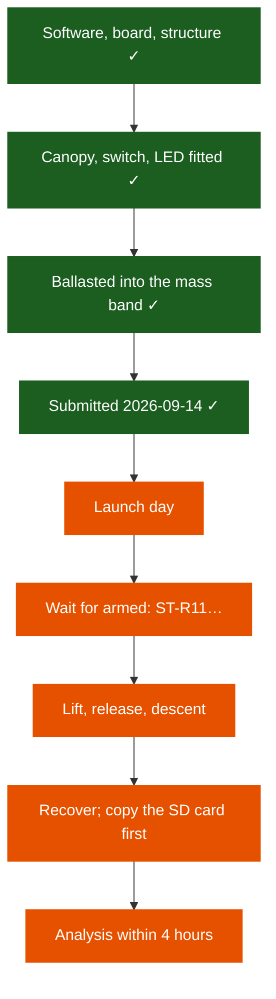

# Project Timeline

Where the project has been, where it stood at submission, and what is left.

**Status date: 2026-09-14 — submitted, launch pending.**

> [!IMPORTANT]
> **The CanSat and the final report were submitted on 2026-09-14** (reported by the team, 2026-09-14). Before
> submission the 80 cm canopy was sewn and fitted, the switch and power LED were fitted, and the
> vehicle was ballasted into the 450–550 g band. **The launch has not happened**, so every
> flight-dependent row on this page — descent, landing, analysis, results — is still open, and
> will stay open until it does.

---

## Contents

- [At a glance](#at-a-glance)
- [What has happened](#what-has-happened)
- [Phase plan](#phase-plan)
- [Development gates](#development-gates)
- [What is left](#what-is-left)
- [Open items](#open-items)
- [Risk register](#risk-register)

---

## At a glance

| Phase | Scope | Status |
|---|---|---|
| 0 · Project setup | Repository, structure, rulebook capture | ✅ Complete |
| 1 · Requirements | Requirement extraction, gap analysis, gates, organizer questions | ✅ Complete |
| 2 · Hardware study | BOM identification, datasheets, compatibility and resource analysis | ✅ Complete |
| 3 · Software | Flight core, telemetry protocol, ground station, web console, test suites | ✅ Complete on host |
| 4 · Documentation | Architecture, wiring, timeline, test plan, runbook, audit, final report | ✅ Complete |
| 5 · Procurement + bring-up | Verify boards, resolve power, bench each subsystem | ✅ **Complete for submission.** Every board inspected, the power question closed by measurement, bring-up gates 3–7 passed on the soldered board |
| 6 · Electrical build | Regulator, switch, LED, divider, PCB, harness | ✅ **Built.** No regulator needed; switch, power LED and divider fitted. **The Schottky was never fitted** |
| 7 · Mechanical build | Structure, egg chamber, parachute, recovery | ✅ **Built.** White PETG structure, egg chamber, 80 cm canopy, ballasted into the mass band. **Never drop-tested** |
| 8 · Integration + flight test | Full-system, drop and range testing | 🟠 **Partly done.** Bench link, one range test, `MAX_RATE` at 3.11 Hz. No drop test and no full rehearsal on record |
| 9 · Competition | Submission, launch, analysis, media | 🟠 **Submitted 2026-09-14.** Launch, four-hour analysis and results still ahead |

**Phases 0–7 are done; 8 and 9 are waiting on the launch.**

---

## What has happened

All development so far is recorded in the repository history.

```mermaid
timeline
    title Development to submission (2026-09-03 to 2026-09-14)
    Repository setup : Project directory structure : Hardware overview drafted
    Requirements : Rulebook captured : 30 requirements extracted : 9 development gates defined : 10 organizer questions raised
    Hardware analysis : BOM identified against Robu SKUs : Pico and BMP280 datasheets stored : Electrical compatibility assessed : GPIO and resource maps drafted : AMS1117-3.3 rejected for direct regulation : microSD supply flagged as blocking
    Software : Telemetry protocol specified : Flight core implemented : SX1278 driver written : Pico HAL written : Ground bridge and framing built : Python ground pipeline built : Web console built : Host test suites written
    Documentation and hardening : regex removed from the shared library : CI workflow added : Architecture, wiring, timeline, test plan, runbook written : Full repository audit
    Second pass : Telemetry rate derived from airtime : One link profile for both ends : One protocol fixture set for three parsers : Web console tested under Node : 30 Hz acquisition with sensor-rate guard : Attitude wrap bug fixed : GPS fixes validated : Packet budget measured : Logging failures survivable : LoRa and microSD drivers executed against simulated devices : Quick-start guide written
    Parts arrive : Every board photographed and identified : The IMU is an MPU-6500, not the MPU-9250 ordered : The microSD reader is a 3.3 V board, closing the supply blocker : Assembly procedure written, sixteen gated steps
    Breadboard bring-up : Radio answers 0x12 and transmits : Card initialises and writes : The 3V3 jumper explains both intermittents : Load budget measured : Decoupling chosen against a real failure
    Soldered board : Floorplan drawn to scale : Board built : Gates 3 to 7 pass : Both I2C sensors on one bus : Clean NMEA : Airtime within 1.8 percent of the model : Rail holds 3.28 V under every load
    First link : 66 packets end to end, no gaps, no duplicates : Microphone added as the additional sensor : Chip-select ordering bug found by running the flight image : Startup summary names what answered
    Rate and record : GPS moved to the log and the period to 700 ms : 1.43 Hz : Ground-to-vehicle erase, inert by construction : GPS gated on satellite count and HDOP : Flight log reader written
    Mission and mechanics : Descent model : 80 cm canopy : Board does not fit a 12 cm section laid flat : Concept of operations written : F-20 found - a landing declared under a hovering drone
    The design lands : Cansat_D1 modelled and exported : Organizers confirm a 12 cm sided box : PETG chosen and argued : Three static-stress studies : Electronics weighed at 151.299 g : Structure estimated at 193 g : Print orientation decided : Sync-word and radio-silence procedures written
    Range and rate : First range test : The organizers' station heard almost nothing on the test sync word : Their receiver discards packets over 200 bytes : Both Picos move to 0xA5 : GPS and sound go on the air : MAX_RATE measured at 3.11 Hz : A five-minute command window
    The vehicle becomes an object : Structure printed in white PETG : Electronics mounted : Egg chamber fitted : Assembled vehicle weighed at 280 g : The print came in 64 g under its upper bound : The mass risk inverts and doubles : Final project report written
    Submitted : Canopy sewn and fitted : Switch and power LED fitted : Ballasted into the 450-550 g band : CanSat and final report submitted
```

### Commit history

Over two hundred commits in seven days. Listing them here would duplicate
[CHANGELOG.md](../../CHANGELOG.md), which carries the reasoning as well as the subject line,
so this is the shape of it instead:

| Days | Roughly what happened | Where the detail is |
|---|---|---|
| **2026-09-03 → 04** | The whole software stack, written and tested on the host, then a second pass over it that found nine defects in code that already built and passed — a telemetry rate the radio could not have delivered, three parsers that disagreed, sensors that could not feed their own loop, an attitude filter wrong at the ±180° seam, a packet budget below the real packet, and two SPI drivers that had never executed | [2026-09-04 audit](../audit/2026-09-04-repository-audit.md#findings), F-12 to F-28 |
| **2026-09-04 → 05** | Parts arrive and are photographed, identified and inspected one board at a time. **The IMU is not the part that was ordered.** The microSD reader turns out to be a 3.3 V board, which closes the blocker that had held up the power design for days | [receiving-inspection.md](../hardware/receiving-inspection.md) |
| **2026-09-05** | Breadboard bring-up. The radio answers and transmits, the card initialises and writes, and two separate intermittents both turn out to be one long supply jumper | [bring-up-record.md](../testing/bring-up-record.md), F-5 to F-10 |
| **2026-09-06** | The board is designed rather than assembled: floorplan to scale, coupling analysis, decoupling sized against a failure that actually happened, sixteen gated build steps | [assembly-procedure.md](../hardware/assembly-procedure.md) |
| **2026-09-07** | The board is built, and gates 3 through 7 pass on it. **The first radio link closes** — 66 packets, no gaps. Running the flight image finds a chip-select ordering bug no host test could have | [bring-up-record.md](../testing/bring-up-record.md), F-12 to F-19 |
| **2026-09-08** | Telemetry to 1.43 Hz, an authorised erase command that is inert by construction, GPS gated on satellite count and HDOP, and the first mechanical and mission analysis this project has had | This document, [concept-of-operations.md](../mission/concept-of-operations.md) |
| **2026-09-09** | **The mechanical design arrives and the vehicle stops being an idea with a board in it.** `Cansat_D1` modelled and exported, the organizers confirm a 12 cm *sided box* so it fits, PETG chosen and argued, three static-stress studies run, the electronics weighed for the first time at **151.299 g**, and the print orientation decided. The mass finding runs the other way: **coming in under the 450 g floor is now likelier than exceeding the cap** | [mechanical/README.md](../../mechanical/README.md), [simulation/README.md](../../mechanical/simulation/README.md) |
| **2026-09-10 → 11** | **The first range test, and the discovery that the organizers' ground station had barely heard the vehicle.** Their receiver was given to the team: an ESP32 on sync word `0xA5` that discards any packet over 200 bytes. The vehicle was on `0xF3`. Both Picos move to `0xA5`, the packet budget drops to 200 bytes, GPS and sound go **on the air** rather than to the card — the organizers having ruled that only transmitted telemetry counts for extra-sensor points — and a `MAX_RATE` uplink command is measured at **3.11 Hz with 1 packet in 544 lost** | [max-rate-command.md](../design/max-rate-command.md), rows 8.17 and 8.18 |
| **2026-09-12** | **The structure comes back from the printer and the vehicle becomes a physical object.** White PETG, electronics mounted, egg chamber fitted, and **280 g on a scale** — the first mechanical measurement the project has had. The print came in at **≈ 128.7 g against a 193 g upper bound**, a 33 % overshoot in the estimate, and the mass risk that inverted on 09-09 **roughly doubled**: the projection is now 315–345 g against a 450 g floor. The final project report is written | [mechanical/README.md](../../mechanical/README.md#mass-budget), [final-report.md](final-report.md) |
| **2026-09-13 → 14** | **Finished and submitted.** The 80 cm canopy was sewn and fitted, the manual switch and the power LED went in, and the vehicle was ballasted into the 450–550 g band — which made the week's biggest open question, whether 450 g binds, stop mattering. **The CanSat and the final report were submitted on 2026-09-14.** All of this is reported by the team, 2026-09-14; the final mass, the canopy type and photographs of the finished vehicle are not in the repository | [requirements.md](../requirements/requirements.md), [mechanical/README.md](../../mechanical/README.md) |

**Two things are worth noticing about that list.** Every one of those days ends with a
finding, and most of the findings came from *running* something rather than from reading it.
And the defects that a host test suite of five thousand assertions could not find — the
chip-select ordering, the supply jumper, the wrong IMU — are all of the kind that only
appear when a real board is powered up.

### What exists now

| Area | Delivered | Evidence |
|---|---|---|
| Telemetry protocol | Rulebook format, strict parser, precision rules, optional fields | [telemetry-protocol.md](../design/telemetry-protocol.md) |
| Flight core | Controller, state machine, scheduler, orientation, calibration, faults, builder, block log, NMEA parser, sound level, command authorisation, link profile, airtime and sensor-rate guards | 113 C++ suites, 4107 assertions |
| Sensor drivers | IMU (MPU-9250 family), BMP280, NEO-6M | Register encodings and timing model host-tested; the IMU, barometer and GPS have since read on hardware. The delivered IMU is a six-axis MPU-6500, so the magnetometer path is dormant ([F-1](../hardware/receiving-inspection.md#findings)) |
| Ground bridge | Continuous RX, CRC framing, status lines, watchdog | Framing unit-tested |
| Ground software | Transport, parser, validator, health, logger, orchestrator, Tk dashboard, CLI, end-to-end trace | 140 Python tests |
| Web console | Framing, parser, validator and link health extracted from `index.html` and run under Node | 71 Node tests |
| SPI drivers | LoRa radio and microSD command sequences against simulated devices | 772 assertions |
| Tooling | LoRa airtime calculator, STEP dimension reader, netlist and drawing generators, SD-card preparation, flight-log reader, documentation-claim checker | 49 Python tests |
| Simulations | Descent model: canopy sizing, descent time and telemetry yield | 40 Python tests |
| Web console UI | Single-file console with demo, file replay and Web Serial | Rendering verified by hand in a browser |
| Vehicle board | 100 × 100 mm perfboard, seven modules, built and working | [bring-up-record.md](../testing/bring-up-record.md), gates 3–7 |
| Generated artifacts | Netlist from `BoardPins`, board layout, wiring schedule, power path, rulebook envelope | All regenerable; the netlist refuses to build if it disagrees with the firmware |
| Documentation | Requirements, mission, hardware, electrical, protocol, architecture, wiring, testing, operations, scoring | This directory, plus per-subsystem summaries in [`avionics/`](../../avionics/README.md), [`electrical/`](../../electrical/README.md) and [`mechanical/`](../../mechanical/README.md) |

---

## Phase plan

The plan that got the project to submission is complete; the Gantt chart it was drawn as is
no longer a forward plan and has been retired. What is left is short, and all of it happens at
or after the launch.

### Phases 5–7 — built ✅

- **Bring-up:** every board inspected and benched; bring-up gates 3–7 pass on the soldered board. **Never done:** a GPS fix outdoors, the series current draw, and the rail under radio and card together
- **Electrical:** no regulator needed; **switch, power LED and divider fitted**. **The Schottky was never fitted** — never connect USB with the battery in
- **Mechanical:** `Cansat_D1` printed in white PETG and assembled; egg chamber fitted; **80 cm canopy sewn and fitted**; **ballasted into the 450–550 g band**. **Never done:** a drop test, the base-first load case, calipers on the printed envelope

### Phase 8 — integration and flight test 🟠

- ~~Range and link testing~~ — one range test, 2026-09-10, which found the sync-word mismatch
- ~~Max-rate link at the bench~~ — **3.11 Hz, 1 packet in 544 lost**
- **Descent-rate measurement** — never made; the launch is the first
- **End-to-end rehearsal** following the [runbook](../operations/runbook.md) — none on record

### Phase 9 — competition 🟠

- ~~Final report~~ — **submitted 2026-09-14**
- **Launch**, following the [launch-day procedure](../operations/runbook.md#launch-day-procedure). **Do not let the drone lift until the vehicle reads armed** (`ST-R11…`)
- **Analysis inside the four-hour window** — the tooling exists; no analysis notebook has been written against sample data
- **Required photographs, video and social-media posts** tagging Physics Club, SVNIT — **not recorded in this repository** whether these were part of the submission

---

## Development gates

The nine gates are defined in
[requirements.md](../requirements/requirements.md#development-gates). Current position:

| Gate | Status | What is missing |
|---|---|---|
| 1 · Requirements locked | 🟠 Partial | Requirements extracted and gates defined. **The dimension and altitude contradictions are resolved** by the 2026 revision — 21 cm (+7 cm) × 12 cm, 500 g ± 10 %, 100 ft from a drone. Six organizer questions remain, and the one that matters most is whether a relative yaw is acceptable, because the delivered part cannot produce anything else |
| 2 · Electrical architecture approved | 🟠 Partial | **Built as designed except one part.** No regulator is needed — every load runs from the Pico's `3V3(OUT)`, measured at **3.28–3.29 V under 45 back-to-back transmits** and 3.28–3.30 V at 100 % write duty. Switch, power LED and divider fitted (reported by the team, 2026-09-14). **Missing at submission: the Schottky** that stops USB back-powering the pack |
| 3 · Power system tested | 🟠 Partial | **The rail is measured** under each load individually and holds. The switch and LED are fitted but no power-cycle test is recorded. Never taken: the divider's measurement (row 2.6), the series current, and the rail under radio **and** card simultaneously |
| 4 · Sensors individually verified | 🟠 Partial | **Both I2C sensors verified together on the soldered board 2026-09-07** — `0x68` and `0x76` on one bus, `0x0C` correctly absent, rates, biases and noise recorded. GPS delivers all six NMEA sentences with zero checksum errors. The microSD writes and sustains ~300 writes/s. Missing: a GPS fix outdoors and [F-13](../testing/bring-up-record.md#findings)'s gyro drift across temperature. The microphone is fitted and transmits as `SN-` |
| 5 · Telemetry verified | 🟠 Partial | **A link has been established.** 66 packets, `P-001` to `P-066`, no gaps and no duplicates, sync word `0xF3`, on 2026-09-07. Transmit is proven on the soldered board: 55 transmits, zero failures, airtime within 1.8 % of the model on both packet sizes, and channel occupancy 33.4 % typical. Missing: the `0xA5` sync word, which is a reflash of *both* Picos; a loss figure over the 500-packet window the row asks for rather than 66; and the lift, flight, landing and post-impact transmissions, which need a flight |
| 6 · Ground station verified | 🟠 Partial | The bridge image runs on its Pico, enumerates over USB and emits status frames at a verified 1 Hz with byte-exact CRC framing, and **the receive pipeline has now seen 66 packets that arrived over the air** — parsed, validated and counted, with the bridge's `frames` counter incrementing once per packet and `dropped=0` throughout. Missing: compatibility with the official dual ground stations, which only the organizers or the venue can settle |
| 7 · Mechanical and recovery verified | 🟠 **Built, not verified** | Structure, egg chamber and **80 cm canopy all built**, and the vehicle **ballasted into the 450–550 g band** (reported by the team, 2026-09-14). **Nothing about recovery was tested**: no drop, no measured descent rate, no deployment, no vertical impact case. The launch is the first test |
| 8 · Full system integration | 🟠 Partial | A bench link, a range test and `MAX_RATE` at 3.11 Hz. No full power-on-to-recovery rehearsal is recorded |
| 9 · Competition readiness | 🟠 **Submitted** | The vehicle and report were handed in on 2026-09-14. What is left is the launch itself |

---

## What is left

**Nothing blocks the launch.** Four things are worth doing before it, none of them required:

1. **Weigh the submitted vehicle** if a scale is available. The final mass is not on record, and
   it decides which modelled descent the flight is compared against.
2. **Write the analysis notebook now**, against `test-data/sample-mission.txt`. Four hours is
   not long to build graphs from nothing, and data analysis is worth 20 points.
3. **Rehearse the pad sequence once**: power on, command window, `MAX_RATE`, wait for
   `ST-R11…`. The one failure that loses the flight's state detection is a drone lifting
   inside the window.
4. **Never connect USB while the battery is in.** The Schottky was not fitted.

---

## Open items

| Item | Blocked by | Owner |
|---|---|---|
| Yaw compliance | No definition of valid yaw data — and the delivered IMU has no magnetometer, so yaw is relative (`YR-G` in the log). If an absolute yaw is required this is a procurement item | Organizers |
| Descent rate and drag coefficient | Never measured; no drop test was made | The launch |
| Structural survival of a landing | Never dropped | The launch |
| Battery-life estimate | The series current draw was never measured | Team |
| The submitted mass | Not recorded | Team |
| Build photographs and media | Not in the repository | Team |

---

## Risk register

| Risk | Impact | Current mitigation |
|---|---|---|
| ~~**[F-20](../testing/bring-up-record.md#findings): a landing declared under a hovering drone**~~ | ~~`MODE-` reads `RECOVERY` through the real descent~~ | **Closed 2026-09-08 by the descent gate**: a landing may not be declared until a vertical rate below −2 m/s has been held for a second during this `FLIGHT`. The same reproduction now lands three seconds after touchdown. Five tests, and `validate_config()` refuses thresholds that could overlap |
| **[F-12](../testing/bring-up-record.md#findings): the microSD intermittent nobody can name** | An empty flight log — the primary record, since only about twenty packets of the descent go over the air | Bounded, not closed: 3 failures in the first 4 runs, 0 in the 11 since, with the supply measured innocent. A static bench is the wrong test for a mechanical fault on a launched vehicle; provocation and vibration are |
| **About twenty packets is the whole over-the-air descent dataset** | One lost packet is 5 % of the descent | The SD log records the same rows, one per packet, but loses none to the link and carries more columns. After its command window the vehicle transmits at 3.11 Hz, which lost 1 packet in 544 at the bench |
| Magnetometer calibration never performed, or performed on a bare board | Yaw stays relative, or an absolute heading is claimed that is wrong by a constant | Moot on the delivered MPU-6500 — there is no magnetometer to calibrate. Calibration ships invalid and the vehicle reports `YR-G`, which is honest rather than mitigated |
| ~~No regulator selected~~ | ~~Blocks the whole power build~~ | **Closed 2026-09-07.** None is needed: the Pico's own rail held 3.28–3.29 V through 45 back-to-back transmits and 3.28–3.30 V at 100 % write duty |
| ~~microSD write transient browns out the shared rail~~ | ~~Loses onboard logging~~ | **Closed 2026-09-07** by measurement, and by the decoupling that [F-10](../testing/bring-up-record.md#findings) forced. The radio-and-card-together case is still untested |
| **The drag coefficient the canopy is sized against is unmeasured** | A descent above 5 m/s, which is a scored requirement | The canopy is sized at the pessimistic end — 550 g on a 35 °C day — so an in-band vehicle has margin by model. **No drop test was made before submission**; the launch is the measurement |
| ~~Nothing has been weighed~~ | ~~The mass budget is vendor figures~~ | **Closed 2026-09-12.** Every mass in the budget is now measured or derived from a measurement: electronics **151.299 g**, assembled vehicle **280 g**. **Both estimates they replaced were wrong by tens of grams** — the avionics estimate by 31 g low, the structure estimate by 64 g high — and in opposite directions, which is the argument for the scale over the spreadsheet |
| Yaw may be judged non-compliant if a relative angle is not accepted | Mandatory field may be judged non-compliant | **Raised by F-1:** the delivered IMU is a six-axis MPU-6500, so this vehicle transmits a relative yaw and declares it `YR-G`. The nine-axis path is implemented and tested and would produce `YR-M` on a real MPU-9250. Mitigation is procurement — a genuine nine-axis part — or an organizer ruling that a declared relative yaw is acceptable |
| ~~Antenna connector gender mismatch~~ | ~~Cannot connect the RF chain~~ | **Closed** — mated and radiating |
| ~~Dimension contradiction unresolved~~ | ~~Disqualification on size~~ | **Closed 2026-09-09** — the organizers confirmed a 12 cm sided box |
| Radio link at range under a canopy | Telemetry loss during the descent | One range test was made (2026-09-10); both Picos now fly the organizers' sync word. The firmware recovers from radio failure with bounded back-off |
| **A lift inside the command window** | Launch detection is off until the vehicle arms, so `FLIGHT`, `LANDED` and the post-impact window are never declared | Runbook and ConOps both say it: **wait for `ST-R11…` before the drone lifts** |
| **The Schottky was never fitted** | USB back-powers the LiPo if a cable goes in with the battery connected | Operational: never connect them together. Written into the runbook's launch-day checklist |
| ~~Hardware bring-up not started~~ | ~~Compresses every later phase~~ | **Closed.** Gates 3–7 pass on the soldered board and the link has closed once |
| ~~**Mechanical build not started**~~ | ~~It is the only thing compressing the schedule~~ | **Closed 2026-09-12.** The structure is printed in white PETG, the electronics are mounted, the egg chamber is fitted, and the vehicle is weighed at 280 g |
| ~~**The vehicle is 105–135 g under the mass floor**~~ | ~~Out of the band if 450 g binds~~ | **Closed before submission: ballasted into the 450–550 g band** (reported by the team, 2026-09-14). The final mass is not recorded — see [mechanical/README.md](../../mechanical/README.md#mass-budget) |
| **Nothing has been dropped** | The canopy has never opened and the printed structure has never absorbed an arrival | The canopy is built and sized with margin; three static-stress studies say the structure has margin, though none models a base-first landing. **The launch is the first test of both** |
| **All three stress studies load horizontally** | A vehicle under a canopy lands base-first — along the build axis, which is the print's weak direction. The one load case never run, and the part is now printed | Open. The margin is large enough (≥ 15 capped, 6–13 derated) that this is a confirmation rather than a doubt, but it is a confirmation nobody has done |

---

Related: [requirements.md](../requirements/requirements.md) ·
[test-plan.md](../testing/test-plan.md) · [runbook.md](../operations/runbook.md) ·
[CHANGELOG.md](../../CHANGELOG.md)
