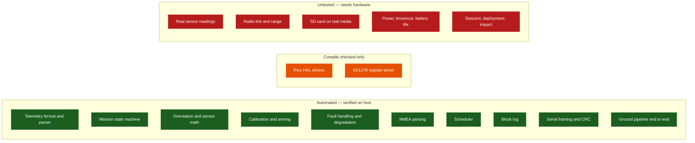

# Test Plan and Verification Record

What is tested automatically today, what each test proves, and what remains untested
because it needs hardware.

**Last run: 2026-09-04 — all suites pass.**

> [!IMPORTANT]
> Automated tests prove *logic*, not flight readiness. Nothing in this document
> establishes that a sensor reads correctly, that the radio link closes, or that the
> vehicle survives a flight. Those require hardware and are all still open.

---

## Contents

- [How to run everything](#how-to-run-everything)
- [Current results](#current-results)
- [Coverage map](#coverage-map)
- [C++ test suites](#c-test-suites)
- [Python test suites](#python-test-suites)
- [Cross-implementation consistency](#cross-implementation-consistency)
- [Not covered by automated tests](#not-covered-by-automated-tests)
- [Hardware test plan](#hardware-test-plan)
- [Mission test plan](#mission-test-plan)

---

## How to run everything

```bash
bash tools/build_host.sh
```

Compiles and runs every host suite — the flight smoke test, the full flight suite, the
ground framing tests — and then the Python ground-station suite. One command, one
pass/fail.

```bash
bash tools/check_pico_syntax.sh
```

Syntax-checks every `PICO_BUILD` branch against minimal SDK stubs
(`tools/pico_sdk_stubs/`). This is a compile check, **not** a firmware build.

Both scripts run on every push through [CI](../../.github/workflows/ci.yml).

---

## Current results

| Suite | Scope | Result |
|---|---|---|
| `flight_smoke_test` | Controller boot, first three packets, GPS parse | ✅ Passed |
| `flight_tests` | 37 suites across the whole flight core | ✅ **546 / 546 assertions** |
| `sx1278_tests` | The LoRa driver against a fake register bank | ✅ **94 / 94 assertions** |
| `sd_card_tests` | The microSD SPI driver against a simulated card | ✅ **581 / 581 assertions** |
| `ground_station_tests` | Framing encode, decode, CRC, resync | ✅ Passed |
| Python ground station | 8 modules | ✅ **80 / 80 tests** |
| Python tooling | `tools/link_budget.py` | ✅ **33 / 33 tests** |
| Documented claims | `tools/check_doc_claims.py` — pin numbers, rates, watchdogs, packet sizes, rulebook constants | ✅ **56 / 56 claims** |
| Web console (Node) | Framing, parser, validator, link health, extracted from `index.html` | ✅ **30 / 30 tests** |
| Pico syntax check | 10 translation units | ✅ All OK |

Translation units syntax-checked: flight `main`, `pico_hal`, `pico_radio`, `mpu6050`,
`bmp280`, `neo6m`, `sd_card`, `sd_logger`, shared `sx1278`, ground bridge `main`.

---

## Coverage map



---

## C++ test suites

### `flight_tests` — 37 suites, 546 assertions

| Suite | What it proves |
|---|---|
| `test_telemetry_format_exact` | The emitted packet matches the rulebook format byte for byte, including field order, separators and decimal places |
| `test_packet_numbering_and_padding` | Numbering starts at `P-001`, increments sequentially, and zero-pads to three digits |
| `test_parser_rejects_precision_and_order` | Wrong decimal precision, wrong field order and malformed fields are all rejected |
| `test_mpu_scaling` | Raw MPU6050 counts convert to m/s² and °/s using datasheet sensitivities for every full-scale range |
| `test_bmp280_compensation_datasheet_vector` | The Bosch compensation implementation reproduces the datasheet reference vector |
| `test_pressure_altitude` | The barometric formula produces the expected altitude for known pressures |
| `test_orientation_levels_and_yaw` | Roll and pitch converge from the gravity vector; yaw integrates body rate and wraps correctly |
| `test_gps_parser` | GGA and RMC parsing, checksum validation, fix and no-fix handling, malformed sentence rejection |
| `test_scheduler` | Fires at most once per period, and re-anchors after a stall instead of firing a catch-up burst |
| `test_fault_manager` | Report, clear, occurrence counting, severity escalation, critical latching |
| `test_state_machine_full_mission` | The full `INIT` to `RECOVERY` path with realistic inputs, including the 5 s post-impact window |
| `test_state_machine_fault_paths` | `FAULT` is reachable from every operational state and does not stop telemetry |
| `test_config_validation` | The `CAN-Team-XX` placeholder, a telemetry period over 1000 ms, and a post-impact window under 5000 ms are all rejected |
| `test_telemetry_builder` | Snapshot to record to packet, optional GPS ordering, suppression on invalid mandatory data |
| `test_raw_block_log` | Header round-trip, append, resume after a simulated reset, boot counting, full-region behaviour |
| `test_controller_sequence_and_degradation` | Sequential packets under normal operation, and continued operation when a peripheral fails |
| `test_controller_sensor_failure_suppresses_but_continues` | Invalid mandatory data suppresses the packet without consuming a number and without stopping the loop |
| `test_controller_launch_detection` | `READY` to `FLIGHT` on a sustained boost or climb once armed |
| `test_controller_arming_lockout_blocks_early_boost` | A boost before the arming delay cannot trigger a false launch |
| `test_startup_calibrator_stationary_and_moving` | A still vehicle calibrates cleanly; a moving one resolves best-effort with the barometric reference only |
| `test_controller_sensor_plausibility` | Readings outside datasheet bounds are rejected and the previous value is dropped |

### `flight_smoke_test`

Boots a `Controller` with mock hardware and asserts: initialisation succeeds, the status
LED lights, the test sync word `0xF3` is applied, three polls produce exactly three
packets, the first is `CAN-Team-01; P-001; Ti-00:00:00:000;`, the third contains `P-003`,
and a known GGA sentence parses to the expected latitude with no checksum errors.

### `ground_station_tests`

| Assertion group | What it proves |
|---|---|
| Frame round-trip | `frame_encode` then `FrameReader` returns the identical payload |
| CRC error detection | A flipped payload byte is reported as `crc_error`, not as a valid frame |
| Resync after noise | Garbage before a frame does not prevent the next frame from decoding |
| Embedded newline | Length-based reads frame a payload containing a newline correctly |
| Known-answer vector | `crc16_ccitt("123456789") == 0x29B1`, the standard CRC-16/CCITT-FALSE check value |

---

## Python test suites

### `test_telemetry.py` — 9 tests

Rulebook packet parses; the `CAN-Team-XX` placeholder is rejected; empty and corrupt
packets are rejected; decimal precision is enforced and extra fields are tolerated;
optional GPS fields are preserved; missing packets are counted; out-of-order packets are
rejected; duplicates are visible to the sequence check; raw and parsed logging both work.

### `test_validator.py` — 9 tests

Sequential streams pass; wrong team is rejected; missing packets are counted; duplicates
and out-of-order packets are detected; timestamp regressions are noted; implausible GPS is
flagged while the packet is still kept; valid GPS is not flagged; diagnostic tags
(`MODE`, `FAULTS`, `CAL`, `ARM`) are parsed.

### `test_transport.py` — 9 tests

Framing: round-trip, CRC error reporting, the known CRC vector, resync after noise, frames
split across chunks, status-frame detection. Transports: framed and plain file replay, and
framed loopback.

### `test_health.py` — 7 tests

Connection flag, packet and loss counters, CRC and status frame accounting, snapshot key
stability. Plus three rate-estimator tests added after a live defect was found: a paced
2 Hz stream reads 2.00 Hz, a same-instant burst cannot inflate the rate, and the rate
falls to zero once the link drops instead of freezing at its last value.

### `test_app.py` — 3 tests

End-to-end counting and logging through the full pipeline; a CRC-error frame is recorded
but never parsed; CSV export.

---

## End-to-end integration

`ground-station/software/tests/test_end_to_end.py` runs the **real flight controller**
(`emit_mission`, built by `tools/build_host.sh`) through a scripted ascent-and-descent
mission, then pushes the packets it transmits through the **real ground station**: CRC
framing, frame decoding, parsing, validation, logging and CSV export.

Every other test checks one side of the system against its own idea of the format. This one
checks the two halves against each other, across the C++/Python boundary, and it is the
test that would catch a field-order, precision, packet-numbering or optional-field
disagreement that per-side testing cannot see.

13 checks: every transmitted packet survives the pipeline; no frame is reported corrupt;
numbering is sequential from `P-001`; the values read at the ground station match the text
the vehicle sent, field by field; GPS and diagnostic tags cross the boundary; the mission
actually progresses past `READY`; altitude varies; every packet reaches both logs and the
CSV export; a dropped packet is counted, not hidden; a corrupted frame is rejected by CRC
rather than parsed, while the raw payload is still recorded; and the stream also survives an
unframed link.

---

## Cross-implementation consistency

Three things exist in more than one language and must not drift:

| Logic | Implementations | Guard |
|---|---|---|
| Packet format and parsing | [`telemetry.cpp`](../../firmware/common/src/telemetry.cpp), [`telemetry.py`](../../ground-station/software/src/telemetry.py), `index.html` | All three read [`test-data/protocol-fixtures.tsv`](../../test-data/protocol-fixtures.tsv) — 32 packets, each with a recorded accept/reject verdict. A parser that disagrees fails the build |
| CRC-16/CCITT framing | [`framing.cpp`](../../firmware/ground-station/src/framing.cpp), [`transport.py`](../../ground-station/software/src/transport.py), `index.html` | The same known-answer vector `0x29B1` is asserted in both suites |
| Validation semantics | [`validator.py`](../../ground-station/software/src/validator.py), `index.html` | Shared test packets; the web console is a direct port |
| LoRa airtime model | [`lora_airtime.hpp`](../../firmware/common/include/cansat/lora_airtime.hpp), [`link_budget.py`](../../tools/link_budget.py) | Both are asserted against the same two published SX127x reference vectors (46.336 ms and 1155.072 ms) |
| Sensor timing model | [`sensor_timing.hpp`](../../firmware/flight-computer/include/flight/sensor_timing.hpp) — register encoding *and* the rate guard | The model reproduces three published BMP280 datasheet figures, so the registers written and the rate validated cannot disagree |
| Radio modem parameters | [`link_profile.hpp`](../../firmware/common/include/cansat/link_profile.hpp) — read by the vehicle *and* the bridge | `test_link_profile_is_shared_by_both_ends()` compares the two ends field by field; a mismatch is a silent, total link failure |

> [!NOTE]
> The web console's ports **are** covered, as of cycle 2. `ground-station/web/tests/console_core.test.mjs`
> extracts the code between the `PORTABLE-CORE` markers straight out of `index.html` and
> runs it under Node, and the harness fails if that code reaches for the DOM. Its parser
> cases come from the same fixture file the other two suites read.

---

## Not covered by automated tests

| Area | Why | Risk |
|---|---|---|
| Pico HAL drivers (I2C sensors, GPS, board I/O) | Need real peripherals | Medium — logic is thin, but register sequences are unverified. The two SPI drivers, radio and microSD, are now covered against simulated devices |
| SX1278 register driver **on real silicon** | Needs the real modem | Medium — the register sequence now executes against a fake register bank (94 assertions), so the driver's own logic is covered; what remains unproven is that the RA-02 responds as the datasheet says |
| Web console **rendering** | No headless browser in the repository | Low — the logic is now tested under Node (30 tests); only the DOM layer is manual. Verified by hand in a browser on 2026-09-04: demo mission ran to `RECOVERY`, rate steady through the injected drop and duplicate, no console errors, both themes legible |
| Tk dashboard | Needs a display | Low |
| CMake build | — | ✅ **Covered.** Verified locally on 2026-09-04: the host tree configures, all 31 targets build, and all 5 CTest tests pass. CMake and Ninja are available through `pip install cmake ninja` when the system has neither |
| Timing under real load | Host tests use a synthetic clock | Medium — the 1 Hz airtime budget is arithmetic ([link-budget.md](../design/link-budget.md)); nothing has been measured on a radio |

---

## Hardware test plan

Each row is a gate. A failure stops the sequence rather than being carried forward.
Sequence follows the [bring-up order](../design/wiring.md#bring-up-order).

| # | Test | Pass criterion | Status |
|---:|---|---|---|
| 1 | Pico alone on USB | GP14 LED blinks; USB serial enumerates | ⬜ |
| 2 | I2C bus scan | Both MPU6050 and BMP280 acknowledge, on distinct addresses | ⬜ |
| 3 | IMU read | Stationary vehicle reads about 1 g total, rates near zero | ⬜ |
| 4 | Barometer read | Pressure within a few hundred Pa of a local reference; temperature plausible | ⬜ |
| 5 | Calibration | `CAL-1` within the sample budget while stationary | ⬜ |
| 5b | Acquisition rate | Logged loop actually achieves 30 Hz with under 6 % jitter; barometer returns a fresh conversion every sample ([sensor-rates.md](../design/sensor-rates.md)) | ⬜ |
| 6 | GPS | Raw NMEA received; fix acquired outdoors; checksum errors near zero | ⬜ |
| 7 | RA-02 identity | Chip version register reads back correctly over SPI | ⬜ |
| 8 | Bench link | Packets received end to end at sync word `0xF3` | ⬜ |
| 9 | Range test | Acceptable loss at the expected launch distance, antenna as flown; log RSSI, SNR and loss against distance to validate [link-budget.md](../design/link-budget.md) | ⬜ |
| 10 | microSD alone | Block read and write on its own supply | ⬜ |
| 11 | Shared SPI | Radio and SD both work with the other present; MISO releases correctly | ⬜ |
| 12 | Packet rate | Sustained 1 Hz with no gaps in numbering; measured airtime within 10 % of the computed value for the packet size actually sent (327 ms for a 206-byte packet) | ⬜ |
| 13 | Battery power | Current draw measured; no brownout during a transmit peak | ⬜ |
| 14 | Battery endurance | Runtime from full charge to cutoff, measured | ⬜ |
| 15 | Watchdog recovery | Forced hang reboots and telemetry resumes automatically | ⬜ |
| 16 | Power-on behaviour | LED lights immediately; telemetry starts with no manual trigger | ⬜ |
| 17 | Sync word switch | `0xA5` configuration verified before the official launch | ⬜ |

---

## Mission test plan

| # | Test | Pass criterion | Status |
|---:|---|---|---|
| 1 | Egg chamber drop | Egg intact after a representative impact | ⬜ |
| 2 | Parachute deployment | Deploys immediately after release, no tangling | ⬜ |
| 3 | Descent rate | No more than 5 m/s, measured | ⬜ |
| 4 | Stable descent | No tumbling; the structure survives landing | ⬜ |
| 5 | Post-impact telemetry | At least 5 s of continuous telemetry after landing | ⬜ |
| 6 | Continuous telemetry | Unbroken from power-on through recovery | ⬜ |
| 7 | Full rehearsal | Complete [runbook](../operations/runbook.md) executed end to end | ⬜ |
| 8 | Analysis workflow | Required graphs produced inside the four-hour window | ⬜ |

---

Related: [software-architecture.md](../design/software-architecture.md) ·
[wiring.md](../design/wiring.md) · [timeline.md](../project/timeline.md) ·
[requirements.md](../requirements/requirements.md)
