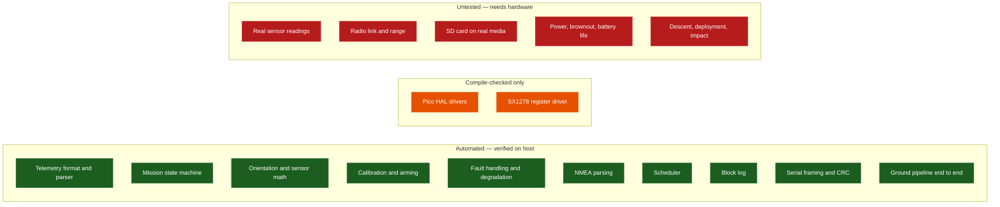

# Test Plan and Verification Record

What is tested automatically today, what each test proves, and what remains untested
because it needs hardware.

**Last run: 2026-09-04 — all suites pass.**

> [!IMPORTANT]
> Automated tests prove *logic*, not flight readiness. Nothing in this document
> establishes that a sensor reads correctly, that the radio link closes, or that the
> vehicle survives a flight. Those require hardware and are all still open.

---

## Contents

- [How to run everything](#how-to-run-everything)
- [Current results](#current-results)
- [Coverage map](#coverage-map)
- [C++ test suites](#c-test-suites)
- [Python test suites](#python-test-suites)
- [Cross-implementation consistency](#cross-implementation-consistency)
- [Not covered by automated tests](#not-covered-by-automated-tests)
- [Hardware test plan](#hardware-test-plan)
- [Mission test plan](#mission-test-plan)

---

## How to run everything

```bash
bash tools/build_host.sh
```

Compiles and runs everything that does not need hardware, in one pass:

| | |
|---|---|
| `flight_smoke_test` | boot, the first three packets, a GPS parse |
| `flight_tests` | the whole flight core |
| `fat_volume_tests` | the FAT32 log-file locator against a synthetic card image |
| `sx1278_tests` | the LoRa driver against a fake register bank |
| `sd_card_tests` | the microSD driver against a simulated card |
| `ground_station_tests` | framing, and the shared framing fixtures |
| Python | the ground-station suite and the tooling suite |
| Node | the web console's portable core, when Node is present |
| `check_doc_claims.py` | every documented number, last, because it reads what the suites above reported |

One command, one pass/fail, **about 17 seconds** on a developer machine — of which the
documentation checks are a third of a second. There is no reason not to run it before every
commit.

```bash
bash tools/check_pico_syntax.sh
```

Syntax-checks every `PICO_BUILD` branch against minimal SDK stubs
(`tools/pico_sdk_stubs/`). This is a compile check, **not** a firmware build.

Both scripts run on every push through [CI](../../.github/workflows/ci.yml), in four
jobs: the host build and tests, the CMake/CTest path, the Pico syntax check, and the
strict warning set.

### The Linux baseline

Every result quoted in this document was measured on the development machine: Windows,
MSYS2 GCC 15.2.0. Until 2026-09-04 the project had never been built on Linux at all --
the CI workflow only reached `main` with the first full push, and its first run failed.

**The cause was a real portability defect, not a CI quirk.** `std::uint64_t` is
`unsigned long long` on Windows but `unsigned long` on 64-bit Linux. A range-`for` over a
braced list in `flight_tests.cpp` mixed `ULL` literals with `std::uint64_t` values; on
Windows both spellings are the same type and the element type deduces cleanly, while on
Linux they are different types and the deduction is ambiguous:

```
error: unable to deduce 'std::initializer_list<auto>&&' from
       '{0, 1, 999, 3600000, last, (((long unsigned int)last) + 1), 1234567890}'
note: deduced conflicting types for parameter 'auto'
      ('long long unsigned int' and 'long unsigned int')
```

Every host job failed on it identically, which is why three jobs went red at once while
the Pico syntax check -- which does not compile the tests -- stayed green. The list is now
explicitly `std::initializer_list<std::uint64_t>`, so no deduction happens and no
conflict is possible. The failure and the fix were both reproduced on Windows before the
fix was pushed, by compiling the same construct against Linux's spelling of the type.

This is the class of defect a single-platform project cannot see. It is also the reason
the workflow keeps its logs: the diagnosis came entirely from the CI output, and the
earlier version of this workflow discarded exactly the lines that named the error.

---

## Current results

| Suite | Scope | Result |
|---|---|---|
| `flight_smoke_test` | Controller boot, first three packets, GPS parse | ✅ Passed |
| `flight_tests` | 143 suites across the whole flight core | ✅ **4674 / 4674 assertions** |
| `fat_volume_tests` | The FAT32 log-file locator against a synthetic card image | ✅ **30 / 30 assertions** |
| `sx1278_tests` | The LoRa driver against a fake register bank | ✅ **168 / 168 assertions** |
| `sd_card_tests` | The microSD SPI driver against a simulated card | ✅ **613 / 613 assertions** |
| `ground_station_tests` | Framing encode, decode, CRC, resync | ✅ Passed |
| Python ground station | 8 modules | ✅ **143 / 143 tests** |
| Python tooling | `tools/link_budget.py`, and `tools/cad_dimensions.py` — the STEP reader the mechanical documents take their dimensions from, tested against hand-built STEP files with known extents, the trailing-dot real literal that first defeated it, a circle bulging past every vertex, and the two files it must refuse rather than under-measure | ✅ **49 / 49 tests** |
| Python simulations | `simulations/descent.py` — canopy sizing, the closed-form fall against both of its own limits, ISA air density, and the mass-tolerance argument | ✅ **40 / 40 tests** |
| Documented claims | `tools/check_doc_claims.py` — pin numbers, rates, watchdogs, packet sizes, UART timing, rulebook constants, the test counts on this page, and every link and heading anchor in the documentation | ✅ **303 / 303 claims** |
| Web console (Node) | Framing, parser, validator, link health, extracted from `index.html` | ✅ **71 / 71 tests** |
| Pico syntax check | 11 translation units | ✅ All OK |

Translation units syntax-checked: flight `main`, `bringup_main`, `pico_hal`, `pico_radio`,
`mpu9250`, `bmp280`, `neo6m`, `sd_card`, `sd_logger`, shared `sx1278`, ground bridge `main`.

---

## Coverage map



---

## C++ test suites

### `flight_tests` — 143 suites, 4674 assertions

| Suite | What it proves |
|---|---|
| `test_mandatory_validity_covers_every_flag` | Dropping any one of the nine mandatory validity flags makes the record invalid and stops it becoming a packet, so a reading the vehicle never took cannot travel as though it had |
| `test_telemetry_format_exact` | The emitted packet matches the rulebook format byte for byte, including field order, separators and decimal places |
| `test_packet_numbering_and_padding` | Numbering starts at `P-001`, increments sequentially, and zero-pads to three digits |
| `test_parser_rejects_precision_and_order` | Wrong decimal precision, wrong field order and malformed fields are all rejected |
| `test_shared_protocol_fixtures` | Every packet in `test-data/protocol-fixtures.tsv` parses to the verdict the fixture file records — the same file the Python and Node parsers read, so the three implementations cannot silently disagree |
| `test_imu_scaling` | Raw MPU-9250 counts convert to m/s² and °/s using datasheet sensitivities for every full-scale range, and the on-die temperature uses the MPU-9250's transfer function rather than the MPU-6050's |
| `test_magnetometer_conversions` | AK8963 quantisation at 14 and 16 bits, the fuse-ROM per-axis sensitivity adjustment, and hard/soft-iron correction — including that an invalid calibration is not applied at all |
| `test_magnetometer_axes_are_rotated_into_the_body_frame` | The AK8963 die is mounted rotated inside the MPU-9250 package; the mapping into the body frame swaps X and Y and inverts Z, preserves field magnitude, and is its own inverse |
| `test_bmp280_compensation_datasheet_vector` | The Bosch compensation implementation reproduces the datasheet reference vector |
| `test_pressure_altitude` | The barometric formula produces the expected altitude for known pressures |
| `test_orientation_levels_and_yaw` | The first accelerometer sample seeds roll and pitch directly rather than being filtered towards; yaw propagates on the gyroscope and is not claimed as magnetic |
| `test_magnetic_yaw_is_tilt_compensated` | Tilt-compensated magnetic yaw recovered from fields synthesised at 54 known attitudes — the test that holds all three sensors to one coordinate frame |
| `test_orientation_yaw_is_disciplined_by_the_magnetometer` | 20 s with a 3 °/s gyro bias: fused yaw holds the magnetic reference while a gyro-only estimate drifts more than 30° |
| `test_a_field_with_no_heading_in_it_is_not_seeded_as_one` | A field of plausible strength with no horizontal component — a magnetic pole, or a vertical disturbance on the pad — carries no recoverable heading, so yaw falls back to zero and the estimator must not report that zero as magnetic |
| `test_uncalibrated_magnetometer_does_not_claim_absolute_heading` | An uncalibrated magnetometer still stops yaw drifting, but `yaw_is_magnetic` stays false |
| `test_orientation_rejects_an_implausible_field` | A field outside 20–70 µT is not the earth's, and does not steer the vehicle |
| `test_orientation_ignores_the_accelerometer_under_high_g` | 6 g along +X for 100 updates does not tip the attitude solution towards the thrust axis |
| `test_orientation_rejects_unusable_input` | Zero-length accelerometer, non-finite values and an unbounded `dt` are discarded rather than propagated into the quaternion |
| `test_gps_parser` | GGA and RMC parsing, checksum validation, fix and no-fix handling, malformed sentence rejection |
| `test_scheduler` | Fires at most once per period, and re-anchors after a stall instead of firing a catch-up burst |
| `test_fault_manager` | Report, clear, occurrence counting, severity escalation, critical latching |
| `test_state_machine_full_mission` | The full `INIT` to `RECOVERY` path with realistic inputs, including the 5 s post-impact window |
| `test_state_machine_fault_paths` | `FAULT` is reachable from every operational state and does not stop telemetry |
| `test_a_hovering_drone_is_not_a_landing` | [F-20](bring-up-record.md#findings). A full drone profile at the real thresholds — a 3 m/s climb to 30 m, a twenty-second hover, then release — never leaves `FLIGHT` before the descent, lands three seconds after touchdown, and spends the post-impact window on the ground. It used to reach `LANDED` at 18.0 s and `RECOVERY` at 23.0 s, twelve seconds before release |
| `test_a_lift_slower_than_the_rest_threshold_is_not_a_landing` | The exposure is wider than hovering: a climb at 0.8 m/s is below `landing_altitude_rate_max_mps`, so every sample of it reads as "not descending". Forty-five seconds of it declares nothing |
| `test_the_descent_gate_does_not_survive_a_state_change` | The gate belongs to one `FLIGHT`, not to the vehicle. A descent seen before the state began cannot authorise a landing inside it |
| `test_one_descending_sample_does_not_open_the_descent_gate` | A barometric spike every second, never held, leaves the gate shut — and with it shut, no landing is declared however long the vehicle sits at rest |
| `test_the_descent_and_rest_thresholds_may_not_overlap` | `validate_config()` refuses a descent threshold at or below the at-rest threshold, and a zero confirm window: either would let one sample mean both "descending" and "stopped" |
| `test_the_link_profile_is_compulsorily_faster_than_1_hz` | The ceiling, the jitter margin, the shipped period and `validate_config()` all agree. Every period at or above the rulebook's 1000 ms is refused, **including 1000 itself** |
| `test_a_default_vehicle_transmits_faster_than_1_hz` | The guard is only worth having if the packets come out at that spacing: a mission is flown and every measured gap between transmitted packets is the configured period, with none reaching a second |
| `test_a_refused_configuration_says_which_setting_was_wrong` | A rejected configuration keeps the reason `validate_config()` gave, so two different rules produce two different messages rather than one generic phrase, and an accepted configuration leaves it empty |
| `test_config_validation` | The `CAN-Team-XX` placeholder, a telemetry period at or above 1000 ms — the rulebook figure itself included — and a post-impact window under 5000 ms are all rejected |
| `test_sound_level_reduces_a_window_to_its_envelope` | An ADC window becomes its peak-to-peak span in millivolts; the same span at a different bias reads the same, and silence reads zero |
| `test_sound_level_refuses_a_window_it_cannot_scale` | An empty window, a zero full scale, a zero or negative reference, and a window never filled all return 0 rather than dividing by zero or reporting a negative loudness |
| `test_a_clipped_window_is_reported_as_clipped` | A window touching either end of the converter is flagged, because the level is then a lower bound — and canopy inflation and touchdown are the two events most likely to saturate |
| `test_the_sound_level_reaches_the_log_and_the_air` | The level goes on the air as one `SN-` field and into the log's columns, and the mandatory block is byte-for-byte what it is with no microphone at all |
| `test_the_log_records_the_numbers_the_gps_gate_judges_on` | `gps_satellites` and `gps_hdop` appear in the header and the row, and stay out of the radio packet — the quantity a decision turns on is recorded next to the decision, and [F-18](bring-up-record.md#findings) was undiagnosable because it was not |
| `test_no_fix_leaves_the_gps_quality_columns_blank` | With no fix, every GPS column is blank and the row still has the header's column count. 0 satellites and HDOP 0.0 are both real readings, and HDOP 0.0 is perfect geometry, so zeros here would describe a fix that never happened |
| `test_an_absent_microphone_leaves_the_columns_blank_rather_than_zero` | No sensor writes empty columns, never `0.0` — a working sensor reports zero for silence and the two must stay distinguishable |
| `test_a_vehicle_without_a_microphone_behaves_as_before` | A null sound pointer flies the full mission, sends packets, and raises no sound fault |
| `test_a_failed_microphone_costs_a_warning_and_nothing_else` | A microphone that fails to start and fails every read raises a warning, does not fail the self-test, does not reach `fault`, and does not cost a packet |
| `test_a_working_microphone_reaches_the_log` | A working one is read, marks health, clears its fault, and its level reaches both the log and the air as `SN-`, with every packet still parsing |
| `test_a_gate_only_module_is_still_a_working_sensor` | A three-pin LM393 board with no analogue output still reports healthy on its threshold duty alone — the two variants are sold under one name |
| `test_gate_duty_is_a_percentage_and_stays_one` | 0, 50 and 100 %; an empty window is 0 rather than a division by zero; a counter that overran its window is clamped |
| `test_an_unwired_gate_leaves_its_column_blank` | A board with only `AO` wired leaves `sound_gate_pct` empty rather than writing a zero that reads as never above threshold |
| `test_telemetry_builder` | Snapshot to record to packet, optional GPS ordering, suppression on invalid mandatory data |
| `test_the_widest_sd_row_still_fits_one_block` | The widest SD row the builder can produce — every column at its legitimate maximum, plus a packet at the airtime budget's cap — fits one 512-byte block, so raising that cap fails the build instead of silently cutting the flight log |
| `test_raw_block_log` | Header round-trip, append, resume after a simulated reset, boot counting, full-region behaviour |
| `test_controller_sequence_and_degradation` | Sequential packets under normal operation, and continued operation when a peripheral fails |
| `test_controller_sensor_failure_suppresses_but_continues` | Invalid mandatory data suppresses the packet without consuming a number and without stopping the loop |
| `test_controller_launch_detection` | `READY` to `FLIGHT` on a sustained boost or climb once armed |

| `test_imu_range_bits_match_their_sensitivities` | The full-scale range written to the IMU and the scale used to convert its output agree. A mismatch multiplies every acceleration by two, four or eight and the data still looks plausible |
| `test_config_radio_airtime_guard` | A telemetry period the radio cannot physically sustain is rejected on the pad rather than silently under-running in flight |
| `test_formatter_and_parser_agree_at_the_edges` | The formatter never emits a packet this library's own parser rejects, at every boundary value |
| `test_a_value_too_wide_to_format_invalidates_the_packet` | A finite value too wide for the formatter's buffer produces an empty field, not the first 63 characters of one — a corrupted reading and a missing one are both rejected, but only one of them looks like a reading |
| `test_controller_drops_optional_fields_before_overrunning_the_budget` | An over-long packet sheds its optional fields in rulebook priority order instead of being truncated by the radio into something the ground station can only read as corruption |
| `test_a_reset_log_reads_empty_and_the_old_bytes_are_scrubbed_away` | After `reset()` plus a driven scrub, every data block reads as spaces — the old rows are gone from the media, not merely past the header's reach. The boot count survives, and the log still appends into the first data block afterwards |
| `test_a_scrub_never_overwrites_a_record_written_during_it` | Interleaving one scrub slice with one append, every record written during the scrub survives. The scrub walks down from the end while records append up, so a scrub that takes minutes on real hardware can run under an open log |
| `test_the_erase_reads_empty_immediately_and_scrubs_afterwards` | The command empties the log on the first poll and the controller then drives the background scrub |
| `test_the_scrub_finishes_without_blocking_telemetry` | A run that scrubs 400 blocks transmits exactly as many packets as one that scrubs nothing. The mandatory 1 Hz downlink may not pay for a card wipe |
| `test_a_vehicle_that_was_never_asked_never_scrubs` | `erase_step()` runs every poll and must be free on a vehicle that has erased nothing |
| `test_a_fix_reaches_the_log_even_when_it_is_not_transmitted` | With `transmit_gps` set false — no longer the default — no `GP-` field reaches the packet, and latitude, longitude, satellites and HDOP all still reach the SD row. The same holds for every lean packet after a `MAX_RATE` command |
| `test_a_budget_below_what_is_on_the_air_is_refused` | A budget that cannot hold the mandatory block plus the GPS it transmits is refused before flight — the controller would otherwise shed GPS from every packet, silently. Sound and tags are not counted: they are shed first, a packet at a time. A flight budget (tags off) above the organizers' 200 bytes is refused; a tagged bench build may use the whole FIFO |
| `test_the_sensor_loop_runs_while_a_packet_is_on_the_air` | With a radio that stays busy for a rich packet's 340 ms, the 33 ms sensor task still runs through every packet — a 30 Hz loop over seven seconds — and the cadence and packet count are unchanged. A packet counts as sent only when the radio says it has gone. The transmit used to wait out the airtime: the range-test log showed 15 reads per 700 ms packet instead of 21 |
| `test_a_packet_on_the_air_holds_the_next_one_back` | A packet that outlasts its slot — only a hung radio can — holds the next one back rather than being cut off by it; nothing is ever started over a packet on the air, and the numbering stays sequential |
| `test_a_packet_that_fails_on_the_air_is_counted_and_recovered` | A packet that starts and then fails is counted as failed when it ends; enough in a row raise `radio_tx` and re-initialise the radio, and the fault clears once packets get through |
| `test_a_missing_gps_fix_is_one_fault_not_one_per_poll` | Ten seconds without a fix is one `gps_unavailable` occurrence, not one per 33 ms poll. The range-test log's `fault_total` climbed 21 a second on a vehicle whose only fault was no sky view |
| `test_the_packet_cadence_is_the_same_in_every_state` | A full profile — pad, boost, coast, descent, landing — and **every gap between consecutive packets equals `telemetry_period_ms`**, whatever state the vehicle was in. The test asserts it actually reached `FLIGHT` and `LANDED` first, so it cannot pass on a mission that never left the pad. State detection drives the `MODE` tag and the LED blink; it must never drive the rate |
| `test_the_builder_can_be_told_to_carry_position_after_construction` | The builder holds its own copy of the configuration, so a command putting position on the air has to tell it directly |
| `test_max_rate_is_a_pattern_of_one_rich_and_two_lean` | After `MAX_RATE`, packets go rich, lean, lean — `GP-` and `SN-` only on the rich one — spaced 374 ms after a rich packet and 296 after a lean one, polled at 1 ms so the spacing is the schedule's; the SD rows of lean packets still carry the fix |
| `test_every_normal_flight_packet_is_rich` | In normal flight every packet after the first second carries `GP-` and `SN-`, and none carries a diagnostic tag |
| `test_max_rate_closes_the_uplink_behind_it` | With a command on the air throughout, exactly one is accepted and the radio is never polled again |
| `test_no_command_is_heard_after_max_rate` | After the latch an erase command is not refused but unheard: nothing is accepted and nothing is erased |
| `test_a_vehicle_past_its_command_window_refuses_to_change_rate` | After the window closes by timeout a `MAX_RATE` is not heard: nothing is accepted and the schedule does not move |
| `test_a_max_rate_command_obeys_the_replay_rules` | A token minted for a packet number the vehicle has not reached changes nothing and is counted as ignored |
| `test_a_flight_build_cannot_be_commanded_to_max_rate` | With `allow_ground_commands` false neither rate command exists: the radio is never polled and the period never moves |
| `test_the_vehicle_does_not_arm_while_its_command_window_is_open` | Still on a desk the vehicle calibrates in about three seconds but does not arm for the whole window; the power-on calibration still runs, giving the window a height above the pad |
| `test_the_window_times_out_then_the_vehicle_recalibrates_and_arms` | At the timeout the uplink closes and the power-on calibration is discarded; arming waits for the new one and for the arming delay counted from the close |
| `test_max_rate_closes_the_window_early_and_the_vehicle_arms_soon_after` | `MAX_RATE` closes the window at once, and the vehicle arms seconds later rather than five minutes later |
| `test_an_erase_does_not_close_the_command_window` | Only `MAX_RATE` closes the window early; an erase leaves it open |
| `test_a_watchdog_reset_skips_the_command_window` | A vehicle restarting from the watchdog never opens the window and never polls the radio, so a reset in flight does not leave it unarmed |
| `test_a_build_without_the_uplink_arms_as_it_always_has` | With no uplink there is no window, and the vehicle arms three seconds after power-on as before |
| `test_the_sealed_build_goes_to_max_rate_when_its_window_closes` | With `auto_max_rate`, the command window runs at 700 ms and the moment it times out the vehicle is in the rich, lean, lean pattern with nobody pressing anything, then recalibrates and arms |
| `test_the_sealed_build_is_at_max_rate_at_once_without_a_window` | With no window to wait for — no uplink, or a watchdog reset — the sealed build is at max rate from its first packet and never listens |
| `test_a_command_window_must_have_a_length` | `validate_config()` refuses a zero or unbounded window when the uplink is on, and ignores the length when it is off |
| `test_a_flight_build_has_no_uplink_at_all` | `allow_ground_commands` defaults to false, and with it false the radio's receive is **never polled** — this is the test the README's "there is no command uplink" rests on |
| `test_a_task_can_be_rescheduled_from_the_packet_it_just_sent` | `reschedule()` sets the next due time from the fire time of the packet just sent and the slot its shape needs — 374 ms after a rich packet, 296 after a lean one — which `due()` alone cannot, since it advances by the period it held when it fired |
| `test_the_sound_level_goes_on_the_air_after_the_position` | `SN-` follows every mandatory field and the position; a microphone with no valid window puts nothing on the air, and `transmit_sound` false keeps it off |
| `test_a_packet_held_lean_still_logs_everything` | A packet built with `air_sensors` false carries neither `GP-` nor `SN-`, and its SD row still has the latitude, the longitude and the sound level |
| `test_the_widest_packets_are_the_budgets_by_construction` | The widest mandatory block and GPS block the builder can produce — packet number 4294967295, a 99-hour clock, extreme negatives — are exactly `kMandatoryPacketBytes` and `kGpsFieldBytes`. It corrected them from 145 and 56 to 147 and 55, and holds the GPS block at 51 since its precision was cut for the organizers' 200-byte ceiling. The widest rich packet (209) is over that ceiling and fits it without `SN-` |
| `test_the_commanded_rate_periods_clear_their_own_airtime` | Both commanded periods clear their own measured airtime plus the SD guard, 201 B costs exactly what 199 B costs, and the published rates cannot move without this failing |
| `test_a_token_authorises_one_command_and_not_another` | A token minted for one command is refused for every other, in both directions, and an unknown command name is refused rather than matched to the nearest known one |
| `test_the_bench_build_erases_the_log_on_command` | Enabled, in `READY` with `ARM-0`, a valid command erases the log |
| `test_a_vehicle_past_its_command_window_refuses_to_erase` | After the window closes an erase is not heard, and the test asserts the vehicle reached `READY` so it cannot pass for the wrong reason |
| `test_another_teams_command_erases_nothing` | A command naming another team is seen, counted as ignored, and erases nothing — the sync word is shared by every team in the competition |
| `test_a_refused_erase_is_reported_rather_than_swallowed` | A logger that cannot erase raises `sd_write`; an operator who pressed the button can tell "erased" from "declined" |
| `test_listening_never_costs_a_packet` | Identical runs with the uplink off and on transmit the same number of packets. The mandatory 1 Hz downlink may not pay for a bench feature |
| `test_a_command_round_trips_for_its_own_team` | A formatted `ERASE_LOG` command parses back to the same command for the team it names |
| `test_a_command_for_another_team_is_ignored` | A command addressed to `CAN-Team-07` is inert here. The sync word is shared by every team, so another team's traffic must be structurally inert rather than merely unlikely |
| `test_a_command_with_the_wrong_password_is_ignored` | A wrong password, or none, yields no command. The token is a digest of the password and the packet number, so the check is on the digest and the password itself never travels |
| `test_the_password_never_appears_on_the_wire` | The formatted command does not contain the password anywhere. The link is unencrypted, so this is the property that makes a password worth having at all |
| `test_a_token_is_valid_for_exactly_one_packet_number` | Moving a valid token to a different `PN-` breaks it. This is what makes a captured frame single-use, and everything the controller does about replay rests on it |
| `test_the_status_field_matches_the_shared_fixture` | The firmware's `ST-` encoder produces exactly the value every row of `test-data/status-tag-cases.tsv` records, nine bytes on the air with its separators, and nine or more faults read `9`. Both ground parsers decode the same file |
| `test_the_status_field_rides_on_rich_packets` | Every normal-flight packet carries `ST-` inside the 200-byte budget with GPS still on the air and the full tags still off it; a still vehicle's status reads armed and calibrated; dropping it raises no oversize fault; `transmit_status = false` turns it off |
| `test_command_tokens_match_the_shared_fixture` | Every row of [`test-data/command-tokens.tsv`](../../test-data/command-tokens.tsv) hashes to its recorded token, including a non-ASCII password — the console reads the same file, so a C++/JavaScript divergence fails the build instead of appearing as "the button does nothing" |
| `test_a_replayed_command_erases_nothing` | The exact frame that worked once, sent again later, erases nothing and is counted as ignored |
| `test_a_command_minted_for_a_future_packet_is_refused` | A token pre-computed for a packet number the vehicle has not reached is refused, so a stockpile of them is useless |
| `test_a_stale_command_is_refused` | A valid, never-used token older than `command_replay_window` is refused — a frame from an earlier session cannot be brought back |
| `test_a_telemetry_packet_is_never_a_command` | The vehicle's own downlink, fed back into the command parser, decodes to nothing — the two directions share a format and must not share a meaning |
| `test_an_unconfigured_vehicle_matches_nothing` | An empty expected team matches no command, rather than matching every command addressed to anybody |
| `test_a_truncated_command_is_ignored` | **Every** prefix of a valid command is inert, checked at each cut. A radio delivers partial frames, and the terminating `;` is mandatory for exactly this reason: without it, every truncation but the last character is still a valid erase |
| `test_a_fix_with_too_few_satellites_is_refused` | A quality-1 GGA reporting three satellites is refused and counted — a receiver announces a fix the moment it has any solution, and three satellites cannot produce a 3D one ([F-18](bring-up-record.md#findings)) |
| `test_a_fix_with_poor_geometry_is_refused` | Eight satellites at HDOP 20 are refused: geometry, not count, is what produces a large confident wrong position |
| `test_a_good_fix_still_passes_and_carries_its_quality` | Eight satellites at HDOP 0.9 still pass, and `satellites` and `hdop` are both readable afterwards — a gate whose inputs are not recorded cannot be tuned in the field |
| `test_a_refused_fix_does_not_disturb_the_last_good_one` | A refused sentence leaves the previous position untouched and the vehicle still holding a fix; only a genuine `quality <= 0` clears it. Declining an update is not the same as losing the fix |
| `test_an_rmc_cannot_make_a_fix_the_gga_gate_refused` | An `RMC` sentence renews the ground track and never the fix — it has no satellites, HDOP or altitude to gate on — and neither it nor a refused `GGA` renews the fix clock. The 2026-09-10 range test put 219 fixes with 0 satellites, HDOP 0.0 and `GP-Alt-0.0` on the air |
| `test_a_hemisphere_from_the_wrong_axis_is_rejected` | A latitude marked `E` or `W`, or a longitude marked `N` or `S`, is rejected rather than read as a sign — a sentence that passed its checksum can still carry a hemisphere character from the other axis, and taking it puts the fix on the wrong side of the equator |
| `test_gps_coordinate_validation` | A checksum-valid sentence carrying an impossible position is rejected: the vehicle transmits no fix rather than a wrong one |
| `test_orientation_survives_the_wrap_and_the_poles` | The quaternion state stays well formed across the ±180° roll seam and through a 20 s tumble at 100 °/s about all three axes — including the ±90° pitch singularity that broke the previous Euler integration |
| `test_telemetry_declares_the_yaw_reference` | Every packet carries `YR-M` or `YR-G`, so a receiver never has to guess whether yaw is absolute |
| `test_a_missing_magnetometer_degrades_rather_than_stops` | A module that is really an MPU-6500 flies on six axes, reports `mag_unavailable`, and still reaches READY |
| `test_a_magnetometer_that_stops_is_reported_and_survived` | A magnetometer that stops answering costs yaw only; attitude and telemetry continue |
| `test_gps_course_is_a_cross_check_not_a_yaw_source` | A grossly disagreeing GPS course raises a warning and does **not** move the heading; slowing below the speed gate withdraws the comparison |
| `test_mag_calibration_requires_real_coverage` | The sweep calibrator refuses to certify itself until every axis has been swept, recovers a known hard-iron offset and soft-iron squash, and rejects saturated samples |
| `test_accel_calibration_is_rotation_invariant` | The accelerometer correction is a scalar scale, so it still returns 1 g in attitudes the vehicle was never calibrated in |
| `test_measured_packet_sizes_match_the_link_budget` | The 118 / 163 / 208-byte figures the link budget quotes are the ones the formatter actually produces |
| `test_calibration_rejects_a_steady_rotation_as_bias` | A vehicle turning at a constant rate on the pad is steady by variance alone; the gate refuses to subtract that real body rate as gyro bias for the whole flight |
| `test_fault_severity_never_falls_while_active` | Severity is monotonic while a fault is active — escalation is honoured, a later routine report at a lower severity cannot downgrade a fault that still applies, and clearing genuinely resets it |
| `test_landing_is_not_declared_during_a_steady_descent` | A steady parachute descent reads as 1 g, indistinguishable from resting on the ground; only the vertical rate separates them, and it does |
| `test_battery_voltage_reports_whether_it_is_scaled` | Battery reporting says which voltage it is showing, so an operator reading 1.6 V off a 3.7 V cell knows it is an unscaled ADC pin voltage before reacting to it |
| `test_loop_tick_is_bounded_by_the_gps_uart_fifo` | A loop tick too slow to drain the GPS UART before its 32-byte FIFO fills is rejected by `validate_config()` |
| `test_sensor_timing_model` | The BMP280, MPU-9250 and AK8963 timing model, pinned to the datasheets' own published presets — including that the MPU-9250's accelerometer and gyroscope bandwidths come from two different registers |
| `test_config_sensor_rate_guard` | The configured acquisition rate is one the sensors can actually feed at their configured oversampling |
| `test_controller_ignores_repeated_barometer_samples` | A barometer returning the same conversion twice does not read as zero climb rate |
| `test_lora_airtime_reference_vectors` | The C++ airtime model matches the same published SX127x reference vectors as `tools/link_budget.py`, so the two cannot drift apart |
| `test_sd_log_row_matches_its_header` | Every SD log row has exactly as many columns as the header, with or without a GPS fix, so scripts that index columns by position stay correct |
| `test_raw_block_log_survives_a_torn_header_write` | Two alternating header copies mean a power failure during a header write always leaves one valid resume point, instead of sending the next boot back over the flight it just recorded |
| `test_a_frozen_gps_fix_is_not_reported_as_a_live_position` | A receiver that stops talking has its fix aged out of telemetry and raises `gps_unavailable`, instead of repeating the last position it saw for the rest of the flight |
| `test_config_rejects_a_gps_timeout_faster_than_the_receiver` | A fix timeout shorter than one NEO-6M navigation period is refused, so a live fix cannot expire between its own updates |
| `test_link_profile_is_shared_by_both_ends` | The vehicle and the bridge read the same modem parameters field by field, so the two ends cannot be configured apart — a mismatch is a silent, total link failure |
| `test_controller_arming_lockout_blocks_early_boost` | A boost before the arming delay cannot trigger a false launch |
| `test_startup_calibrator_stationary_and_moving` | A still vehicle calibrates cleanly; a moving one resolves best-effort with the barometric reference only |
| `test_controller_sensor_plausibility` | Readings outside datasheet bounds are rejected and the previous value is dropped |

### `flight_smoke_test`

Boots a `Controller` with mock hardware and asserts: initialisation succeeds, the status
LED lights, the test sync word `0xF3` is applied, three polls produce exactly three
packets, the first is `CAN-Team-01; P-001; Ti-00:00:00:000;`, the third contains `P-003`,
and a known GGA sentence parses to the expected latitude with no checksum errors.

### `ground_station_tests`

| Assertion group | What it proves |
|---|---|
| Frame round-trip | `frame_encode` then `FrameReader` returns the identical payload |
| CRC error detection | A flipped payload byte is reported as `crc_error`, not as a valid frame |
| Resync after noise | Garbage before a frame does not prevent the next frame from decoding |
| Embedded newline | Length-based reads frame a payload containing a newline correctly |
| Known-answer vector | `crc16_ccitt("123456789") == 0x29B1`, the standard CRC-16/CCITT-FALSE check value |

---

## Python test suites

### `test_telemetry.py` — 22 tests

Rulebook packet parses; the `CAN-Team-XX` placeholder is rejected; empty and corrupt
packets are rejected; decimal precision is enforced and extra fields are tolerated;
optional GPS fields are preserved; missing packets are counted; out-of-order packets are
rejected; duplicates are visible to the sequence check; raw and parsed logging both work.

Five further tests cover the yaw reference: a magnetic yaw is reported as a compass
bearing, a relative one yields no bearing, a packet without the tag says nothing either
way, the bearing wraps into `[0, 360)`, and the CSV row records which kind of yaw it
holds — the same distinction the C++ formatter and the web console make.

Two hold the console's markup to its own code: every id the page selects must be declared
in the page, and every SVG icon it names must be defined there. A `$("#typo")` returns null
and the next property access throws, which in this file would stop the render loop on a
display somebody is watching a vehicle through.

Three hold both ground parsers to
[`test-data/optional-tag-cases.tsv`](../../test-data/optional-tag-cases.tsv). The optional
tags are `<key>-<value>` and the keys themselves contain dashes, so both parsers split on
the last one — which is the separator right up until the value is negative, and then the
last dash is the minus sign. `GP-Lat--18.5` split to the key `GP-Lat-` and the value
`18.5`: the sign eaten, the key unrecognisable, and a southern-hemisphere fix vanished from
the console, the CSV and the map **with no error and no rejection counter**. Both
implementations were wrong the same way because they were hand-ports of each other and no
fixture carried a negative coordinate. The web console reads the same file, so the two are
held to one definition rather than to two sets of similarly-named tests.

Two more hold the two parsers to the same **field names**, by running the console's parser
under Node and comparing the record it returns with Python's. The shared fixtures already
hold both to one definition of a valid packet; they say nothing about what the parsed record
is called afterwards, and a name is what a hand-port gets wrong. A short list covers the
names that exist on one side by design, and a second test fails if an entry on that list
stops describing reality.

### `test_validator.py` — 22 tests

Two more read the shared scenario file: the file is present and complete, and every scenario reaches the verdict it records. The web console runs the same file through its own validator.

Sequential streams pass; wrong team is rejected; missing packets are counted; duplicates
and out-of-order packets are detected; timestamp regressions are noted; implausible GPS is
flagged while the packet is still kept; valid GPS is not flagged; diagnostic tags
(`MODE`, `FAULTS`, `CAL`, `ARM`) are parsed.

Eleven more cover vehicle reboots and the bounded duplicate window, because both are ways
a correct stream can be read as a broken one. A reboot restarts numbering at `P-001` with
the clock going backwards, and must be recognised rather than counted as a flood of
duplicates; a `P-001` corrupted out of a longer number is not a restart, nor is a clock
regression on its own; the first packet of a session is never a restart; multiple reboots
are each counted; a restart clears both structures; and the duplicate window is bounded so
a long flight cannot grow it without limit, while still catching recent repeats.

### `test_transport.py` — 20 tests

Framing: round-trip, CRC error reporting, the known CRC vector, resync after noise, a torn
header that must not swallow the frame behind it, a truncated length field, frames split
across chunks, status-frame detection, and a stuck link that must not grow the buffer
without bound. Transports: framed and plain file replay, and framed loopback.

Three more read [`test-data/framing-cases.tsv`](../../test-data/framing-cases.tsv), the
fixture `framing.cpp` and the web console read too: every case decodes to its recorded
events and counters, and the same stream split at every single byte decodes identically —
a serial port splits wherever it likes.

Five more cover replaying a raw log this ground station wrote — the file the runbook's
post-flight step replays. A logged line replays as the packet it recorded, a logged status
line is still a status line, escaped control characters come back exactly, a plain file of
packets is untouched, and the behaviour can be turned off for a file that legitimately
begins with a date.

### `test_health.py` — 13 tests

Connection flag, packet and loss counters, CRC and status frame accounting, snapshot key
stability. Plus three rate-estimator tests added after a live defect was found: a paced
2 Hz stream reads 2.00 Hz, a same-instant burst cannot inflate the rate, and the rate
falls to zero once the link drops instead of freezing at its last value.

**And six for the rulebook rate verdict**, which is the receiving end of a rule the vehicle
enforces at the transmitting end. The vehicle refuses to build at or below **1 Hz**; the
ground station reports whether what actually arrived cleared it, because those are different
questions once the link starts losing packets. The tests pin the three-valued answer: the
flight profile's **1.43 Hz** passes, exactly 1.00 Hz passes (it meets the minimum — the
vehicle is the end that refuses to sit there, not this one), 0.5 Hz fails, and a link that
is too new or has dropped reports `None` rather than `False`. "Not measured yet" and
"measured, and too slow" call for very different reactions from an operator, and a boolean
cannot say the first.

### `test_app.py` — 17 tests

End-to-end counting and logging through the full pipeline; a CRC-error frame is recorded
but never parsed; CSV export; a healthy log reports no errors, and a failing write is
surfaced without stopping reception.

The rest cover the bridge status line, which is the operator's only view of the radio
itself: the radio report reaches the snapshot, a negative SNR keeps its sign, a radio-loss
line is recorded, status lines are never counted as telemetry, and the **sync word the
bridge reports** reaches the dashboard — with an older bridge image that reports no sync
word leaving the field absent rather than filling it with a guess.

Two more carry the frame decoder's own counters to the snapshot an operator reads: a framed
transport reports what its decoder saw, including an oversized length mid-stream, and an
unframed one reports nothing at all rather than zeroes — no decoder ran, and zero would read
as "nothing went wrong".

Two hold the dashboard to itself: every field list is populated, and every variable the
dashboard writes to is one it created — `self._vars["typo"].set(...)` is a `KeyError` the
moment a snapshot arrives, which on this display means the window stops updating during a
flight. The check is static, so it runs without Tk.

Two more hold the Tk dashboard to the snapshot: every value the ground station knows must be
named by the display an operator watches, with an explicit list of the few rendered another
way — and a second test that fails if an entry on that list stops being rendered at all, so
the exception cannot outlive its reason.

### `test_logger.py` — 22 tests

The raw log's escaping is reversible over every byte value, escaped text never contains a
separator, and one line is written per record even for a corrupted payload — so a payload
that failed to parse is still recoverable from the raw log. Nothing is discarded, valid
packets still reach the CSV, a failing write is counted rather than raised, the station
keeps logging the other file, errors accumulate across packets, and packet-gap accounting
distinguishes a genuine gap from a repeat or a regression.

Four more read [`test-data/raw-log-escapes.tsv`](../../test-data/raw-log-escapes.tsv), the
fixture the web console reads too: every case escapes to its recorded form, unescapes back
to the original, and no escaped form contains a separator. The plain text is stored as hex
because it is allowed to contain tabs and newlines — the same reason the log escapes it.

### `test_documented_commands.py` — 9 tests

The commands the documentation tells a reader to run, run. Two defects were found by typing
documented commands in exactly the form the documents give them, and neither would have been
caught by testing the code those commands reach: every document named a `packets.txt` this
repository has never contained, and the runbook's post-flight step replayed a real flight log
to `received=0` with no error and no warning.

So: the sample mission the documents name exists; the documented replay command accepts every
packet in it; a raw log this station wrote replays through the documented command as the
mission it recorded; a file that cannot be read fails loudly rather than silently; and every
`python src/main.py` invocation in the README, the quick start, the runbook and the
ground-station README parses against the real argument parser, so a document cannot offer a
flag the program does not have.

Parsing is not enough on its own. A ninth test requires every documented `live --port`
command to carry `--framed`, because the bridge frames everything it emits: the quick start's
end-to-end test omitted the flag while the runbook required it, and the omitted form parses,
opens the port, runs, and receives nothing. A documented command that fails silently on real
hardware is worse than one that will not parse.

### `test_protocol_fixtures.py` — 5 tests

The fixture file is present and complete, every fixture parses to its recorded verdict,
every rejected fixture carries a reason, every accepted fixture exposes all mandatory
fields, and the packet-number rule matches the other implementations.

---

## End-to-end integration

`ground-station/software/tests/test_end_to_end.py` runs the **real flight controller**
(`emit_mission`, built by `tools/build_host.sh`) through a scripted ascent-and-descent
mission, then pushes the packets it transmits through the **real ground station**: CRC
framing, frame decoding, parsing, validation, logging and CSV export.

Every other test checks one side of the system against its own idea of the format. This one
checks the two halves against each other, across the C++/Python boundary, and it is the
test that would catch a field-order, precision, packet-numbering or optional-field
disagreement that per-side testing cannot see.

13 checks: every transmitted packet survives the pipeline; no frame is reported corrupt;
numbering is sequential from `P-001`; the values read at the ground station match the text
the vehicle sent, field by field; GPS and diagnostic tags cross the boundary; the mission
actually progresses past `READY`; altitude varies; every packet reaches both logs and the
CSV export; a dropped packet is counted, not hidden; a corrupted frame is rejected by CRC
rather than parsed, while the raw payload is still recorded; and the stream also survives an
unframed link.

---

## Cross-implementation consistency

Three things exist in more than one language and must not drift:

| Logic | Implementations | Guard |
|---|---|---|
| Packet format and parsing | [`telemetry.cpp`](../../firmware/common/src/telemetry.cpp), [`telemetry.py`](../../ground-station/software/src/telemetry.py), `index.html` | All three read [`test-data/protocol-fixtures.tsv`](../../test-data/protocol-fixtures.tsv) — 32 packets, each with a recorded accept/reject verdict. A parser that disagrees fails the build |
| CRC-16/CCITT framing | [`framing.cpp`](../../firmware/ground-station/src/framing.cpp), [`transport.py`](../../ground-station/software/src/transport.py), `index.html` | All three read [`test-data/framing-cases.tsv`](../../test-data/framing-cases.tsv) — 14 byte streams with the exact events and counters each must produce, including every recovery path: a torn header, a truncated length, a `$` inside a CRC field, an oversized length. The known-answer vector `0x29B1` is asserted on top of it |
| Raw-log escaping | [`logger.py`](../../ground-station/software/src/logger.py), `index.html` | Both read [`test-data/raw-log-escapes.tsv`](../../test-data/raw-log-escapes.tsv) — 16 cases including a literal backslash before `t`, the one an unescaper a character out of step reads as a tab. The console replays raw logs, so a disagreement here invents payloads the vehicle never sent |
| Parsed record field names | [`telemetry.py`](../../ground-station/software/src/telemetry.py), `index.html` | The console's parser is run under Node and the keys of the record it returns are compared with Python's. `fault_count` was `faults` on one side, which in JavaScript reads as `undefined` rather than raising |
| Validation semantics | [`validator.py`](../../ground-station/software/src/validator.py), `index.html` | Both read [`test-data/validator-scenarios.tsv`](../../test-data/validator-scenarios.tsv) — 13 scenarios, 34 packets, each with the verdict the validator must reach: gaps, duplicates, out-of-order arrivals, a vehicle reboot and the corrupted `P-001` that is not one, wrong team, clock regression and an implausible fix. A validator that disagrees fails the build |
| LoRa airtime model | [`lora_airtime.hpp`](../../firmware/common/include/cansat/lora_airtime.hpp), [`link_budget.py`](../../tools/link_budget.py) | Both are asserted against the same two published SX127x reference vectors (46.336 ms and 1155.072 ms) |
| Sensor timing model | [`sensor_timing.hpp`](../../firmware/flight-computer/include/flight/sensor_timing.hpp) — register encoding *and* the rate guard | The model reproduces three published BMP280 datasheet figures, so the registers written and the rate validated cannot disagree |
| Radio modem parameters | [`link_profile.hpp`](../../firmware/common/include/cansat/link_profile.hpp) — read by the vehicle *and* the bridge | `test_link_profile_is_shared_by_both_ends()` compares the two ends field by field; a mismatch is a silent, total link failure |

> [!NOTE]
> The web console's ports **are** covered, as of cycle 2. `ground-station/web/tests/console_core.test.mjs`
> extracts the code between the `PORTABLE-CORE` markers straight out of `index.html` and
> runs it under Node, and the harness fails if that code reaches for the DOM. Its parser
> cases come from the same fixture file the other two suites read.

---

## Not covered by automated tests

| Area | Why | Risk |
|---|---|---|
| Pico HAL drivers (I2C sensors, GPS, board I/O) | Need real peripherals | Medium — logic is thin, but register sequences are unverified. The two SPI drivers, radio and microSD, are now covered against simulated devices |
| SX1278 register driver **on real silicon** | Needs the real modem | Medium — the register sequence now executes against a fake register bank (94 assertions), so the driver's own logic is covered; what remains unproven is that the RA-02 responds as the datasheet says |
| Web console **rendering** | No headless browser in the repository | Low — the logic is now tested under Node (30 tests); only the DOM layer is manual. Verified by hand in a browser on 2026-09-04: demo mission ran to `RECOVERY`, rate steady through the injected drop and duplicate, no console errors, both themes legible |
| Tk dashboard | Needs a display | Low |
| CMake build | — | ✅ **Covered.** Verified locally on 2026-09-04: the host tree configures, all 31 targets build, and all 6 CTest tests pass. CMake and Ninja are available through `pip install cmake ninja` when the system has neither |
| Timing under real load | Host tests use a synthetic clock | Medium — the 1 Hz airtime budget is arithmetic ([link-budget.md](../design/link-budget.md)); nothing has been measured on a radio |

---

## Hardware test plan

> [!TIP]
> [**bring-up-record.md**](bring-up-record.md) is the companion to this table: where this
> plan says pass or fail, that one carries every number the repository *predicts* — airtime,
> sensor output rates, bus load, RSSI against distance — with the procedure to measure each
> and a blank to write down what you actually got. Take it to the bench.

Each row is a gate. A failure stops the sequence rather than being carried forward.
Sequence follows the [bring-up order](../design/wiring.md#bring-up-order).

| # | Test | Pass criterion | Status |
|---:|---|---|---|
| 1 | Pico alone on USB | GP14 LED blinks; USB serial enumerates | ⬜ |
| 2 | I2C bus scan | MPU-9250, BMP280 and (with the pass-through bridge enabled) the AK8963 at `0x0C` all acknowledge, on distinct addresses | ⬜ |
| 3 | IMU read | Stationary vehicle reads about 1 g total, rates near zero | ⬜ |
| 4 | Barometer read | Pressure within a few hundred Pa of a local reference; temperature plausible | ⬜ |
| 5 | Calibration | `ST-` calibrated flag set within the sample budget while stationary | ⬜ |
| 5b | Acquisition rate | Logged loop actually achieves 30 Hz with under 6 % jitter; barometer returns a fresh conversion every sample ([sensor-rates.md](../design/sensor-rates.md)) | ⬜ |
| 6 | GPS | Raw NMEA received; fix acquired outdoors; checksum errors near zero | ⬜ |
| 7 | RA-02 identity | Chip version register reads back correctly over SPI | ⬜ |
| 8 | Bench link | Packets received end to end at sync word `0xF3` | ⬜ |
| 9 | Range test | Acceptable loss at the expected launch distance, antenna as flown; log RSSI, SNR and loss against distance to validate [link-budget.md](../design/link-budget.md) | ⬜ |
| 10 | microSD alone | Block read and write on its own supply | ⬜ |
| 11 | Shared SPI | Radio and SD both work with the other present; MISO releases correctly | ⬜ |
| 12 | Packet rate | Sustained 1 Hz with no gaps in numbering; measured airtime within 10 % of the computed value for the packet size actually sent (327 ms for a 206-byte packet) | ⬜ |
| 13 | Battery power | Current draw measured; no brownout during a transmit peak | ⬜ |
| 14 | Battery endurance | Runtime from full charge to cutoff, measured | ⬜ |
| 15 | Watchdog recovery | Forced hang reboots and telemetry resumes automatically | ⬜ |
| 16 | Power-on behaviour | LED lights immediately; telemetry starts with no manual trigger | ⬜ |
| 17 | Sync word switch | `0xA5` configuration verified before the official launch | ⬜ |

---

## Mission test plan

| # | Test | Pass criterion | Status |
|---:|---|---|---|
| 1 | Egg chamber drop | Egg intact after a representative impact | ⬜ |
| 2 | Parachute deployment | Deploys immediately after release, no tangling | ⬜ |
| 3 | Descent rate | No more than 5 m/s, measured | ⬜ |
| 4 | Stable descent | No tumbling; the structure survives landing | ⬜ |
| 5 | Post-impact telemetry | At least 5 s of continuous telemetry after landing | ⬜ |
| 6 | Continuous telemetry | Unbroken from power-on through recovery | ⬜ |
| 7 | Full rehearsal | Complete [runbook](../operations/runbook.md) executed end to end | ⬜ |
| 8 | Analysis workflow | Required graphs produced inside the four-hour window | ⬜ |

---

Related: [software-architecture.md](../design/software-architecture.md) ·
[wiring.md](../design/wiring.md) · [timeline.md](../project/timeline.md) ·
[requirements.md](../requirements/requirements.md)
