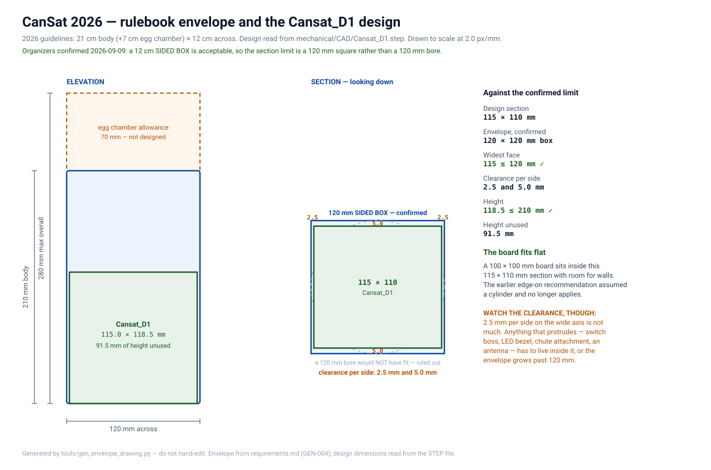

# Mechanical

The structure, the egg chamber, the parachute and the recovery system.

> [!IMPORTANT]
> **A design exists. Nothing has been fabricated.** `Cansat_D1` is modelled in Fusion 360
> and exported to STEP, with three simulation studies in the archive. No part has been cut,
> printed or assembled, nothing has been weighed, and no drop test has been done.

**Status: 2026-09-09.** Gate 7 (mechanical and recovery verified) has not been attempted.
It is still the largest single block of unclaimed points in the project — see
[scoring-assessment.md](../documentation/project/scoring-assessment.md).

**Every dimension on this page is read from
[`CAD/Cansat_D1.step`](CAD/Cansat_D1.step)** by
[`tools/cad_dimensions.py`](../tools/cad_dimensions.py), and `check_doc_claims.py` fails
the build if this page and the model disagree. Re-export the STEP after any model change
and run `bash tools/build_host.sh` — it will tell you which numbers moved.

---

## Contents

- [What the rulebook fixes](#what-the-rulebook-fixes)
- [The design](#the-design)
- [Structural simulation](#structural-simulation)
- [The parachute](#the-parachute)
- [Mass budget](#mass-budget)
- [What has to be decided](#what-has-to-be-decided)
- [Directory contents](#directory-contents)

---

## What the rulebook fixes

Three numbers, and only three. The 2026 revision resolved the contradictions the original
guidelines carried, so these are now single-valued.

| Quantity | Value | Requirement |
|---|---|---|
| Body envelope | **21 cm × 12 cm** | [GEN-004](../documentation/requirements/requirements.md) |
| Egg chamber allowance | **+7 cm**, so 28 cm overall | GEN-004 |
| Mass | **500 g ± 10 %** — 450 g to 550 g | [GEN-005](../documentation/requirements/requirements.md) |
| Release altitude | **100 ft / 30.48 m**, from a drone | [MIS-001](../documentation/requirements/requirements.md) |
| Descent rate | **≤ 5 m/s** | [REC-005](../documentation/requirements/requirements.md) |

**Exceeding size or mass by more than 10 % is a disqualification.** It is not a scored
item; it is a closed list, and this is on it. That makes the mass budget below the single
most consequential table in this directory.

---

## The design

`Cansat_D1`, read straight out of the STEP:

| | |
|---|---:|
| Solids | one, `Body1`, 56 faces |
| **Bounding box** | **118.5 × 115.0 × 110.0 mm** |
| Cross-section diagonal | **159.1 mm** |
| Circular features | Ø5.1, Ø12.0, Ø16.0, Ø45.0 mm |
| Height against the 210 mm body allowance | **91.5 mm unused** |

It is **prismatic, not a cylinder** — the largest radius anywhere in the model is 22.5 mm,
nothing like the 60 mm a 120 mm circular section would need.

### The board fits flat after all

**An earlier version of this page said the vehicle board could not be mounted flat and
should go in edge-on as a spine. That was reasoned against a 120 mm *circular* section,
before there was a design.** Against the actual one it is wrong:

| | |
|---|---:|
| Board, as built | 100 × 100 mm ([C.9](../documentation/hardware/receiving-inspection.md)) |
| Board diagonal | 141.4 mm |
| Design section | **115 × 110 mm** |

A 100 mm square fits a 115 × 110 mm opening flat, with 15 and 10 mm to spare for walls and
standoffs. The edge-on recommendation is withdrawn. *(It would still be the answer for a
circular section: a 120 mm bore caps a flat deck at 84.9 mm square.)*

### The envelope question — and it is a disqualification-class one

**"12 cm across" is not defined as a width or a diameter, and for a prismatic body those
give different answers:**

| Reading | Verdict |
|---|---|
| **Width** — no face wider than 120 mm | 115 and 110 both pass ✅ |
| **Diameter** — fits through a 120 mm bore | needs **159.1 mm**, which is **+33 %** ❌ |

The rulebook disqualifies at **more than 10 % over**, so under the second reading this
design is not marginal — it is out. Under the first it passes comfortably.

**Nothing in the repository can settle this; the organizers can, in one email.** It is
[open question 11](../documentation/requirements/requirements.md#open-questions-for-organizers). The argument for the
width reading is that the vehicle is drone-released and never passes through a tube. The
argument for asking anyway is that a judge with a caliper measuring "across" may well
measure the widest thing they can find.

**Until it is answered, know what the fallback costs.** Fitting a 120 mm bore means a
section of about 84.9 mm square, which the 100 mm board does not fit — so it is a
structural redesign *and* a board rebuild, not a trim. That is the risk being carried.

---

## Structural simulation

Three studies exist in [`CAD/Cansat_D1.f3d`](CAD/Cansat_D1.f3d) — the archive lists
`Simulation Case`, `Simulation Case_2` and `Simulation Case_3`, each with its own mesh
database.

> [!NOTE]
> **Their results are not in this repository yet.** The `.f3d` is a Fusion archive: its
> simulation results are proprietary binary blobs, and even its zip container uses a
> compression method standard tools will not open. Nothing outside Fusion can read them.
>
> **To bring them in**, export from Fusion's Simulation workspace — *Results → Report*
> produces HTML or PDF carrying the setup, material, constraints, loads, mesh statistics
> and result extrema together — and commit it beside the model. Screenshots of each result
> plot work too, and are what section D's presentation marks want anyway.

Until they are here, this table stays empty rather than guessed:

| Case | Study type | Material | Load | Max von Mises | Min safety factor | Max displacement |
|---|---|---|---|---:|---:|---:|
| 1 | | | | | | |
| 2 | | | | | | |
| 3 | | | | | | |

**What the numbers have to answer**, once they arrive:

- **The landing.** Terminal descent is 5 m/s, and the deceleration depends entirely on what
  it lands on and how much the structure gives — which is a modelling assumption, not a
  measured one. State the assumption beside the result.
- **Whether the board mounts survive it.** The electronics are the payload that matters;
  the vehicle can be scuffed and still score, but a cracked board mount ends telemetry, and
  REC-008 requires 5 s of it after impact.
- **The antenna and battery joints.** The u.FL connector is the most fragile joint on the
  vehicle and the battery lead is the one that must not come out on arrival.

**A simulation is not a drop test**, and section C scores the real descent. The model tells
you where to look; the drop test tells you whether you were right.

---

## The parachute

Sized by [`simulations/descent.py`](../simulations/descent.py), which is run by the host
test suite and pinned to closed-form limits — see [simulations/README.md](../simulations/README.md).

**The answer, and the reasoning is in the model rather than here:**

| Case | Flat diameter | Descent rate | Descent time |
|---|---:|---:|---:|
| 500 g, ISA 15 °C, vented flat circular | 73.7 cm | 5.00 m/s | 6.45 s |
| **550 g, 35 °C — size to this** | **80.0 cm** | **5.00 m/s** | **6.45 s** |

**Size at 550 g and a hot day, not at 500 g and ISA.** Canopy area is linear in mass, so
the ±10 % mass tolerance is ±10 % of area but only ~5 % of diameter. A canopy sized at the
nominal mass and flown at the top of the tolerance **breaks the 5 m/s cap**; one sized at
the top is compliant across the whole band and costs 6 cm of cloth.

**Three things the rulebook says about the parachute that are not the diameter:**

- It **must not be tightly packed** — external or semi-exposed, so it deploys immediately
  on release ([REC-003](../documentation/requirements/requirements.md), REC-004). A chute
  stuffed inside the body risks the 5 deployment points *and* a disqualification for
  unsafe deployment.
- Descent must be **stable, without tumbling or spinning** (REC-006), and it is scored
  *comparatively against other teams*. An unvented flat circular canopy oscillates. A
  central vent of roughly 10 % of the diameter costs a little drag and buys a great deal of
  stability; a cruciform is better still and is easy to sew.
- The structure must be **intact after landing** (REC-007), and telemetry must continue for
  **at least 5 s after impact** (REC-008) — which the firmware already enforces, and which
  means the antenna and the battery connection have to survive the arrival.

**The uncertainty that paper cannot close.** Drag coefficient is the dominant term and the
spread between canopy types is larger than everything else combined. Close it with a drop
test: known mass, known height, a stopwatch, and the measured rate fed back into the model.

---

## Mass budget

**Nothing here has been weighed.** The project does not own a scale accurate enough to be
worth quoting, which is itself the first action item. Until then this table is a plan with
its sources named, not a measurement — the same rule the rest of the repository runs under.

| Item | Qty | Mass each | Source | Total |
|---|---:|---:|---|---:|
| Raspberry Pi Pico | 1 | ~3 g | Vendor figure, unverified | ~3 g |
| SX1278 RA-02 module | 1 | ~6 g | Vendor figure, unverified | ~6 g |
| 433 MHz SMA antenna + IPEX cable | 1 | TBD | Not stated on the listing | TBD |
| MPU-6500 breakout | 1 | ~2 g | Vendor figure, unverified | ~2 g |
| BMP280 breakout | 1 | ~1 g | Vendor figure, unverified | ~1 g |
| NEO-6M GPS + patch antenna | 1 | ~20 g | Vendor figure, unverified; the antenna dominates | ~20 g |
| microSD reader + card | 1 | ~2 g | Vendor figure, unverified | ~2 g |
| LM393 sound module | 1 | ~3 g | Vendor figure, unverified | ~3 g |
| Perfboard, 100 × 100 × 1.6 mm FR-4 | 1 | TBD | Weigh it — this one is on the bench | TBD |
| Orange 1500 mAh 1S LiPo | 1 | ~30 g | Vendor figure, unverified | ~30 g |
| Wiring, headers, passives, switch, LEDs | — | TBD | Weigh the assembled board | TBD |
| **Avionics subtotal** | | | | **~67 g + TBD** |
| Structure | 1 | **TBD** | Not designed | TBD |
| Egg chamber | 1 | **TBD** | Not designed | TBD |
| Parachute, shroud lines, harness | 1 | **TBD** | Not built | TBD |
| **Budget** | | | GEN-005 | **450–550 g** |

**Read this table for its shape, not its total.** The counted lines come to **~67 g**, and
three are still `TBD` — the antenna and cable, the perfboard, and the wiring and passives.
Even allowing generously for those, the avionics are unlikely to exceed **~120 g** against a
**500 g** budget, which leaves **upwards of 380 g** for the structure, the egg chamber and
the parachute together.

That is a great deal, and the useful conclusion is a negative one: **mass is very unlikely to
be the binding constraint.** The binding constraint is the 120 mm section, which the drawing
above already shows. Design to the envelope; check the mass once and stop worrying about it.

**The first three actions, in order:** weigh the assembled board; weigh the battery; weigh
the perfboard offcut to get a mass per unit area for the structure estimate. All three are
one afternoon with a kitchen scale, and all three replace a "vendor figure, unverified"
with a number.

---

## What has to be decided

None of these is blocked on anybody outside the team. They are open because nobody has
started.

| Decision | Depends on | Note |
|---|---|---|
| ~~Board orientation~~ | — | **Settled by the design.** A 100 mm board fits the 115 × 110 mm section flat |
| **How "12 cm across" is measured** | **Organizers** | The one open item that could invalidate the design. See [above](#the-envelope-question--and-it-is-a-disqualification-class-one) |
| Structure material | Mass budget, drop testing | Points are scored on material choice and craftsmanship (section D). **The simulations assume one — say which** |
| Whether to use the 91.5 mm of unused height | Nothing | The body allowance is 210 mm and the design is 118.5 mm. Section D scores *effective use of the volume the rules permit*, and half of it is currently empty |
| Egg chamber, built even though no egg flies | Nothing | PAY-002 is a separate requirement from PAY-001, carries the +7 cm allowance, and section D scores use of permitted volume. **Build it** — see [scoring-assessment.md](../documentation/project/scoring-assessment.md) |
| Canopy type and material | Sewing capability | Vented flat circular is the floor; cruciform scores better on stability |
| Deployment arrangement | Structure | REC-003/REC-004 forbid tight packing |
| Antenna routing and strain relief | Board orientation | The u.FL connector is the most fragile joint on the vehicle |
| Switch and LED placement | Structure | PWR-001 to PWR-003, and **5 of the cheapest points on the board** |

---

## Directory contents

| Path | Contents |
|---|---|
| [`drawings/`](drawings/) | Dimensioned drawings. Generated from the requirement **and from the CAD**, so they cannot drift from either |
| [`CAD/`](CAD/) | `Cansat_D1.f3d` (Fusion, native, with three simulation studies) and `Cansat_D1.step` (neutral export, and the one this repository can actually read) |

Related: [simulations/descent.py](../simulations/descent.py) ·
[requirements.md](../documentation/requirements/requirements.md) ·
[scoring-assessment.md](../documentation/project/scoring-assessment.md) ·
[timeline.md](../documentation/project/timeline.md)
